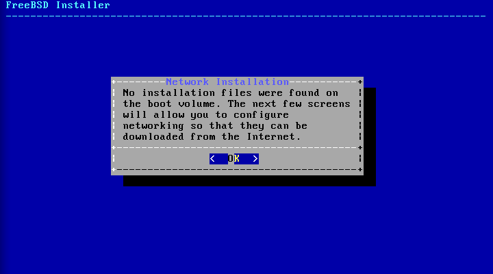

==================================
3.6. Installation aus dem Netzwerk
==================================

.. raw:: html

   

3.6. Installation aus dem Netzwerk
`Zur?ck <using-bsdinstall.html>`__?
Kapitel 3. FreeBSD?9.\ *``x``* (und neuer) installieren
?\ `Weiter <bsdinstall-partitioning.html>`__

--------------

.. raw:: html

   

.. raw:: html

   

.. raw:: html

   

.. raw:: html

   

.. raw:: html

   

3.6. Installation aus dem Netzwerk
----------------------------------

.. raw:: html

   

.. raw:: html

   

.. raw:: html

   

Die *bootonly*-Installationsmedien enth?lt keine Kopien der
Installationsdateien. Wenn eine *bootonly*-Installationsmethode
verwendet wird, m?ssen die Dateien ?ber eine Netzwerkverbindung
?bertragen werden, sobald diese ben?tigt werden.

.. raw:: html

   

.. raw:: html

   

Abbildung 3.8. Installation ?ber das Netzwerk

.. raw:: html

   

.. raw:: html

   

.. raw:: html

   

|Installation ?ber das Netzwerk|

.. raw:: html

   

.. raw:: html

   

.. raw:: html

   

Nachdem die Netzwerkverbindung wie in `Abschnitt?3.9.2, „Die
Netzwerkschnittstelle
konfigurieren“ <bsdinstall-post.html#bsdinstall-config-network-dev>`__
konfiguriert wurde, kann ein Spiegelserver ausgew?hlt werden.
Spiegelserver dienen zur Zwischenspeicherung von Kopien der
FreeBSD-Dateien. W?hlen Sie einen Spiegelserver, welcher in der gleichen
Region auf der Welt beheimatet ist, wie der Computer, auf dem FreeBSD
installiert werden soll. Dateien k?nnen so viel schneller ?bertragen
werden, wenn der Spiegelserver sich n?her am Zielcomputer befindet und
die Installationszeit wird somit reduziert.

.. raw:: html

   

.. raw:: html

   

Abbildung 3.9. Einen Spiegelserver w?hlen

.. raw:: html

   

.. raw:: html

   

.. raw:: html

   

|Einen Spiegelserver w?hlen|

.. raw:: html

   

.. raw:: html

   

.. raw:: html

   

Die Installation wird auf die gleiche Weise fortfahren, als w?rden die
Installationsdateien auf einem lokalen Medium vorliegen.

.. raw:: html

   

.. raw:: html

   

--------------

+---------------------------------------+-----------------------------------+------------------------------------------------+
| `Zur?ck <using-bsdinstall.html>`__?   | `Nach oben <bsdinstall.html>`__   | ?\ `Weiter <bsdinstall-partitioning.html>`__   |
+---------------------------------------+-----------------------------------+------------------------------------------------+
| 3.5. Das bsdinstall-Werkzeug?         | `Zum Anfang <index.html>`__       | ?3.7. Plattenplatz bereitstellen               |
+---------------------------------------+-----------------------------------+------------------------------------------------+

.. raw:: html

   

| Wenn Sie Fragen zu FreeBSD haben, schicken Sie eine E-Mail an
  <de-bsd-questions@de.FreeBSD.org\ >.
|  Wenn Sie Fragen zu dieser Dokumentation haben, schicken Sie eine
  E-Mail an <de-bsd-translators@de.FreeBSD.org\ >.

.. |Einen Spiegelserver w?hlen| image:: bsdinstall/bsdinstall-netinstall-mirrorselect.png
