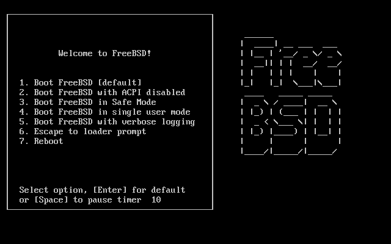

=============================
2.4. Die Installation starten
=============================

.. raw:: html

   

2.4. Die Installation starten
`Zur?ck <install-pre.html>`__?
Kapitel 2. FreeBSD?8.\ *``X``* (und ?lter) installieren
?\ `Weiter <using-sysinstall.html>`__

--------------

.. raw:: html

   

.. raw:: html

   

.. raw:: html

   

.. raw:: html

   

.. raw:: html

   

2.4. Die Installation starten
-----------------------------

.. raw:: html

   

.. raw:: html

   

.. raw:: html

   

.. raw:: html

   

Wichtig:
~~~~~~~~

Die Installationsprozedur l?sst die Daten auf Ihren Laufwerken solange
unver?ndert bis die nachstehende Meldung erscheint:

.. code:: literallayout

    Last Chance: Are you SURE you want continue the installation?

    If you're running this on a disk with data you wish to save then WE
    STRONGLY ENCOURAGE YOU TO MAKE PROPER BACKUPS before proceeding!

    We can take no responsibility for lost disk contents!

Vor dieser Meldung kann die Installationsprozedur jederzeit abgebrochen
werden, ohne die Daten auf der Festplatte zu ver?ndern. Wenn Sie meinen,
etwas falsch konfiguriert zu haben, k?nnen Sie vor diesem Zeitpunkt
einfach den Rechner ausschalten.

.. raw:: html

   

.. raw:: html

   

.. raw:: html

   

.. raw:: html

   

.. raw:: html

   

2.4.1. Der Systemstart
~~~~~~~~~~~~~~~~~~~~~~

.. raw:: html

   

.. raw:: html

   

.. raw:: html

   

.. raw:: html

   

.. raw:: html

   

.. raw:: html

   

.. raw:: html

   

2.4.1.1. Systemstart von i386™-Systemen
^^^^^^^^^^^^^^^^^^^^^^^^^^^^^^^^^^^^^^^

.. raw:: html

   

.. raw:: html

   

.. raw:: html

   

.. raw:: html

   

#. Schalten Sie zun?chst Ihren Rechner aus.

#. Schalten Sie den Rechner ein. W?hrend des Starts sollte angezeigt
   werden, wie Sie das Systemeinstellungsmen? (oder BIOS) erreichen.
   Meist dr?cken Sie dazu die Tasten **F2**, **F10**, **Del** oder
   **Alt**+**S**. Benutzen Sie die angezeigte Tastenkombination. Viele
   Rechner zeigen beim Systemstart eine Grafik an. Typischerweise k?nnen
   Sie die Grafik mit der Taste **Esc** entfernen und so die angezeigten
   Meldungen lesen.

#. Suchen Sie Option, die einstellt von welchem Ger?t der Rechner
   startet. Normalerweise wird die Option ``Boot Order`` genannt und
   zeigt eine Ger?teliste, beispielsweise ``Floppy``, ``CD-ROM``,
   ``First Hard Disk`` an.

   Wenn Sie von einer CD-ROM starten, stellen Sie sicher, das das
   CD-ROM-Laufwerk ausgew?hlt ist. Starten Sie hingegen von einem
   USB-Stick oder von einer Startdiskette, w?hlen Sie ebenfalls den
   entsprechenden Eintrag aus. Wenn Sie nicht sicher sind, lesen Sie
   bitte im Handbuch des Rechners oder im Handbuch der Systemplatine
   nach.

   Stellen Sie das gew?nschte Startmedium ein und sichern Sie die
   Einstellungen. Der Rechner sollte dann neu starten.

#. Wenn Sie (wie in `Abschnitt?2.3.7, „Das Startmedium
   vorbereiten“ <install-pre.html#install-boot-media>`__ beschrieben)
   ein bootbaren USB-Stick vorbereitet haben, st?pseln Sie diesen bitte
   ein, bevor Sie Ihren Rechner einschalten.

   Wenn Sie den Rechner von einer CD-ROM starten, legen Sie die CD-ROM
   so fr?h wie m?glich in das Laufwerk ein.

   .. raw:: html

      

   Anmerkung:
   ~~~~~~~~~~

   Bis einschlie?lich FreeBSD?7.3 kann FreeBSD auch von einer
   Startdiskette aus installiert werden. Eine Anleitung hierzu finden
   Sie in `Abschnitt?2.3.7, „Das Startmedium
   vorbereiten“ <install-pre.html#install-boot-media>`__). Legen Sie die
   erste Diskette (diese enth?lt das Abbild ``boot.flp``) in das
   Diskettenlaufwerk ein und starten Sie den Rechner.

   .. raw:: html

      

   Wenn Ihr Rechner wieder normal startet und das existierende
   Betriebssystem l?dt, kann das folgende Ursachen haben:

   .. raw:: html

      

   #. Das Startmedium (Diskette, CD-ROM) ist nicht schnell genug
      eingelegt worden. Belassen Sie das Startmedium im Laufwerk und
      starten Sie Ihren Rechner neu.

   #. Die BIOS-Einstellungen sind falsch vorgenommen worden. Wiederholen
      Sie diesen Schritt, bis Sie die richtige Einstellung gefunden
      haben.

   #. Das verwendete BIOS kann nicht von dem gew?nschten Medium starten.

   .. raw:: html

      

#. FreeBSD startet jetzt. Wenn Sie von einer CD-ROM starten, sehen Sie
   die folgenden Meldungen (Versionsangaben entfernt):

   .. code:: screen

       Booting from CD-Rom...
       645MB medium detected
       CD Loader 1.2

       Building the boot loader arguments
       Looking up /BOOT/LOADER... Found
       Relocating the loader and the BTX
       Starting the BTX loader

       BTX loader 1.00 BTX version is 1.02
       Consoles: internal video/keyboard
       BIOS CD is cd0
       BIOS drive C: is disk0
       BIOS drive D: is disk1
       BIOS 636kB/261056kB available memory

       FreeBSD/i386 bootstrap loader, Revision 1.1

       Loading /boot/defaults/loader.conf
       /boot/kernel/kernel text=0x64daa0 data=0xa4e80+0xa9e40 syms=[0x4+0x6cac0+0x4+0x88e9d]
       \           

   Wenn Sie mit Startdisketten hochfahren, sehen Sie folgende Meldungen
   (Versionsangaben entfernt):

   .. code:: screen

       Booting from Floppy...
       Uncompressing ... done

       BTX loader 1.00  BTX version is 1.01
       Console: internal video/keyboard
       BIOS drive A: is disk0
       BIOS drive C: is disk1
       BIOS 639kB/261120kB available memory

       FreeBSD/i386 bootstrap loader, Revision 1.1

       Loading /boot/defaults/loader.conf
       /kernel text=0x277391 data=0x3268c+0x332a8 |

       Insert disk labelled "Kernel floppy 1" and press any key...

   Folgen Sie der Anweisung und entfernen Sie die ``boot.flp``-Diskette,
   anschlie?end legen Sie die ``kern1.flp``-Diskette ein und dr?cken
   **Enter**. Starten Sie das System mit der ersten Diskette und legen
   Sie, wenn Sie dazu aufgefordert werden, die anderen Disketten ein.

#. Unabh?ngig davon, ob Sie von Disketten oder von CD-ROM gestartet
   haben, erscheint danach das FreeBSD Bootloader-Men?:

   .. raw:: html

      

   .. raw:: html

      

   Abbildung 2.1. FreeBSD Boot Loader Menu

   .. raw:: html

      

   .. raw:: html

      

   .. raw:: html

      

   |FreeBSD Boot Loader Menu|

   .. raw:: html

      

   .. raw:: html

      

   .. raw:: html

      

   | 

   Warten Sie entweder zehn Sekunden oder dr?cken Sie **Enter**.

.. raw:: html

   

.. raw:: html

   

.. raw:: html

   

.. raw:: html

   

.. raw:: html

   

.. raw:: html

   

2.4.1.2. Systemstart bei SPARC64?-Systemen
^^^^^^^^^^^^^^^^^^^^^^^^^^^^^^^^^^^^^^^^^^

.. raw:: html

   

.. raw:: html

   

.. raw:: html

   

Die meisten SPARC64?-Systeme sind so konfiguriert, dass sie automatisch
von der Festplatte starten. Um FreeBSD auf einem solchen System zu
installieren, m?ssen Sie das System aber ?ber das Netzwerk oder von
einer CD-ROM starten. Daher m?ssen Sie den Bootprozess unterbrechen und
das System ?ber das PROM (OpenFirmware) starten.

Dazu starten Sie Ihr System neu und warten, bis die Startmeldung
erscheint. Der genaue Wortlaut h?ngt vom eingesetzten Modell ab, die
Nachricht sollte aber ?hnlich der folgenden aussehen:

.. code:: screen

    Sun Blade 100 (UltraSPARC-IIe), Keyboard Present
    Copyright 1998-2001 Sun Microsystems, Inc.  All rights reserved.
    OpenBoot 4.2, 128 MB memory installed, Serial #51090132.
    Ethernet address 0:3:ba:b:92:d4, Host ID: 830b92d4.

Um den Startvorgang zu unterbrechen, dr?cken Sie nun die
Tastenkombination **L1**+**A** oder **Stop**+**A**. Verwenden Sie eine
serielle Verbindung, senden Sie das Signal ``BREAK`` ?ber die serielle
Konsole (etwa durch die Eingabe von ``~#`` in den Programmen
`tip(1) <http://www.FreeBSD.org/cgi/man.cgi?query=tip&sektion=1>`__ oder
`cu(1) <http://www.FreeBSD.org/cgi/man.cgi?query=cu&sektion=1>`__). In
beiden F?llen landen Sie anschlie?end am PROM-Prompt:

.. code:: screen

    ok     
    ok {0} 

.. raw:: html

   

+--------------------------------------+--------------------------------------+
| `|1| <#prompt-single>`__             | Der auf Einprozessorsystemen         |
|                                      | verwendete Prompt.                   |
+--------------------------------------+--------------------------------------+
| `|2| <#prompt-smp>`__                | Der Prompt auf                       |
|                                      | Mehrprozessorsystemen. Die Zahl      |
|                                      | steht dabei f?r die Anzahl der       |
|                                      | vorhandenen Prozessoren.             |
+--------------------------------------+--------------------------------------+

.. raw:: html

   

Nun legen Sie Ihre CD-ROM in das Laufwerk ein und geben am PROM-Prompt
``boot cdrom`` ein. Danach startet Ihr System von der eingelegten
CD-ROM.

.. raw:: html

   

.. raw:: html

   

.. raw:: html

   

.. raw:: html

   

.. raw:: html

   

.. raw:: html

   

2.4.2. Die Ger?teerkennung pr?fen
~~~~~~~~~~~~~~~~~~~~~~~~~~~~~~~~~

.. raw:: html

   

.. raw:: html

   

.. raw:: html

   

Die letzten paar Hundert Zeilen der Bildschirmausgabe werden gesichert
und k?nnen gepr?ft werden.

Um sich den Bildschirmpuffer anzusehen, dr?cken Sie die Taste
**Scroll-Lock**. Im Puffer k?nnen Sie mit den Pfeiltasten oder den
Tasten **PageUp** und **PageDown** bl?ttern. Um zur normalen
Bildschirmausgabe zur?ckzukehren, dr?cken Sie nochmals die Taste
**Scroll-Lock**.

Pr?fen Sie mit diesem Verfahren nun die Ausgaben der Ger?teerkennung.
Sie werden einen Text ?hnlich wie in `Abbildung?2.2, „Ausgabe der
Ger?teerkennung“ <install-start.html#install-dev-probe>`__ sehen. Die
genauen Ausgaben sind abh?ngig von den in Ihrem System installierten
Ger?ten.

.. raw:: html

   

.. raw:: html

   

Abbildung 2.2. Ausgabe der Ger?teerkennung

.. raw:: html

   

.. raw:: html

   

.. code:: screen

    avail memory = 253050880 (247120K bytes)
    Preloaded elf kernel "kernel" at 0xc0817000.
    Preloaded mfs_root "/mfsroot" at 0xc0817084.
    md0: Preloaded image </mfsroot> 4423680 bytes at 0xc03ddcd4

    md1: Malloc disk
    Using $PIR table, 4 entries at 0xc00fde60
    npx0: <math processor> on motherboard
    npx0: INT 16 interface
    pcib0: <Host to PCI bridge> on motherboard
    pci0: <PCI bus> on pcib0
    pcib1:<VIA 82C598MVP (Apollo MVP3) PCI-PCI (AGP) bridge> at device 1.0 on pci0
    pci1: <PCI bus> on pcib1
    pci1: <Matrox MGA G200 AGP graphics accelerator> at 0.0 irq 11
    isab0: <VIA 82C586 PCI-ISA bridge> at device 7.0 on pci0
    isa0: <iSA bus> on isab0
    atapci0: <VIA 82C586 ATA33 controller> port 0xe000-0xe00f at device 7.1 on pci0
    ata0: at 0x1f0 irq 14 on atapci0
    ata1: at 0x170 irq 15 on atapci0
    uhci0 <VIA 83C572 USB controller> port 0xe400-0xe41f irq 10 at device 7.2 on pci
    0
    usb0: <VIA 83572 USB controller> on uhci0
    usb0: USB revision 1.0
    uhub0: VIA UHCI root hub, class 9/0, rev 1.00/1.00, addr1
    uhub0: 2 ports with 2 removable, self powered
    pci0: <unknown card> (vendor=0x1106, dev=0x3040) at 7.3
    dc0: <ADMtek AN985 10/100BaseTX> port 0xe800-0xe8ff mem 0xdb000000-0xeb0003ff ir
    q 11 at device 8.0 on pci0
    dc0: Ethernet address: 00:04:5a:74:6b:b5
    miibus0: <MII bus> on dc0
    ukphy0: <Generic IEEE 802.3u media interface> on miibus0
    ukphy0: 10baseT, 10baseT-FDX, 100baseTX, 100baseTX-FDX, auto
    ed0: <NE2000 PCI Ethernet (RealTek 8029)> port 0xec00-0xec1f irq 9 at device 10.
    0 on pci0
    ed0 address 52:54:05:de:73:1b, type NE2000 (16 bit)
    isa0: too many dependant configs (8)
    isa0: unexpected small tag 14
    orm0: <Option ROM> at iomem 0xc0000-0xc7fff on isa0
    fdc0: <NEC 72065B or clone> at port 0x3f0-0x3f5,0x3f7 irq 6 drq2 on isa0
    fdc0: FIFO enabled, 8 bytes threshold
    fd0: <1440-KB 3.5” drive> on fdc0 drive 0
    atkbdc0: <Keyboard controller (i8042)> at port 0x60,0x64 on isa0
    atkbd0: <AT Keyboard> flags 0x1 irq1 on atkbdc0
    kbd0 at atkbd0
    psm0: <PS/2 Mouse> irq 12 on atkbdc0
    psm0: model Generic PS/@ mouse, device ID 0
    vga0: <Generic ISA VGA> at port 0x3c0-0x3df iomem 0xa0000-0xbffff on isa0
    sc0: <System console> at flags 0x100 on isa0
    sc0: VGA <16 virtual consoles, flags=0x300>
    sio0 at port 0x3f8-0x3ff irq 4 flags 0x10 on isa0
    sio0: type 16550A
    sio1 at port 0x2f8-0x2ff irq 3 on isa0
    sio1: type 16550A
    ppc0: <Parallel port> at port 0x378-0x37f irq 7 on isa0
    pppc0: SMC-like chipset (ECP/EPP/PS2/NIBBLE) in COMPATIBLE mode
    ppc0: FIFO with 16/16/15 bytes threshold
    plip0: <PLIP network interface> on ppbus0
    ad0: 8063MB <IBM-DHEA-38451> [16383/16/63] at ata0-master UDMA33
    acd0: CD-RW <LITE-ON LTR-1210B> at ata1-slave PIO4
    Mounting root from ufs:/dev/md0c
    /stand/sysinstall running as init on vty0

.. raw:: html

   

.. raw:: html

   

Pr?fen Sie die Ausgabe der Ger?teerkennung sorgf?ltig und stellen Sie
sicher, dass FreeBSD alle erwarteten Ger?te gefunden hat. Wenn ein Ger?t
nicht gefunden wurde, wird es nicht angezeigt. Ist dies bei Ihnen der
Fall, m?ssen Sie einen `angepassten Kernel <kernelconfig.html>`__
erstellen, da das betroffene Ger?t (beispielsweise eine Soundkarte) in
diesem Fall vom ``GENERIC``-Kernel nicht unterst?tzt wird.

Sie gelangen im n?chsten Schritt in ein Men?, in dem Sie ?ber die
Cursortasten das Land, in dem Sie sich befinden, ausw?hlen k?nnen
(`Abbildung?2.3, „Ihr Land
ausw?hlen“ <install-start.html#config-country>`__). Durch die
Best?tigung mit der **Enter**-Taste wird automatisch das von Ihnen
gew?hlte Land sowie die dazu passende Tastaturbelegung gew?hlt.

.. raw:: html

   

.. raw:: html

   

Abbildung 2.3. Ihr Land ausw?hlen

.. raw:: html

   

.. raw:: html

   

.. raw:: html

   

|Ihr Land ausw?hlen|

.. raw:: html

   

.. raw:: html

   

.. raw:: html

   

Haben Sie als Land United States gew?hlt, wird automatisch die
amerikanische Standardtastatur verwendet. Haben Sie hingegen ein anderes
Land angegeben, erscheint das folgende Men?, in dem Sie Ihre
Tastaturbelegung ausw?hlen k?nnen (best?tigen Sie Ihre Auswahl mit der
**Enter**-Taste).

.. raw:: html

   

.. raw:: html

   

Abbildung 2.4. Die Tastaturbelegung ausw?hlen

.. raw:: html

   

.. raw:: html

   

.. raw:: html

   

|Die Tastaturbelegung ausw?hlen|

.. raw:: html

   

.. raw:: html

   

.. raw:: html

   

Nachdem Sie das Land ausgew?hlt haben, erscheint das Hauptmen? von
sysinstall.

.. raw:: html

   

.. raw:: html

   

.. raw:: html

   

--------------

+----------------------------------+--------------------------------+-----------------------------------------+
| `Zur?ck <install-pre.html>`__?   | `Nach oben <install.html>`__   | ?\ `Weiter <using-sysinstall.html>`__   |
+----------------------------------+--------------------------------+-----------------------------------------+
| 2.3. Vor der Installation?       | `Zum Anfang <index.html>`__    | ?2.5. Das Werkzeug sysinstall           |
+----------------------------------+--------------------------------+-----------------------------------------+

.. raw:: html

   

| Wenn Sie Fragen zu FreeBSD haben, schicken Sie eine E-Mail an
  <de-bsd-questions@de.FreeBSD.org\ >.
|  Wenn Sie Fragen zu dieser Dokumentation haben, schicken Sie eine
  E-Mail an <de-bsd-translators@de.FreeBSD.org\ >.

.. |1| image:: ./imagelib/callouts/1.png
.. |2| image:: ./imagelib/callouts/2.png
.. |Ihr Land ausw?hlen| image:: install/config-country.png
.. |Die Tastaturbelegung ausw?hlen| image:: install/config-keymap.png
