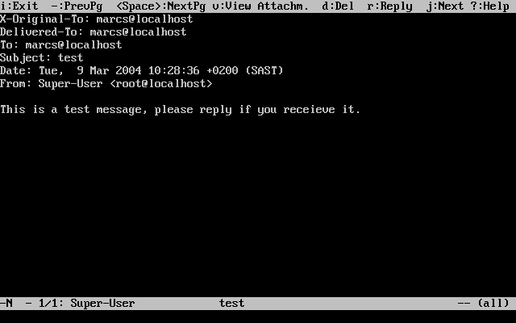
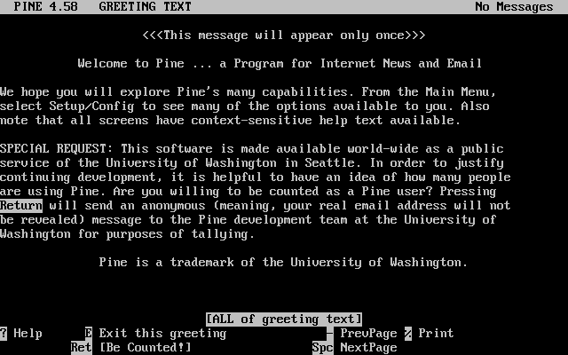
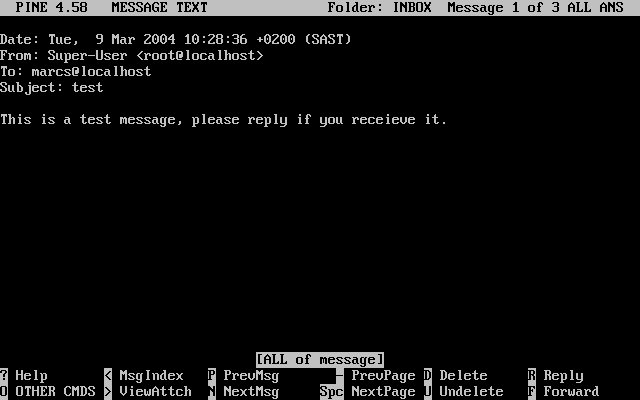
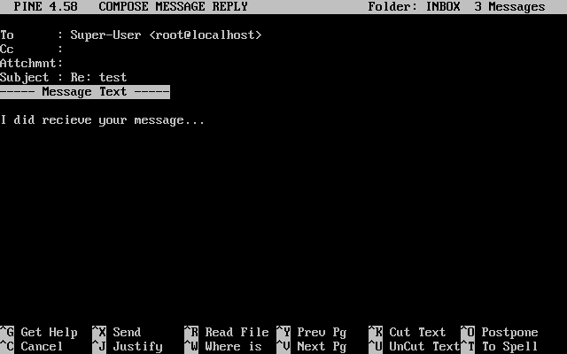

=======================
30.12. E-Mail-Programme
=======================

.. raw:: html

   

30.12. E-Mail-Programme
`Zur?ck <SMTP-Auth.html>`__?
Kapitel 30. Elektronische Post (E-Mail)
?\ `Weiter <mail-fetchmail.html>`__

--------------

.. raw:: html

   

.. raw:: html

   

.. raw:: html

   

.. raw:: html

   

.. raw:: html

   

30.12. E-Mail-Programme
-----------------------

.. raw:: html

   

.. raw:: html

   

Beigetragen von Marc Silver.

.. raw:: html

   

.. raw:: html

   

.. raw:: html

   

Anwendungen, die E-Mails versenden und empfangen, werden als
E-Mail-Programme oder Mail-User-Agents (MUA) bezeichnet. Mit der
Entwicklung und Ausbreitung von E-Mail wachsen auch die E-Mail-Programme
und bieten Benutzern mehr Funktionen und h?here Flexibilit?t. Unter
FreeBSD laufen zahlreiche E-Mail-Programme, die Sie alle mit der
`FreeBSD Ports-Sammlung <ports.html>`__ installieren k?nnen. Sie k?nnen
w?hlen zwischen Programmen mit grafischer Benutzeroberfl?che, wie
evolution oder balsa, konsolenorientierten Programmen wie mutt, alpine
oder ``mail``, oder auch Programmen mit Web-Schnittstellen, die von
einigen gro?en Institutionen benutzt werden.

.. raw:: html

   

.. raw:: html

   

.. raw:: html

   

.. raw:: html

   

30.12.1. mail
~~~~~~~~~~~~~

.. raw:: html

   

.. raw:: html

   

.. raw:: html

   

Das standardm??ig unter FreeBSD installierte E-Mail-Programm ist
`mail(1) <http://www.FreeBSD.org/cgi/man.cgi?query=mail&sektion=1>`__.
Das Programm ist konsolenorientiert und enth?lt alle Funktionen, die zum
Versand und Empfang textbasierter E-Mails erforderlich sind. Allerdings
lassen sich Anh?nge mit ``mail`` nur schwer bearbeiten und kann ``mail``
kann nur auf lokale Postf?cher zugreifen.

``mail`` kann nicht direkt auf POP- oder IMAP-Server zugreifen.
Entfernte Postf?cher k?nnen aber mit einer Anwendung wie fetchmail in
die lokale Datei ``mbox`` geladen werden. fetchmail wird sp?ter in
diesem Kapitel besprochen (`Abschnitt?30.13, „E-Mails mit fetchmail
abholen“ <mail-fetchmail.html>`__).

Um E-Mails zu versenden oder zu empfangen, starten Sie einfach ``mail``
wie im nachstehenden Beispiel:

.. code:: screen

    % mail

Das Werkzeug ``mail`` liest automatisch den Inhalt des
Benutzer-Postfachs im Verzeichnis ``/var/mail``. Sollte das Postfach
leer sein, beendet sich ``mail`` mit der Nachricht, dass keine E-Mails
vorhanden sind. Wenn das Postfach gelesen wurde, wird die
Benutzeroberfl?che gestartet und eine Liste der E-Mails angezeigt. Die
E-Mails werden automatisch nummeriert wie im folgenden Beispiel gezeigt:

.. code:: screen

    Mail version 8.1 6/6/93.  Type ? for help.
    "/var/mail/marcs": 3 messages 3 new
    >N  1 root@localhost        Mon Mar  8 14:05  14/510   "test"
     N  2 root@localhost        Mon Mar  8 14:05  14/509   "user account"
     N  3 root@localhost        Mon Mar  8 14:05  14/509   "sample"

Einzelne Nachrichten k?nnen Sie jetzt mit dem ``mail``-Kommando **t**
gefolgt von der Nummer der Nachricht lesen. Im nachstehenden Beispiel
lesen wir die erste E-Mail:

.. code:: screen

    & t 1
    Message 1:
    From root@localhost  Mon Mar  8 14:05:52 2004
    X-Original-To: marcs@localhost
    Delivered-To: marcs@localhost
    To: marcs@localhost
    Subject: test
    Date: Mon,  8 Mar 2004 14:05:52 +0200 (SAST)
    From: root@localhost (Charlie Root)

    Das ist eine Test-Nachricht.  Antworte bitte!

Die Taste **t** zeigt die Nachricht zusammen mit dem vollst?ndigen
Nachrichtenkopf an. Wenn Sie die Liste der E-Mails erneut sehen wollen,
dr?cken Sie die Taste **h**.

Um auf eine E-Mail zu antworten, benutzen Sie im Programm ``mail``
entweder die Taste **R** oder die Taste **r**. Mit der Taste **R**
weisen Sie ``mail`` an, dem Versender der Nachricht zu antworten. Mit
der Taste **r** antworten Sie nicht nur dem Versender sondern auch allen
Empf?ngern der Nachricht. Sie k?nnen zusammen mit diesen Kommandos eine
Zahl angeben, um die E-Mail, auf die Sie antworten wollen, auszusuchen.
Wenn Sie den Befehl abgesetzt haben, schreiben Sie Ihre Antwort und
beenden die Eingabe mit einem einzelnen Punkt (``.``) auf einer neuen
Zeile. Den Vorgang zeigt das nachstehende Beispiel:

.. code:: screen

    & R 1
    To: root@localhost
    Subject: Re: test

    Danke, ich habe deine E-Mail erhalten.
    .
    EOT

Neue E-Mails k?nnen Sie mit der Taste **m** verschicken. Geben Sie dabei
die E-Mail-Adresse des Empf?ngers an. Sie k?nnen auch mehrere durch
Kommata (``,``) getrennte Empf?nger angeben. Geben Sie dann den Betreff
(*subject*) der Nachricht gefolgt von der Nachricht selbst ein.
Schlie?en Sie die Nachricht mit einem einzelnen Punkt (``.``) auf einer
neuen Zeile ab.

.. code:: screen

    & mail root@localhost
    Subject: Ich habe die E-Mails im Griff!

    Jetzt kann ich E-Mails versenden und empfangen ... :)
    .
    EOT

Die Taste **?** zeigt zu jeder Zeit einen Hilfetext an. Wenn Sie weitere
Hilfe ben?tigen, lesen Sie bitte die Hilfeseite
`mail(1) <http://www.FreeBSD.org/cgi/man.cgi?query=mail&sektion=1>`__.

.. raw:: html

   

Anmerkung:
~~~~~~~~~~

Wie vorhin gesagt, wurde das Programm
`mail(1) <http://www.FreeBSD.org/cgi/man.cgi?query=mail&sektion=1>`__
nicht f?r den Umgang mit Anh?ngen entworfen und kann daher sehr schlecht
mit Anh?ngen umgehen. Neuere MUAs wie mutt gehen wesentlich besser mit
Anh?ngen um. Sollten Sie dennoch das ``mail``-Kommando benutzen wollen,
werden Sie den Port
`converters/mpack <http://www.freebsd.org/cgi/url.cgi?ports/converters/mpack/pkg-descr>`__
sehr zu sch?tzen wissen.

.. raw:: html

   

.. raw:: html

   

.. raw:: html

   

.. raw:: html

   

.. raw:: html

   

.. raw:: html

   

30.12.2. mutt
~~~~~~~~~~~~~

.. raw:: html

   

.. raw:: html

   

.. raw:: html

   

mutt ist ein schlankes aber sehr leistungsf?higes E-Mail-Programm mit
hervorrangenden Funktionen, unter anderem:

.. raw:: html

   

-  mutt kann den Verlauf einer Diskussion (*threading*) darstellen.

-  Durch die Integration von PGP k?nnen E-Mails signiert und
   verschl?sselt werden.

-  MIME wird unterst?tzt.

-  Postf?cher k?nnen im Maildir-Format gespeichert werden.

-  mutt l?sst sich im h?chsten Ma?e an lokale Bed?rfnisse anpassen.

.. raw:: html

   

Wegen des Funktionsumfangs ist mutt eins der ausgefeiltesten
E-Mail-Programme. Mehr ?ber mutt erfahren Sie auf der Seite
``http://www.mutt.org``.

Der Port
`mail/mutt <http://www.freebsd.org/cgi/url.cgi?ports/mail/mutt/pkg-descr>`__
enth?lt die Produktionsversion von mutt, die aktuelle Entwicklerversion
befindet sich im Port
`mail/mutt-devel <http://www.freebsd.org/cgi/url.cgi?ports/mail/mutt-devel/pkg-descr>`__.
Wenn mutt installiert ist, wird das Programm mit dem nachstehenden
Kommando gestartet:

.. code:: screen

    % mutt

mutt liest automatisch den Inhalt des Benutzer-Postfachs im Verzeichnis
``/var/mail``. Wenn E-Mails vorhanden sind, werden diese dargestellt.
Sind keine E-Mails vorhanden, wartet mutt auf Benutzereingaben. Das
folgende Beispiel zeigt, wie mutt eine Nachrichten-Liste darstellt:

.. raw:: html

   

|image0|

.. raw:: html

   

Wenn Sie eine Nachricht lesen wollen, w?hlen Sie die Nachricht einfach
mit den Pfeiltasten aus und dr?cken **Enter**. mutt zeigt E-Mails wie
folgt an:

.. raw:: html

   

|image1|

.. raw:: html

   

Wenn Sie auf eine E-Mail antworten, k?nnen Sie, wie in
`mail(1) <http://www.FreeBSD.org/cgi/man.cgi?query=mail&sektion=1>`__,
aussuchen, ob Sie nur dem Versender oder auch allen Empf?ngern antworten
wollen. Wenn Sie nur dem Versender antworten wollen, dr?cken Sie die
Taste **r**. Wenn sie dem Versender und allen Empf?ngern antworten
wollen, dr?cken Sie die Taste **g**.

.. raw:: html

   

Anmerkung:
~~~~~~~~~~

Zum Erstellen oder zum Beantworten von E-Mails ruft mutt den Editor
`vi(1) <http://www.FreeBSD.org/cgi/man.cgi?query=vi&sektion=1>`__ auf.
Wenn Sie den von mutt verwendeten Editor ?ndern m?chten, erstellen oder
editieren Sie in Ihrem Heimatverzeichnis die Datei ``.muttrc``. Den
Editor k?nnen Sie in ``.muttrc`` mit der Variablen ``editor`` festlegen.
Alternativ k?nnen Sie auch die Umgebungsvariable ``EDITOR`` setzen.
Weitere Informationen zur Konfiguration von mutt finden Sie unter
``http://www.mutt.org/``.

.. raw:: html

   

Dr?cken Sie die Taste **m**, wenn Sie eine neue Nachricht verfassen
wollen. Nachdem Sie einen Betreff (*subject*) eingegeben haben, startet
mutt den Editor
`vi(1) <http://www.FreeBSD.org/cgi/man.cgi?query=vi&sektion=1>`__ und
Sie k?nnen die Nachricht eingeben. Wenn Sie fertig sind, speichern Sie
die Nachricht und verlassen den Editor. mutt wird dann wieder aktiv und
zeigt eine Zusammenfassung der zu sendenden Nachricht an. Dr?cken Sie
**y**, um die E-Mail zu versenden. Der nachstehende Bildschirmabzug
zeigt die Zusammenfassung der E-Mail:

.. raw:: html

   

|image2|

.. raw:: html

   

mutt verf?gt ?ber eine umfangreiche Hilfestellung. Aus fast jedem Men?
k?nnen Sie Hilfeseiten mit der Taste **?** aufrufen. In der oberen
Statuszeile werden zudem die verf?gbaren Tastenkombinationen angezeigt.

.. raw:: html

   

.. raw:: html

   

.. raw:: html

   

.. raw:: html

   

.. raw:: html

   

30.12.3. alpine
~~~~~~~~~~~~~~~

.. raw:: html

   

.. raw:: html

   

.. raw:: html

   

alpine wendet sich an Anf?nger bietet aber ebenfalls einige Funktionen
f?r Profis.

.. raw:: html

   

Warnung:
~~~~~~~~

In der Vergangenheit wurden in alpine mehrere Schwachstellen gefunden.
Die Schwachstellen gestatteten entfernten Benutzern, durch das Versenden
einer besonders verfassten E-Mail, Programme auf dem lokalen System
laufen zu lassen. Alle *bekannten* Schwachstellen sind beseitigt worden,
doch wird im Quellcode von alpine ein sehr riskanter Programmierstil
verwendet, sodass der FreeBSD-Security-Officer von weiteren unbekannten
Schwachstellen ausgeht. Sie installieren alpine auf eigene
Verantwortung!

.. raw:: html

   

Der Port
`mail/alpine <http://www.freebsd.org/cgi/url.cgi?ports/mail/alpine/pkg-descr>`__
enth?lt die aktuelle Version von alpine. Nach der Installation k?nnen
Sie alpine mit dem nachstehenden Kommando starten:

.. code:: screen

    % alpine

Wenn Sie alpine das erste Mal starten, zeigt das Programm eine Seite mit
einer kurzen Einf?hrung an. Um die alpine-Benutzer zu z?hlen, bitten die
Entwickler auf dieser Seite um eine anonyme E-Mail. Sie k?nnen diese
anonyme E-Mail senden, indem Sie **Enter** dr?cken oder den
Begr??ungsbildschirm mit der Taste **E** verlassen, ohne die anonyme
E-Mail zu senden. Der Begr??ungsbildschirm sieht wie folgt aus:

.. raw:: html

   

|image3|

.. raw:: html

   

Nach dem Begr??ungsbildschirm wird das Hauptmen? dargestellt, das sich
leicht mit den Pfeiltasten bedienen l?sst. Mit Tastenkombinationen
k?nnen Sie aus dem Hauptmen? neue E-Mails erstellen, Postf?cher anzeigen
und auch das Adressbuch verwalten. Unterhalb des Men?s werden die
Tastenkombinationen f?r die verf?gbaren Aktionen angezeigt.

In der Voreinstellung ?ffnet pine das Verzeichnis ``inbox``. Die Taste
**I** oder der Men?punkt MESSAGE INDEX f?hrt zu einer Nachrichten-Liste:

.. raw:: html

   

|image4|

.. raw:: html

   

Die Liste zeigt die Nachrichten im Arbeitsverzeichnis. Sie k?nnen
Nachrichten mit den Pfeiltasten markieren. Wenn Sie eine Nachricht lesen
wollen, dr?cken Sie **Enter**.

.. raw:: html

   

|image5|

.. raw:: html

   

Im n?chsten Bildschirmabzug sehen Sie, wie pine eine Nachricht
darstellt. Die unteren Bildschirmzeilen zeigen die verf?gbaren
Tastenkombinationen. Mit der Taste **r** k?nnen Sie zum Beispiel auf die
gerade angezeigte Nachricht antworten.

.. raw:: html

   

|image6|

.. raw:: html

   

Zum Antworten auf eine E-Mail wird in pine der Editor pico, der mit
installiert wird, benutzt. pico ist leicht zu bedienen und gerade f?r
Anf?nger besser geeignet als
`vi(1) <http://www.FreeBSD.org/cgi/man.cgi?query=vi&sektion=1>`__ oder
`mail(1) <http://www.FreeBSD.org/cgi/man.cgi?query=mail&sektion=1>`__.
Die Antwort wird mit der Tastenkombination **Ctrl**+**X** versendet. Vor
dem Versand bittet pine noch um eine Best?tigung.

.. raw:: html

   

|image7|

.. raw:: html

   

?ber den Men?punkt SETUP des Hauptmen?s k?nnen Sie pine an Ihre
Bed?rfnisse anpassen. Erl?uterungen dazu finden Sie auf der Seite
``http://www.washington.edu/pine/``.

.. raw:: html

   

.. raw:: html

   

.. raw:: html

   

--------------

+----------------------------------+-------------------------------+-----------------------------------------+
| `Zur?ck <SMTP-Auth.html>`__?     | `Nach oben <mail.html>`__     | ?\ `Weiter <mail-fetchmail.html>`__     |
+----------------------------------+-------------------------------+-----------------------------------------+
| 30.11. SMTP-Authentifizierung?   | `Zum Anfang <index.html>`__   | ?30.13. E-Mails mit fetchmail abholen   |
+----------------------------------+-------------------------------+-----------------------------------------+

.. raw:: html

   

| Wenn Sie Fragen zu FreeBSD haben, schicken Sie eine E-Mail an
  <de-bsd-questions@de.FreeBSD.org\ >.
|  Wenn Sie Fragen zu dieser Dokumentation haben, schicken Sie eine
  E-Mail an <de-bsd-translators@de.FreeBSD.org\ >.

.. |image0| image:: mail/mutt1.png

.. |image2| image:: mail/mutt3.png

.. |image4| image:: mail/pine2.png
.. |image5| image:: mail/pine3.png

