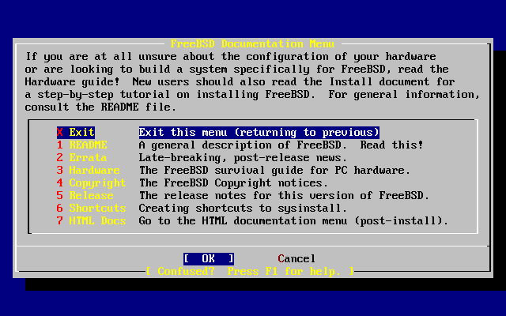

============================
2.5. Das Werkzeug sysinstall
============================

.. raw:: html

   

2.5. Das Werkzeug sysinstall
`Zur?ck <install-start.html>`__?
Kapitel 2. FreeBSD?8.\ *``X``* (und ?lter) installieren
?\ `Weiter <install-steps.html>`__

--------------

.. raw:: html

   

.. raw:: html

   

.. raw:: html

   

.. raw:: html

   

.. raw:: html

   

2.5. Das Werkzeug sysinstall
----------------------------

.. raw:: html

   

.. raw:: html

   

.. raw:: html

   

Zum Installieren von FreeBSD stellt das FreeBSD-Project das Werkzeug
sysinstall zur Verf?gung. Das Werkzeug arbeitet textorientiert und
bietet eine Reihe von Men?s und Bildschirmen, um den
Installationsprozess zu konfigurieren und zu steuern.

Die Men?s von sysinstall werden mit Tasten wie den Pfeiltasten,
**Enter**, **Tab** oder **Space** bedient. Eine ausf?hrliche
Beschreibung der Tastenbelegung ist in der Gebrauchsanweisung von
sysinstall enthalten.

Die Gebrauchsanweisung k?nnen Sie lesen, indem Sie den Men?punkt Usage
ausw?hlen. Stellen Sie sicher, dass die Schaltfl?che [Select], wie in
`Abbildung?2.5, „Die Gebrauchsanweisung von sysinstall
ausw?hlen“ <using-sysinstall.html#sysinstall-main3>`__ gezeigt,
aktiviert ist und dr?cken Sie die Taste **Enter**.

Es erscheinen Anweisungen wie das Men?system zu bedienen ist. Wenn Sie
diese gelesen haben, dr?cken Sie **Enter**, um in das Hauptmen?
zur?ckzukehren.

.. raw:: html

   

.. raw:: html

   

Abbildung 2.5. Die Gebrauchsanweisung von sysinstall ausw?hlen

.. raw:: html

   

.. raw:: html

   

.. raw:: html

   

|Die Gebrauchsanweisung von sysinstall ausw?hlen|

.. raw:: html

   

.. raw:: html

   

.. raw:: html

   

.. raw:: html

   

.. raw:: html

   

.. raw:: html

   

.. raw:: html

   

2.5.1. Die Dokumentation abrufen
~~~~~~~~~~~~~~~~~~~~~~~~~~~~~~~~

.. raw:: html

   

.. raw:: html

   

.. raw:: html

   

Aus dem Hauptmen? w?hlen Sie mit den Pfeiltasten Doc aus und dr?cken
**Enter**.

.. raw:: html

   

.. raw:: html

   

Abbildung 2.6. Die Dokumentation abrufen

.. raw:: html

   

.. raw:: html

   

.. raw:: html

   

|Die Dokumentation abrufen|

.. raw:: html

   

.. raw:: html

   

.. raw:: html

   

Es wird das Dokumentationsmen? angezeigt.

.. raw:: html

   

.. raw:: html

   

Abbildung 2.7. Das Dokumentationsmen? von sysinstall

.. raw:: html

   

.. raw:: html

   

.. raw:: html

   

|Das Dokumentationsmen? von sysinstall|

.. raw:: html

   

.. raw:: html

   

.. raw:: html

   

Lesen Sie bitte unbedingt die mitgelieferte Dokumentation.

Um ein Dokument zu lesen, w?hlen Sie das Dokument mit den Pfeiltasten
aus und dr?cken **Enter**. Wenn Sie das Dokument gelesen haben, kommen
Sie mit der Taste **Enter** in das Dokumentationsmen? zur?ck.

Um in das Hauptmen? zur?ckzukommen, w?hlen Sie mit den Pfeiltasten Exit
aus und dr?cken die Taste **Enter**.

.. raw:: html

   

.. raw:: html

   

.. raw:: html

   

.. raw:: html

   

.. raw:: html

   

2.5.2. Die Tastaturbelegung ?ndern
~~~~~~~~~~~~~~~~~~~~~~~~~~~~~~~~~~

.. raw:: html

   

.. raw:: html

   

.. raw:: html

   

Um die Tastaturbelegung zu ?ndern, w?hlen Sie den Men?punkt Keymap und
dr?cken **Enter**. Dies ist nur erforderlich wenn Sie eine nicht
standard-konforme Tastatur oder eine andere als eine amerikanische
Tastatur einsetzen.

.. raw:: html

   

.. raw:: html

   

Abbildung 2.8. Das Hauptmen? von sysinstall

.. raw:: html

   

.. raw:: html

   

.. raw:: html

   

|Das Hauptmen? von sysinstall|

.. raw:: html

   

.. raw:: html

   

.. raw:: html

   

Eine andere Tastaturbelegung k?nnen Sie mit den Pfeiltasten markieren
und der Taste **Space** ausw?hlen. Wenn Sie die Taste **Space** nochmals
dr?cken wird die Auswahl aufgehoben. Haben Sie eine Tastaturbelegung
ausgew?hlt, markieren Sie mit den Pfeiltasten [?OK?] und dr?cken Sie
**Enter**.

Der Bildschirmabzug zeigt nur einen der verf?gbaren Belegungen an. Mit
der Taste **Tab** markieren Sie die Schaltfl?che [?Cancel?], die mit der
Vorgabe-Belegung wieder in das Hauptmen? zur?ckf?hrt.

.. raw:: html

   

.. raw:: html

   

Abbildung 2.9. Sysinstall Keymap Menu

.. raw:: html

   

.. raw:: html

   

.. raw:: html

   

|Sysinstall Keymap Menu|

.. raw:: html

   

.. raw:: html

   

.. raw:: html

   

.. raw:: html

   

.. raw:: html

   

.. raw:: html

   

.. raw:: html

   

.. raw:: html

   

2.5.3. Installationsoptionen einstellen
~~~~~~~~~~~~~~~~~~~~~~~~~~~~~~~~~~~~~~~

.. raw:: html

   

.. raw:: html

   

.. raw:: html

   

W?hlen Sie Options aus und r?cken die Taste **Enter**.

.. raw:: html

   

.. raw:: html

   

Abbildung 2.10. Das Hauptmen? von sysinstall

.. raw:: html

   

.. raw:: html

   

.. raw:: html

   

|Das Hauptmen? von sysinstall|

.. raw:: html

   

.. raw:: html

   

.. raw:: html

   

.. raw:: html

   

.. raw:: html

   

Abbildung 2.11. Optionen von sysinstall

.. raw:: html

   

.. raw:: html

   

.. raw:: html

   

|Optionen von sysinstall|

.. raw:: html

   

.. raw:: html

   

.. raw:: html

   

F?r die meisten Benutzer sind die voreingestellten Werte v?llig
ausreichend und brauchen daher nicht ge?ndert werden. Der Name des
Releases variiert mit der zu installierenden Version von FreeBSD.

Eine Beschreibung der ausgew?hlten Option erscheint blau hervorgehoben
am unteren Ende des Bildschirms. Mit der Option Use Defaults k?nnen Sie
alle Optionen auf die Vorgabewerte zur?ckstellen.

Wenn Sie die Hilfeseite zu den verschiedenen Optionen lesen wollen,
dr?cken Sie die Taste **F1**.

Die Taste **Q** f?hrt in das Hauptmen? zur?ck.

.. raw:: html

   

.. raw:: html

   

.. raw:: html

   

.. raw:: html

   

.. raw:: html

   

2.5.4. Eine Standard-Installation starten
~~~~~~~~~~~~~~~~~~~~~~~~~~~~~~~~~~~~~~~~~

.. raw:: html

   

.. raw:: html

   

.. raw:: html

   

Die Standard-Installation sollte von allen UNIX?- oder FreeBSD-Anf?ngern
benutzt werden. Markieren Sie mit den Pfeiltasten Standard und dr?cken
Sie **Enter**, um die Installation zu starten.

.. raw:: html

   

.. raw:: html

   

Abbildung 2.12. Die Standard-Installation starten

.. raw:: html

   

.. raw:: html

   

.. raw:: html

   

|Die Standard-Installation starten|

.. raw:: html

   

.. raw:: html

   

.. raw:: html

   

.. raw:: html

   

.. raw:: html

   

.. raw:: html

   

--------------

+------------------------------------+--------------------------------+------------------------------------------------+
| `Zur?ck <install-start.html>`__?   | `Nach oben <install.html>`__   | ?\ `Weiter <install-steps.html>`__             |
+------------------------------------+--------------------------------+------------------------------------------------+
| 2.4. Die Installation starten?     | `Zum Anfang <index.html>`__    | ?2.6. Plattenplatz f?r FreeBSD bereitstellen   |
+------------------------------------+--------------------------------+------------------------------------------------+

.. raw:: html

   

| Wenn Sie Fragen zu FreeBSD haben, schicken Sie eine E-Mail an
  <de-bsd-questions@de.FreeBSD.org\ >.
|  Wenn Sie Fragen zu dieser Dokumentation haben, schicken Sie eine
  E-Mail an <de-bsd-translators@de.FreeBSD.org\ >.

.. |Die Gebrauchsanweisung von sysinstall ausw?hlen| image:: install/main1.png
.. |Die Dokumentation abrufen| image:: install/main-doc.png

.. |Das Hauptmen? von sysinstall| image:: install/main-keymap.png
.. |Sysinstall Keymap Menu| image:: install/keymap.png
.. |Das Hauptmen? von sysinstall| image:: install/main-options.png
.. |Optionen von sysinstall| image:: install/options.png
.. |Die Standard-Installation starten| image:: install/main-std.png
