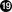

=====================================
11.3. Die Community informiert halten
=====================================

.. raw:: html

   

11.3. Die Community informiert halten
`Zur?ck <security-fix.html>`__?
Kapitel 11. Sicherheit der Ports
?\ `Weiter <porting-dads.html>`__

--------------

.. raw:: html

   

.. raw:: html

   

.. raw:: html

   

.. raw:: html

   

.. raw:: html

   

11.3. Die Community informiert halten
-------------------------------------

.. raw:: html

   

.. raw:: html

   

.. raw:: html

   

.. raw:: html

   

.. raw:: html

   

.. raw:: html

   

.. raw:: html

   

11.3.1. Die VuXML-Datenbank
~~~~~~~~~~~~~~~~~~~~~~~~~~~

.. raw:: html

   

.. raw:: html

   

.. raw:: html

   

Ein sehr wichtiger und dringender Schritt, den man unternehmen muss,
sobald eine Sicherheitsl?cke entdeckt wurde, ist die Gemeinschaft der
Anwender des Ports ?ber die Gefahr zu informieren. Diese
Benachrichtigung hat zwei Gr?nde. Erstens wird es sinnvoll sein, wenn
die Gefahr wirklich so gro? ist, sofort Abhilfe zu schaffen, indem man
z.B. den betreffenden Netzwerkdienst beendet oder den Port komplett
deinstalliert, bis die L?cke geschlossen wurde. Und Zweitens pflegen
viele Nutzer installierte Pakete nur gelegentlich zu aktualisieren. Sie
werden aus der Mitteilung erfahren, dass Sie das Paket, sobald eine
Korrektur verf?gbar ist, sofort aktualisieren *m?ssen*.

Angesichts der riesigen Zahl an Ports kann nicht f?r jeden Vorfall ein
Sicherheitshinweis erstellt werden, ohne durch die Flut an Nachrichten
die Aufmerksamkeit der Empf?nger zu verlieren, im Laufe der Zeit kommt
es so zu ernsten Problemen. Deshalb werden Sicherheitsl?cken von Ports
in `der FreeBSD VuXML-Datenbank <http://vuxml.freebsd.org/>`__
aufgezeichnet. Das Team der Sicherheitsverantwortlichen beobachtet diese
wegen Angelegenheiten, die Ihr Eingreifen erfordern.

Wenn Sie Committerrechte haben, k?nnen Sie die VuXML-Datenbank selbst
aktualisieren. Auf diese Weise helfen Sie den
Sicherheitsverantwortlichen und liefern die kritischen Informationen
fr?hzeitig an die Community. Aber auch wenn Sie kein Committer sind und
glauben, Sie haben eine au?ergew?hnlich schwerwiegende L?cke
gefunden?–?egal welche?–?z?gern Sie bitte nicht die
Sicherheitsverantwortlichen zu kontaktieren, wie es in den `FreeBSD
Sicherheitsinformationen <http://www.freebsd.org/security/#how>`__
beschrieben wird.

Wie vielleicht aus dem Titel hervorgeht, handelt es sich bei der
VuXMl-Datenbank um ein XML-Dokument. Die Quelldatei ``vuln.xml`` k?nnen
Sie im Port
`security/vuxml <http://www.freebsd.org/cgi/url.cgi?ports/security/vuxml/pkg-descr>`__
finden. Deshalb wird der komplette Pfadname
``       PORTSDIR/security/vuxml/vuln.xml`` lauten. Jedes Mal, wenn Sie
eine Sicherheitsl?cke in einem Port entdecken, f?gen Sie bitte einen
Eintrag daf?r in diese Datei ein. Solange Sie nicht mit VuXML vertraut
sind, ist es das Beste, was Sie machen k?nnen, einen vorhandenen
Eintrag, der zu Ihrem Fall passt, zu kopieren und als Vorlage zu
verwenden.

.. raw:: html

   

.. raw:: html

   

.. raw:: html

   

.. raw:: html

   

.. raw:: html

   

11.3.2. Eine kurze Einf?hrung in VuXML
~~~~~~~~~~~~~~~~~~~~~~~~~~~~~~~~~~~~~~

.. raw:: html

   

.. raw:: html

   

.. raw:: html

   

Das komplette XML ist komplex und w?rde den Rahmen dieses Buches
sprengen. Allerdings ben?tigen Sie f?r einen grundlegenden Einblick in
die Struktur eines VuXML-Eintrags nur eine Vorstellung der Tags.
XML-Tags bestehen aus Namen, die in spitzen Klammern eingeschlossen
sind. Zu jedem ?ffnenden <Tag> muss ein passendes </Tag> existieren.
Tags k?nnen geschachtelt werden. Wenn sie geschachtelt werden m?ssen die
inneren Tags vor den ?u?eren geschlossen werden. Es gibt eine Hierarchie
von Tags?–?das hei?t komplexere Regeln zur Schachtelung. Klingt so
?hnlich wie HTML, oder? Der gr??te Unterschied ist: XML ist erweiterbar
(e*X*tensible)?–?das hei?t es basiert darauf ma?geschneiderte Tags zu
definieren. Aufgrund seiner wesentlichen Struktur bringt XML ansonsten
formlose Daten in eine bestimmte Form. VuXML ist speziell darauf
zugeschnitten Beschreibungen von Sicherheitsl?cken zu verwalten.

Lassen Sie uns nun einen realistischen VuXML-Eintrag betrachten:

.. code:: programlisting

    <vuln vid="f4bc80f4-da62-11d8-90ea-0004ac98a7b9"> 
      <topic>Several vulnerabilities found in Foo</topic> 
      <affects>
        <package>
          <name>foo</name> 
          <name>foo-devel</name>
          <name>ja-foo</name>
          <range><ge>1.6</ge><lt>1.9</lt></range> 
          <range><ge>2.*</ge><lt>2.4_1</lt></range>
          <range><eq>3.0b1</eq></range>
        </package>
        <package>
          <name>openfoo</name> 
          <range><lt>1.10_7</lt></range> 
          <range><ge>1.2,1</ge><lt>1.3_1,1</lt></range>
        </package>
      </affects>
      <description>
        <body xmlns="http://www.w3.org/1999/xhtml">
          
J. Random Hacker reports:
 
          <blockquote
            cite="http://j.r.hacker.com/advisories/1">
            
Several issues in the Foo software may be exploited
              via carefully crafted QUUX requests.  These requests will
              permit the injection of Bar code, mumble theft, and the
              readability of the Foo administrator account.

          </blockquote>
        </body>
      </description>
      <references> 
        <freebsdsa>SA-10:75.foo</freebsdsa> 
        <freebsdpr>ports/987654</freebsdpr> 
        <cvename>CAN-2010-0201</cvename> 
        <cvename>CAN-2010-0466</cvename>
        <bid>96298</bid> 
        <certsa>CA-2010-99</certsa> 
        <certvu>740169</certvu> 
        <uscertsa>SA10-99A</uscertsa> 
        <uscertta>SA10-99A</uscertta> 
        <mlist msgid="201075606@hacker.com">http://marc.theaimsgroup.com/?l=bugtraq&amp;m=203886607825605</mlist> 
        <url>http://j.r.hacker.com/advisories/1</url> 
      </references>
      <dates>
        <discovery>2010-05-25</discovery> 
        <entry>2010-07-13</entry> 
        <modified>2010-09-17</modified> 
      </dates>
    </vuln>

Die Namen der Tags sollten selbsterkl?rend sein ?–?also werfen wir einen
genaueren Blick auf die Felder, die Sie selbst ausf?llen m?ssen:

.. raw:: html

   

+--------------------------------------+--------------------------------------+
| `|1| <#co-vx-vid>`__                 | Dies ist die h?chste Tag-Ebene eines |
|                                      | VuXML-Eintrags. Es ist ein           |
|                                      | vorgeschriebenes Attribut ``vid``,   |
|                                      | welches eine allgemein einzigartige  |
|                                      | Kennung (universally unique          |
|                                      | identifier, UUID) in                 |
|                                      | Anf?hrungszeichen f?r diesen Eintrag |
|                                      | festlegt. Sie sollten eine UUID f?r  |
|                                      | jeden neuen VuXML-Eintrag erzeugen   |
|                                      | (und vergessen Sie nicht die UUID    |
|                                      | der Vorlage zu ersetzen, es sei      |
|                                      | denn, Sie schreiben den Eintrag von  |
|                                      | Grund auf selbst). Sie k?nnen        |
|                                      | `uuidgen(1) <http://www.FreeBSD.org/ |
|                                      | cgi/man.cgi?query=uuidgen&sektion=1> |
|                                      | `__                                  |
|                                      | verwenden, um eine VuXML UUID zu     |
|                                      | erzeugen.                            |
+--------------------------------------+--------------------------------------+
| `|2| <#co-vx-top>`__                 | Dies ist eine einzeilige             |
|                                      | Beschreibung des gefundenen Fehlers. |
+--------------------------------------+--------------------------------------+
| `|3| <#co-vx-nam>`__                 | Hier werden die Namen betroffener    |
|                                      | Pakete aufgef?hrt. Es k?nnen mehrere |
|                                      | Namen angegeben werden, da mehrere   |
|                                      | Pakete von einem einzigen            |
|                                      | Master-Port oder Software-Produkt    |
|                                      | abh?ngen k?nnen. Das schlie?t        |
|                                      | Stable–?und Developement-Zweige,     |
|                                      | lokalisierte Versionen und           |
|                                      | Slave-Ports ein, die verschiedene    |
|                                      | Auswahlm?glichkeiten wichtiger       |
|                                      | Kompilierungszeit-Optionen bieten.   |
|                                      |                                      |
|                                      | .. raw:: html                        |
|                                      |                                      |
|                                      |    
  |
|                                      |                                      |
|                                      | Wichtig:                             |
|                                      | ~~~~~~~~                             |
|                                      |                                      |
|                                      | Es liegt in Ihrer Verantwortung all  |
|                                      | diese betroffenen Pakete zu finden,  |
|                                      | wenn Sie den VuXML-Eintrag           |
|                                      | schreiben.Behalten Sie im            |
|                                      | Hinterkopf, dass                     |
|                                      | ``make search         name=foo`` Ihr |
|                                      | Freund ist. Die wichtigsten Punkte,  |
|                                      | auf die Sie achten sollten, sind die |
|                                      | folgenden:                           |
|                                      |                                      |
|                                      | .. raw:: html                        |
|                                      |                                      |
|                                      |    
                                 |
|                                      |                                      |
|                                      | -  die ``foo-devel`` Variante eines  |
|                                      |    ``foo`` Ports;                    |
|                                      |                                      |
|                                      | -  andere Varianten mit einem Suffix |
|                                      |    wie `` -a4`` (f?r                 |
|                                      |    Druck-betreffende Pakete),        |
|                                      |    ``-without-gui`` (f?r Pakete mit  |
|                                      |    deaktivierter X-Unterst?tzung)    |
|                                      |    oder ?hnliche                     |
|                                      |                                      |
|                                      | -  ``jp-``, ``ru-``, ``zh-`` und     |
|                                      |    andere, eventuell lokalisierte,   |
|                                      |    Varianten in den entsprechenden   |
|                                      |    L?nderkategorien der              |
|                                      |    Ports-Sammlung                    |
|                                      |                                      |
|                                      | .. raw:: html                        |
|                                      |                                      |
|                                      |    
                            |
|                                      |                                      |
|                                      | .. raw:: html                        |
|                                      |                                      |
|                                      |    
                            |
+--------------------------------------+--------------------------------------+
| `|4| <#co-vx-rng>`__                 | Betroffene Versionen der Pakete      |
|                                      | werden hier als ein Bereich oder     |
|                                      | mehrere durch eine Kombination aus   |
|                                      | ``<lt>``, ``<le>           ``,       |
|                                      | ``<eq>``, ``           <ge>``, und   |
|                                      | ``<gt>``-Elementen ausgegeben. Die   |
|                                      | angegebenen Bereiche sollten sich    |
|                                      | nicht ?berschneiden.                 |
|                                      |                                      |
|                                      | In einer Bereichsangabe steht ``*``  |
|                                      | (Asterisk) f?r die kleinste          |
|                                      | Versionsnummer. Insbesondere ist     |
|                                      | ``2.*`` kleiner als ``2.a``. Deshalb |
|                                      | kann ein Stern benutzt werden, um    |
|                                      | auf alle m?glichen                   |
|                                      | ``Alpha           ``-, ``Beta``–?und |
|                                      | ``RC ``-Versionen zuzutreffen. Zum   |
|                                      | Beispiel passt                       |
|                                      | ``<ge>2.*</ge><lt>3.*           </lt |
|                                      | >``                                  |
|                                      | auf alle Versionen der Form ``2.x``, |
|                                      | w?hrend                              |
|                                      | ``<ge>           2.0</ge><lt>3.0</lt |
|                                      | >``                                  |
|                                      | das nicht erf?llt, da es nicht auf   |
|                                      | ``2.r3           `` passt, auf       |
|                                      | ``3.b`` aber schon.                  |
|                                      |                                      |
|                                      | Das obige Beispiel legt fest, dass   |
|                                      | Versionen von ``1.6`` bis ``1.9``    |
|                                      | betroffen sind?–?au?erdem Versionen  |
|                                      | ``2.x `` vor ``2.4_1`` und Version   |
|                                      | ``3.0b1``.                           |
+--------------------------------------+--------------------------------------+
| `|5| <#co-vx-nm2>`__                 | Mehrere zusammenh?ngende Gruppen von |
|                                      | Paketen (im wesentlichen Ports)      |
|                                      | k?nnen im Abschnitt `` <affected>``  |
|                                      | aufgef?hrt werden. Das kann man      |
|                                      | benutzen, wenn sich Programme (sagen |
|                                      | wir FooBar, FreeBar und OpenBar)     |
|                                      | denselben Quelltext als Grundlage    |
|                                      | haben und sich noch dessen Fehler    |
|                                      | und Sicherheitsl?cken teilen.        |
|                                      | Beachten Sie den Unterschied zum     |
|                                      | Anf?hren mehrerer Namen innerhalb    |
|                                      | eines <package> Abschnittes.         |
+--------------------------------------+--------------------------------------+
| `|6| <#co-vx-epo>`__                 | Die Versionsbereiche sollten, wenn   |
|                                      | m?glich, sowohl ``PORTEPOCH`` als    |
|                                      | auch ``           PORTREVISION``     |
|                                      | erlauben. Bitte denken Sie daran,    |
|                                      | dass gem?? der Vergleichsregeln eine |
|                                      | Version mit einer ``PORTEPOCH``, die |
|                                      | nicht Null ist, gr??er ist als jede  |
|                                      | Version ohne ``PORTEPOCH``. Das      |
|                                      | hei?t, `` 3.0,1`` ist gr??er als     |
|                                      | ``3.1 `` oder sogar ``8.9``.         |
+--------------------------------------+--------------------------------------+
| `|7| <#co-vx-bdy>`__                 | Das ist die Zusammenfassung des      |
|                                      | Problems. In diesem Feld wird XHTML  |
|                                      | verwendet. Zumindest umschlie?ende   |
|                                      | ``
`` und ``
`` sollten         |
|                                      | auftauchen. Komplexere Tags sind     |
|                                      | zwar m?glich, aber sollten nur um    |
|                                      | der Genauigkeit und Klarheit willen  |
|                                      | verwendet werden: Bitte verwenden    |
|                                      | Sie hier kein Eye-Candy.             |
+--------------------------------------+--------------------------------------+
| `|8| <#co-vx-ref>`__                 | Dieser Abschnitt enth?lt Verweise    |
|                                      | auf relevante Dokumente. Es wird     |
|                                      | empfohlen so viele Referenzen wie    |
|                                      | n?tig aufzuf?hren.                   |
+--------------------------------------+--------------------------------------+
| `|9| <#co-vx-fsa>`__                 | Das ist ein `FreeBSD                 |
|                                      | Sicherheitshinweis <http://www.freeb |
|                                      | sd.org/security/#adv>`__.            |
+--------------------------------------+--------------------------------------+
| `|10| <#co-vx-fpr>`__                | Das ist ein `FreeBSD                 |
|                                      | Problembericht <http://www.freebsd.o |
|                                      | rg/support.html#gnats>`__.           |
+--------------------------------------+--------------------------------------+
| `|11| <#co-vx-cve>`__                | Das ist eine `Mitre                  |
|                                      | CVE <http://www.cve.mitre.org/>`__   |
|                                      | Kennung.                             |
+--------------------------------------+--------------------------------------+
| `|12| <#co-vx-bid>`__                | Das ist eine `SecurityFocus          |
|                                      | Fehler-Kennung <http://www.securityf |
|                                      | ocus.com/bid>`__.                    |
+--------------------------------------+--------------------------------------+
| `|13| <#co-vx-cts>`__                | Das ist ein Sicherheitshinweis von   |
|                                      | `US-CERT <http://www.cert.org/>`__.  |
+--------------------------------------+--------------------------------------+
| `|14| <#co-vx-ctv>`__                | Das ist eine Mitteilung ?ber eine    |
|                                      | Schwachstelle von                    |
|                                      | `US-CERT <http://www.cert.org/>`__.  |
+--------------------------------------+--------------------------------------+
| `|15| <#co-vx-ucs>`__                | Das ist ein Cyber-Sicherheitsalarm   |
|                                      | von                                  |
|                                      | `US-CERT <http://www.cert.org/>`__.  |
+--------------------------------------+--------------------------------------+
| `|16| <#co-vx-uct>`__                | Das ist ein technischer              |
|                                      | Cyber-Sicherheitsalarm von           |
|                                      | `US-CERT <http://www.cert.org/>`__.  |
+--------------------------------------+--------------------------------------+
| `|17| <#co-vx-mls>`__                | Das ist eine URL zu einem            |
|                                      | archivierten Posting auf einer       |
|                                      | Mailingliste. Das Attribut ``msgid`` |
|                                      | ist optional und gibt die            |
|                                      | Nachrichtenkennung des Postings an.  |
+--------------------------------------+--------------------------------------+
| `|18| <#co-vx-url>`__                | Das ist eine gew?hnliche URL. Sie    |
|                                      | sollte nur verwendet werden, wenn    |
|                                      | keine der anderen Referenzkategorien |
|                                      | verf?gbar ist.                       |
+--------------------------------------+--------------------------------------+
| `|19| <#co-vx-dsc>`__                | Das ist das Datum, an dem die        |
|                                      | Sicherheitsl?cke bekannt wurde       |
|                                      | (*``JJJJ-MM-TT``*).                  |
+--------------------------------------+--------------------------------------+
| `|20| <#co-vx-ent>`__                | Das ist das Datum, an dem der        |
|                                      | Eintrag hinzugef?gt wurde            |
|                                      | (*``JJJJ-MM-TT``*).                  |
+--------------------------------------+--------------------------------------+
| `|21| <#co-vx-mod>`__                | Das ist das Datum, an dem zuletzt    |
|                                      | irgendeine Information des Eintrags  |
|                                      | ver?ndert wurde (*``JJJJ-MM-TT``*).  |
|                                      | Neue Eintr?ge d?rfen dieses Feld     |
|                                      | nicht enthalten. Es sollte beim      |
|                                      | Editieren eines existierenden        |
|                                      | Eintrags eingef?gt werden.           |
+--------------------------------------+--------------------------------------+

.. raw:: html

   

.. raw:: html

   

.. raw:: html

   

.. raw:: html

   

.. raw:: html

   

.. raw:: html

   

11.3.3. Ihre ?nderungen an der VuXML-Datenbank testen
~~~~~~~~~~~~~~~~~~~~~~~~~~~~~~~~~~~~~~~~~~~~~~~~~~~~~

.. raw:: html

   

.. raw:: html

   

.. raw:: html

   

Nehmen wir an, Sie haben gerade einen Eintrag f?r eine Sicherheitsl?cke
in dem Paket ``clamav`` geschrieben oder ausgef?llt, die in der Version
``0.65_7`` korrigiert wurde.

Als Voraussetzung m?ssen Sie die aktuellen Versionen der Ports
`ports-mgmt/portaudit <http://www.freebsd.org/cgi/url.cgi?ports/ports-mgmt/portaudit/pkg-descr>`__,
`ports-mgmt/portaudit-db <http://www.freebsd.org/cgi/url.cgi?ports/ports-mgmt/portaudit-db/pkg-descr>`__
sowie
`security/vuxml <http://www.freebsd.org/cgi/url.cgi?ports/security/vuxml/pkg-descr>`__
*installieren*.

.. raw:: html

   

Anmerkung:
~~~~~~~~~~

Um ``packaudit`` auszuf?hren, m?ssen Sie die Berechtigung haben
``DATABASEDIR`` zu schreiben?–??blicherweise ist das
``/var/db/portaudit``.

Durch Setzen der Umgebungsvariable ``DATABASEDIR`` k?nnen Sie hier auch
ein anderes Verzeichnis angeben.

Arbeiten Sie nicht aus dem Verzeichnis ``${PORTSDIR}/security/vuxml``
heraus, m?ssen Sie zus?tzlich die Umgebungsvariable ``VUXMLDIR`` setzen,
um anzugeben, in welchem Verzeichnis sich die Datei ``vuln.xml``
befindet.

.. raw:: html

   

Zuerst ?berpr?fen Sie bitte, ob bereits ein Eintrag f?r diese
Schwachstelle existiert. Wenn es einen solchen Eintrag gibt, sollte er
auf die vorige Version ``0.65_6`` zutreffen:

.. code:: screen

    % packaudit
    % portaudit clamav-0.65_6

Wenn keine vorhandenen Eintr?ge gefunden werden haben Sie gr?nes Licht,
einen neuen Eintrag f?r diese Sicherheitsl?cke anzulegen. Sie k?nnen nun
eine neue UUID erzeugen (wir nehmen an, diese lautet
``74a9541d-5d6c-11d8-80e3-0020ed76ef5a``) und einen neuen Eintrag in der
VuXML-Datenbank anlegen. Bitte ?berpr?fen Sie danach die Syntax mit
folgendem Befehl:

.. code:: screen

    % cd ${PORTSDIR}/security/vuxml && make validate

.. raw:: html

   

Anmerkung:
~~~~~~~~~~

Sie werden zumindest eines der folgenden Pakete ben?tigen:
`textproc/libxml2 <http://www.freebsd.org/cgi/url.cgi?ports/textproc/libxml2/pkg-descr>`__,
`textproc/jade <http://www.freebsd.org/cgi/url.cgi?ports/textproc/jade/pkg-descr>`__.

.. raw:: html

   

Jetzt bauen Sie bitte die ``portaudit``-Datenbank aus der VuXML-Datei
neu:

.. code:: screen

    % packaudit

Um sicherzustellen, dass der Abschnitt ``<affected>`` Ihres Eintrags die
richtigen Pakete betrifft, verwenden Sie bitte den folgenden Befehl:

.. code:: screen

    % portaudit -f /usr/ports/INDEX -r 74a9541d-5d6c-11d8-80e3-0020ed76ef5a

.. raw:: html

   

Anmerkung:
~~~~~~~~~~

Bitte lesen Sie in
`portaudit(1) <http://www.FreeBSD.org/cgi/man.cgi?query=portaudit&sektion=1>`__
nach, um ein besseres Verst?ndnis der Befehlssyntax zu entwickeln.

.. raw:: html

   

Bitte stellen Sie sicher, dass Ihr Eintrag keine falschen Treffer in der
Ausgabe erzeugt.

Jetzt ?berpr?fen Sie bitte, dass Ihr Eintrag die richtigen Versionen des
Pakets angibt:

.. code:: screen

    % portaudit clamav-0.65_6 clamav-0.65_7
    Affected package: clamav-0.65_6 (matched by clamav<0.65_7)
    Type of problem: clamav remote denial-of-service.
    Reference: <http://www.freebsd.org/ports/portaudit/74a9541d-5d6c-11d8-80e3-0020ed76ef5a.html>

    1 problem(s) found.

Offensichtlich sollte die erste Version ausgegeben werden?–?die zweite
jedoch nicht.

Abschlie?end ?berpr?fen Sie bitte, ob die Webseite, die aus der
VuXML-Datenbank erzeugt wird, wie erwartet aussieht:

.. code:: screen

    % mkdir -p ~/public_html/portaudit
    % packaudit
    % lynx ~/public_html/portaudit/74a9541d-5d6c-11d8-80e3-0020ed76ef5a.html

.. raw:: html

   

.. raw:: html

   

.. raw:: html

   

--------------

+---------------------------------------+---------------------------------+-----------------------------------------------------------+
| `Zur?ck <security-fix.html>`__?       | `Nach oben <security.html>`__   | ?\ `Weiter <porting-dads.html>`__                         |
+---------------------------------------+---------------------------------+-----------------------------------------------------------+
| 11.2. Sicherheitsl?cken schliessen?   | `Zum Anfang <index.html>`__     | ?Kapitel 12. Was man machen respektive vermeiden sollte   |
+---------------------------------------+---------------------------------+-----------------------------------------------------------+

.. raw:: html

   

| Wenn Sie Fragen zu FreeBSD haben, schicken Sie eine E-Mail an
  <de-bsd-questions@de.FreeBSD.org\ >.
|  Wenn Sie Fragen zu dieser Dokumentation haben, schicken Sie eine
  E-Mail an <de-bsd-translators@de.FreeBSD.org\ >.

.. |1| image:: ./imagelib/callouts/1.png
.. |2| image:: ./imagelib/callouts/2.png
.. |3| image:: ./imagelib/callouts/3.png
.. |4| image:: ./imagelib/callouts/4.png
.. |5| image:: ./imagelib/callouts/5.png
.. |6| image:: ./imagelib/callouts/6.png
.. |7| image:: ./imagelib/callouts/7.png
.. |8| image:: ./imagelib/callouts/8.png
.. |9| image:: ./imagelib/callouts/9.png
.. |10| image:: ./imagelib/callouts/10.png
.. |11| image:: ./imagelib/callouts/11.png
.. |12| image:: ./imagelib/callouts/12.png
.. |13| image:: ./imagelib/callouts/13.png
.. |14| image:: ./imagelib/callouts/14.png
.. |15| image:: ./imagelib/callouts/15.png
.. |16| image:: ./imagelib/callouts/16.png
.. |17| image:: ./imagelib/callouts/17.png
.. |18| image:: ./imagelib/callouts/18.png

.. |20| image:: ./imagelib/callouts/20.png
.. |21| image:: ./imagelib/callouts/21.png
