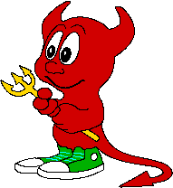
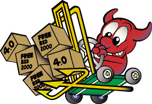
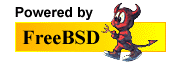

===========
FreeBSD Art
===========

.. raw:: html

   

.. raw:: html

   

.. raw:: html

   

.. raw:: html

   

.. raw:: html

   

Section Navigation
------------------

-  `About <./about.html>`__
-  `Features <./features.html>`__
-  `Applications <./applications.html>`__
-  `Advocacy <./advocacy/>`__
-  `Marketing <./marketing/>`__
-  `Administration <./administration.html>`__
-  `News <./news/newsflash.html>`__
-  `Events <./events/events.html>`__
-  `Press <./news/press.html>`__
-  `Multimedia <./multimedia/multimedia.html>`__
-  `Artwork <./art.html>`__
-  `Logo <./logo.html>`__
-  `Donations <./donations/>`__
-  `Legal Notices <./copyright/>`__
-  `Privacy Policy <./privacy.html>`__

.. raw:: html

   

.. raw:: html

   

.. raw:: html

   

FreeBSD Art
===========

-  `BSD Daemon <#bsd-daemon>`__
-  `“Powered by FreeBSD” Logos <#powered-by>`__
-  `Old advertisement banners <#adv>`__
-  `Graphics use <#use>`__

This page contains miscellaneous FreeBSD “art”. Suggestions for
additions can be sent to www@FreeBSD.org. Please note the `usage
policy <#use>`__ for these graphics.

`BSD Daemon <copyright/daemon.html>`__
--------------------------------------

|BSD Daemon|?
Created by Poul-Henning Kamp
Source:
`/usr/share/examples/BSD\_daemon/ <http://svnweb.freebsd.org/base/head/share/examples/BSD_daemon/>`__
on FreeBSD systems.
|BSD Daemon wielding a hammer|
|BSD Daemon waiting tables|
|BSD Daemon editing the news|
|BSD Daemon reading documentation|
|BSD Daemon delivering the latest release|
“Powered by FreeBSD” Logos
--------------------------

|Powered by FreeBSD Logo|
|Powered by FreeBSD Logo|
|Powered by FreeBSD Logo|
|Powered by FreeBSD Logo|
|FreeBSD Hardware Partner Logo|
|FreeBSD The Power To Serve Logo|

|FreeBSD The Power To Serve Logo|

|FreeBSD The Power To Serve Logo|

|FreeBSD The Power To Serve Logo|

Old Advertisement Banners
-------------------------

+-----------------+-----------------+
| |Adv Banner1|   | |Adv Banner2|   |
+-----------------+-----------------+

Graphics Use
------------

The “Powered by FreeBSD” logos above may be
`downloaded <gifs/powerlogo.gif>`__ and displayed on personal or
commercial home pages served by FreeBSD machines. Use of this logo or
the likeliness of the `BSD Daemons <copyright/daemon.html>`__ for
profitable gain requires the consent of `Brian
Tao <mailto:taob@risc.org>`__ (creator of the “power” logo) and
`Marshall Kirk McKusick <mailto:mckusick@mckusick.com>`__ (copyright
holder for the BSD Daemon image).

Poul-Henning Kamp's rendering of the BSD Daemon is released under “THE
BEER-WARE LICENSE”. See the
`README <http://svnweb.freebsd.org/base/head/share/examples/BSD_daemon/README?view=markup>`__
for more information.

Trademarks
----------

The `FreeBSD Foundation <http://www.freebsdfoundation.org>`__ holds
several FreeBSD related trademarks (among them the trademark for the
term “FreeBSD” itself). For more information about these trademarks read
the `FreeBSD Trademark Usage Terms and
Conditions <http://www.freebsdfoundation.org/faqs.shtml#Trademark>`__.

.. raw:: html

   

.. raw:: html

   

.. raw:: html

   

.. raw:: html

   

.. raw:: html

   

.. raw:: html

   

.. |BSD Daemon wielding a hammer| image:: gifs/daemon_hammer-tn25.jpg
   :target: gifs/daemon_hammer.jpg
.. |BSD Daemon waiting tables| image:: gifs/power.jpg
.. |BSD Daemon editing the news| image:: gifs/news.jpg
.. |BSD Daemon reading documentation| image:: gifs/doc.jpg

.. |Powered by FreeBSD Logo| image:: gifs/powerlogo.gif
.. |Powered by FreeBSD Logo| image:: gifs/power-button.gif

.. |Powered by FreeBSD Logo| image:: gifs/powerani.gif
.. |FreeBSD Hardware Partner Logo| image:: gifs/fhp_mini.jpg

.. |FreeBSD The Power To Serve Logo| image:: gifs/banner2.gif
.. |FreeBSD The Power To Serve Logo| image:: gifs/banner3.gif
.. |FreeBSD The Power To Serve Logo| image:: gifs/banner4.gif

.. |Adv Banner2| image:: gifs/freebsd_3.gif
