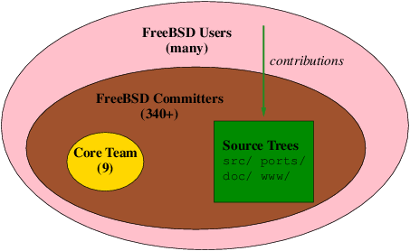
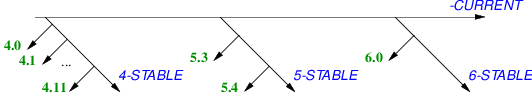

======================================
2.?FreeBSD as a set of building blocks
======================================

.. raw:: html

   

2.?FreeBSD as a set of building blocks
`Prev <index.html>`__?
?
?\ `Next <freebsd-collaboration.html>`__

--------------

.. raw:: html

   

.. raw:: html

   

.. raw:: html

   

.. raw:: html

   

.. raw:: html

   

2.?FreeBSD as a set of building blocks
--------------------------------------

.. raw:: html

   

.. raw:: html

   

.. raw:: html

   

FreeBSD makes an excellent foundation on which to build products:

.. raw:: html

   

-  FreeBSD source code is distributed under a liberal BSD license
   facilitating its adoption in commercial products
   [`Mon2005 <bi01.html#idp64317008>`__\ ] with minimum hassle.
-  The FreeBSD project has excellent engineering practices that can be
   leveraged.
-  The project offers exceptional transparency into its workings,
   allowing organizations using its code to plan effectively for the
   future.
-  The culture of the FreeBSD project, carried over from the Computer
   Science Research Group at The University of California, Berkeley
   [`McKu1999-1 <bi01.html#idp64304464>`__\ ], fosters high-quality
   work. Some features in FreeBSD define the state of the art.

.. raw:: html

   

[`GoldGab2005 <bi01.html#idp64240208>`__\ ] examines the business
reasons for using open-source in greater detail. For organizations, the
benefits of using FreeBSD components in their products include a shorter
time to market, lower development costs and lower development risks.

.. raw:: html

   

.. raw:: html

   

.. raw:: html

   

.. raw:: html

   

2.1.?Building with FreeBSD
~~~~~~~~~~~~~~~~~~~~~~~~~~

.. raw:: html

   

.. raw:: html

   

.. raw:: html

   

Here are a few ways organizations have used FreeBSD:

.. raw:: html

   

-  As an upstream source for tested code for libraries and utilities.

   By being “downstream” of the project, organizations leverage the new
   features, bug fixes and testing that the upstream code receives.

-  As an embedded OS (for example, for an OEM router and firewall
   device). In this model, organizations use a customized FreeBSD kernel
   and application program set along with a proprietary management layer
   for their device. OEMs benefit from new hardware support being added
   by the FreeBSD project upstream, and from the testing that the base
   system receives.

   FreeBSD ships with a self-hosting development environment that allows
   easy creation of such configurations.

-  As a Unix compatible environment for the management functions of
   high-end storage and networking devices, running on a separate
   processor “blade”.

   FreeBSD provides the tools for creating dedicated OS and application
   program images. Its implementation of a BSD unix API is mature and
   tested. FreeBSD can also provide a stable cross-development
   environment for the other components of the high-end device.

-  As a vehicle to get widespread testing and support from a worldwide
   team of developers for non-critical “intellectual property”.

   In this model, organizations contribute useful infrastructural
   frameworks to the FreeBSD project (for example, see
   `netgraph(3) <http://www.FreeBSD.org/cgi/man.cgi?query=netgraph&sektion=3>`__).
   The widespread exposure that the code gets helps to quickly identify
   performance issues and bugs. The involvement of top-notch developers
   also leads to useful extensions to the infrastructure that the
   contributing organization also benefits from.

-  As a development environment supporting cross-development for
   embedded OSes like `RTEMS <http://www.rtems.com/>`__ and
   `eCOS <http://ecos.sourceware.org/>`__.

   There are many full-fledged development environments in the
   24,000-strong collection of applications ported and packaged with
   FreeBSD.

-  As a way to support a Unix-like API in an otherwise proprietary OS,
   increasing its palatability for application developers.

   Here parts of FreeBSD's kernel and application programs are “ported”
   to run alongside other tasks in the proprietary OS. The availability
   of a stable and well tested Unix™ API implementation can reduce the
   effort needed to port popular applications to the proprietary OS. As
   FreeBSD ships with high-quality documentation for its internals and
   has effective vulnerability management and release engineering
   processes, the costs of keeping upto-date are kept low.

.. raw:: html

   

.. raw:: html

   

.. raw:: html

   

.. raw:: html

   

.. raw:: html

   

.. raw:: html

   

2.2.?Technologies
~~~~~~~~~~~~~~~~~

.. raw:: html

   

.. raw:: html

   

.. raw:: html

   

There are a large number of technologies supported by the FreeBSD
project. A selection of these are listed below:

.. raw:: html

   

-  A complete system that can cross-host itself for `many
   architectures: <../../../../platforms/>`__

-  Support for the following technologies, protocols and standards: ATA,
   ATAPI, ATM, Bluetooth™, CAM, CardBus™, DHCP, DNS, EISA™, Ethernet™,
   FDDI, Fibre Channel, GPIB, IEEE 1394, IPv4, IPv6, IPSEC, IPX™, ISDN,
   MAC, NIS, NFS, OpenSSH, OPIE, PAM, PCI™, PCMCIA, POSIX™, PnP, RAID,
   RPC, SATA, SCSI, SMB, TCP, USB, VESA, VLAN, VLB, WebNFS™.
-  A modular symmetric multiprocessing capable kernel, with loadable
   kernel modules and a flexible and easy to use configuration system.
-  Support for emulation of Linux™ and SVR4 binaries at near machine
   speeds. Support for binary Windows™ (NDIS) network drivers.
-  Libraries for many programming tasks: archivers, FTP and HTTP
   support, thread support, in addition to a full POSIX™ like
   programming environment.
-  Advanced security features: Mandatory Access Control
   (`mac(9) <http://www.FreeBSD.org/cgi/man.cgi?query=mac&sektion=9>`__),
   jails
   (`jail(2) <http://www.FreeBSD.org/cgi/man.cgi?query=jail&sektion=2>`__),
   ACLs, and in-kernel cryptographic device support.
-  Advanced networking features: firewall-ing, QoS management,
   high-performance TCP/IP networking with support for many advanced
   features.

   FreeBSD's in-kernel Netgraph
   (`netgraph(4) <http://www.FreeBSD.org/cgi/man.cgi?query=netgraph&sektion=4>`__)
   framework allows kernel networking modules to be connected together
   in flexible ways.

-  Support for advanced storage technologies: Fibre Channel, SCSI,
   software and hardware RAID, ATA and SATA.

   FreeBSD supports a number of filesystems, and its native UFS2
   filesystem supports soft updates, snapshots and very large filesystem
   sizes (16TB per filesystem) [`McKu1999 <bi01.html#idp64280912>`__\ ].

   FreeBSD's in-kernel GEOM
   (`geom(4) <http://www.FreeBSD.org/cgi/man.cgi?query=geom&sektion=4>`__)
   framework allows kernel storage modules to be composed in flexible
   ways.

-  Over 24,000 ported applications, both commercial and open-source,
   managed via the FreeBSD ports collection.

.. raw:: html

   

.. raw:: html

   

.. raw:: html

   

.. raw:: html

   

.. raw:: html

   

.. raw:: html

   

2.3.?Organizational Structure
~~~~~~~~~~~~~~~~~~~~~~~~~~~~~

.. raw:: html

   

.. raw:: html

   

.. raw:: html

   

FreeBSD's organizational structure is non-hierarchical.

There are essentially two kinds of contributors to FreeBSD, general
users of FreeBSD, and developers with write access (known as
*committers* in the jargon) to the source base.

There are many thousands of contributors in the first group; the vast
majority of contributions to FreeBSD come from individuals in this
group. Commit rights (write access) to the repository are granted to
individuals who contribute consistently to the project. Commit rights
come with additional responsibilities, and new committers are assigned
mentors to help them learn the ropes.

.. raw:: html

   

.. raw:: html

   

Figure?1.?FreeBSD Organization

.. raw:: html

   

.. raw:: html

   

.. raw:: html

   

|FreeBSD Organization|

.. raw:: html

   

.. raw:: html

   

.. raw:: html

   

Conflict resolution is performed by a nine member “Core Team” that is
elected from the group of committers.

FreeBSD does not have “corporate” committers. Individual committers are
required to take responsibility for the changes they introduce to the
code. The `FreeBSD Committer's
guide <../../../../doc/en_US.ISO8859-1/articles/committers-guide>`__
[`ComGuide <bi01.html#idp64225232>`__\ ] documents the rules and
responsibilities for committers.

FreeBSD's project model is examined in detail in
[`Nik2005 <bi01.html#idp64326096>`__\ ].

.. raw:: html

   

.. raw:: html

   

.. raw:: html

   

.. raw:: html

   

.. raw:: html

   

2.4.?FreeBSD Release Engineering Processes
~~~~~~~~~~~~~~~~~~~~~~~~~~~~~~~~~~~~~~~~~~

.. raw:: html

   

.. raw:: html

   

.. raw:: html

   

FreeBSD's release engineering processes play a major role in ensuring
that its released versions are of a high quality. At any point of time,
FreeBSD's volunteers support multiple code lines (`Figure?2, “FreeBSD
Release Branches” <freebsd-intro.html#fig-freebsd-branches>`__):

.. raw:: html

   

-  New features and disruptive code enters on the development branch,
   also known as the *-CURRENT* branch.
-  *-STABLE* branches are code lines that are branched from HEAD at
   regular intervals. Only tested code is allowed onto a -STABLE branch.
   New features are allowed once they have been tested and stabilized in
   the -CURRENT branch.
-  *-RELEASE* branches are maintained by the FreeBSD security team. Only
   bug fixes for critical issues are permitted onto -RELEASE branches.

.. raw:: html

   

.. raw:: html

   

.. raw:: html

   

Figure?2.?FreeBSD Release Branches

.. raw:: html

   

.. raw:: html

   

.. raw:: html

   

|FreeBSD Release Branches|

.. raw:: html

   

.. raw:: html

   

.. raw:: html

   

Code lines are kept alive for as long as there is user and developer
interest in them.

Machine architectures are grouped into “tiers”; *Tier 1* architectures
are fully supported by the project's release engineering and security
teams, *Tier 2* architectures are supported on a best effort basis, and
experimental architectures comprise *Tier 3*. The list of `supported
architectures <../../../../doc/en_US.ISO8859-1/articles/committers-guide/archs.html>`__
is part of the FreeBSD documentation collection.

The release engineering team publishes a `road
map <../../../../releng/>`__ for future releases of FreeBSD on the
project's web site. The dates laid down in the road map are not
deadlines; FreeBSD is released when its code and documentation are
ready.

FreeBSD's release engineering processes are described in
[`RelEngDoc <bi01.html#idp64390480>`__\ ].

.. raw:: html

   

.. raw:: html

   

.. raw:: html

   

--------------

+-----------------------------------+-------------------------+--------------------------------------------+
| `Prev <index.html>`__?            | ?                       | ?\ `Next <freebsd-collaboration.html>`__   |
+-----------------------------------+-------------------------+--------------------------------------------+
| Building Products with FreeBSD?   | `Home <index.html>`__   | ?3.?Collaborating with FreeBSD             |
+-----------------------------------+-------------------------+--------------------------------------------+

.. raw:: html

   

All FreeBSD documents are available for download at
http://ftp.FreeBSD.org/pub/FreeBSD/doc/

| Questions that are not answered by the
  `documentation <http://www.FreeBSD.org/docs.html>`__ may be sent to
  <freebsd-questions@FreeBSD.org\ >.
|  Send questions about this document to <freebsd-doc@FreeBSD.org\ >.

