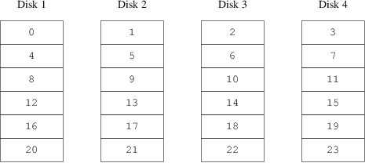

=====================
2.?Access Bottlenecks
=====================

.. raw:: html

   

2.?Access Bottlenecks
`Prev <index.html>`__?
?
?\ `Next <vinum-data-integrity.html>`__

--------------

.. raw:: html

   

.. raw:: html

   

.. raw:: html

   

.. raw:: html

   

.. raw:: html

   

2.?Access Bottlenecks
---------------------

.. raw:: html

   

.. raw:: html

   

.. raw:: html

   

Modern systems frequently need to access data in a highly concurrent
manner. For example, large FTP or HTTP servers can maintain thousands of
concurrent sessions and have multiple 100?Mbit/s connections to the
outside world, well beyond the sustained transfer rate of most disks.

Current disk drives can transfer data sequentially at up to 70?MB/s, but
this value is of little importance in an environment where many
independent processes access a drive, and where they may achieve only a
fraction of these values. In such cases, it is more interesting to view
the problem from the viewpoint of the disk subsystem. The important
parameter is the load that a transfer places on the subsystem, or the
time for which a transfer occupies the drives involved in the transfer.

In any disk transfer, the drive must first position the heads, wait for
the first sector to pass under the read head, and then perform the
transfer. These actions can be considered to be atomic as it does not
make any sense to interrupt them.

 Consider a typical transfer of about 10?kB: the current generation of
high-performance disks can position the heads in an average of 3.5?ms.
The fastest drives spin at 15,000?rpm, so the average rotational latency
(half a revolution) is 2?ms. At 70?MB/s, the transfer itself takes about
150?μs, almost nothing compared to the positioning time. In such a case,
the effective transfer rate drops to a little over 1?MB/s and is clearly
highly dependent on the transfer size.

The traditional and obvious solution to this bottleneck is “more
spindles”: rather than using one large disk, use several smaller disks
with the same aggregate storage space. Each disk is capable of
positioning and transferring independently, so the effective throughput
increases by a factor close to the number of disks used.

The actual throughput improvement is smaller than the number of disks
involved. Although each drive is capable of transferring in parallel,
there is no way to ensure that the requests are evenly distributed
across the drives. Inevitably the load on one drive will be higher than
on another.

The evenness of the load on the disks is strongly dependent on the way
the data is shared across the drives. In the following discussion, it is
convenient to think of the disk storage as a large number of data
sectors which are addressable by number, rather like the pages in a
book. The most obvious method is to divide the virtual disk into groups
of consecutive sectors the size of the individual physical disks and
store them in this manner, rather like taking a large book and tearing
it into smaller sections. This method is called *concatenation* and has
the advantage that the disks are not required to have any specific size
relationships. It works well when the access to the virtual disk is
spread evenly about its address space. When access is concentrated on a
smaller area, the improvement is less marked. `Figure?1, “Concatenated
Organization” <vinum-access-bottlenecks.html#vinum-concat>`__
illustrates the sequence in which storage units are allocated in a
concatenated organization.

.. raw:: html

   

.. raw:: html

   

Figure?1.?Concatenated Organization

.. raw:: html

   

.. raw:: html

   

.. raw:: html

   

|Concatenated Organization|

.. raw:: html

   

.. raw:: html

   

.. raw:: html

   

| 

An alternative mapping is to divide the address space into smaller,
equal-sized components and store them sequentially on different devices.
For example, the first 256 sectors may be stored on the first disk, the
next 256 sectors on the next disk and so on. After filling the last
disk, the process repeats until the disks are full. This mapping is
called *striping* or RAID-0.

RAID offers various forms of fault tolerance, though RAID-0 is somewhat
misleading as it provides no redundancy. Striping requires somewhat more
effort to locate the data, and it can cause additional I/O load where a
transfer is spread over multiple disks, but it can also provide a more
constant load across the disks. `Figure?2, “Striped
Organization” <vinum-access-bottlenecks.html#vinum-striped>`__
illustrates the sequence in which storage units are allocated in a
striped organization.

.. raw:: html

   

.. raw:: html

   

Figure?2.?Striped Organization

.. raw:: html

   

.. raw:: html

   

.. raw:: html

   

|Striped Organization|

.. raw:: html

   

.. raw:: html

   

.. raw:: html

   

| 

.. raw:: html

   

.. raw:: html

   

--------------

+---------------------------------+-------------------------+-------------------------------------------+
| `Prev <index.html>`__?          | ?                       | ?\ `Next <vinum-data-integrity.html>`__   |
+---------------------------------+-------------------------+-------------------------------------------+
| The ``vinum`` Volume Manager?   | `Home <index.html>`__   | ?3.?Data Integrity                        |
+---------------------------------+-------------------------+-------------------------------------------+

.. raw:: html

   

All FreeBSD documents are available for download at
http://ftp.FreeBSD.org/pub/FreeBSD/doc/

| Questions that are not answered by the
  `documentation <http://www.FreeBSD.org/docs.html>`__ may be sent to
  <freebsd-questions@FreeBSD.org\ >.
|  Send questions about this document to <freebsd-doc@FreeBSD.org\ >.

.. |Concatenated Organization| image:: vinum-concat.png

