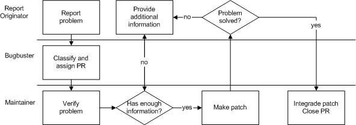

======================
6.6.?Problem reporting
======================

.. raw:: html

   

6.6.?Problem reporting
`Prev <model-maintenance.html>`__?
Chapter?6.?Processes
?\ `Next <process-reactions.html>`__

--------------

.. raw:: html

   

.. raw:: html

   

.. raw:: html

   

.. raw:: html

   

.. raw:: html

   

6.6.?Problem reporting
----------------------

.. raw:: html

   

.. raw:: html

   

.. raw:: html

   

Before FreeBSD?10, FreeBSD included a problem reporting tool called
``send-pr``. Problems include bug reports, feature requests, feature
enhancements and notices of new versions of external software that are
included in the project. Although ``send-pr`` is available, users and
developers are encouraged to submit issues using our `problem report
form <https://bugs.freebsd.org/submit/>`__.

Problem reports are sent to an email address where it is inserted into
the Problem Reports maintenance database. A
`Bugbuster <proc-depend-hats.html#role-bugbuster>`__ classifies the
problem and sends it to the correct group or maintainer within the
project. After someone has taken responsibility for the report, the
report is being analysed. This analysis includes verifying the problem
and thinking out a solution for the problem. Often feedback is required
from the report originator or even from the FreeBSD community. Once a
patch for the problem is made, the originator may be asked to try it
out. Finally, the working patch is integrated into the project, and
documented if applicable. It there goes through the regular maintenance
cycle as described in section `maintenance <model-maintenance.html>`__.
These are the states a problem report can be in: open, analyzed,
feedback, patched, suspended and closed. The suspended state is for when
further progress is not possible due to the lack of information or for
when the task would require so much work that nobody is working on it at
the moment.

.. raw:: html

   

.. raw:: html

   

Figure?6.7.?Process summary: problem reporting

.. raw:: html

   

.. raw:: html

   

.. raw:: html

   

|Process summary: problem reporting|

.. raw:: html

   

.. raw:: html

   

.. raw:: html

   

| 

A problem is reported by the report originator. It is then classified by
a bugbuster and handed to the correct maintainer. He verifies the
problem and discusses the problem with the originator until he has
enough information to create a working patch. This patch is then
committed and the problem report is closed.

The roles included in this process are:

.. raw:: html

   

#. `Report originator <proc-depend-hats.html#role-problem-originator>`__

#. `Maintainership <sect-hats.html#role-maintainer>`__

#. `Bugbuster <proc-depend-hats.html#role-bugbuster>`__

.. raw:: html

   

[`FreeBSD, 2002C <bibliography.html#freebsd-handle-pr>`__]. [`FreeBSD,
2002D <bibliography.html#freebsd-send-pr>`__]

.. raw:: html

   

.. raw:: html

   

--------------

+--------------------------------------+---------------------------------+----------------------------------------+
| `Prev <model-maintenance.html>`__?   | `Up <model-processes.html>`__   | ?\ `Next <process-reactions.html>`__   |
+--------------------------------------+---------------------------------+----------------------------------------+
| 6.5.?Maintenance?                    | `Home <index.html>`__           | ?6.7.?Reacting to misbehaviour         |
+--------------------------------------+---------------------------------+----------------------------------------+

.. raw:: html

   

All FreeBSD documents are available for download at
http://ftp.FreeBSD.org/pub/FreeBSD/doc/

| Questions that are not answered by the
  `documentation <http://www.FreeBSD.org/docs.html>`__ may be sent to
  <freebsd-questions@FreeBSD.org\ >.
|  Send questions about this document to <freebsd-doc@FreeBSD.org\ >.

