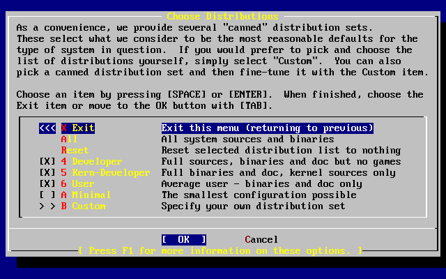

=============================
3.7.?Choosing What to Install
=============================

.. raw:: html

   

3.7.?Choosing What to Install
`Prev <install-steps.html>`__?
Chapter?3.?Installing FreeBSD?8.\ *``X``*
?\ `Next <install-media.html>`__

--------------

.. raw:: html

   

.. raw:: html

   

.. raw:: html

   

.. raw:: html

   

.. raw:: html

   

3.7.?Choosing What to Install
-----------------------------

.. raw:: html

   

.. raw:: html

   

.. raw:: html

   

.. raw:: html

   

.. raw:: html

   

.. raw:: html

   

.. raw:: html

   

3.7.1.?Select the Distribution Set
~~~~~~~~~~~~~~~~~~~~~~~~~~~~~~~~~~

.. raw:: html

   

.. raw:: html

   

.. raw:: html

   

Deciding which distribution set to install will depend largely on the
intended use of the system and the amount of disk space available. The
predefined options range from installing the smallest possible
configuration to everything. Those who are new to UNIX? or FreeBSD
should select one of these canned options. Customizing a distribution
set is typically for the more experienced user.

Press **F1** for more information on the distribution set options and
what they contain. When finished reviewing the help, press **Enter** to
return to the Select Distributions Menu.

If a graphical user interface is desired, the configuration of Xorg and
selection of a default desktop must be done after the installation of
FreeBSD. More information regarding the installation and configuration
of a Xorg can be found in `Chapter?6, *The X Window
System* <x11.html>`__.

If compiling a custom kernel is anticipated, select an option which
includes the source code. For more information on why a custom kernel
should be built or how to build a custom kernel, see `Chapter?9,
*Configuring the FreeBSD Kernel* <kernelconfig.html>`__.

The most versatile system is one that includes everything. If there is
adequate disk space, select All, as shown in `Figure?3.25, “Choose
Distributions” <install-choosing.html#distribution-set1>`__, by using
the arrow keys and pressing **Enter**. If there is a concern about disk
space, consider using an option that is more suitable for the situation.
Do not fret over the perfect choice, as other distributions can be added
after installation.

.. raw:: html

   

.. raw:: html

   

Figure?3.25.?Choose Distributions

.. raw:: html

   

.. raw:: html

   

.. raw:: html

   

|Choose Distributions|

.. raw:: html

   

.. raw:: html

   

.. raw:: html

   

.. raw:: html

   

.. raw:: html

   

.. raw:: html

   

.. raw:: html

   

.. raw:: html

   

3.7.2.?Installing the Ports Collection
~~~~~~~~~~~~~~~~~~~~~~~~~~~~~~~~~~~~~~

.. raw:: html

   

.. raw:: html

   

.. raw:: html

   

After selecting the desired distribution, an opportunity to install the
FreeBSD Ports Collection is presented. The Ports Collection is an easy
and convenient way to install software as it provides a collection of
files that automate the downloading, compiling, and installation of
third-party software packages. `Chapter?5, *Installing Applications:
Packages and Ports* <ports.html>`__ discusses how to use the Ports
Collection.

The installation program does not check to see if you have adequate
space. Select this option only if you have adequate hard disk space. As
of FreeBSD 10.1, the FreeBSD Ports Collection takes up about 500?MB of
disk space. You can safely assume a larger value for more recent
versions of FreeBSD.

.. code:: screen

                             User Confirmation Requested
     Would you like to install the FreeBSD ports collection?

     This will give you ready access to over 24,000 ported software packages,
     at a cost of around 500?MB of disk space when "clean" and possibly much
     more than that if a lot of the distribution tarballs are loaded
     (unless you have the extra CDs from a FreeBSD CD/DVD distribution
     available and can mount it on /cdrom, in which case this is far less
     of a problem).

     The Ports Collection is a very valuable resource and well worth having
     on your /usr partition, so it is advisable to say Yes to this option.

     For more information on the Ports Collection & the latest ports,
     visit:
         http://www.FreeBSD.org/ports

                                  [ Yes ]     No

Select [?Yes?] with the arrow keys to install the Ports Collection or
[?No?] to skip this option. Press **Enter** to continue. The Choose
Distributions menu will redisplay.

.. raw:: html

   

.. raw:: html

   

Figure?3.26.?Confirm Distributions

.. raw:: html

   

.. raw:: html

   

.. raw:: html

   

|Confirm Distributions|

.. raw:: html

   

.. raw:: html

   

.. raw:: html

   

Once satisfied with the options, select Exit with the arrow keys, ensure
that [?OK?] is highlighted, and press **Enter** to continue.

.. raw:: html

   

.. raw:: html

   

.. raw:: html

   

--------------

+----------------------------------+-------------------------+-----------------------------------------+
| `Prev <install-steps.html>`__?   | `Up <install.html>`__   | ?\ `Next <install-media.html>`__        |
+----------------------------------+-------------------------+-----------------------------------------+
| 3.6.?Allocating Disk Space?      | `Home <index.html>`__   | ?3.8.?Choosing the Installation Media   |
+----------------------------------+-------------------------+-----------------------------------------+

.. raw:: html

   

All FreeBSD documents are available for download at
http://ftp.FreeBSD.org/pub/FreeBSD/doc/

| Questions that are not answered by the
  `documentation <http://www.FreeBSD.org/docs.html>`__ may be sent to
  <freebsd-questions@FreeBSD.org\ >.
|  Send questions about this document to <freebsd-doc@FreeBSD.org\ >.

.. |Choose Distributions| image:: install/dist-set.png

