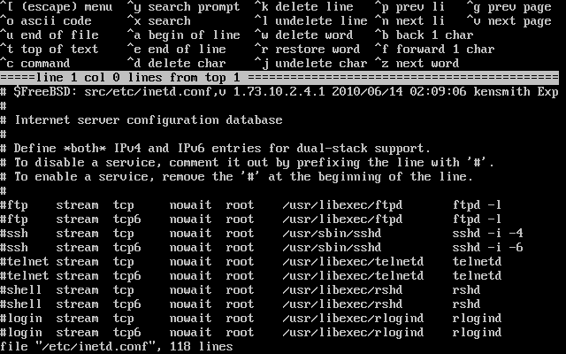
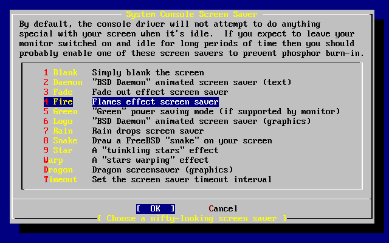
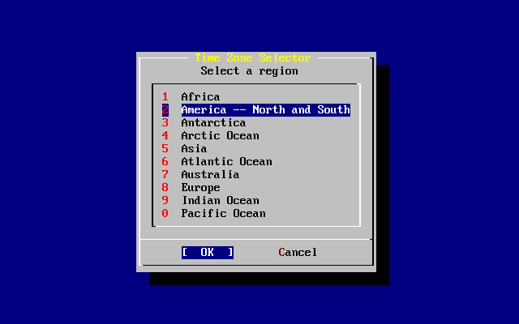
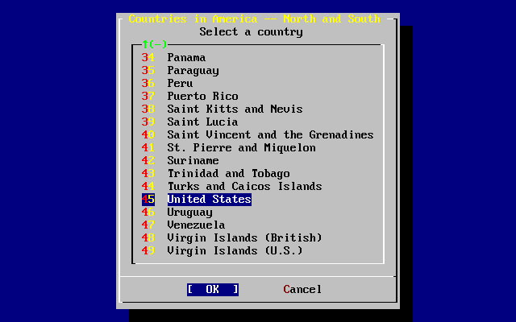
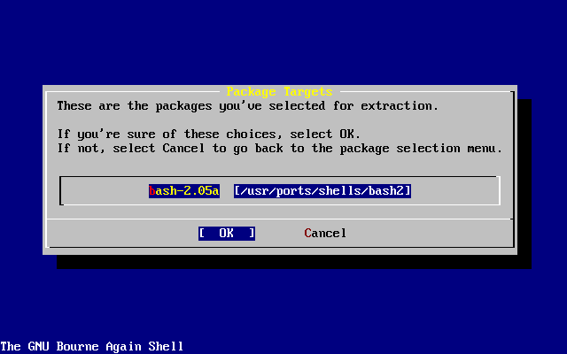
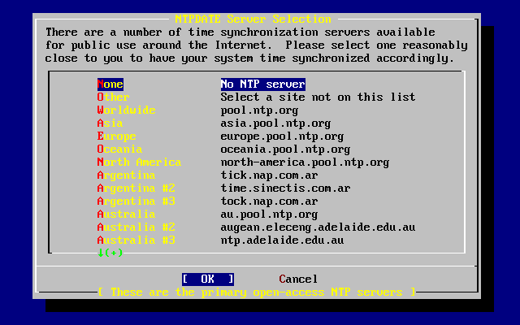

=======================
3.10.?Post-installation
=======================

.. raw:: html

   

3.10.?Post-installation
`Prev <install-final-warning.html>`__?
Chapter?3.?Installing FreeBSD?8.\ *``X``*
?\ `Next <install-trouble.html>`__

--------------

.. raw:: html

   

.. raw:: html

   

.. raw:: html

   

.. raw:: html

   

.. raw:: html

   

3.10.?Post-installation
-----------------------

.. raw:: html

   

.. raw:: html

   

.. raw:: html

   

Configuration of various options can be performed after a successful
installation. An option can be configured by re-entering the
configuration menus before booting the new FreeBSD system or after boot
using
`sysinstall(8) <http://www.FreeBSD.org/cgi/man.cgi?query=sysinstall&sektion=8>`__
and then selecting the Configure menu.

.. raw:: html

   

.. raw:: html

   

.. raw:: html

   

.. raw:: html

   

3.10.1.?Network Device Configuration
~~~~~~~~~~~~~~~~~~~~~~~~~~~~~~~~~~~~

.. raw:: html

   

.. raw:: html

   

.. raw:: html

   

If PPP was previously configured for an FTP install, this screen will
not display and can be configured after boot as described above.

For detailed information on Local Area Networks and configuring FreeBSD
as a gateway/router refer to the `Advanced
Networking <advanced-networking.html>`__ chapter.

.. code:: screen

                          User Confirmation Requested
       Would you like to configure any Ethernet or PPP network devices?

                                 [ Yes ]   No

To configure a network device, select [?Yes?] and press **Enter**.
Otherwise, select [?No?] to continue.

.. raw:: html

   

.. raw:: html

   

Figure?3.28.?Selecting an Ethernet Device

.. raw:: html

   

.. raw:: html

   

.. raw:: html

   

|Selecting an Ethernet Device|

.. raw:: html

   

.. raw:: html

   

.. raw:: html

   

Select the interface to be configured with the arrow keys and press
**Enter**.

.. code:: screen

                          User Confirmation Requested
           Do you want to try IPv6 configuration of the interface?

                                  Yes   [ No ]

In this private local area network, the current Internet type protocol
(IPv4) was sufficient and [?No?] was selected with the arrow keys and
**Enter** pressed.

If connected to an existing IPv6 network with an RA server, choose
[?Yes?] and press **Enter**. It will take several seconds to scan for RA
servers.

.. code:: screen

                                 User Confirmation Requested
            Do you want to try DHCP configuration of the interface?

                                  Yes   [ No ]

If Dynamic Host Configuration Protocol DHCP) is not required, select
[?No?] with the arrow keys and press **Enter**.

Selecting [?Yes?] will execute
`dhclient(8) <http://www.FreeBSD.org/cgi/man.cgi?query=dhclient&sektion=8>`__
and, if successful, will fill in the network configuration information
automatically. Refer to `Section?29.6, “Dynamic Host Configuration
Protocol (DHCP)” <network-dhcp.html>`__ for more information.

The following Network Configuration screen shows the configuration of
the Ethernet device for a system that will act as the gateway for a
Local Area Network.

.. raw:: html

   

.. raw:: html

   

Figure?3.29.?Set Network Configuration for *``ed0``*

.. raw:: html

   

.. raw:: html

   

.. raw:: html

   

|Set Network Configuration for ed0|

.. raw:: html

   

.. raw:: html

   

.. raw:: html

   

Use **Tab** to select the information fields and fill in appropriate
information:

.. raw:: html

   

Host
    The fully-qualified hostname, such as ``k6-2.example.com`` in this
    case.

Domain
    The name of the domain that the machine is in, such as
    ``example.com`` for this case.

IPv4 Gateway
    IP address of host forwarding packets to non-local destinations.
    This must be filled in if the machine is a node on the network.
    *Leave this field blank* if the machine is the gateway to the
    Internet for the network. The IPv4 Gateway is also known as the
    default gateway or default route.

Name server
    IP address of the local DNS server. There is no local DNS server on
    this private local area network so the IP address of the provider's
    DNS server (``208.163.10.2``) was used.

IPv4 address
    The IP address to be used for this interface was ``192.168.0.1``

Netmask
    The address block being used for this local area network is
    ``192.168.0.0`` - ``192.168.0.255`` with a netmask of
    ``255.255.255.0``.

Extra options to
`ifconfig(8) <http://www.FreeBSD.org/cgi/man.cgi?query=ifconfig&sektion=8>`__
    Any additional interface-specific options to
    `ifconfig(8) <http://www.FreeBSD.org/cgi/man.cgi?query=ifconfig&sektion=8>`__.
    There were none in this case.

.. raw:: html

   

Use **Tab** to select [?OK?] when finished and press **Enter**.

.. code:: screen

                          User Confirmation Requested
            Would you like to bring the ed0 interface up right now?

                                 [ Yes ]   No

Choosing [?Yes?] and pressing **Enter** will bring the machine up on the
network so it is ready for use. However, this does not accomplish much
during installation, since the machine still needs to be rebooted.

.. raw:: html

   

.. raw:: html

   

.. raw:: html

   

.. raw:: html

   

.. raw:: html

   

3.10.2.?Configure Gateway
~~~~~~~~~~~~~~~~~~~~~~~~~

.. raw:: html

   

.. raw:: html

   

.. raw:: html

   

.. code:: screen

                           User Confirmation Requested
           Do you want this machine to function as a network gateway?

                                  [ Yes ]    No

If the machine will be acting as the gateway for a local area network
and forwarding packets between other machines, select [?Yes?] and press
**Enter**. If the machine is a node on a network, select [?No?] and
press **Enter** to continue.

.. raw:: html

   

.. raw:: html

   

.. raw:: html

   

.. raw:: html

   

.. raw:: html

   

3.10.3.?Configure Internet Services
~~~~~~~~~~~~~~~~~~~~~~~~~~~~~~~~~~~

.. raw:: html

   

.. raw:: html

   

.. raw:: html

   

.. code:: screen

                          User Confirmation Requested
    Do you want to configure inetd and the network services that it provides?

                                   Yes   [ No ]

If [?No?] is selected, various services will not be enabled. These
services can be enabled after installation by editing
``/etc/inetd.conf`` with a text editor. See `Section?29.2.1,
“Configuration File” <network-inetd.html#network-inetd-conf>`__ for more
information.

Otherwise, select [?Yes?] to configure these services during install. An
additional confirmation will display:

.. code:: screen

                          User Confirmation Requested
    The Internet Super Server (inetd) allows a number of simple Internet
    services to be enabled, including finger, ftp and telnetd.  Enabling
    these services may increase risk of security problems by increasing
    the exposure of your system.

    With this in mind, do you wish to enable inetd?

                                 [ Yes ]   No

Select [?Yes?] to continue.

.. code:: screen

                          User Confirmation Requested
    inetd(8) relies on its configuration file, /etc/inetd.conf, to determine
    which of its Internet services will be available.  The default FreeBSD
    inetd.conf(5) leaves all services disabled by default, so they must be
    specifically enabled in the configuration file before they will
    function, even once inetd(8) is enabled.  Note that services for
    IPv6 must be separately enabled from IPv4 services.

    Select [Yes] now to invoke an editor on /etc/inetd.conf, or [No] to
    use the current settings.

                                 [ Yes ]   No

Selecting [?Yes?] allows services to be enabled by deleting the ``#`` at
the beginning of the lines representing those services.

.. raw:: html

   

.. raw:: html

   

Figure?3.30.?Editing ``inetd.conf``

.. raw:: html

   

.. raw:: html

   

.. raw:: html

   

|Editing inetd.conf|

.. raw:: html

   

.. raw:: html

   

.. raw:: html

   

Once the edits are complete, press **Esc** to display a menu which will
exit the editor and save the changes.

.. raw:: html

   

.. raw:: html

   

.. raw:: html

   

.. raw:: html

   

.. raw:: html

   

3.10.4.?Enabling SSH Login
~~~~~~~~~~~~~~~~~~~~~~~~~~

.. raw:: html

   

.. raw:: html

   

.. raw:: html

   

.. code:: screen

                          User Confirmation Requested
                      Would you like to enable SSH login?
                               Yes        [  No  ]

Selecting [?Yes?] will enable
`sshd(8) <http://www.FreeBSD.org/cgi/man.cgi?query=sshd&sektion=8>`__,
the daemon for OpenSSH. This allows secure remote access to the machine.
For more information about OpenSSH, see `Section?14.8,
“OpenSSH” <openssh.html>`__.

.. raw:: html

   

.. raw:: html

   

.. raw:: html

   

.. raw:: html

   

.. raw:: html

   

3.10.5.?Anonymous FTP
~~~~~~~~~~~~~~~~~~~~~

.. raw:: html

   

.. raw:: html

   

.. raw:: html

   

.. code:: screen

                          User Confirmation Requested
     Do you want to have anonymous FTP access to this machine?

                                  Yes    [ No ]

.. raw:: html

   

.. raw:: html

   

.. raw:: html

   

.. raw:: html

   

3.10.5.1.?Deny Anonymous FTP
^^^^^^^^^^^^^^^^^^^^^^^^^^^^

.. raw:: html

   

.. raw:: html

   

.. raw:: html

   

Selecting the default [?No?] and pressing **Enter** will still allow
users who have accounts with passwords to use FTP to access the machine.

.. raw:: html

   

.. raw:: html

   

.. raw:: html

   

.. raw:: html

   

.. raw:: html

   

3.10.5.2.?Allow Anonymous FTP
^^^^^^^^^^^^^^^^^^^^^^^^^^^^^

.. raw:: html

   

.. raw:: html

   

.. raw:: html

   

Anyone can access the machine if anonymous FTP connections are allowed.
The security implications should be considered before enabling this
option. For more information about security, see `Chapter?14,
*Security* <security.html>`__.

To allow anonymous FTP, use the arrow keys to select [?Yes?] and press
**Enter**. An additional confirmation will display:

.. code:: screen

                           User Confirmation Requested
     Anonymous FTP permits un-authenticated users to connect to the system
     FTP server, if FTP service is enabled.  Anonymous users are
     restricted to a specific subset of the file system, and the default
     configuration provides a drop-box incoming directory to which uploads
     are permitted.  You must separately enable both inetd(8), and enable
     ftpd(8) in inetd.conf(5) for FTP services to be available.  If you
     did not do so earlier, you will have the opportunity to enable inetd(8)
     again later.

     If you want the server to be read-only you should leave the upload
     directory option empty and add the -r command-line option to ftpd(8)
     in inetd.conf(5)

     Do you wish to continue configuring anonymous FTP?

                              [ Yes ]         No

This message indicates that the FTP service will also have to be enabled
in ``/etc/inetd.conf`` to allow anonymous FTP connections. Select
[?Yes?] and press **Enter** to continue. The following screen will
display:

.. raw:: html

   

.. raw:: html

   

Figure?3.31.?Default Anonymous FTP Configuration

.. raw:: html

   

.. raw:: html

   

.. raw:: html

   

|Default Anonymous FTP Configuration|

.. raw:: html

   

.. raw:: html

   

.. raw:: html

   

Use **Tab** to select the information fields and fill in appropriate
information:

.. raw:: html

   

UID
    The user ID to assign to the anonymous FTP user. All files uploaded
    will be owned by this ID.

Group
    Which group to place the anonymous FTP user into.

Comment
    String describing this user in ``/etc/passwd``.

FTP Root Directory
    Where files available for anonymous FTP will be kept.

Upload Subdirectory
    Where files uploaded by anonymous FTP users will go.

.. raw:: html

   

The FTP root directory will be put in ``/var`` by default. If there is
not enough room there for the anticipated FTP needs, use ``/usr``
instead by setting the FTP root directory to ``/usr/ftp``.

Once satisfied with the values, press **Enter** to continue.

.. code:: screen

                              User Confirmation Requested
             Create a welcome message file for anonymous FTP users?

                                  [ Yes ]    No

If [?Yes?] is selected, press **Enter** and the
`ee(1) <http://www.FreeBSD.org/cgi/man.cgi?query=ee&sektion=1>`__ editor
will automatically start.

.. raw:: html

   

.. raw:: html

   

Figure?3.32.?Edit the FTP Welcome Message

.. raw:: html

   

.. raw:: html

   

.. raw:: html

   

|Edit the FTP Welcome Message|

.. raw:: html

   

.. raw:: html

   

.. raw:: html

   

Use the instructions to change the message. Note the file name location
at the bottom of the editor screen.

Press **Esc** and a pop-up menu will default to a) leave editor. Press
**Enter** to exit and continue. Press **Enter** again to save any
changes.

.. raw:: html

   

.. raw:: html

   

.. raw:: html

   

.. raw:: html

   

.. raw:: html

   

.. raw:: html

   

3.10.6.?Configure the Network File System
~~~~~~~~~~~~~~~~~~~~~~~~~~~~~~~~~~~~~~~~~

.. raw:: html

   

.. raw:: html

   

.. raw:: html

   

The Network File System (NFS) allows sharing of files across a network.
A machine can be configured as a server, a client, or both. Refer to
`Section?29.3, “Network File System (NFS)” <network-nfs.html>`__ for
more information.

.. raw:: html

   

.. raw:: html

   

.. raw:: html

   

.. raw:: html

   

3.10.6.1.?NFS Server
^^^^^^^^^^^^^^^^^^^^

.. raw:: html

   

.. raw:: html

   

.. raw:: html

   

.. code:: screen

                           User Confirmation Requested
     Do you want to configure this machine as an NFS server?

                                  Yes    [ No ]

If there is no need for a NFS server, select [?No?] and press **Enter**.

If [?Yes?] is chosen, a message will pop-up indicating that
``/etc/exports`` must be created.

.. code:: screen

                                   Message
    Operating as an NFS server means that you must first configure an
    /etc/exports file to indicate which hosts are allowed certain kinds of
    access to your local filesystems.
    Press [Enter] now to invoke an editor on /etc/exports
                                   [ OK ]

Press **Enter** to continue. A text editor will start, allowing
``/etc/exports`` to be edited.

.. raw:: html

   

.. raw:: html

   

Figure?3.33.?Editing ``exports``

.. raw:: html

   

.. raw:: html

   

.. raw:: html

   

|Editing exports|

.. raw:: html

   

.. raw:: html

   

.. raw:: html

   

Use the instructions to add the exported filesystems. Note the file name
location at the bottom of the editor screen.

Press **Esc** and a pop-up menu will default to a) leave editor. Press
**Enter** to exit and continue.

.. raw:: html

   

.. raw:: html

   

.. raw:: html

   

.. raw:: html

   

.. raw:: html

   

3.10.6.2.?NFS Client
^^^^^^^^^^^^^^^^^^^^

.. raw:: html

   

.. raw:: html

   

.. raw:: html

   

The NFS client allows the machine to access NFS servers.

.. code:: screen

                           User Confirmation Requested
     Do you want to configure this machine as an NFS client?

                                  Yes   [ No ]

With the arrow keys, select [?Yes?] or [?No?] as appropriate and press
**Enter**.

.. raw:: html

   

.. raw:: html

   

.. raw:: html

   

.. raw:: html

   

.. raw:: html

   

.. raw:: html

   

3.10.7.?System Console Settings
~~~~~~~~~~~~~~~~~~~~~~~~~~~~~~~

.. raw:: html

   

.. raw:: html

   

.. raw:: html

   

There are several options available to customize the system console.

.. code:: screen

                          User Confirmation Requested
           Would you like to customize your system console settings?

                                  [ Yes ]  No

To view and configure the options, select [?Yes?] and press **Enter**.

.. raw:: html

   

.. raw:: html

   

Figure?3.34.?System Console Configuration Options

.. raw:: html

   

.. raw:: html

   

.. raw:: html

   

|System Console Configuration Options|

.. raw:: html

   

.. raw:: html

   

.. raw:: html

   

A commonly used option is the screen saver. Use the arrow keys to select
Saver and then press **Enter**.

.. raw:: html

   

.. raw:: html

   

Figure?3.35.?Screen Saver Options

.. raw:: html

   

.. raw:: html

   

.. raw:: html

   

|Screen Saver Options|

.. raw:: html

   

.. raw:: html

   

.. raw:: html

   

Select the desired screen saver using the arrow keys and then press
**Enter**. The System Console Configuration menu will redisplay.

The default time interval is 300 seconds. To change the time interval,
select Saver again. At the Screen Saver Options menu, select Timeout
using the arrow keys and press **Enter**. A pop-up menu will appear:

.. raw:: html

   

.. raw:: html

   

Figure?3.36.?Screen Saver Timeout

.. raw:: html

   

.. raw:: html

   

.. raw:: html

   

|Screen Saver Timeout|

.. raw:: html

   

.. raw:: html

   

.. raw:: html

   

The value can be changed, then select [?OK?] and press **Enter** to
return to the System Console Configuration menu.

.. raw:: html

   

.. raw:: html

   

Figure?3.37.?System Console Configuration Exit

.. raw:: html

   

.. raw:: html

   

.. raw:: html

   

|System Console Configuration Exit|

.. raw:: html

   

.. raw:: html

   

.. raw:: html

   

Select Exit and press **Enter** to continue with the post-installation
configuration.

.. raw:: html

   

.. raw:: html

   

.. raw:: html

   

.. raw:: html

   

.. raw:: html

   

3.10.8.?Setting the Time Zone
~~~~~~~~~~~~~~~~~~~~~~~~~~~~~

.. raw:: html

   

.. raw:: html

   

.. raw:: html

   

Setting the time zone allows the system to automatically correct for any
regional time changes and perform other time zone related functions
properly.

The example shown is for a machine located in the Eastern time zone of
the United States. The selections will vary according to the geographic
location.

.. code:: screen

                          User Confirmation Requested
              Would you like to set this machine's time zone now?

                                [ Yes ]   No

Select [?Yes?] and press **Enter** to set the time zone.

.. code:: screen

                           User Confirmation Requested
     Is this machine's CMOS clock set to UTC? If it is set to local time
     or you don't know, please choose NO here!

                                  Yes   [ No ]

Select [?Yes?] or [?No?] according to how the machine's clock is
configured, then press **Enter**.

.. raw:: html

   

.. raw:: html

   

Figure?3.38.?Select the Region

.. raw:: html

   

.. raw:: html

   

.. raw:: html

   

|Select the Region|

.. raw:: html

   

.. raw:: html

   

.. raw:: html

   

The appropriate region is selected using the arrow keys and then
pressing **Enter**.

.. raw:: html

   

.. raw:: html

   

Figure?3.39.?Select the Country

.. raw:: html

   

.. raw:: html

   

.. raw:: html

   

|Select the Country|

.. raw:: html

   

.. raw:: html

   

.. raw:: html

   

Select the appropriate country using the arrow keys and press **Enter**.

.. raw:: html

   

.. raw:: html

   

Figure?3.40.?Select the Time Zone

.. raw:: html

   

.. raw:: html

   

.. raw:: html

   

|Select the Time Zone|

.. raw:: html

   

.. raw:: html

   

.. raw:: html

   

The appropriate time zone is selected using the arrow keys and pressing
**Enter**.

.. code:: screen

                                Confirmation
                Does the abbreviation 'EDT' look reasonable?

                                [ Yes ]   No

Confirm that the abbreviation for the time zone is correct. If it looks
okay, press **Enter** to continue with the post-installation
configuration.

.. raw:: html

   

.. raw:: html

   

.. raw:: html

   

.. raw:: html

   

.. raw:: html

   

3.10.9.?Mouse Settings
~~~~~~~~~~~~~~~~~~~~~~

.. raw:: html

   

.. raw:: html

   

.. raw:: html

   

This option allows cut and paste in the console and user programs using
a 3-button mouse. If using a 2-button mouse, refer to
`moused(8) <http://www.FreeBSD.org/cgi/man.cgi?query=moused&sektion=8>`__
for details on emulating the 3-button style. This example depicts a
non-USB mouse configuration:

.. code:: screen

                          User Confirmation Requested
             Does this system have a PS/2, serial, or bus mouse?

                                [ Yes ]    No 

Select [?Yes?] for a PS/2, serial, or bus mouse, or [?No?] for a USB
mouse, then press **Enter**.

.. raw:: html

   

.. raw:: html

   

Figure?3.41.?Select Mouse Protocol Type

.. raw:: html

   

.. raw:: html

   

.. raw:: html

   

|Select Mouse Protocol Type|

.. raw:: html

   

.. raw:: html

   

.. raw:: html

   

Use the arrow keys to select Type and press **Enter**.

.. raw:: html

   

.. raw:: html

   

Figure?3.42.?Set Mouse Protocol

.. raw:: html

   

.. raw:: html

   

.. raw:: html

   

|Set Mouse Protocol|

.. raw:: html

   

.. raw:: html

   

.. raw:: html

   

The mouse used in this example is a PS/2 type, so the default Auto is
appropriate. To change the mouse protocol, use the arrow keys to select
another option. Ensure that [?OK?] is highlighted and press **Enter** to
exit this menu.

.. raw:: html

   

.. raw:: html

   

Figure?3.43.?Configure Mouse Port

.. raw:: html

   

.. raw:: html

   

.. raw:: html

   

|Configure Mouse Port|

.. raw:: html

   

.. raw:: html

   

.. raw:: html

   

Use the arrow keys to select Port and press **Enter**.

.. raw:: html

   

.. raw:: html

   

Figure?3.44.?Setting the Mouse Port

.. raw:: html

   

.. raw:: html

   

.. raw:: html

   

|Setting the Mouse Port|

.. raw:: html

   

.. raw:: html

   

.. raw:: html

   

This system had a PS/2 mouse, so the default PS/2 is appropriate. To
change the port, use the arrow keys and then press **Enter**.

.. raw:: html

   

.. raw:: html

   

Figure?3.45.?Enable the Mouse Daemon

.. raw:: html

   

.. raw:: html

   

.. raw:: html

   

|Enable the Mouse Daemon|

.. raw:: html

   

.. raw:: html

   

.. raw:: html

   

Last, use the arrow keys to select Enable, and press **Enter** to enable
and test the mouse daemon.

.. raw:: html

   

.. raw:: html

   

Figure?3.46.?Test the Mouse Daemon

.. raw:: html

   

.. raw:: html

   

.. raw:: html

   

|Test the Mouse Daemon|

.. raw:: html

   

.. raw:: html

   

.. raw:: html

   

Move the mouse around the screen to verify that the cursor responds
properly. If it does, select [?Yes?] and press **Enter**. If not, the
mouse has not been configured correctly. Select [?No?] and try using
different configuration options.

Select Exit with the arrow keys and press **Enter** to continue with the
post-installation configuration.

.. raw:: html

   

.. raw:: html

   

.. raw:: html

   

.. raw:: html

   

.. raw:: html

   

3.10.10.?Install Packages
~~~~~~~~~~~~~~~~~~~~~~~~~

.. raw:: html

   

.. raw:: html

   

.. raw:: html

   

Packages are pre-compiled binaries and are a convenient way to install
software.

Installation of one package is shown for purposes of illustration.
Additional packages can also be added at this time if desired. After
installation,
`sysinstall(8) <http://www.FreeBSD.org/cgi/man.cgi?query=sysinstall&sektion=8>`__
can be used to add additional packages.

.. code:: screen

                         User Confirmation Requested
     The FreeBSD package collection is a collection of hundreds of
     ready-to-run applications, from text editors to games to WEB servers
     and more. Would you like to browse the collection now?

                                [ Yes ]   No

Select [?Yes?] and press **Enter** to be presented with the Package
Selection screens:

.. raw:: html

   

.. raw:: html

   

Figure?3.47.?Select Package Category

.. raw:: html

   

.. raw:: html

   

.. raw:: html

   

|Select Package Category|

.. raw:: html

   

.. raw:: html

   

.. raw:: html

   

Only packages on the current installation media are available for
installation at any given time.

All packages available will be displayed if All is selected. Otherwise,
select a particular category. Highlight the selection with the arrow
keys and press **Enter**.

A menu will display showing all the packages available for the selection
made:

.. raw:: html

   

.. raw:: html

   

Figure?3.48.?Select Packages

.. raw:: html

   

.. raw:: html

   

.. raw:: html

   

|Select Packages|

.. raw:: html

   

.. raw:: html

   

.. raw:: html

   

The bash shell is shown as selected. Select as many packages as desired
by highlighting the package and pressing **Space**. A short description
of each package will appear in the lower left corner of the screen.

Press **Tab** to toggle between the last selected package, [?OK?], and
[?Cancel?].

Once finished marking the packages for installation, press **Tab** once
to toggle to [?OK?] and press **Enter** to return to the Package
Selection menu.

The left and right arrow keys will also toggle between [?OK?] and
[?Cancel?]. This method can also be used to select [?OK?] and press
**Enter** to return to the Package Selection menu.

.. raw:: html

   

.. raw:: html

   

Figure?3.49.?Install Packages

.. raw:: html

   

.. raw:: html

   

.. raw:: html

   

|Install Packages|

.. raw:: html

   

.. raw:: html

   

.. raw:: html

   

Use the **Tab** and arrow keys to select [?Install?] and press **Enter**
to see the installation confirmation message:

.. raw:: html

   

.. raw:: html

   

Figure?3.50.?Confirm Package Installation

.. raw:: html

   

.. raw:: html

   

.. raw:: html

   

|Confirm Package Installation|

.. raw:: html

   

.. raw:: html

   

.. raw:: html

   

Select [?OK?] and press **Enter** to start the package installation.
Installation messages will appear until all of the installations have
completed. Make note if there are any error messages.

The final configuration continues after packages are installed. If no
packages are selected, select Install to return to the final
configuration.

.. raw:: html

   

.. raw:: html

   

.. raw:: html

   

.. raw:: html

   

.. raw:: html

   

3.10.11.?Add Users/Groups
~~~~~~~~~~~~~~~~~~~~~~~~~

.. raw:: html

   

.. raw:: html

   

.. raw:: html

   

Add at least one user during the installation so that the system can be
used without logging in as ``root``. The root partition is generally
small and running applications as ``root`` can quickly fill it. A bigger
danger is noted below:

.. code:: screen

                         User Confirmation Requested
     Would you like to add any initial user accounts to the system? Adding
     at least one account for yourself at this stage is suggested since
     working as the "root" user is dangerous (it is easy to do things which
     adversely affect the entire system).

                                [ Yes ]   No

Select [?Yes?] and press **Enter** to continue with adding a user.

.. raw:: html

   

.. raw:: html

   

Figure?3.51.?Select User

.. raw:: html

   

.. raw:: html

   

.. raw:: html

   

|Select User|

.. raw:: html

   

.. raw:: html

   

.. raw:: html

   

Select User with the arrow keys and press **Enter**.

.. raw:: html

   

.. raw:: html

   

Figure?3.52.?Add User Information

.. raw:: html

   

.. raw:: html

   

.. raw:: html

   

|Add User Information|

.. raw:: html

   

.. raw:: html

   

.. raw:: html

   

The following descriptions will appear in the lower part of the screen
as the items are selected with **Tab** to assist with entering the
required information:

.. raw:: html

   

Login ID
    The login name of the new user (mandatory).

UID
    The numerical ID for this user (leave blank for automatic choice).

Group
    The login group name for this user (leave blank for automatic
    choice).

Password
    The password for this user (enter this field with care!).

Full name
    The user's full name (comment).

Member groups
    The groups this user belongs to.

Home directory
    The user's home directory (leave blank for default).

Login shell
    The user's login shell (leave blank for default of ``/bin/sh``).

.. raw:: html

   

In this example, the login shell was changed from ``/bin/sh`` to
``/usr/local/bin/bash`` to use the bash shell that was previously
installed as a package. Do not use a shell that does not exist or the
user will not be able to login. The most common shell used in FreeBSD is
the C shell, ``/bin/tcsh``.

The user was also added to the ``wheel`` group to be able to become a
superuser with ``root`` privileges.

Once satisfied, press [?OK?] and the User and Group Management menu will
redisplay:

.. raw:: html

   

.. raw:: html

   

Figure?3.53.?Exit User and Group Management

.. raw:: html

   

.. raw:: html

   

.. raw:: html

   

|Exit User and Group Management|

.. raw:: html

   

.. raw:: html

   

.. raw:: html

   

Groups can also be added at this time. Otherwise, this menu may be
accessed using
`sysinstall(8) <http://www.FreeBSD.org/cgi/man.cgi?query=sysinstall&sektion=8>`__
at a later time.

When finished adding users, select Exit with the arrow keys and press
**Enter** to continue the installation.

.. raw:: html

   

.. raw:: html

   

.. raw:: html

   

.. raw:: html

   

.. raw:: html

   

3.10.12.?Set the ``root`` Password
~~~~~~~~~~~~~~~~~~~~~~~~~~~~~~~~~~

.. raw:: html

   

.. raw:: html

   

.. raw:: html

   

.. code:: screen

                            Message
     Now you must set the system manager's password.
     This is the password you'll use to log in as "root".

                             [ OK ]

                   [ Press enter or space ]

Press **Enter** to set the ``root`` password.

The password will need to be typed in twice correctly. Do not forget
this password. Notice that the typed password is not echoed, nor are
asterisks displayed.

.. code:: screen

    New password:
    Retype new password :

The installation will continue after the password is successfully
entered.

.. raw:: html

   

.. raw:: html

   

.. raw:: html

   

.. raw:: html

   

.. raw:: html

   

3.10.13.?Exiting Install
~~~~~~~~~~~~~~~~~~~~~~~~

.. raw:: html

   

.. raw:: html

   

.. raw:: html

   

A message will ask if configuration is complete:

.. code:: screen

                         User Confirmation Requested
     Visit the general configuration menu for a chance to set any last
     options?

                                  Yes   [ No ]

Select [?No?] with the arrow keys and press **Enter** to return to the
Main Installation Menu.

.. raw:: html

   

.. raw:: html

   

Figure?3.54.?Exit Install

.. raw:: html

   

.. raw:: html

   

.. raw:: html

   

|Exit Install|

.. raw:: html

   

.. raw:: html

   

.. raw:: html

   

Select [X Exit Install] with the arrow keys and press **Enter**. The
installer will prompt to confirm exiting the installation:

.. code:: screen

                         User Confirmation Requested
     Are you sure you wish to exit? The system will reboot.

                                [ Yes ]   No

Select [?Yes?]. If booting from the CDROM drive, the following message
will remind you to remove the disk:

.. code:: screen

                        Message
     Be sure to remove the media from the drive.

                        [ OK ]
               [ Press enter or space ]

The CDROM drive is locked until the machine starts to reboot, then the
disk can quickly be removed from the drive. Press [?OK?] to reboot.

The system will reboot so watch for any error messages that may appear,
see `Section?3.10.15, “FreeBSD
Bootup” <install-post.html#freebsdboot>`__ for more details.

.. raw:: html

   

.. raw:: html

   

.. raw:: html

   

.. raw:: html

   

.. raw:: html

   

3.10.14.?Configure Additional Network Services
~~~~~~~~~~~~~~~~~~~~~~~~~~~~~~~~~~~~~~~~~~~~~~

.. raw:: html

   

.. raw:: html

   

Contributed by Tom Rhodes.

.. raw:: html

   

.. raw:: html

   

.. raw:: html

   

Configuring network services can be a daunting task for users that lack
previous knowledge in this area. Since networking and the Internet are
critical to all modern operating systems, it is useful to have some
understanding of FreeBSD's extensive networking capabilities.

Network services are programs that accept input from anywhere on the
network. Since there have been cases where bugs in network services have
been exploited by attackers, it is important to only enable needed
network services. If in doubt, do not enable a network service until it
is needed. Services can be enabled with
`sysinstall(8) <http://www.FreeBSD.org/cgi/man.cgi?query=sysinstall&sektion=8>`__
or by editing ``/etc/rc.conf``.

Selecting the Networking option will display a menu similar to the one
below:

.. raw:: html

   

.. raw:: html

   

Figure?3.55.?Network Configuration Upper-level

.. raw:: html

   

.. raw:: html

   

.. raw:: html

   

|Network Configuration Upper-level|

.. raw:: html

   

.. raw:: html

   

.. raw:: html

   

The first option, Interfaces, is covered in `Section?3.10.1, “Network
Device Configuration” <install-post.html#inst-network-dev>`__.

Selecting the AMD option adds support for
`amd(8) <http://www.FreeBSD.org/cgi/man.cgi?query=amd&sektion=8>`__.
This is usually used in conjunction with NFS for automatically mounting
remote filesystems.

Next is the AMD Flags option. When selected, a menu will pop up where
specific AMD flags can be entered. The menu already contains a set of
default options:

.. code:: screen

    -a /.amd_mnt -l syslog /host /etc/amd.map /net /etc/amd.map

``-a`` sets the default mount location which is specified here as
``/.amd_mnt``. ``-l`` specifies the default ``log``; however, when
`syslogd(8) <http://www.FreeBSD.org/cgi/man.cgi?query=syslogd&sektion=8>`__
is used, all log activity will be sent to the system log daemon.
``/host`` is used to mount an exported file system from a remote host,
while ``/net`` is used to mount an exported filesystem from an IP
address. The default options for AMD exports are defined in
``/etc/amd.map``.

The Anon FTP option permits anonymous FTP connections. Select this
option to make this machine an anonymous FTP server. Be aware of the
security risks involved with this option. Another menu will be displayed
to explain the security risks and configuration in depth.

The Gateway menu will configure the machine to be a gateway. This menu
can also be used to unset the Gateway option if it was accidentally
selected during installation.

The Inetd option can be used to configure or completely disable
`inetd(8) <http://www.FreeBSD.org/cgi/man.cgi?query=inetd&sektion=8>`__.

The Mail option is used to configure the system's default Mail Transfer
Agent (MTA). Selecting this option will bring up the following menu:

.. raw:: html

   

.. raw:: html

   

Figure?3.56.?Select a Default MTA

.. raw:: html

   

.. raw:: html

   

.. raw:: html

   

|Select a Default MTA|

.. raw:: html

   

.. raw:: html

   

.. raw:: html

   

This menu offers a choice as to which MTA to install and set as the
default. An MTA is a mail server which delivers email to users on the
system or the Internet.

Select Sendmail to install Sendmail as the default MTA. Select Sendmail
local to set Sendmail as the default MTA, but disable its ability to
receive incoming email from the Internet. The other options, Postfix and
Exim, provide alternatives to Sendmail.

The next menu after the MTA menu is NFS client. This menu is used to
configure the system to communicate with a NFS server which in turn is
used to make filesystems available to other machines on the network over
the NFS protocol. See `Section?29.3, “Network File System
(NFS)” <network-nfs.html>`__ for more information about client and
server configuration.

Below that option is the NFS server option, for setting the system up as
an NFS server. This adds the required information to start up the Remote
Procedure Call RPC services. RPC is used to coordinate connections
between hosts and programs.

Next in line is the Ntpdate option, which deals with time
synchronization. When selected, a menu like the one below shows up:

.. raw:: html

   

.. raw:: html

   

Figure?3.57.?Ntpdate Configuration

.. raw:: html

   

.. raw:: html

   

.. raw:: html

   

|Ntpdate Configuration|

.. raw:: html

   

.. raw:: html

   

.. raw:: html

   

From this menu, select the server which is geographically closest. This
will make the time synchronization more accurate as a farther server may
have more connection latency.

The next option is the PCNFSD selection. This option will install the
`net/pcnfsd <http://www.freebsd.org/cgi/url.cgi?ports/net/pcnfsd/pkg-descr>`__
package from the Ports Collection. This is a useful utility which
provides NFS authentication services for systems which are unable to
provide their own, such as Microsoft's MS-DOS? operating system.

Now, scroll down a bit to see the other options:

.. raw:: html

   

.. raw:: html

   

Figure?3.58.?Network Configuration Lower-level

.. raw:: html

   

.. raw:: html

   

.. raw:: html

   

|Network Configuration Lower-level|

.. raw:: html

   

.. raw:: html

   

.. raw:: html

   

RPC communication between NFS servers and clients is managed by
`rpcbind(8) <http://www.FreeBSD.org/cgi/man.cgi?query=rpcbind&sektion=8>`__
which is required for NFS servers to operate correctly. Status
monitoring is provided by
`rpc.statd(8) <http://www.FreeBSD.org/cgi/man.cgi?query=rpc.statd&sektion=8>`__
and the reported status is usually held in ``/var/db/statd.status``. The
next option is for
`rpc.lockd(8) <http://www.FreeBSD.org/cgi/man.cgi?query=rpc.lockd&sektion=8>`__
which provides file locking services. This is usually used with
`rpc.statd(8) <http://www.FreeBSD.org/cgi/man.cgi?query=rpc.statd&sektion=8>`__
to monitor which hosts are requesting locks and how frequently they
request them. While these last two options are useful for debugging,
they are not required for NFS servers and clients to operate correctly.

The next menu, Routed, configures the routing daemon.
`routed(8) <http://www.FreeBSD.org/cgi/man.cgi?query=routed&sektion=8>`__,
manages network routing tables, discovers multicast routers, and
supplies a copy of the routing tables to any physically connected host
on the network upon request. This is mainly used for machines which act
as a gateway for the local network. If selected, a menu will request the
default location of the utility. To accept the default location, press
**Enter**. Yet another menu will ask for the flags to pass to
`routed(8) <http://www.FreeBSD.org/cgi/man.cgi?query=routed&sektion=8>`__.
The default of ``-q`` should appear on the screen.

The next menu, Rwhod, starts
`rwhod(8) <http://www.FreeBSD.org/cgi/man.cgi?query=rwhod&sektion=8>`__
during system initialization. This utility broadcasts system messages
across the network periodically, or collects them when in “consumer”
mode. More information can be found in
`ruptime(1) <http://www.FreeBSD.org/cgi/man.cgi?query=ruptime&sektion=1>`__
and
`rwho(1) <http://www.FreeBSD.org/cgi/man.cgi?query=rwho&sektion=1>`__.

The next to last option in the list is for
`sshd(8) <http://www.FreeBSD.org/cgi/man.cgi?query=sshd&sektion=8>`__,
the secure shell server for OpenSSH. It is highly recommended over the
standard
`telnetd(8) <http://www.FreeBSD.org/cgi/man.cgi?query=telnetd&sektion=8>`__
and
`ftpd(8) <http://www.FreeBSD.org/cgi/man.cgi?query=ftpd&sektion=8>`__
servers as it is used to create a secure, encrypted connection from one
host to another.

The final option is TCP Extensions which are defined in RFC?1323 and
RFC?1644. While on many hosts this can speed up connections, it can also
cause some connections to be dropped. It is not recommended for servers,
but may be beneficial for stand alone machines.

Once the network services are configured, scroll up to the very top item
which is X Exit and continue on to the next configuration item or simply
exit
`sysinstall(8) <http://www.FreeBSD.org/cgi/man.cgi?query=sysinstall&sektion=8>`__
by selecting X Exit twice then [X Exit Install].

.. raw:: html

   

.. raw:: html

   

.. raw:: html

   

.. raw:: html

   

.. raw:: html

   

3.10.15.?FreeBSD Bootup
~~~~~~~~~~~~~~~~~~~~~~~

.. raw:: html

   

.. raw:: html

   

.. raw:: html

   

.. raw:: html

   

.. raw:: html

   

.. raw:: html

   

.. raw:: html

   

3.10.15.1.?FreeBSD/i386 Bootup
^^^^^^^^^^^^^^^^^^^^^^^^^^^^^^

.. raw:: html

   

.. raw:: html

   

.. raw:: html

   

If everything went well, messages will scroll along the screen and a
login prompt will appear. To view these messages, press **Scroll-Lock**
then use **PgUp** and **PgDn**. Press **Scroll-Lock** again to return to
the prompt.

All of the messages may not display due to buffer limitations, but they
can be read after logging using
`dmesg(8) <http://www.FreeBSD.org/cgi/man.cgi?query=dmesg&sektion=8>`__.

Login using the username and password which were set during
installation. Avoid logging in as ``root`` except when necessary.

Typical boot messages (version information omitted):

.. code:: screen

    Copyright (c) 1992-2002 The FreeBSD Project.
    Copyright (c) 1979, 1980, 1983, 1986, 1988, 1989, 1991, 1992, 1993, 1994
            The Regents of the University of California. All rights reserved.

    Timecounter "i8254"  frequency 1193182 Hz
    CPU: AMD-K6(tm) 3D processor (300.68-MHz 586-class CPU)
      Origin = "AuthenticAMD"  Id = 0x580  Stepping = 0
      Features=0x8001bf<FPU,VME,DE,PSE,TSC,MSR,MCE,CX8,MMX>
      AMD Features=0x80000800<SYSCALL,3DNow!>
    real memory  = 268435456 (262144K bytes)
    config> di sn0
    config> di lnc0
    config> di le0
    config> di ie0
    config> di fe0
    config> di cs0
    config> di bt0
    config> di aic0
    config> di aha0
    config> di adv0
    config> q
    avail memory = 256311296 (250304K bytes)
    Preloaded elf kernel "kernel" at 0xc0491000.
    Preloaded userconfig_script "/boot/kernel.conf" at 0xc049109c.
    md0: Malloc disk
    Using $PIR table, 4 entries at 0xc00fde60
    npx0: <math processor> on motherboard
    npx0: INT 16 interface
    pcib0: <Host to PCI bridge> on motherboard
    pci0: <PCI bus> on pcib0
    pcib1: <VIA 82C598MVP (Apollo MVP3) PCI-PCI (AGP) bridge> at device 1.0 on pci0
    pci1: <PCI bus> on pcib1
    pci1: <Matrox MGA G200 AGP graphics accelerator> at 0.0 irq 11
    isab0: <VIA 82C586 PCI-ISA bridge> at device 7.0 on pci0
    isa0: <ISA bus> on isab0
    atapci0: <VIA 82C586 ATA33 controller> port 0xe000-0xe00f at device 7.1 on pci0
    ata0: at 0x1f0 irq 14 on atapci0
    ata1: at 0x170 irq 15 on atapci0
    uhci0: <VIA 83C572 USB controller> port 0xe400-0xe41f irq 10 at device 7.2 on pci0
    usb0: <VIA 83C572 USB controller> on uhci0
    usb0: USB revision 1.0
    uhub0: VIA UHCI root hub, class 9/0, rev 1.00/1.00, addr 1
    uhub0: 2 ports with 2 removable, self powered
    chip1: <VIA 82C586B ACPI interface> at device 7.3 on pci0
    ed0: <NE2000 PCI Ethernet (RealTek 8029)> port 0xe800-0xe81f irq 9 at
    device 10.0 on pci0
    ed0: address 52:54:05:de:73:1b, type NE2000 (16 bit)
    isa0: too many dependant configs (8)
    isa0: unexpected small tag 14
    fdc0: <NEC 72065B or clone> at port 0x3f0-0x3f5,0x3f7 irq 6 drq 2 on isa0
    fdc0: FIFO enabled, 8 bytes threshold
    fd0: <1440-KB 3.5" drive> on fdc0 drive 0
    atkbdc0: <keyboard controller (i8042)> at port 0x60-0x64 on isa0
    atkbd0: <AT Keyboard> flags 0x1 irq 1 on atkbdc0
    kbd0 at atkbd0
    psm0: <PS/2 Mouse> irq 12 on atkbdc0
    psm0: model Generic PS/2 mouse, device ID 0
    vga0: <Generic ISA VGA> at port 0x3c0-0x3df iomem 0xa0000-0xbffff on isa0
    sc0: <System console> at flags 0x1 on isa0
    sc0: VGA <16 virtual consoles, flags=0x300>
    sio0 at port 0x3f8-0x3ff irq 4 flags 0x10 on isa0
    sio0: type 16550A
    sio1 at port 0x2f8-0x2ff irq 3 on isa0
    sio1: type 16550A
    ppc0: <Parallel port> at port 0x378-0x37f irq 7 on isa0
    ppc0: SMC-like chipset (ECP/EPP/PS2/NIBBLE) in COMPATIBLE mode
    ppc0: FIFO with 16/16/15 bytes threshold
    ppbus0: IEEE1284 device found /NIBBLE
    Probing for PnP devices on ppbus0:
    plip0: <PLIP network interface> on ppbus0
    lpt0: <Printer> on ppbus0
    lpt0: Interrupt-driven port
    ppi0: <Parallel I/O> on ppbus0
    ad0: 8063MB <IBM-DHEA-38451> [16383/16/63] at ata0-master using UDMA33
    ad2: 8063MB <IBM-DHEA-38451> [16383/16/63] at ata1-master using UDMA33
    acd0: CDROM <DELTA OTC-H101/ST3 F/W by OIPD> at ata0-slave using PIO4
    Mounting root from ufs:/dev/ad0s1a
    swapon: adding /dev/ad0s1b as swap device
    Automatic boot in progress...
    /dev/ad0s1a: FILESYSTEM CLEAN; SKIPPING CHECKS
    /dev/ad0s1a: clean, 48752 free (552 frags, 6025 blocks, 0.9% fragmentation)
    /dev/ad0s1f: FILESYSTEM CLEAN; SKIPPING CHECKS
    /dev/ad0s1f: clean, 128997 free (21 frags, 16122 blocks, 0.0% fragmentation)
    /dev/ad0s1g: FILESYSTEM CLEAN; SKIPPING CHECKS
    /dev/ad0s1g: clean, 3036299 free (43175 frags, 374073 blocks, 1.3% fragmentation)
    /dev/ad0s1e: filesystem CLEAN; SKIPPING CHECKS
    /dev/ad0s1e: clean, 128193 free (17 frags, 16022 blocks, 0.0% fragmentation)
    Doing initial network setup: hostname.
    ed0: flags=8843<UP,BROADCAST,RUNNING,SIMPLEX,MULTICAST> mtu 1500
            inet 192.168.0.1 netmask 0xffffff00 broadcast 192.168.0.255
            inet6 fe80::5054::5ff::fede:731b%ed0 prefixlen 64 tentative scopeid 0x1
            ether 52:54:05:de:73:1b
    lo0: flags=8049<UP,LOOPBACK,RUNNING,MULTICAST> mtu 16384
            inet6 fe80::1%lo0 prefixlen 64 scopeid 0x8
            inet6 ::1 prefixlen 128
            inet 127.0.0.1 netmask 0xff000000
    Additional routing options: IP gateway=YES TCP keepalive=YES
    routing daemons:.
    additional daemons: syslogd.
    Doing additional network setup:.
    Starting final network daemons: creating ssh RSA host key
    Generating public/private rsa1 key pair.
    Your identification has been saved in /etc/ssh/ssh_host_key.
    Your public key has been saved in /etc/ssh/ssh_host_key.pub.
    The key fingerprint is:
    cd:76:89:16:69:0e:d0:6e:f8:66:d0:07:26:3c:7e:2d root@k6-2.example.com
     creating ssh DSA host key
    Generating public/private dsa key pair.
    Your identification has been saved in /etc/ssh/ssh_host_dsa_key.
    Your public key has been saved in /etc/ssh/ssh_host_dsa_key.pub.
    The key fingerprint is:
    f9:a1:a9:47:c4:ad:f9:8d:52:b8:b8:ff:8c:ad:2d:e6 root@k6-2.example.com.
    setting ELF ldconfig path: /usr/lib /usr/lib/compat /usr/X11R6/lib
    /usr/local/lib
    a.out ldconfig path: /usr/lib/aout /usr/lib/compat/aout /usr/X11R6/lib/aout
    starting standard daemons: inetd cron sshd usbd sendmail.
    Initial rc.i386 initialization:.
    rc.i386 configuring syscons: blank_time screensaver moused.
    Additional ABI support: linux.
    Local package initialization:.
    Additional TCP options:.

    FreeBSD/i386 (k6-2.example.com) (ttyv0)

    login: rpratt
    Password:

Generating the RSA and DSA keys may take some time on slower machines.
This happens only on the initial boot-up of a new installation.
Subsequent boots will be faster.

If Xorg has been configured and a default desktop chosen, it can be
started by typing ``startx`` at the command line.

.. raw:: html

   

.. raw:: html

   

.. raw:: html

   

.. raw:: html

   

.. raw:: html

   

.. raw:: html

   

3.10.16.?FreeBSD Shutdown
~~~~~~~~~~~~~~~~~~~~~~~~~

.. raw:: html

   

.. raw:: html

   

.. raw:: html

   

It is important to properly shutdown the operating system. Do not just
turn off the power. First, become the superuser using
`su(1) <http://www.FreeBSD.org/cgi/man.cgi?query=su&sektion=1>`__ and
entering the ``root`` password. This will work only if the user is a
member of ``wheel``. Otherwise, login as ``root``. To shutdown the
system, type ``shutdown -h now``.

.. code:: screen

    The operating system has halted.
    Please press any key to reboot.

It is safe to turn off the power after the shutdown command has been
issued and the message “Please press any key to reboot” appears. If any
key is pressed instead of turning off the power switch, the system will
reboot.

The **Ctrl**+**Alt**+**Del** key combination can also be used to reboot
the system; however, this is not recommended.

.. raw:: html

   

.. raw:: html

   

.. raw:: html

   

--------------

+------------------------------------------+-------------------------+--------------------------------------+
| `Prev <install-final-warning.html>`__?   | `Up <install.html>`__   | ?\ `Next <install-trouble.html>`__   |
+------------------------------------------+-------------------------+--------------------------------------+
| 3.9.?Committing to the Installation?     | `Home <index.html>`__   | ?3.11.?Troubleshooting               |
+------------------------------------------+-------------------------+--------------------------------------+

.. raw:: html

   

All FreeBSD documents are available for download at
http://ftp.FreeBSD.org/pub/FreeBSD/doc/

| Questions that are not answered by the
  `documentation <http://www.FreeBSD.org/docs.html>`__ may be sent to
  <freebsd-questions@FreeBSD.org\ >.
|  Send questions about this document to <freebsd-doc@FreeBSD.org\ >.

.. |Selecting an Ethernet Device| image:: install/ed0-conf.png
.. |Set Network Configuration for ed0| image:: install/ed0-conf2.png

.. |Default Anonymous FTP Configuration| image:: install/ftp-anon1.png
.. |Edit the FTP Welcome Message| image:: install/ftp-anon2.png
.. |Editing exports| image:: install/nfs-server-edit.png
.. |System Console Configuration Options| image:: install/console-saver1.png

.. |Screen Saver Timeout| image:: install/console-saver3.png
.. |System Console Configuration Exit| image:: install/console-saver4.png

.. |Select the Time Zone| image:: install/timezone3.png
.. |Select Mouse Protocol Type| image:: install/mouse1.png
.. |Set Mouse Protocol| image:: install/mouse2.png
.. |Configure Mouse Port| image:: install/mouse3.png
.. |Setting the Mouse Port| image:: install/mouse4.png
.. |Enable the Mouse Daemon| image:: install/mouse5.png
.. |Test the Mouse Daemon| image:: install/mouse6.png
.. |Select Package Category| image:: install/pkg-cat.png
.. |Select Packages| image:: install/pkg-sel.png
.. |Install Packages| image:: install/pkg-install.png

.. |Select User| image:: install/adduser1.png
.. |Add User Information| image:: install/adduser2.png
.. |Exit User and Group Management| image:: install/adduser3.png
.. |Exit Install| image:: install/mainexit.png
.. |Network Configuration Upper-level| image:: install/net-config-menu1.png
.. |Select a Default MTA| image:: install/mta-main.png

.. |Network Configuration Lower-level| image:: install/net-config-menu2.png
