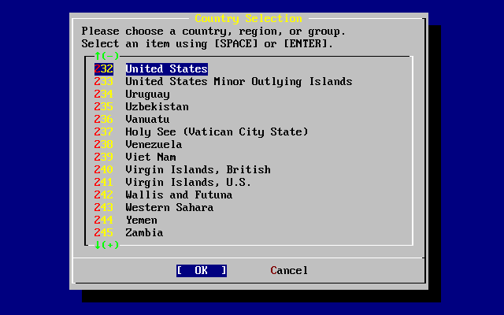
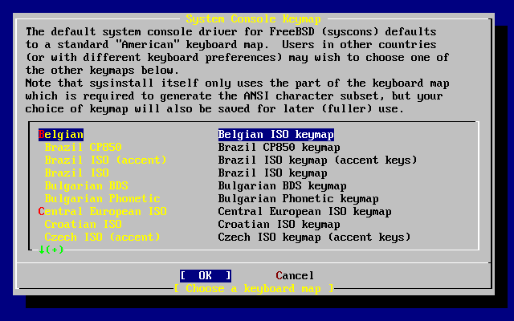

==============================
3.4.?Starting the Installation
==============================

.. raw:: html

   

3.4.?Starting the Installation
`Prev <install-pre.html>`__?
Chapter?3.?Installing FreeBSD?8.\ *``X``*
?\ `Next <using-sysinstall.html>`__

--------------

.. raw:: html

   

.. raw:: html

   

.. raw:: html

   

.. raw:: html

   

.. raw:: html

   

3.4.?Starting the Installation
------------------------------

.. raw:: html

   

.. raw:: html

   

.. raw:: html

   

.. raw:: html

   

Important:
~~~~~~~~~~

By default, the installer will not make any changes to the disk(s) until
after the following message:

.. code:: literallayout

    Last Chance: Are you SURE you want continue the installation?

    If you're running this on a disk with data you wish to save then WE
    STRONGLY ENCOURAGE YOU TO MAKE PROPER BACKUPS before proceeding!

    We can take no responsibility for lost disk contents!

The install can be exited at any time prior to this final warning
without changing the contents of the hard drive. If there is a concern
that something is configured incorrectly, turn the computer off before
this point, and no damage will be done.

.. raw:: html

   

.. raw:: html

   

.. raw:: html

   

.. raw:: html

   

.. raw:: html

   

3.4.1.?Booting
~~~~~~~~~~~~~~

.. raw:: html

   

.. raw:: html

   

.. raw:: html

   

.. raw:: html

   

.. raw:: html

   

.. raw:: html

   

.. raw:: html

   

3.4.1.1.?Booting for the i386™
^^^^^^^^^^^^^^^^^^^^^^^^^^^^^^

.. raw:: html

   

.. raw:: html

   

.. raw:: html

   

.. raw:: html

   

#. Turn on the computer. As it starts it should display an option to
   enter the system set up menu, or BIOS, commonly reached by keys like
   **F2**, **F10**, **Del**, or **Alt**+**S**. Use whichever keystroke
   is indicated on screen. In some cases the computer may display a
   graphic while it starts. Typically, pressing **Esc** will dismiss the
   graphic and display the boot messages.

#. Find the setting that controls which devices the system boots from.
   This is usually labeled as the “Boot Order” and commonly shown as a
   list of devices, such as ``Floppy``, ``CDROM``,
   ``First Hard         Disk``, and so on.

   If booting from the CD/DVD, make sure that the CDROM drive is
   selected. If booting from a USB disk, make sure that it is selected
   instead. When in doubt, consult the manual that came with the
   computer or its motherboard.

   Make the change, then save and exit. The computer should now restart.

#. If using a prepared a “bootable” USB stick, as described in
   `Section?3.3.7, “Prepare the Boot
   Media” <install-pre.html#install-boot-media>`__, plug in the USB
   stick before turning on the computer.

   If booting from CD/DVD, turn on the computer, and insert the CD/DVD
   at the first opportunity.

   .. raw:: html

      

   Note:
   ~~~~~

   For FreeBSD/pc98, installation boot floppies are available and can be
   prepared as described in `Section?3.3.7, “Prepare the Boot
   Media” <install-pre.html#install-boot-media>`__. The first floppy
   disc will contain ``boot.flp``. Put this floppy in the floppy drive
   to boot into the installer.

   .. raw:: html

      

   If the computer starts up as normal and loads the existing operating
   system, then either:

   .. raw:: html

      

   #. The disks were not inserted early enough in the boot process.
      Leave them in, and try restarting the computer.

   #. The BIOS changes did not work correctly. Redo that step until the
      right option is selected.

   #. That particular BIOS does not support booting from the desired
      media.

   .. raw:: html

      

#. FreeBSD will start to boot. If booting from CD/DVD, messages will be
   displayed, similar to these:

   .. code:: screen

       Booting from CD-Rom...
       645MB medium detected
       CD Loader 1.2

       Building the boot loader arguments
       Looking up /BOOT/LOADER... Found
       Relocating the loader and the BTX
       Starting the BTX loader

       BTX loader 1.00 BTX version is 1.02
       Consoles: internal video/keyboard
       BIOS CD is cd0
       BIOS drive C: is disk0
       BIOS drive D: is disk1
       BIOS 636kB/261056kB available memory

       FreeBSD/i386 bootstrap loader, Revision 1.1

       Loading /boot/defaults/loader.conf
       /boot/kernel/kernel text=0x64daa0 data=0xa4e80+0xa9e40 syms=[0x4+0x6cac0+0x4+0x88e9d]
       \

   If booting from floppy disc, a display similar to this will be shown:

   .. code:: screen

       Booting from Floppy...
       Uncompressing ... done

       BTX loader 1.00  BTX version is 1.01
       Console: internal video/keyboard
       BIOS drive A: is disk0
       BIOS drive C: is disk1
       BIOS 639kB/261120kB available memory

       FreeBSD/i386 bootstrap loader, Revision 1.1

       Loading /boot/defaults/loader.conf
       /kernel text=0x277391 data=0x3268c+0x332a8 |

       Insert disk labelled "Kernel floppy 1" and press any key...

   Remove the ``boot.flp`` floppy, insert the next floppy, and press
   **Enter**. When prompted, insert the other disks as required.

#. The boot process will then display the FreeBSD boot loader menu:

   .. raw:: html

      

   .. raw:: html

      

   Figure?3.1.?FreeBSD Boot Loader Menu

   .. raw:: html

      

   .. raw:: html

      

   .. raw:: html

      

   |FreeBSD Boot Loader Menu|

   .. raw:: html

      

   .. raw:: html

      

   .. raw:: html

      

   | 

   Either wait ten seconds, or press **Enter**.

.. raw:: html

   

.. raw:: html

   

.. raw:: html

   

.. raw:: html

   

.. raw:: html

   

.. raw:: html

   

3.4.1.2.?Booting for SPARC64?
^^^^^^^^^^^^^^^^^^^^^^^^^^^^^

.. raw:: html

   

.. raw:: html

   

.. raw:: html

   

Most SPARC64? systems are set to boot automatically from disk. To
install FreeBSD, boot over the network or from a CD/DVD and wait until
the boot message appears. The message depends on the model, but should
look similar to:

.. code:: screen

    Sun Blade 100 (UltraSPARC-IIe), Keyboard Present
    Copyright 1998-2001 Sun Microsystems, Inc.  All rights reserved.
    OpenBoot 4.2, 128 MB memory installed, Serial #51090132.
    Ethernet address 0:3:ba:b:92:d4, Host ID: 830b92d4.

If the system proceeds to boot from disk, press **L1**+**A** or
**Stop**+**A** on the keyboard, or send a ``BREAK`` over the serial
console using ``~#`` in
`tip(1) <http://www.FreeBSD.org/cgi/man.cgi?query=tip&sektion=1>`__ or
`cu(1) <http://www.FreeBSD.org/cgi/man.cgi?query=cu&sektion=1>`__ to get
to the PROM prompt. It looks like this:

.. code:: screen

    ok     
    ok {0} 

.. raw:: html

   

+--------------------------------------+--------------------------------------+
| `|1| <#prompt-single>`__             | This is the prompt used on systems   |
|                                      | with just one CPU.                   |
+--------------------------------------+--------------------------------------+
| `|2| <#prompt-smp>`__                | This is the prompt used on SMP       |
|                                      | systems and the digit indicates the  |
|                                      | number of the active CPU.            |
+--------------------------------------+--------------------------------------+

.. raw:: html

   

At this point, place the CD/DVD into the drive and from the PROM prompt,
type ``boot cdrom``.

.. raw:: html

   

.. raw:: html

   

.. raw:: html

   

.. raw:: html

   

.. raw:: html

   

.. raw:: html

   

3.4.2.?Reviewing the Device Probe Results
~~~~~~~~~~~~~~~~~~~~~~~~~~~~~~~~~~~~~~~~~

.. raw:: html

   

.. raw:: html

   

.. raw:: html

   

The last few hundred lines that have been displayed on screen are stored
and can be reviewed.

To review this buffer, press **Scroll Lock** to turn on scrolling in the
display. Use the arrow keys or **PageUp** and **PageDown** to view the
results. Press **Scroll Lock** again to stop scrolling.

Do this now, to review the text that scrolled off the screen when the
kernel was carrying out the device probes. Text similar to `Figure?3.2,
“Typical Device Probe Results” <install-start.html#install-dev-probe>`__
will be displayed, although it will differ depending on the devices in
the computer.

.. raw:: html

   

.. raw:: html

   

Figure?3.2.?Typical Device Probe Results

.. raw:: html

   

.. raw:: html

   

.. code:: screen

    avail memory = 253050880 (247120K bytes)
    Preloaded elf kernel "kernel" at 0xc0817000.
    Preloaded mfs_root "/mfsroot" at 0xc0817084.
    md0: Preloaded image </mfsroot> 4423680 bytes at 0xc03ddcd4

    md1: Malloc disk
    Using $PIR table, 4 entries at 0xc00fde60
    npx0: <math processor> on motherboard
    npx0: INT 16 interface
    pcib0: <Host to PCI bridge> on motherboard
    pci0: <PCI bus> on pcib0
    pcib1:<VIA 82C598MVP (Apollo MVP3) PCI-PCI (AGP) bridge> at device 1.0 on pci0
    pci1: <PCI bus> on pcib1
    pci1: <Matrox MGA G200 AGP graphics accelerator> at 0.0 irq 11
    isab0: <VIA 82C586 PCI-ISA bridge> at device 7.0 on pci0
    isa0: <iSA bus> on isab0
    atapci0: <VIA 82C586 ATA33 controller> port 0xe000-0xe00f at device 7.1 on pci0
    ata0: at 0x1f0 irq 14 on atapci0
    ata1: at 0x170 irq 15 on atapci0
    uhci0 <VIA 83C572 USB controller> port 0xe400-0xe41f irq 10 at device 7.2 on pci
    0
    usb0: <VIA 83572 USB controller> on uhci0
    usb0: USB revision 1.0
    uhub0: VIA UHCI root hub, class 9/0, rev 1.00/1.00, addr1
    uhub0: 2 ports with 2 removable, self powered
    pci0: <unknown card> (vendor=0x1106, dev=0x3040) at 7.3
    dc0: <ADMtek AN985 10/100BaseTX> port 0xe800-0xe8ff mem 0xdb000000-0xeb0003ff ir
    q 11 at device 8.0 on pci0
    dc0: Ethernet address: 00:04:5a:74:6b:b5
    miibus0: <MII bus> on dc0
    ukphy0: <Generic IEEE 802.3u media interface> on miibus0
    ukphy0: 10baseT, 10baseT-FDX, 100baseTX, 100baseTX-FDX, auto
    ed0: <NE2000 PCI Ethernet (RealTek 8029)> port 0xec00-0xec1f irq 9 at device 10.
    0 on pci0
    ed0 address 52:54:05:de:73:1b, type NE2000 (16 bit)
    isa0: too many dependant configs (8)
    isa0: unexpected small tag 14
    orm0: <Option ROM> at iomem 0xc0000-0xc7fff on isa0
    fdc0: <NEC 72065B or clone> at port 0x3f0-0x3f5,0x3f7 irq 6 drq2 on isa0
    fdc0: FIFO enabled, 8 bytes threshold
    fd0: <1440-KB 3.5” drive> on fdc0 drive 0
    atkbdc0: <Keyboard controller (i8042)> at port 0x60,0x64 on isa0
    atkbd0: <AT Keyboard> flags 0x1 irq1 on atkbdc0
    kbd0 at atkbd0
    psm0: <PS/2 Mouse> irq 12 on atkbdc0
    psm0: model Generic PS/@ mouse, device ID 0
    vga0: <Generic ISA VGA> at port 0x3c0-0x3df iomem 0xa0000-0xbffff on isa0
    sc0: <System console> at flags 0x100 on isa0
    sc0: VGA <16 virtual consoles, flags=0x300>
    sio0 at port 0x3f8-0x3ff irq 4 flags 0x10 on isa0
    sio0: type 16550A
    sio1 at port 0x2f8-0x2ff irq 3 on isa0
    sio1: type 16550A
    ppc0: <Parallel port> at port 0x378-0x37f irq 7 on isa0
    pppc0: SMC-like chipset (ECP/EPP/PS2/NIBBLE) in COMPATIBLE mode
    ppc0: FIFO with 16/16/15 bytes threshold
    plip0: <PLIP network interface> on ppbus0
    ad0: 8063MB <IBM-DHEA-38451> [16383/16/63] at ata0-master UDMA33
    acd0: CD-RW <LITE-ON LTR-1210B> at ata1-slave PIO4
    Mounting root from ufs:/dev/md0c
    /stand/sysinstall running as init on vty0

.. raw:: html

   

.. raw:: html

   

Check the probe results carefully to make sure that FreeBSD found all
the devices. If a device was not found, it will not be listed. A `custom
kernel <kernelconfig.html>`__ can be used to add in support for devices
which are not in the ``GENERIC`` kernel.

After the device probe, the menu shown in `Figure?3.3, “Selecting
Country Menu” <install-start.html#config-country>`__ will be displayed.
Use the arrow key to choose a country, region, or group. Then press
**Enter** to set the country.

.. raw:: html

   

.. raw:: html

   

Figure?3.3.?Selecting Country Menu

.. raw:: html

   

.. raw:: html

   

.. raw:: html

   

|Selecting Country Menu|

.. raw:: html

   

.. raw:: html

   

.. raw:: html

   

If United States is selected as the country, the standard American
keyboard map will be used. If a different country is chosen, the
following menu will be displayed. Use the arrow keys to choose the
correct keyboard map and press **Enter**.

.. raw:: html

   

.. raw:: html

   

Figure?3.4.?Selecting Keyboard Menu

.. raw:: html

   

.. raw:: html

   

.. raw:: html

   

|Selecting Keyboard Menu|

.. raw:: html

   

.. raw:: html

   

.. raw:: html

   

After the country selection, the
`sysinstall(8) <http://www.FreeBSD.org/cgi/man.cgi?query=sysinstall&sektion=8>`__
main menu will display.

.. raw:: html

   

.. raw:: html

   

.. raw:: html

   

--------------

+--------------------------------+-------------------------+---------------------------------------+
| `Prev <install-pre.html>`__?   | `Up <install.html>`__   | ?\ `Next <using-sysinstall.html>`__   |
+--------------------------------+-------------------------+---------------------------------------+
| 3.3.?Pre-installation Tasks?   | `Home <index.html>`__   | ?3.5.?Introducing sysinstall(8)       |
+--------------------------------+-------------------------+---------------------------------------+

.. raw:: html

   

All FreeBSD documents are available for download at
http://ftp.FreeBSD.org/pub/FreeBSD/doc/

| Questions that are not answered by the
  `documentation <http://www.FreeBSD.org/docs.html>`__ may be sent to
  <freebsd-questions@FreeBSD.org\ >.
|  Send questions about this document to <freebsd-doc@FreeBSD.org\ >.

.. |FreeBSD Boot Loader Menu| image:: install/boot-loader-menu.png
.. |1| image:: ./imagelib/callouts/1.png
.. |2| image:: ./imagelib/callouts/2.png

