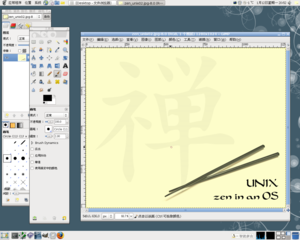

==================================
FreeBSD GNOME Project: Screenshots
==================================

.. raw:: html

   

.. raw:: html

   

.. raw:: html

   

.. raw:: html

   

.. raw:: html

   

Section Navigation
------------------

-  `FreeBSD/GNOME <../gnome/index.html>`__

   -  `Installation Instructions <../gnome/docs/faq2.html#q1>`__
   -  `Upgrade Instructions <../gnome/docs/faq232.html#q2>`__
   -  `Available Applications <../gnome/../ports/gnome.html>`__
   -  `How to Help <../gnome/docs/volunteer.html>`__
   -  `Reporting a Bug <../gnome/docs/bugging.html>`__
   -  `Screenshots <../gnome/screenshots.html>`__
   -  `Contact Us <../gnome/contact.html>`__

-  `Documentation <../gnome/index.html>`__

   -  `FAQ <../gnome/docs/faq2.html>`__
   -  `HAL FAQ <../gnome/docs/halfaq.html>`__
   -  `2.30 to 2.32 Upgrade FAQ <../gnome/docs/faq232.html>`__
   -  `Development Branch FAQ <../gnome/docs/develfaq.html>`__
   -  `Creating Ports <../gnome/docs/porting.html>`__
   -  `Known Issues <../gnome/docs/faq232.html#q4>`__

.. raw:: html

   

.. raw:: html

   

.. raw:: html

   

FreeBSD GNOME Project: Screenshots
==================================

Here are some examples of GNOME running on FreeBSD. Click on the
thumbnails below to see a larger image.

GNOME 2.24 Screenshots
~~~~~~~~~~~~~~~~~~~~~~

| **A GNOME 2.24 Desktop showing off the Gimp, the System Monitor
  applet, and the multi-byte, fully internationalized power of GNOME.**
|  |GNOME 2.24 Screen Shot 1|
|  *Contributed by Denise H. G. <darcsis \|at\| gmail.com>*

| **GNOME 2.24 within GNOME 2.24! This is a GNOME 2.24 Desktop running
  vinagre connected to another GNOME 2.24 Desktop running Epiphany. The
  main desktop is also sporting the Anjuta IDE, the new Empathy IM
  client, and showing off the SMB network browsing capability along with
  the internationalized clock applet.**
|  |GNOME 2.24 Screen Shot 2|
|  *Contributed by Joe Marcus Clarke <marcus \|at\| FreeBSD.org>*

.. raw:: html

   

.. raw:: html

   

.. raw:: html

   

.. raw:: html

   

.. raw:: html

   

.. raw:: html

   

.. |GNOME 2.24 Screen Shot 2| image:: images/ss224-2-tn.png
   :target: images/ss224-2.png
