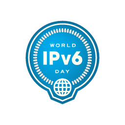

==========================
FreeBSD and World IPv6 Day
==========================

.. raw:: html

   

.. raw:: html

   

`Skip site navigation <#content>`__ (1) `Skip section
navigation <#contentwrap>`__ (2)

.. raw:: html

   

.. raw:: html

   

Header And Logo
---------------

.. raw:: html

   

|FreeBSD|

.. raw:: html

   

.. raw:: html

   

.. raw:: html

   

.. raw:: html

   

.. raw:: html

   

**.**

.. raw:: html

   

.. raw:: html

   

.. raw:: html

   

`Donate to FreeBSD <https://www.FreeBSDFoundation.org/donate/>`__

.. raw:: html

   

.. raw:: html

   

.. raw:: html

   

**.**

.. raw:: html

   

.. raw:: html

   

.. raw:: html

   

Peripheral Links
----------------

.. raw:: html

   

.. raw:: html

   

.. raw:: html

   

Search
------

?

.. raw:: html

   

.. raw:: html

   

.. raw:: html

   

Site Navigation
---------------

.. raw:: html

   

-  `Home <../>`__

-  `About <../about.html>`__

   -  `Introduction <../projects/newbies.html>`__
   -  `Features <../features.html>`__
   -  `Advocacy <../advocacy/>`__
   -  `Marketing <../marketing/>`__
   -  `Privacy Policy <../privacy.html>`__

-  `Get FreeBSD <../where.html>`__

   -  `Release Information <../releases/>`__
   -  `Release Engineering <../releng/>`__

-  `Documentation <../docs.html>`__

   -  `FAQ <../doc/en_US.ISO8859-1/books/faq/>`__
   -  `Handbook <../doc/en_US.ISO8859-1/books/handbook/>`__
   -  `Porter's
      Handbook <../doc/en_US.ISO8859-1/books/porters-handbook>`__
   -  `Developer's
      Handbook <../doc/en_US.ISO8859-1/books/developers-handbook>`__
   -  `Manual Pages <//www.FreeBSD.org/cgi/man.cgi>`__
   -  `Documentation Project
      Primer <../doc/en_US.ISO8859-1/books/fdp-primer>`__
   -  `All Books and Articles <../docs/books.html>`__

-  `Community <../community.html>`__

   -  `Mailing Lists <../community/mailinglists.html>`__
   -  `Forums <https://forums.FreeBSD.org>`__
   -  `User Groups <../usergroups.html>`__
   -  `Events <../events/events.html>`__
   -  `Q&A
      (external) <http://serverfault.com/questions/tagged/freebsd>`__

-  `Developers <../projects/index.html>`__

   -  `Project Ideas <https://wiki.FreeBSD.org/IdeasPage>`__
   -  `SVN Repository <https://svnweb.FreeBSD.org>`__
   -  `Perforce Repository <http://p4web.FreeBSD.org>`__

-  `Support <../support.html>`__

   -  `Vendors <../commercial/commercial.html>`__
   -  `Security Information <../security/>`__
   -  `Bug Reports <https://bugs.FreeBSD.org/search/>`__
   -  `Submitting Bug Reports <https://www.FreeBSD.org/support.html>`__

-  `Foundation <https://www.freebsdfoundation.org/>`__

   -  `Monetary Donations <https://www.freebsdfoundation.org/donate/>`__
   -  `Hardware Donations <../donations/>`__

.. raw:: html

   

.. raw:: html

   

.. raw:: html

   

.. raw:: html

   

.. raw:: html

   

Section Navigation
------------------

-  `Developers <../projects/index.html>`__
-  `Developer's
   Handbook <../doc/en_US.ISO8859-1/books/developers-handbook>`__
-  `Porter's Handbook <../doc/en_US.ISO8859-1/books/porters-handbook>`__
-  `Source code repositories <../developers/cvs.html>`__
-  `Release Engineering <../releng/index.html>`__
-  `Platforms <../platforms/>`__
-  `Project Ideas <https://wiki.FreeBSD.org/IdeasPage>`__
-  `Contributing <../doc/en_US.ISO8859-1/articles/contributing/index.html>`__

.. raw:: html

   

.. raw:: html

   

.. raw:: html

   

FreeBSD and World IPv6 Day
==========================

.. raw:: html

   

Category Navigation
^^^^^^^^^^^^^^^^^^^

-  `IPv6 in FreeBSD <../ipv6/>`__
-  `No-IPv4 support (IPv6-only) <../ipv6/ipv6only.html>`__
-  `World IPv6 Launch <../ipv6/w6l.html>`__
-  `World IPv6 Day <../ipv6/w6d.html>`__
-  

   -  `www stats <../ipv6/w6d-www-stats.html>`__

.. raw:: html

   

|ISOC World IPv6 Day badge: blue|
About World IPv6 Day
--------------------

While Internet Protocol version 6 is in fact more than 15 years old,
World IPv6 Day, a 24 hour test flight day on **8 June 2011** has
motivated a lot of different organizations to get ready for IPv6, or
improve their already existent IPv6 support. Major content providers
will enable IPv6 for their websites that day, network operators and
hosting companies have been working to provide IPv6 to their customers
and operating system vendors like FreeBSD have been improving IPv6
support. You can find more information about World IPv6 Day on The
Internet Society's web page
`www.worldipv6day.org <http://www.worldipv6day.org/>`__.

You and FreeBSD on World IPv6 Day
---------------------------------

What is special about that day for FreeBSD you might wonder? Indeed,
with the help of the community, FreeBSD has been serving releases on
IPv6 since 2003. We have our major infrastructure like
`www.freebsd.org <http://www.freebsd.org/>`__ IPv6 enabled since
`2007 <../news/2007/index.html#event200782:0>`__. FreeBSD itself has
been supporting IPv6 since the 4.0 Release for over a decade now, using
the `KAME <http://www.kame.net/>`__ based reference implementation.

Nonetheless there are things we can do during that day:

-  help promoting IPv6.
    During the day there might be a lot more IPv6 users suddenly, and
   some people are expecting significantly more traffic. A lot of
   FreeBSD servers are out there actively using IPv6, some people have
   put FreeBSD into their networking products, but only few tell us. We
   would love to hear about your FreeBSD IPv6 experiences on World IPv6
   Day.
-  help you in case of problems.
    Obviously if you will run into problems you might want help
   immediately for the one day test flight. We will more closely monitor
   the `FreeBSD networking mailing
   list <http://lists.freebsd.org/mailman/listinfo/freebsd-net>`__, as
   well as being around on IRC in #freebsd-w6d on EFNet to answer your
   questions. In case you will file an IPv6 related `bug
   report <../support/bugreports.html>`__, you may want to tag it with
   ``[ip6]``.
-  working on improving your IPv6 experience.
    As we get your questions and feedback we will take notes to further
   improve IPv6 support in FreeBSD. There might not be an immediate
   change but rest assured that your feedback will not be lost.

Join us for World IPv6 Day, spread the word, to help improving IPv6
support in FreeBSD even further!

FAQ
---

What is this IPv6 thing?
~~~~~~~~~~~~~~~~~~~~~~~~

Please see the `chapter on
IPv6 <../doc/en_US.ISO8859-1/books/handbook/network-ipv6.html>`__ in the
FreeBSD `Handbook <../doc/en_US.ISO8859-1/books/handbook/>`__ for an
explanation.

Do you provide IPv6 connectivity?
~~~~~~~~~~~~~~~~~~~~~~~~~~~~~~~~~

FreeBSD is an operating system, not an Internet Service Provider. There
are multiple ways to connect to an IPv6 network with FreeBSD however:

-  direct configuration on an (Ethernet) interface,
-  ppp and IPV6CP by user space ppp or some ports, and
-  various tunnel brokers we support out of base or ports

| to just name a few.
|  Please see the `chapter on
  IPv6 <../doc/en_US.ISO8859-1/books/handbook/network-ipv6.html>`__ in
  the FreeBSD `Handbook <../doc/en_US.ISO8859-1/books/handbook/>`__ for
  more information.

I have problems getting IPv6 to work on FreeBSD. Can you help?
~~~~~~~~~~~~~~~~~~~~~~~~~~~~~~~~~~~~~~~~~~~~~~~~~~~~~~~~~~~~~~

Most likely. If our documentation did not help you, contact us. See the
previous section on how to best do that during World IPv6 Day.

Why is IPv6 not enabled by default?
~~~~~~~~~~~~~~~~~~~~~~~~~~~~~~~~~~~

| IPv6 has a mandatory link-local address. In times where many people
  are are also using FreeBSD on their mobile computers and joining
  random networks the services they started would be accessible by other
  people on the same network. This may also happen if they only started
  the services for IPv4 and are not aware of IPv6 at all, do not have
  tcp-wrappers or a firewall in place. To not put people at risk, IPv6
  is disabled by default on FreeBSD.
|  However we already provide support for you to configure it from our
  installer and it will automatically start to work as soon as you
  configure an interface for stateless address auto-configuration
  (SLAAC) or with a static IPv6 address as it has been available in all
  default configurations we have been shipping since 4.0 Release.

Do you have a desktop version as well?
~~~~~~~~~~~~~~~~~~~~~~~~~~~~~~~~~~~~~~

FreeBSD comes with a huge collections of `ports <../ports/>`__ that
allow you to install a graphical user interface and window manager of
choice. FreeBSD however does not ship with a graphical desktop
preconfigured. Other FreeBSD derived projects like
`PC-BSD <http://www.pcbsd.org/>`__ however do an excellent job there.

I have reported a problem but it is not fixed yet.
~~~~~~~~~~~~~~~~~~~~~~~~~~~~~~~~~~~~~~~~~~~~~~~~~~

We are sorry that this is the case. If you have submitted a `bug
report <../support/bugreports.html>`__ it is not lost. FreeBSD is
developed and maintained by a `large team of
individuals <../doc/en_US.ISO8859-1/articles/contributors/staff-committers.html>`__
and there might have been other things we worked on to improve FreeBSD.

.. raw:: html

   

.. raw:: html

   

.. raw:: html

   

`Site Map <../search/index-site.html>`__ \| `Legal
Notices <../copyright/>`__ \| ? 1995–2015 The FreeBSD Project. All
rights reserved.

.. raw:: html

   

.. raw:: html

   

.. raw:: html

   

.. |FreeBSD| image:: ../layout/images/logo-red.png
   :target: ..

