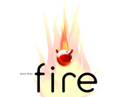

============
FreeBSD Logo
============

.. raw:: html

   

.. raw:: html

   

`Skip site navigation <#content>`__ (1) `Skip section
navigation <#contentwrap>`__ (2)

.. raw:: html

   

.. raw:: html

   

Header And Logo
---------------

.. raw:: html

   

|FreeBSD|

.. raw:: html

   

.. raw:: html

   

.. raw:: html

   

.. raw:: html

   

.. raw:: html

   

**.**

.. raw:: html

   

.. raw:: html

   

.. raw:: html

   

`Donate to FreeBSD <https://www.FreeBSDFoundation.org/donate/>`__

.. raw:: html

   

.. raw:: html

   

.. raw:: html

   

**.**

.. raw:: html

   

.. raw:: html

   

.. raw:: html

   

Peripheral Links
----------------

.. raw:: html

   

.. raw:: html

   

.. raw:: html

   

Search
------

?

.. raw:: html

   

.. raw:: html

   

.. raw:: html

   

Site Navigation
---------------

.. raw:: html

   

-  `Home <./>`__

-  `About <./about.html>`__

   -  `Introduction <./projects/newbies.html>`__
   -  `Features <./features.html>`__
   -  `Advocacy <./advocacy/>`__
   -  `Marketing <./marketing/>`__
   -  `Privacy Policy <./privacy.html>`__

-  `Get FreeBSD <./where.html>`__

   -  `Release Information <./releases/>`__
   -  `Release Engineering <./releng/>`__

-  `Documentation <./docs.html>`__

   -  `FAQ <./doc/en_US.ISO8859-1/books/faq/>`__
   -  `Handbook <./doc/en_US.ISO8859-1/books/handbook/>`__
   -  `Porter's
      Handbook <./doc/en_US.ISO8859-1/books/porters-handbook>`__
   -  `Developer's
      Handbook <./doc/en_US.ISO8859-1/books/developers-handbook>`__
   -  `Manual Pages <//www.FreeBSD.org/cgi/man.cgi>`__
   -  `Documentation Project
      Primer <./doc/en_US.ISO8859-1/books/fdp-primer>`__
   -  `All Books and Articles <./docs/books.html>`__

-  `Community <./community.html>`__

   -  `Mailing Lists <./community/mailinglists.html>`__
   -  `Forums <https://forums.FreeBSD.org>`__
   -  `User Groups <./usergroups.html>`__
   -  `Events <./events/events.html>`__
   -  `Q&A
      (external) <http://serverfault.com/questions/tagged/freebsd>`__

-  `Developers <./projects/index.html>`__

   -  `Project Ideas <https://wiki.FreeBSD.org/IdeasPage>`__
   -  `SVN Repository <https://svnweb.FreeBSD.org>`__
   -  `Perforce Repository <http://p4web.FreeBSD.org>`__

-  `Support <./support.html>`__

   -  `Vendors <./commercial/commercial.html>`__
   -  `Security Information <./security/>`__
   -  `Bug Reports <https://bugs.FreeBSD.org/search/>`__
   -  `Submitting Bug Reports <https://www.FreeBSD.org/support.html>`__

-  `Foundation <https://www.freebsdfoundation.org/>`__

   -  `Monetary Donations <https://www.freebsdfoundation.org/donate/>`__
   -  `Hardware Donations <./donations/>`__

.. raw:: html

   

.. raw:: html

   

.. raw:: html

   

.. raw:: html

   

.. raw:: html

   

Section Navigation
------------------

-  `About <./about.html>`__
-  `Features <./features.html>`__
-  `Applications <./applications.html>`__
-  `Advocacy <./advocacy/>`__
-  `Marketing <./marketing/>`__
-  `Administration <./administration.html>`__
-  `News <./news/newsflash.html>`__
-  `Events <./events/events.html>`__
-  `Press <./news/press.html>`__
-  `Multimedia <./multimedia/multimedia.html>`__
-  `Artwork <./art.html>`__
-  `Logo <./logo.html>`__
-  `Donations <./donations/>`__
-  `Legal Notices <./copyright/>`__
-  `Privacy Policy <./privacy.html>`__

.. raw:: html

   

.. raw:: html

   

.. raw:: html

   

FreeBSD Logo
============

-  `Usage Guideline <#guideline>`__
-  `Resource <#resource>`__
-  `Sample <#sample>`__

Usage Guideline
---------------

FreeBSD is a registered trademark of The FreeBSD Foundation. The FreeBSD
logo and The Power to Serve are trademarks of The FreeBSD Foundation.

All images listed under the heading "Resource" are available for use
under license from The FreeBSD Foundation.

For more information on how to obtain permission to use the logo, please
refer to the FreeBSD Logo Usage Guidelines at `The FreeBSD
Foundation. <http://www.freebsdfoundation.org/documents/Guidelines.shtml>`__

Resource
--------

Standard Logo (fullcolor)
~~~~~~~~~~~~~~~~~~~~~~~~~

|image1|

Standard Logo (fullcolor for dark background)
~~~~~~~~~~~~~~~~~~~~~~~~~~~~~~~~~~~~~~~~~~~~~

|image2|

Standard Logo (black and white)
~~~~~~~~~~~~~~~~~~~~~~~~~~~~~~~

|image3|

Vector formats
~~~~~~~~~~~~~~

Format: `Adobe(r) Illustrator(r) <logo/logo-basic.ai>`__,
`SVG <logo/logo-simple.svg>`__

|image4|

Sample
------

NOTE: "freeBSD" text in these images were created based on draft version
of logo contest. Correct version of this text should be rendered by one
black color, not two colors and first "f" character should be spelled
capitalized as "F".

CD/DVD package
~~~~~~~~~~~~~~

|image5|

Postcard
~~~~~~~~

.. raw:: html

   

|image6|

.. raw:: html

   

.. raw:: html

   

|image7|

.. raw:: html

   

.. raw:: html

   

|image8|

.. raw:: html

   

.. raw:: html

   

|image9|

.. raw:: html

   

.. raw:: html

   

?

.. raw:: html

   

Wallpaper
~~~~~~~~~

Here are sample wallpapers.

|image10|

|image11|

|image12|

.. raw:: html

   

.. raw:: html

   

.. raw:: html

   

`Site Map <./search/index-site.html>`__ \| `Legal
Notices <./copyright/>`__ \| ? 1995–2015 The FreeBSD Project. All rights
reserved.

.. raw:: html

   

.. raw:: html

   

.. raw:: html

   

.. |FreeBSD| image:: ./layout/images/logo-red.png
   :target: .
.. |image1| image:: logo/logo-full-thumb.png
   :target: logo/logo-full.png

.. |image3| image:: logo/logo-bw-thumb.png
   :target: logo/logo-bw.png
.. |image4| image:: logo/logo-basic-thumb.png
   :target: logo/logo-basic.png
.. |image5| image:: logo/cd-thumb.jpg
   :target: logo/cd.jpg

.. |image7| image:: logo/postcard2-thumb.jpg
   :target: logo/postcard2.jpg
.. |image8| image:: logo/postcard3-thumb.jpg
   :target: logo/postcard3.jpg
.. |image9| image:: logo/postcard4-thumb.jpg
   :target: logo/postcard4.jpg

.. |image11| image:: logo/wall2-thumb.jpg
   :target: logo/wall2.jpg
.. |image12| image:: logo/wall3-thumb.jpg
   :target: logo/wall3.jpg
