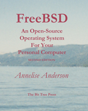
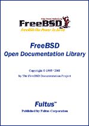
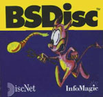
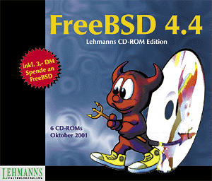

============================
FreeBSD Related Publications
============================

.. raw:: html

   

.. raw:: html

   

.. raw:: html

   

.. raw:: html

   

.. raw:: html

   

Section Navigation
------------------

-  `Documentation <./docs.html>`__
-  `FAQ <./doc/en_US.ISO8859-1/books/faq/>`__
-  `Handbook <./doc/en_US.ISO8859-1/books/handbook/>`__
-  `Manual Pages <//www.FreeBSD.org/cgi/man.cgi>`__
-  `Books and Articles Online <./docs/books.html>`__
-  `Publications <./publish.html>`__
-  `Web Resources <./docs/webresources.html>`__
-  `For Newbies <./projects/newbies.html>`__
-  `Documentation Project <./docproj/>`__
-  `Archive <https://docs.freebsd.org/doc/>`__

.. raw:: html

   

.. raw:: html

   

.. raw:: html

   

FreeBSD Related Publications
============================

+--------------------------------------+--------------------------------------+
| |FreeBSD Daemon|                     | -  `BOOKS <#books>`__                |
|                                      | -  `CDROMS <#cdroms>`__              |
|                                      | -  `MAGAZINES <#magazines>`__        |
|                                      | -  `PRESS <news/press.html>`__       |
+--------------------------------------+--------------------------------------+

Here you will find the covers of many FreeBSD related publications. If
you know of any additional FreeBSD publications/CDROMs let us know, at
www@FreeBSD.org, so that they may be added to this site.
The `FreeBSD Handbook <doc/en_US.ISO8859-1/books/handbook/index.html>`__
contains a considerably longer
`bibliography <doc/en_US.ISO8859-1/books/handbook/bibliography.html>`__.

Click on any of the graphics to see a larger version.

Books
-----

+--------------------------------------+--------------------------------------+
| |book cover|                         | A publication from Tatsumi Hosokawa  |
|                                      | and others. Among computer books, it |
|                                      | is a top-seller in Japan and         |
|                                      | exceeded the sales of Bill Gates'    |
|                                      | "The Road Ahead" when published (it  |
|                                      | was #2, this book was #1).           |
+--------------------------------------+--------------------------------------+
| |book cover|                         | (Japanese FreeBSD book with 2.0.5,   |
|                                      | titled "FreeBSD: Fun and easy        |
|                                      | Installation")                       |
+--------------------------------------+--------------------------------------+
| |book cover|                         | (Japanese FreeBSD book with 2.0.5,   |
|                                      | titled "FreeBSD Introductory Kit")   |
+--------------------------------------+--------------------------------------+
| |book cover|                         | This is BSDi's "The Complete         |
|                                      | FreeBSD" with installation guide,    |
|                                      | manual pages and installation CDs    |
|                                      | inside.                              |
+--------------------------------------+--------------------------------------+
| |book cover|                         | This book was published (early 1997) |
|                                      | in Taiwan. Its title is "FreeBSD:    |
|                                      | introduction and applications" and   |
|                                      | the author is Jian-Da Li (aka.       |
|                                      | jdli).                               |
+--------------------------------------+--------------------------------------+
| |book cover|                         | This is the "Getting Started with    |
|                                      | FreeBSD" from Fuki-Shuppan. Other    |
|                                      | than the standard installation guide |
|                                      | and Japanese environment, it         |
|                                      | emphasizes system administration and |
|                                      | low-level information (such as the   |
|                                      | boot process, etc.) FreeBSD-2.2.2R   |
|                                      | and XFree86-3.2 on CDROM. 264 pages, |
|                                      | 3,400 yen.                           |
+--------------------------------------+--------------------------------------+
| |book cover|                         | The "Personal Unix Starter Kit -     |
|                                      | FreeBSD" from ASCII. Includes        |
|                                      | history of UNIX?, a guide to build a |
|                                      | Japanese documentation processing    |
|                                      | system and how to create ports.      |
|                                      | 2.1.7.1R and XFree86-3.2 in CDROM.   |
|                                      | 384 pages, 3,000 yen.                |
+--------------------------------------+--------------------------------------+
| |book cover|                         | BSD mit Methode, M. Schulze, B.      |
|                                      | Roehrig, M. Hoelzer und andere, C&L  |
|                                      | Computer und Literatur Verlag, 1998, |
|                                      | 850 pages. 2 CDROMs, FreeBSD 2.2.6,  |
|                                      | NetBSD 1.2.1 and 1.3.2, OpenBSD 2.2  |
|                                      | and 2.3. DM 98,-.                    |
+--------------------------------------+--------------------------------------+
| |book cover|                         | This is the "FreeBSD Install and     |
|                                      | utilization manual" from Mainichi    |
|                                      | Communications. General introduction |
|                                      | to FreeBSD from installation to      |
|                                      | utilization with troubleshooting     |
|                                      | under the supervision of the user    |
|                                      | group in Japan. 2.2.7-RELEASE        |
|                                      | FreeBSD(98)2.2.7-Rev01 PAO and       |
|                                      | distfiles in CDROM. 472 pages,       |
|                                      | 3,600yen.                            |
+--------------------------------------+--------------------------------------+
| |book cover|                         | The "FreeBSD User's Reference        |
|                                      | Manual" from Mainichi                |
|                                      | Communications, under the            |
|                                      | supervision of "jpman project", the  |
|                                      | manual translation project by the    |
|                                      | user group in Japan. Japanese        |
|                                      | edition of the section 1 of the      |
|                                      | FreeBSD manual. 2.2.7-RELEASE        |
|                                      | FreeBSD(98)2.2.7-Rev01 and PAO in    |
|                                      | CDROM. 1,040 pages, 3,800yen.        |
+--------------------------------------+--------------------------------------+
| |book cover|                         | The "FreeBSD System Administrator's  |
|                                      | Manual" from Mainichi                |
|                                      | Communications, under the            |
|                                      | supervision of "jpman project", the  |
|                                      | manual translation project by the    |
|                                      | user group in Japan. Japanese        |
|                                      | edition of the section 5 and 8 of    |
|                                      | the FreeBSD manual. 756 pages,       |
|                                      | 3,300yen.                            |
+--------------------------------------+--------------------------------------+
| |book cover|                         | This is "About FreeBSD" from         |
|                                      | Youngjin.com. It is first FreeBSD    |
|                                      | book in Korea, and covers several    |
|                                      | topics from installation to Korean   |
|                                      | environment. 3.5.1-RELEASE/PAO and   |
|                                      | 4.1-RELEASE in 3 CDROMs. 788 pages,  |
|                                      | 26,000 won.                          |
+--------------------------------------+--------------------------------------+
| |book cover|                         | Onno W Purbo, Dodi Maryanto,         |
|                                      | Syahrial Hubbany, Widjil Widodo:     |
|                                      | `Building Internet Server with       |
|                                      | FreeBSD <http://maxwell.itb.ac.id/>` |
|                                      | __                                   |
|                                      | (in Indonesia Language), published   |
|                                      | by `Elex Media                       |
|                                      | Komputindo <http://www.elexmedia.co. |
|                                      | id/>`__,                             |
|                                      | 2000.                                |
+--------------------------------------+--------------------------------------+
| |book cover|                         | The FreeBSD Handbook 1st Edition is  |
|                                      | a comprehensive FreeBSD Tutorial and |
|                                      | reference. It covers installation,   |
|                                      | day-to-day use of FreeBSD, and much  |
|                                      | more. April 2000, BSDi. ISBN         |
|                                      | 1-57176-241-8                        |
+--------------------------------------+--------------------------------------+
| |book cover|                         | The Complete FreeBSD with CDs, 3rd   |
|                                      | Ed, FreeBSD 4.2. Everything you ever |
|                                      | wanted to know about how to get your |
|                                      | computer up and running FreeBSD.     |
|                                      | Includes 4 CDs containing the        |
|                                      | FreeBSD operating system! Released:  |
|                                      | November 2000 ISBN: 1-57176-246-9    |
+--------------------------------------+--------------------------------------+
| |book cover|                         | The FreeBSD Handbook 2nd Edition is  |
|                                      | a comprehensive FreeBSD Tutorial and |
|                                      | reference. It covers installation,   |
|                                      | day-to-day use of FreeBSD, and much  |
|                                      | more. November 2001, Wind River      |
|                                      | Systems. ISBN 1-57176-303-1          |
+--------------------------------------+--------------------------------------+
| |book cover|                         | "The FreeBSD Corporate Networker's   |
|                                      | Guide" Mittelstaedt, Ted. Addison    |
|                                      | Wesley, 2000.                        |
|                                      |  There are two printings: the first  |
|                                      | has disk 1 of FreeBSD 4.2, the       |
|                                      | second has disk 1 of FreeBSD 4.4.    |
|                                      | 400 pages. The Japanese translation  |
|                                      | was published in 2001.               |
|                                      |  The Networker's Guide covers        |
|                                      | integration of FreeBSD into typical  |
|                                      | corporate networks with special      |
|                                      | emphasis on interoperation with      |
|                                      | Windows 95/98/ME/NT/2K.              |
|                                      |  English version: 2000, Addison      |
|                                      | Wesley. ISBN 0-201-70481-1           |
|                                      |  Japanese version: 2001, Pearson     |
|                                      | Education Japan. ISBN 4-89471-464-7  |
+--------------------------------------+--------------------------------------+
| |book cover|                         | "FreeBSD, An Open-Source Operating   |
|                                      | System for Your Personal Computer",  |
|                                      | Annelise Anderson.                   |
|                                      |  An introduction to FreeBSD for      |
|                                      | users new to both FreeBSD and UNIX.  |
|                                      | This book includes a 4.4             |
|                                      | installation CD-ROM and covers       |
|                                      | everything you need to know about    |
|                                      | installation of the system and       |
|                                      | third-party software; getting sound, |
|                                      | X Window, your network, and printing |
|                                      | working; building your own kernel;   |
|                                      | and upgrading. Second Edition.       |
|                                      | December 2001, The Bit Tree Press.   |
|                                      | ISBN 0-9712045-1-9                   |
+--------------------------------------+--------------------------------------+
| |Absolute BSD book cover|            | Absolute BSD. This book discusses    |
|                                      | management of FreeBSD-based servers  |
|                                      | in high-performance enterprise       |
|                                      | environments. June 2002, `No Starch  |
|                                      | Press. <http://www.nostarch.com/>`__ |
|                                      | ISBN 1-886411-74-3                   |
+--------------------------------------+--------------------------------------+
| |FreeBSD Open Documentation Library| | `Fultus <http://www.fultus.com/>`__  |
|                                      | presents **FreeBSD Open              |
|                                      | Documentation Library**. This is the |
|                                      | **full up-to-date** FreeBSD          |
|                                      | documentation collection available   |
|                                      | `online <http://elibrary.fultus.com/ |
|                                      | mergedProjects/FreeBSD%20Documentati |
|                                      | on/index.htm>`__                     |
|                                      | in the Technical Literature section  |
|                                      | of the Fultus                        |
|                                      | `eLibrary <http://elibrary.fultus.co |
|                                      | m/>`__                               |
|                                      | and Fultus Online Book               |
|                                      | `Superstore <http://store.fultus.com |
|                                      | /advanced_search_result.php?keywords |
|                                      | =FreeBSD>`__                         |
|                                      | in the following formats:            |
|                                      |                                      |
|                                      | -  Online Web Help (searchable       |
|                                      |    through all documents) (Mozilla,  |
|                                      |    Netscape Navigator & IE           |
|                                      |    compatible);                      |
|                                      | -  Searchable Adobe PDF format with  |
|                                      |    Bookmark link page (for desktop   |
|                                      |    and PDA);                         |
|                                      | -  Compiled HTML format (chm) (for   |
|                                      |    Windows).                         |
|                                      |                                      |
|                                      | Interested?                          |
|                                      | Read about FreeBSD eBooks and        |
|                                      | download examples on the `FreeBSD    |
|                                      | Documentation <http://www.fultus.com |
|                                      | /free/documentation.phtml>`__        |
|                                      | page of the                          |
|                                      | `Fultus <http://www.fultus.com/>`__  |
|                                      | web site.                            |
+--------------------------------------+--------------------------------------+
| |book cover|                         | "Building an Internet Server with    |
|                                      | FreeBSD 6" is a step-by-step guide   |
|                                      | for helping new and experienced      |
|                                      | users to FreeBSD install and         |
|                                      | configure the latest Internet server |
|                                      | applications in a minimum of time.   |
|                                      | The guide includes descriptions of   |
|                                      | many of the Internet's most popular  |
|                                      | and widely deployed open source      |
|                                      | projects, detailed instructions on   |
|                                      | implementing each, and maintenance   |
|                                      | tasks important to an Internet       |
|                                      | server. May 2006, Lulu Press, ISBN   |
|                                      | 1411695747, 228 pages.               |
+--------------------------------------+--------------------------------------+
| |book cover|                         | Written by the professionals of      |
|                                      | EnderUNIX and Huseyin Yuce this book |
|                                      | is the first Turkish FreeBSD book.   |
|                                      | The book is published by             |
|                                      | `acikkod <http://www.acikkod.com/>`_ |
|                                      | _                                    |
|                                      | publications. Book is available for  |
|                                      | sale on                              |
|                                      | `this <http://www.acikkod.com/sipari |
|                                      | s.php>`__                            |
|                                      | page. Details of the book:           |
|                                      |  ISBN: 975-98990-0-0                 |
|                                      |  Published: February 2004            |
|                                      |  Paperback: 504 pages                |
|                                      |  CD: FreeBSD 4.9 Installation CD     |
|                                      |  Authors: H?seyin Y?ce, İsmail       |
|                                      | Yenig?l, ?mer Faruk Şen, Barış       |
|                                      | Şimşek and Murat Balaban.            |
|                                      |  `Table of                           |
|                                      | Contents <http://www.acikkod.com/pdf |
|                                      | s/freebsd1.pdf>`__                   |
|                                      | (in Turkish)                         |
+--------------------------------------+--------------------------------------+
| |Les cahiers de l'Admin BSD book     | Les cahiers de l'Admin: BSD (the BSD |
| cover|                               | sysadmin notebook), from Emmanuel    |
|                                      | Dreyfus, covers various UNIX?        |
|                                      | administrative topics for BSD        |
|                                      | systems. Aimed at beginners and      |
|                                      | intermediate in BSD system           |
|                                      | administration. Book in french,      |
|                                      | `Eyrolles <http://www.eyrolles.com/> |
|                                      | `__,                                 |
|                                      | 2004. ISBN 2-212-11463-X             |
+--------------------------------------+--------------------------------------+
| |The OpenBSD PF Packet Filter Book|  | The OpenBSD PF Packet Filter Book    |
|                                      | covers the PF packet filter suite,   |
|                                      | ALTQ, spamd, address translation,    |
|                                      | and more for FreeBSD, NetBSD,        |
|                                      | OpenBSD, and DragonFly. August 2006, |
|                                      | `Reed Media                          |
|                                      | Services <http://www.reedmedia.net/b |
|                                      | ooks/pf-book/>`__.                   |
|                                      | ISBN 978-0-9790342-0-6.              |
+--------------------------------------+--------------------------------------+
| |FreeBSD 6 Unleashed|                | FreeBSD 6 Unleashed covers           |
|                                      | everything you need to know to use   |
|                                      | FreeBSD to its fullest potential.    |
|                                      | Jun 7, 2006,                         |
|                                      | `Sams <http://www.samspublishing.com |
|                                      | /bookstore/product.asp?isbn=07686663 |
|                                      | 41&rl=1>`__.                         |
|                                      | ISBN 0-672-32875-5                   |
+--------------------------------------+--------------------------------------+
| |The FreeBSD 6.0 Book|               | (Traditional Chinese FreeBSD book    |
|                                      | with 6.0) December 2005,             |
|                                      | `Drmaster <http://www.twbsd.org/cht/ |
|                                      | book/>`__.                           |
|                                      | ISBN 9-575-27878-X                   |
+--------------------------------------+--------------------------------------+
| |Utilizare, administrare,            | This Romanian language book is a     |
| configurare|                         | useful guide for people taking their |
|                                      | first steps with FreeBSD. It covers  |
|                                      | installation and day-to-day          |
|                                      | operation of a FreeBSD system, and   |
|                                      | contains practical examples          |
|                                      | illustrating the use of FreeBSD's    |
|                                      | utilities. It has two case studies   |
|                                      | on configuring FreeBSD as a server   |
|                                      | and a router. 2005, Polirom          |
|                                      | Publishing House, ISBN 973-681-683-4 |
+--------------------------------------+--------------------------------------+
| |The RadioBSD Crier: Issue 2007/01:  | The “RadioBSD Crier: 2007/01” is a   |
| Managing FreeBSD and NetBSD          | 24-page article on managing FreeBSD  |
| Firewalls|                           | and NetBSD IPFW, IPFW2, and IP6FW    |
|                                      | firewalls.                           |
+--------------------------------------+--------------------------------------+
| |The Best of FreeBSD Basics by Dru   | The Best of FreeBSD Basics by Dru    |
| Lavigne|                             | Lavigne provides near 100 tutorials  |
|                                      | covering a wide range of FreeBSD and |
|                                      | open source Unix topics. December    |
|                                      | 2007. `Reed Media                    |
|                                      | Services <http://www.reedmedia.net/b |
|                                      | ooks/freebsd-basics/>`__.            |
|                                      | ISBN 978-0-9790342-2-0.              |
+--------------------------------------+--------------------------------------+

CDROMs
------

For more about recent releases go to `FreeBSD release information
page <releases/index.html>`__.

+----------------+--------------------------------------------------------------------------------------------------------------------------------------------------------------------------------------------------------------------------------------------------------------------------------------------------------------------------------------------------------------------------------------------------------+
| |CD cover|     | This is InfoMagic's BSDisc, containing FreeBSD 2.0 and NetBSD 1.0 on a single CD. This is the only example I have which had cover art.                                                                                                                                                                                                                                                                 |
+----------------+--------------------------------------------------------------------------------------------------------------------------------------------------------------------------------------------------------------------------------------------------------------------------------------------------------------------------------------------------------------------------------------------------------+
| |CD cover|     | This is the original 4.4 BSD Lite2 release from UC Berkeley, the core technology behind much of FreeBSD.                                                                                                                                                                                                                                                                                               |
+----------------+--------------------------------------------------------------------------------------------------------------------------------------------------------------------------------------------------------------------------------------------------------------------------------------------------------------------------------------------------------------------------------------------------------+
| |CD cover|     | The first of Laser5's "BSD" series. Contains FreeBSD-2.0.5R, NetBSD-1.0, XFree86-3.1.1 and FreeBSD(98) kernel.                                                                                                                                                                                                                                                                                         |
+----------------+--------------------------------------------------------------------------------------------------------------------------------------------------------------------------------------------------------------------------------------------------------------------------------------------------------------------------------------------------------------------------------------------------------+
| |CD cover|     | The second of Laser5's "BSD" series. From this version, the CDs come in a standard jewel box. Contains FreeBSD-2.1R, NetBSD-1.1, XFree86-3.1.2 and 3.1.2A, and FreeBSD(98) kernel (2.0.5).                                                                                                                                                                                                             |
+----------------+--------------------------------------------------------------------------------------------------------------------------------------------------------------------------------------------------------------------------------------------------------------------------------------------------------------------------------------------------------------------------------------------------------+
| |CD cover|     | This is the Laser5 Japanese edition of the FreeBSD CDROM. It is a 4 CD set.                                                                                                                                                                                                                                                                                                                            |
+----------------+--------------------------------------------------------------------------------------------------------------------------------------------------------------------------------------------------------------------------------------------------------------------------------------------------------------------------------------------------------------------------------------------------------+
| |CD cover|     | This is the only FreeBSD CD Pacific Hitech produced before merging their product line with that of Walnut Creek CDROM. PHT now also produces the FreeBSD/J (Japanese) CD product.                                                                                                                                                                                                                      |
+----------------+--------------------------------------------------------------------------------------------------------------------------------------------------------------------------------------------------------------------------------------------------------------------------------------------------------------------------------------------------------------------------------------------------------+
| \ |CD cover|   | This is the cover disc from the Korean `magazine <#magazines>`__. Note the creative cover art! The CD contains the FreeBSD 2.2.1 release with some local additions.                                                                                                                                                                                                                                    |
+----------------+--------------------------------------------------------------------------------------------------------------------------------------------------------------------------------------------------------------------------------------------------------------------------------------------------------------------------------------------------------------------------------------------------------+
| |CD cover|     | This is it - the very first FreeBSD CD published! Both the FreeBSD Project and Walnut Creek CDROM were fairly young back then, and you'll probably have little difficulty in spotting the differences in production quality between then and now.                                                                                                                                                      |
+----------------+--------------------------------------------------------------------------------------------------------------------------------------------------------------------------------------------------------------------------------------------------------------------------------------------------------------------------------------------------------------------------------------------------------+
| |CD cover|     | This was the second FreeBSD CD published by Walnut Creek CDROM and also the very last on the 1.x branch (ref USL/Novell lawsuit and settlement). The next release, FreeBSD 1.1.5, was only available on the net.                                                                                                                                                                                       |
+----------------+--------------------------------------------------------------------------------------------------------------------------------------------------------------------------------------------------------------------------------------------------------------------------------------------------------------------------------------------------------------------------------------------------------+
| |CD cover|     | This unusual CD is something of a collector's item now given that almost all existing examples were systematically tracked down and destroyed. An artwork mishap has this CD dated for the wrong year, and on the spine "January" is also misspelled as "Jaunary", just to increase the embarrassment factor. Ah, the perils of turning in one's artwork just hours before leaving for a trade show.   |
+----------------+--------------------------------------------------------------------------------------------------------------------------------------------------------------------------------------------------------------------------------------------------------------------------------------------------------------------------------------------------------------------------------------------------------+
| |CD cover|     | This is the fixed-up version of the FreeBSD 2.0 CD. Note that the color scheme has even been changed in the corrected version, something unusual for a fixup and perhaps done to distance it from the earlier mistake.                                                                                                                                                                                 |
+----------------+--------------------------------------------------------------------------------------------------------------------------------------------------------------------------------------------------------------------------------------------------------------------------------------------------------------------------------------------------------------------------------------------------------+
| |CD cover|     | The FreeBSD 2.0.5 release CD. This was the first CD to feature Tatsumi Hosokawa's daemon artwork.                                                                                                                                                                                                                                                                                                      |
+----------------+--------------------------------------------------------------------------------------------------------------------------------------------------------------------------------------------------------------------------------------------------------------------------------------------------------------------------------------------------------------------------------------------------------+
| |CD cover|     | The FreeBSD 2.1 release CD. This was the first CD release on the 2.1 branch (the last being 2.1.7).                                                                                                                                                                                                                                                                                                    |
+----------------+--------------------------------------------------------------------------------------------------------------------------------------------------------------------------------------------------------------------------------------------------------------------------------------------------------------------------------------------------------------------------------------------------------+
| |CD cover|     | The FreeBSD 2.1.5 release CD.                                                                                                                                                                                                                                                                                                                                                                          |
+----------------+--------------------------------------------------------------------------------------------------------------------------------------------------------------------------------------------------------------------------------------------------------------------------------------------------------------------------------------------------------------------------------------------------------+
| |CD cover|     | The FreeBSD 2.1.6 release CD.                                                                                                                                                                                                                                                                                                                                                                          |
+----------------+--------------------------------------------------------------------------------------------------------------------------------------------------------------------------------------------------------------------------------------------------------------------------------------------------------------------------------------------------------------------------------------------------------+
| |CD cover|     | The Japanese version of 2.1.6. This was the first and last Japanese localized version published by WC, responsibility for that product then transitioning to a team led by Tatsumi Hosokawa and sponsored by Pacific Hitech and Laser5.                                                                                                                                                                |
+----------------+--------------------------------------------------------------------------------------------------------------------------------------------------------------------------------------------------------------------------------------------------------------------------------------------------------------------------------------------------------------------------------------------------------+
| |CD cover|     | The FreeBSD 2.1.7 release CD. Also the last CD released on the 2.1.x branch. Done primarily as a security fixup for 2.1.6                                                                                                                                                                                                                                                                              |
+----------------+--------------------------------------------------------------------------------------------------------------------------------------------------------------------------------------------------------------------------------------------------------------------------------------------------------------------------------------------------------------------------------------------------------+
| |CD cover|     | An early release SNAPshot of 2.2 (done before 2.2.1 was released).                                                                                                                                                                                                                                                                                                                                     |
+----------------+--------------------------------------------------------------------------------------------------------------------------------------------------------------------------------------------------------------------------------------------------------------------------------------------------------------------------------------------------------------------------------------------------------+
| |CD cover|     | The FreeBSD 2.2.1 release CD. This was the first CD on the 2.2 branch.                                                                                                                                                                                                                                                                                                                                 |
+----------------+--------------------------------------------------------------------------------------------------------------------------------------------------------------------------------------------------------------------------------------------------------------------------------------------------------------------------------------------------------------------------------------------------------+
| |CD cover|     | The FreeBSD 2.2.2 release CD.                                                                                                                                                                                                                                                                                                                                                                          |
+----------------+--------------------------------------------------------------------------------------------------------------------------------------------------------------------------------------------------------------------------------------------------------------------------------------------------------------------------------------------------------------------------------------------------------+
| |CD cover|     | The FreeBSD 3.0 snapshot CD.                                                                                                                                                                                                                                                                                                                                                                           |
+----------------+--------------------------------------------------------------------------------------------------------------------------------------------------------------------------------------------------------------------------------------------------------------------------------------------------------------------------------------------------------------------------------------------------------+
| |CD cover|     | The FreeBSD mailing list and newsgroup archives, turned into HTML and semi-indexed by thread. This product ran for 2 releases and then stopped with a thud once it became obvious that there was simply too much data to deal with on one CD. Perhaps when DVD becomes more popular...                                                                                                                 |
+----------------+--------------------------------------------------------------------------------------------------------------------------------------------------------------------------------------------------------------------------------------------------------------------------------------------------------------------------------------------------------------------------------------------------------+
| |CD cover|     | FreeBSD Toolkit: Six disc set of resources to make your FreeBSD experience more enriching.                                                                                                                                                                                                                                                                                                             |
+----------------+--------------------------------------------------------------------------------------------------------------------------------------------------------------------------------------------------------------------------------------------------------------------------------------------------------------------------------------------------------------------------------------------------------+
| |CD cover|     | FreeBSD Alpha 4.2 - The full version of the DEC Alpha 64-bit UNIX operating system.                                                                                                                                                                                                                                                                                                                    |
+----------------+--------------------------------------------------------------------------------------------------------------------------------------------------------------------------------------------------------------------------------------------------------------------------------------------------------------------------------------------------------------------------------------------------------+
| |CD cover|     | FreeBSD 4.2: The full version of the PC 32-bit UNIX operating system.                                                                                                                                                                                                                                                                                                                                  |
+----------------+--------------------------------------------------------------------------------------------------------------------------------------------------------------------------------------------------------------------------------------------------------------------------------------------------------------------------------------------------------------------------------------------------------+
| |CD cover|     | FreeBSD 4.2 CD-ROM. Lehmanns CD-ROM Edition. January 2001, 4 CD-ROMs. Lehmanns Fachbuchhandlung. Germany. ISBN 3-931253-72-4.                                                                                                                                                                                                                                                                          |
+----------------+--------------------------------------------------------------------------------------------------------------------------------------------------------------------------------------------------------------------------------------------------------------------------------------------------------------------------------------------------------------------------------------------------------+
| |CD cover|     | FreeBSD 4.3 RELEASE CDROM. April 2001, Wind River Systems. ISBN 1-57176-300-7.                                                                                                                                                                                                                                                                                                                         |
+----------------+--------------------------------------------------------------------------------------------------------------------------------------------------------------------------------------------------------------------------------------------------------------------------------------------------------------------------------------------------------------------------------------------------------+
| |CD cover|     | FreeBSD Toolkit: Six disc set of resources to make your FreeBSD experience more enriching. June 2001, Wind River Systems. ISBN 1-57176-301-5.                                                                                                                                                                                                                                                          |
+----------------+--------------------------------------------------------------------------------------------------------------------------------------------------------------------------------------------------------------------------------------------------------------------------------------------------------------------------------------------------------------------------------------------------------+
| |CD cover|     | FreeBSD 4.4 CD-ROM. Lehmanns CD-ROM Edition. November 2001, 6 CD-ROMs in Jewelcase. `Lehmanns Fachbuchhandlung <http://www.lob.de/>`__. Germany. ISBN 3-931253-84-8.                                                                                                                                                                                                                                   |
+----------------+--------------------------------------------------------------------------------------------------------------------------------------------------------------------------------------------------------------------------------------------------------------------------------------------------------------------------------------------------------------------------------------------------------+
| |CD cover|     | FreeBSD 4.4 RELEASE CDROM. Wind River Systems. September 2001. ISBN 1-57176-304-X.                                                                                                                                                                                                                                                                                                                     |
+----------------+--------------------------------------------------------------------------------------------------------------------------------------------------------------------------------------------------------------------------------------------------------------------------------------------------------------------------------------------------------------------------------------------------------+
| |CD cover|     | FreeBSD 4.5 RELEASE CDROM. February 2002, FreeBSD Mall Inc. ISBN 1-57176-306-6.                                                                                                                                                                                                                                                                                                                        |
+----------------+--------------------------------------------------------------------------------------------------------------------------------------------------------------------------------------------------------------------------------------------------------------------------------------------------------------------------------------------------------------------------------------------------------+

Magazines
---------

+--------------------+----------------------------------------------------------------------------------------------------------------------------------------------------------------------------------------------------------------------------------------------------------------------------------------------------------------------------------------------------------------+
| |magazine cover|   | Cover of Korean UNIX magazine, May 1997 issue. Also included `FreeBSD 2.2.1 <#221cd>`__ with cover CDs.                                                                                                                                                                                                                                                        |
+--------------------+----------------------------------------------------------------------------------------------------------------------------------------------------------------------------------------------------------------------------------------------------------------------------------------------------------------------------------------------------------------+
| |magazine cover|   | UNIX User Magazine November 1996 issue. Also included FreeBSD 2.1.5 on cover CD.                                                                                                                                                                                                                                                                               |
+--------------------+----------------------------------------------------------------------------------------------------------------------------------------------------------------------------------------------------------------------------------------------------------------------------------------------------------------------------------------------------------------+
| |magazine cover|   | This is the "FreeBSD Full Course" special in April 1997's Software Design (published by Gijutsu Hyoron Sha). There are 80 pages of FreeBSD articles covering everything from installation to tracking -current.                                                                                                                                                |
+--------------------+----------------------------------------------------------------------------------------------------------------------------------------------------------------------------------------------------------------------------------------------------------------------------------------------------------------------------------------------------------------+
| |magazine cover|   | `Quality Unix for FREE <http://www.zdnet.com/sr/stories/issue/0,4537,349576,00.html>`__, by Brett Glass in `Sm@rt Reseller Online <http://www.zdnet.com/sr/>`__ September 1998                                                                                                                                                                                 |
+--------------------+----------------------------------------------------------------------------------------------------------------------------------------------------------------------------------------------------------------------------------------------------------------------------------------------------------------------------------------------------------------+
| |magazine cover|   | This is the "BSD magazine" published by ASCII corporation, the world's first publication specialized in BSD. BSD magazine covers FreeBSD, NetBSD, OpenBSD and BSD/OS. The premiere issue features articles on the history of BSD, installation, and Ports/Packages; it also includes 4 CD-ROMs containing FreeBSD 3.2-RELEASE, NetBSD 1.4.1 and OpenBSD 2.5.   |
+--------------------+----------------------------------------------------------------------------------------------------------------------------------------------------------------------------------------------------------------------------------------------------------------------------------------------------------------------------------------------------------------+

.. raw:: html

   

.. raw:: html

   

.. raw:: html

   

.. raw:: html

   

.. raw:: html

   

.. raw:: html

   

.. |book cover| image:: gifs/jp.jpg
   :target: gifs/jpb.jpg
.. |book cover| image:: gifs/205-jp.jpg
   :target: gifs/205-jpb.jpg
.. |book cover| image:: gifs/pc98-jp.jpg
   :target: gifs/pc98-jpb.jpg
.. |book cover| image:: gifs/complete.jpg
   :target: gifs/comp_b.jpg
.. |book cover| image:: gifs/tw.jpg
   :target: gifs/twb.jpg
.. |book cover| image:: gifs/getstart.jpg
   :target: gifs/getstarb.jpg
.. |book cover| image:: gifs/starkit.jpg
   :target: gifs/starkitb.jpg
.. |book cover| image:: gifs/bsdm.jpg
   :target: gifs/bsdmb.jpg
.. |book cover| image:: gifs/instman.jpg
   :target: gifs/instmanb.jpg
.. |book cover| image:: gifs/urm.jpg
   :target: gifs/urmb.jpg
.. |book cover| image:: gifs/sam.jpg
   :target: gifs/samb.jpg
.. |book cover| image:: gifs/aboutf.jpg
   :target: gifs/aboutfb.jpg
.. |book cover| image:: gifs/bukudepan.jpg
   :target: http://maxwell.itb.ac.id/bukudepan.jpg
.. |book cover| image:: gifs/bsdi-handbook.png
   :target: http://www.freebsdmall.com/cgi-bin/fm/bsdhandbk
.. |book cover| image:: gifs/bsdcomp-4.2.gif
   :target: http://www.freebsdmall.com/cgi-bin/fm/bsdcomp
.. |book cover| image:: gifs/wr-handbook-2nd.png
   :target: http://www.freebsdmall.com/cgi-bin/fm/bsdhandbk

.. |Absolute BSD book cover| image:: gifs/abs_bsd_cov.gif
   :target: http://www.AbsoluteBSD.com/

.. |book cover| image:: gifs/building_internet_servers_small.jpg
   :target: gifs/building_internet_servers.jpg
.. |book cover| image:: gifs/kapak_sml.jpg
   :target: gifs/kapak.jpg
.. |Les cahiers de l'Admin BSD book cover| image:: gifs/cahiers_adm_cov.jpg
   :target: http://www.eyrolles.com/Informatique/Livre/9782212114638/

.. |FreeBSD 6 Unleashed| image:: gifs/unleashed6.jpg
   :target: gifs/unleashed6.jpg
.. |The FreeBSD 6.0 Book| image:: gifs/twbsd6cover.jpg
   :target: http://www.twbsd.org/cht/book/
.. |Utilizare, administrare, configurare| image:: gifs/freebsdro.png
   :target: http://www.unixinside.org/FreeBSD/

.. |CD cover| image:: gifs/las512.jpg
   :target: gifs/las512b.jpg

.. |CD cover| image:: gifs/las5.jpg
   :target: gifs/las5b.jpg

.. |CD cover| image:: gifs/cover.jpg
   :target: gifs/coverb.jpg
.. |CD cover| image:: gifs/wc-10.jpg
   :target: gifs/wc-10b.jpg
.. |CD cover| image:: gifs/wc-11.jpg
   :target: gifs/wc-11b.jpg
.. |CD cover| image:: gifs/wc-blun.jpg
   :target: gifs/wc-blunb.jpg
.. |CD cover| image:: gifs/wc-200.jpg
   :target: gifs/wc-200b.jpg
.. |CD cover| image:: gifs/wc-205.jpg
   :target: gifs/wc-205b.jpg
.. |CD cover| image:: gifs/wc-21.jpg
   :target: gifs/wc-21b.jpg
.. |CD cover| image:: gifs/wc-215.jpg
   :target: gifs/wc-215b.jpg
.. |CD cover| image:: gifs/wc-216.jpg
   :target: gifs/wc-216b.jpg
.. |CD cover| image:: gifs/wc-216jp.jpg
   :target: gifs/wc-216jpb.jpg
.. |CD cover| image:: gifs/wc-217.jpg
   :target: gifs/wc-217b.jpg
.. |CD cover| image:: gifs/wc-22snap.jpg
   :target: gifs/wc-22snapb.jpg

.. |CD cover| image:: gifs/wc-222.jpg
   :target: gifs/wc-222b.jpg
.. |CD cover| image:: gifs/wc-30sna.jpg
   :target: gifs/wc-30snab.jpg
.. |CD cover| image:: gifs/wc-docs.jpg
   :target: gifs/wc-docsb.jpg
.. |CD cover| image:: gifs/wc-bsdtool.gif
   :target: http://www.freebsdmall.com/cgi-bin/fm/bsdtool
.. |CD cover| image:: gifs/wc-bsdalph-4.2.gif
   :target: http://www.freebsdmall.com/
.. |CD cover| image:: gifs/wc-freebsd-4.2b.gif
   :target: http://www.freebsdmall.com/
.. |CD cover| image:: gifs/lob-freebsd-4.2.gif
   :target: http://www.lob.de/
.. |CD cover| image:: gifs/wr-freebsd43.png
   :target: http://www.freebsdmall.com/
.. |CD cover| image:: gifs/wr-bsdtool-june2001.png
   :target: http://www.freebsdmall.com/cgi-bin/fm/bsdtool

.. |CD cover| image:: gifs/fm-freebsd45.png
   :target: http://www.freebsdmall.com/
.. |magazine cover| image:: gifs/kr.jpg
   :target: gifs/krb.jpg
.. |magazine cover| image:: gifs/unixuser.jpg
   :target: gifs/unixuserb.jpg
.. |magazine cover| image:: gifs/fullcourse3.jpg
   :target: gifs/fullcourse3b.jpg
.. |magazine cover| image:: gifs/smart-reseller-small.jpg
   :target: gifs/smart-reseller.jpg
.. |magazine cover| image:: gifs/bsdmagazine.jpg
   :target: gifs/bsdmagazine.jpg
