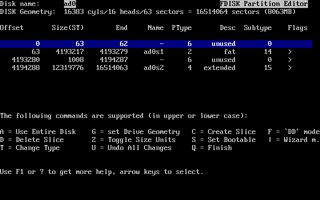
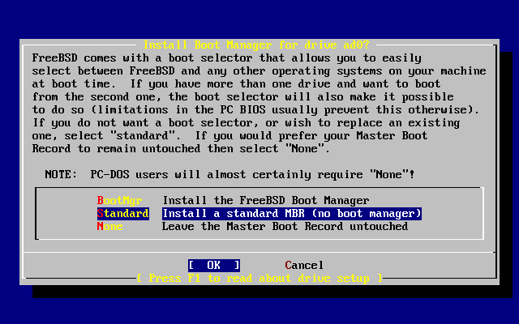
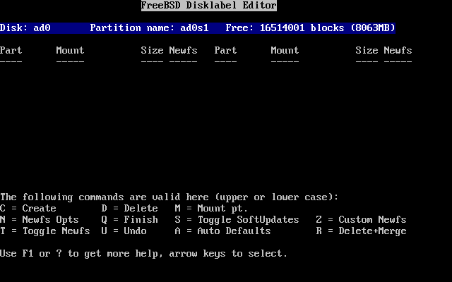
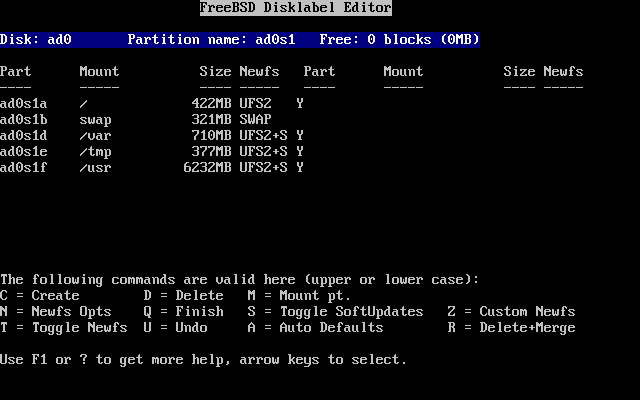
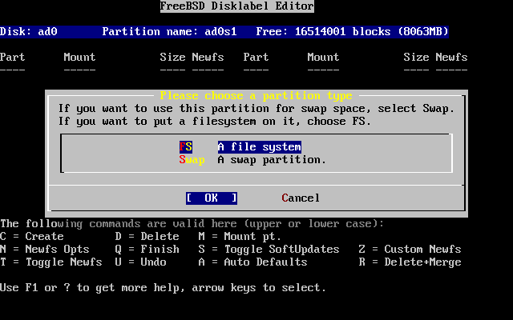

===================================
2.6. Asignaci?n de espacio en disco
===================================

.. raw:: html

   

2.6. Asignaci?n de espacio en disco
`Anterior <using-sysinstall.html>`__?
Cap?tulo 2. Instalaci?n de FreeBSD
?\ `Siguiente <install-choosing.html>`__

--------------

.. raw:: html

   

.. raw:: html

   

.. raw:: html

   

.. raw:: html

   

.. raw:: html

   

2.6. Asignaci?n de espacio en disco
-----------------------------------

.. raw:: html

   

.. raw:: html

   

.. raw:: html

   

Lo primero que tiene que hacer es asignar espacio en disco a FreeBSD
para que sysinstall lo pueda dejar listo para su uso. Para ello debe
saber c?mo espera FreeBSD encontrar la informaci?n en el disco.

.. raw:: html

   

.. raw:: html

   

.. raw:: html

   

.. raw:: html

   

2.6.1. Numeraci?n de unidades desde el punto de vista de la BIOS
~~~~~~~~~~~~~~~~~~~~~~~~~~~~~~~~~~~~~~~~~~~~~~~~~~~~~~~~~~~~~~~~

.. raw:: html

   

.. raw:: html

   

.. raw:: html

   

Antes de instalar y configurar FreeBSD en su sistema hay una cosa m?s de
la que ocuparse, especialmente si tiene m?s de un disco duro.

La BIOS es capz de abstraer el orden normal de los discos si hablamos de
un PC en el que se est? ejecutando un sistema operativo
"BIOS-dependiente" como MS-DOS? o Microsoft??Windows?, que admiten esos
cambios sin problemas. Tal cosa permite al usuario arrancar desde un
disco duro distinto del llamado ?maestro principal?. Esto viene muy bien
a los usuarios que tienen el ?backup? del sistema m?s barato que existe,
comprar un disco duro id?ntico al primero y copiar peri?dicamente la
primera unidad en la segunda mediante Ghost o XCOPY. De este modo si la
primera unidad falla, sufre el ataque de un virus o sufre las
consecuencias de un fallo del sistema operativo s?lo hay que decirle a
la BIOS que interpole l?gicamente las unidades. Es como intercambiar las
conexiones de los discos sin tener que abrir la caja del sistema.

en sistemas m?s caros a veces pueden encontrarse controladoras SCSI que
incorporan extensiones BIOS, que permiten organizar hasta siete unidades
SCSI de un modo muy similar.

Cualquiera que est? acostumbrado a usar las t?cnicas descritas se
llevar? una sorpresa al intentar usarlas en FreeBSD. FreeBSD no usa la
BIOS y no tiene en cuenta en absoluto la ?notaci?n de unidades l?gicas
desde el punto de vista de la BIOS?. Esto puede dar lugar a situaciones
bastante chocantes, especialmente cuando las unidades son f?sicamente
id?nticas en geometr?a y han sido creadas como clones de datos la una de
la otra.

Si va a usar FreeBSD recuerde siempre devolver a la BIOS a los valores
de numeraci?n ?natural? antes de la instalaci?n y dejarlos as?. Si tiene
que intercambiar unidades h?galo, pero a la vieja usanza: abra la caja,
toque los ?jumpers? y los cables todo lo que sea menester.

.. raw:: html

   

.. raw:: html

   

.. raw:: html

   

.. raw:: html

   

.. raw:: html

   

.. raw:: html

   

.. raw:: html

   

.. raw:: html

   

.. raw:: html

   

Pedro decide dedicar una vieja m?quina ?Wintel? para prepararle un
sistema FreeBSD a Pablo. Pedro le instala una sola unidad SCSI como
?unidad SCSI 0? e instala FreeBSD en ella.

Pablo comienza a usar el sistema pero a los pocos dias advierte que esa
vieja unidad SCSI est? mostrando numerosos errores l?gicos, as? que
informa del hecho a Pedro.

Dias despu?s Pedro decide solucionar el problema; consigue un disco
id?ntico al que instal? a Pablo. Le pasa un chequeo de superficie que da
resultados satisfactorios, as? que instala este disco como ?unidad SCSI
4? y hace una copia binaria de la unidad 0 (el primer disco) a la reci?n
instalada unidad 4. Una vez que el nuevo disco est? instalado Pedro
decide que hay que empezar a usarlo, as? que configura la BIOS SCSI para
reorganizar las unidades de disco para que el sistema arranque desde la
unidad SCSI 4. FreeBSD arranca desde dicha unidad y todo funciona
perfectamente.

Pablo sigue trabajando varios dias y no pasa mucho tiempo antes de que
Pedro y Pablo decidan que ya es hora de meterse en una nueva aventura:
actualizarse a la nueva vers?n de FreeBSD. Bill retira la unidad SCSI 0
de la m?quina porque le parece poco de fiar y la reemplaza por un disco
que obtiene de su en apariencia inagotable trastero. Pedro instala la
?ltima versi?n de FreeBSD en la nueva unidad SCSI mediante los disquetes
FTP m?gicos que Pablo ha bajado de Internet. La instalaci?n se ejecuta
sin problemas.

Pablo utiliza la nueva versi?n de FreeBSD durante unos dias y comprueba
que en efecto es lo bastante buena como para usarla en el departamento
de ingenier?a. Ha llegado, por tanto, el momento de copiar los datos que
tiene en la versi?n anterior de FreeBSD a su nuevo alojamiento. Pablo
monta la unidad SCSI 4 (la ?ltima que instal? con la versi?n anterior de
FreeBSD). Pablo queda consternado al comprobar que en la unidad SCSI 4
no hay ni rastro de sus preciados datos.

?D?nde est?n los datos?

Cuando Pedro hizo la copia binaria de la unidad SCSI 0 en la unidad SCSI
4, la unidad se convirti? en el ?el nuevo clon?. Cuando Pedro
reconfigur? la BIOS SCSI para poder arrancar desde la unidad SCSI 4 tan
s?lo estaba enga??ndose a s? mismo puesto que FreeBSD segu?a arrancando
desde la unidad SCSI 0. Al hacer tal cambio en la BIOS causamos que
parte del c?digo de arranque y del cargador del sistema se copie de una
a otra unidad pero en cuanto los controladores del kernel de FreeBSD
toman el control de la situaci?n el esquema de nomenclatura de unidades
de la BIOS es desestimado y FreeBSD recupera el esquema normal de
nomenclatura. En nuestro ejemplo el sistema sigue funcionando desde la
unidad SCSI 0 y ah? est?n todos los datos de Pablo, no en la unidad SCSI
4. El hecho de que pareciera que el sistema estaba funcionando en la
unidad SCSI 4 era un producto de la imaginaci?n humana.

Estamos encantados de decir que ni un solo byte fue herido o maltratado
durante el descubrimiento de este fen?meno. La vieja unidad SCSI 0 fu?
recuperada del mont?n de discos ca?dos en acto de servicio y fue posible
devolver todo el trabajo de Pablo a su leg?timo due?o. Por si fuera
poco, ahora Pedro sabe con certeza que es capaz de contar hasta cero.

En el ejemplo se han usado unidades SCSI pero los conceptos pueden
aplicarse perfectamente a unidades IDE.

.. raw:: html

   

.. raw:: html

   

.. raw:: html

   

.. raw:: html

   

.. raw:: html

   

.. raw:: html

   

2.6.2. Creaci?n de ?slices? con FDisk
~~~~~~~~~~~~~~~~~~~~~~~~~~~~~~~~~~~~~

.. raw:: html

   

.. raw:: html

   

.. raw:: html

   

.. raw:: html

   

Nota:
~~~~~

A?n no ha hecho modificaciones en su disco duro. Si cree que ha cometido
alg?n error y quiere comenzar de nuevo puede hacerlo, salga de los men?s
de sysinstall e int?ntelo de nuevo o pulse **U** para ejecutar la opci?n
Undo (deshacer). Si se pierde o no sabe c?mo salir siempre puede apagar
su sistema.

.. raw:: html

   

Si ha elegido iniciar una instalaci?n est?ndar sysinstall le mostrar? el
siguiente mensaje:

.. code:: screen

                                     Message
     In the next menu, you will need to set up a DOS-style ("fdisk")
     partitioning scheme for your hard disk. If you simply wish to devote
     all disk space to FreeBSD (overwriting anything else that might be on
     the disk(s) selected) then use the (A)ll command to select the default
     partitioning scheme followed by a (Q)uit. If you wish to allocate only
     free space to FreeBSD, move to a partition marked "unused" and use the
     (C)reate command.
                                    [  OK  ]

                          [ Press enter or space ]

Es decir:

.. code:: screen

                                     Mensaje
     En el siguiente men? tendr? que configurar un esquema de particionado
     estilo DOS ("fdisk") en su disco duro.  Si quiere dedicar todo el
     espacio de disco a FreeBSD (cosa que sobreescribir? cualquier cosa
     que contuviera el/los disco/s) use el comando (A)ll (Todo) para
     seleccionar el esquema de particiones por defecto y luego pulse
     (Q)uit (Salir).  Si quiere asignar a FreeBSD s?lamente el espacio
     libre en la unidad elija una partici?n que figure marcada como
     "unused" (sin usar) y ejecute el comando (C)reate (Crear).
                                    [  OK  ]

                          [ Pulse Intro o Espacio ]

Pulse **Intro** tal y como se le dice. Se le mostrar? una lista con
todas las unidades de disco duro que el kernel ha econtrado al hacer el
chequeo del sistema. La `Figura?2.12, “Elija en qu? unidad usar
FDisk” <install-steps.html#sysinstall-fdisk-drive1>`__ muestra un
ejemplo de un sistema con dos discos IDE. Reciben los nombres de ``ad0``
y ``ad2``.

.. raw:: html

   

.. raw:: html

   

Figura 2.12. Elija en qu? unidad usar FDisk

.. raw:: html

   

.. raw:: html

   

.. raw:: html

   

|Elija en qu? unidad usar FDisk|

.. raw:: html

   

.. raw:: html

   

.. raw:: html

   

Quiz?s est? preguntandose por qu? ``ad1`` no aparece por ning?n lado.
?Acaso hemos pasado algo por alto?

Veamos qu? ocurrir?a si tuviera usted dos discos duros IDE, uno como
maestro de la primera controladora IDE y el otro como maestro en la
segunda controladora IDE. Si FreeBSD asignara n?meros de unidad en el
orden en el que las encuentra en el ejemplo habr?amos visto ``ad0`` y
``ad1`` y todo funcionar?a sin mayor problema.

Pero si tuviera usted que a?adir un tercer disco, digamos como esclavo
de la primera controladora IDE, tendr?a que llamarse ``ad1`` y el disco
que antes era ``ad1`` pasar?a a llamarse ``ad2``. Los nombres de
dispositivo (como por ejemplo ``ad1s1a``) se usan para ubicar sistemas
de ficheros, as? que podr?a encontrarse con que alguno de sus sistemas
de ficheros no est? donde debiera y tendr?a que modificar la
configuraci?n de su FreeBSD.

Para evitar este problema el kernel puede configurarse para asignar
nombres a discos IDE bas?ndose en d?nde est?n en lugar de hacerlo por el
orden en el que los encuentra. Seg?n dicho esquema el disco maestro de
la segunda contoladora IDE *siempre* ser? ``ad2``, incluso si no existen
dispositivos ``ad0`` o ``ad1``.

?sta es la configuraci?n por omisi?n que incorpora el kernel de FreeBSD,
por lo que muestra las unidades ``ad0`` y ``ad2``. La m?quina en la que
se tomaron las capturas de pantalla tiene sendos discos IDE en ambos
canales maestros de las dos controladoras y carece de discos en los
canales esclavos.

Seleccione el disco en el que desea instalar FreeBSD y pulse [?OK?].
FDisk arrancar? y le mostrar? una pantalla similar a la que muestra la
`Figura?2.13, “Un ejemplo de particionamiento t?pico con
FDisk” <install-steps.html#sysinstall-fdisk1>`__.

La pantalla de FDisk se divide en tres partes.

La primera parte, que ocupa las dos primeras l?neas de la pantalla,
muestra los detalles del disco que seleccionemos, el nombre que FreeBSD
le da, la geometr?a del disco y el tama?o total del disco.

La segunda parte muestra las ?slices? que haya en el disco, d?nde
comienzan y acaban, cu?l es su tama?o, qu? nombre les da FreeBSD, su
descripci?n y subtipo. Este ejemplo muestra dos peque?as ?slices? sin
usar; las ?slices? (del ingl?s ?rebanadas?) son un tipo de esquema
estructural de los discos de PC. Tambi?n muestra una gran ?slice? FAT,
que casi con total seguridad aparecer? como ``C:`` en MS-DOS? /
Windows?, y una ?slice? extendida, que podr?a contener otras letras de
unidad de MS-DOS? / Windows?.

La tercera parte muestra las ?rdenes que pueden usarse en FDisk.

.. raw:: html

   

.. raw:: html

   

Figura 2.13. Un ejemplo de particionamiento t?pico con FDisk

.. raw:: html

   

.. raw:: html

   

.. raw:: html

   

|Un ejemplo de particionamiento t?pico con FDisk|

.. raw:: html

   

.. raw:: html

   

.. raw:: html

   

Lo que deba hacer a partir de ahora depender? mucho de la forma en la
que quiera distribuir su disco.

Si desea usar FreeBSD en el resto del disco (lo que implica borrar todos
los datos que pudiera haber en el disco una vez que le confirme a
sysinstall que desea seguir adelante con la instalaci?n) pulse **A**,
que equivale a la opci?n Use Entire Disk (Utilizar el disco ?ntegro).
Las ?slices? que existieran se borrar?n y ser?n reemplazadas por un
peque?o ?rea de disco marcado como ``sin usar`` (otro recurso de la
estructura de disco de los PC) y tras ?l una gran ?slice? destinada a
FreeBSD. Ahora marque la partici?n FreeBSD que acaba de crear como
arrancable: pulse **S**. La pantalla que ver? ha de ser muy similar a la
`Figura?2.14, “Partici?n con FDisk usando el disco
completo” <install-steps.html#sysinstall-fdisk2>`__. Observe la ``A`` en
la columna ``Flags``: indica que la ?slice? es *activa* y se arrancar?
desde ella.

Si desea borrar una ?slice? para hacer m?s sitio a FreeBSD selecci?nela
mediante las flechas y pulse **D**. Despu?s pulse **C** y ver? un
mensaje en el que se le pedir? el tama?o de la ?slice? que va a crear.
Introduzca los datos apropiados y pulse **Intro**. El valor por defecto
en ?sta pantalla es el de la ?slice? m?s grande que pueda crear en el
disco, que deber?a ser la mayor parte del disco que queda sin usar o el
tama?o del disco duro completo.

Si ha hecho sitio para FreeBSD (quiz?s con una herramienta como
PartitionMagic?) puede pulsar press **C** y crear una nueva ?slice?.
Ver? de nuevo un mensaje en el que se le pedir? que escriba el tama?o de
la ?slice? que va a crear.

.. raw:: html

   

.. raw:: html

   

Figura 2.14. Partici?n con FDisk usando el disco completo

.. raw:: html

   

.. raw:: html

   

.. raw:: html

   

|Partici?n con FDisk usando el disco completo|

.. raw:: html

   

.. raw:: html

   

.. raw:: html

   

Cuando acabe pulse **Q**. Sus cambios se guardar?n en sysinstall, pero
de momento no se guardar?n en disco.

.. raw:: html

   

.. raw:: html

   

.. raw:: html

   

.. raw:: html

   

.. raw:: html

   

2.6.3. Instalaci?n de un gestor de arranque
~~~~~~~~~~~~~~~~~~~~~~~~~~~~~~~~~~~~~~~~~~~

.. raw:: html

   

.. raw:: html

   

.. raw:: html

   

Ha llegado el momento de instalar un gestor de arranque. Elija el gestor
de arranque de FreeBSD si:

.. raw:: html

   

-  Tiene m?s de un disco y ha instalado FreeBSD en cualquiera que no sea
   el primero.

-  Ha instalado FreeBSD codo con codo con otro sistema operativo y
   quiere poder elegir si arrancar FreeBSD o ese otro sistema operativo
   cuando arranque su sistema.

.. raw:: html

   

Si FreeBSD va a ser el ?nico sistema operativo en el sistema y va a
instalarlo en el primer disco duro elija el gestor est?ndar (que,
obviamente, est? en la opci?n Standard). Elija None (ninguno) si va a
usar alg?n otro gestor de arranque que sea capaz de arrancar FreeBSD.

Elija y pulse **Intro**.

.. raw:: html

   

.. raw:: html

   

Figura 2.15. Men? de gestores de arranque de sysinstall

.. raw:: html

   

.. raw:: html

   

.. raw:: html

   

|Men? de gestores de arranque de sysinstall|

.. raw:: html

   

.. raw:: html

   

.. raw:: html

   

La pantalla de ayuda, que puede consultar en cualquier momento pulsando
**F1**, puede serle de mucha ayuda con los problemas que puede
encontrarse al intentar compartir un disco duro entre varios sistemas
operativos.

.. raw:: html

   

.. raw:: html

   

.. raw:: html

   

.. raw:: html

   

.. raw:: html

   

2.6.4. Creaci?n de ?slices? en otra unidad.
~~~~~~~~~~~~~~~~~~~~~~~~~~~~~~~~~~~~~~~~~~~

.. raw:: html

   

.. raw:: html

   

.. raw:: html

   

Si hay m?s de una unidad de disco el programa de instalaci?n volver? a
la pantalla ?Select Drives? (?selecci?n de unidades?) una vez elegido el
gestor de arranque. Si quiere instalar FreeBSD en m?s de un disco
seleccione aqu? ese otro disco y repita el proceso con las ?slices?
mediante FDisk.

.. raw:: html

   

Importante:
~~~~~~~~~~~

Si va a instalar FreeBSD en una unidad que no sea la primera tendr? que
instalar el gestor de arranque de FreeBSD en ambas unidades.

.. raw:: html

   

.. raw:: html

   

.. raw:: html

   

Figura 2.16. Salir de la selecci?n de unidad

.. raw:: html

   

.. raw:: html

   

.. raw:: html

   

|Salir de la selecci?n de unidad|

.. raw:: html

   

.. raw:: html

   

.. raw:: html

   

El **tabulador** se usa para hacer pasar el cursor entre [?OK?],
[?Cancel?].

Pulse **tabulador** para pasar el cursor a [?OK?] y pulse **Enter** para
proseguir con la instalaci?n.

.. raw:: html

   

.. raw:: html

   

.. raw:: html

   

.. raw:: html

   

.. raw:: html

   

2.6.5. Creaci?n de particiones con Disklabel
~~~~~~~~~~~~~~~~~~~~~~~~~~~~~~~~~~~~~~~~~~~~

.. raw:: html

   

.. raw:: html

   

.. raw:: html

   

Tendr? que crear particiones dentro de las ?slices? que haya creado.
Recuerde que cada partici?n est? asociada a una letra entre la ``a`` y
la ``h``\ y que las particiones ``b``, ``c`` y ``d`` tienen significados
heredados que tendr? que respetar.

Ciertas aplicaciones pueden optimizar su rendimiento de un esquema de
particiones concreto, sobre todo si hace particiones repartidas en m?s
de un disco. Si embargo si esta es su primera instalaci?n de FreeBSD no
necesita dedicarle demasiado tiempo a decidir c?mo partir el disco duro.
Es mucho m?s importante que instale FreeBSD y empiece a aprender a
usarlo. Siempre est?a tiempo de reinstalar FreeBSD y cambiar su esquema
de particiones cuando est? m?s familiarizado con el sistema operativo.

El siguiente esquema consta de cuatro particiones: una para la swap y
tres para los sistemas de ficheros.

.. raw:: html

   

.. raw:: html

   

Tabla 2.2. Estructura de particiones del primer disco

.. raw:: html

   

.. raw:: html

   

+-------------+-----------------------+----------------------------------+----------------------------------------------------------------------------------------------------------------------------------------------------------------------------------------------------------------------------------------------------------------------------------------------------------------------------------------------------------------------------------------------------------------------------------------------------+
| Partici?n   | Sistema de ficheros   | Tama?o                           | Descripci?n                                                                                                                                                                                                                                                                                                                                                                                                                                        |
+=============+=======================+==================================+====================================================================================================================================================================================================================================================================================================================================================================================================================================================+
| ``a``       | ``/``                 | 512?MB                           | Este es el sistema de ficheros ra?z. el resto de sistemas de ficheros se montar?n en alg?n punto de este sistema ra?z. 100?MB es un tama?o razonable para ?l. No es el mejor sitio para almacenar muchos datos y la instalaci?n de FreeBSD escribir? cerca de 40?MB de datos en ella. El resto del espacio es para datos temporales y por si futuras versiones de FreeBSD necesitan m?s espacio en ``/``.                                          |
+-------------+-----------------------+----------------------------------+----------------------------------------------------------------------------------------------------------------------------------------------------------------------------------------------------------------------------------------------------------------------------------------------------------------------------------------------------------------------------------------------------------------------------------------------------+
| ``b``       | N/A                   | 2-3 x RAM                        | Esta partici?n es el espacio de memoria de intercambio (o ?swap?) del sistema. La elecci?n de la cantidad correcta de swap es casi un arte en s? mismo. Hay una regla b?sica que es asignar a la swap el doble o el triple de MB de los que haya en la memoria f?sica (RAM) del sistema. Deber?a tener al menos 64?MB de swap as? que si tiene menos de 32?MB de RAM as?gnele a su swap 64?MB.                                                     |
|             |                       |                                  |                                                                                                                                                                                                                                                                                                                                                                                                                                                    |
|             |                       |                                  | Si tiene m?s de un disco puede poner espacio swap en cada disco. FreeBSD usar? ambas swap con el resultado de acelerar notablemente el intercambio de p?ginas de memoria. Calcule el total de swap que necesita (por ejemplo 128?MB) y divida esa cantidad por el n?mero de discos que tenga (por ejemplo dos) y ya tiene la cantidad de espacio que debe destinar a swap en cada uno de sus discos. En nuestro ejemplo 64?MB de swap por disco.   |
+-------------+-----------------------+----------------------------------+----------------------------------------------------------------------------------------------------------------------------------------------------------------------------------------------------------------------------------------------------------------------------------------------------------------------------------------------------------------------------------------------------------------------------------------------------+
| ``e``       | ``/var``              | 256?MB to 1024?MB                | El directorio ``/var`` contiene ficheros que est?n en continuo cambio, como ?logs? y otros ficheros administrativos. Muchos de esos ficheros son una consecuencia o son de gran ayuda para el correcto funcionamiento diario de FreeBSD. FreeBSD ubica dichos ficheros en ese sistema de ficheros para optimizar el acceso a los mismos sin afectar a otros ficheros ni directorios que tienen similar patr?n de accesos.                          |
+-------------+-----------------------+----------------------------------+----------------------------------------------------------------------------------------------------------------------------------------------------------------------------------------------------------------------------------------------------------------------------------------------------------------------------------------------------------------------------------------------------------------------------------------------------+
| ``f``       | ``/usr``              | Resto del disco(al menos 2?GB)   | El resto de sus ficheros pueden almacenarse en ``/usr`` y sus subdirectorios.                                                                                                                                                                                                                                                                                                                                                                      |
+-------------+-----------------------+----------------------------------+----------------------------------------------------------------------------------------------------------------------------------------------------------------------------------------------------------------------------------------------------------------------------------------------------------------------------------------------------------------------------------------------------------------------------------------------------+

.. raw:: html

   

.. raw:: html

   

.. raw:: html

   

Aviso:
~~~~~~

Los valores que se han mostrado son simples ejemplos y se recomienda su
uso exclusivamente a usuarios experimentados. Recomendamos a los
usuarios que utilicen la opci?n ``Auto Defaults``, que elegir? unas
proporciones adecuadas para el espacio que encuentre disponible.

.. raw:: html

   

Si va a instalar FreeBSD en m?s de un disco puede crear particiones el
las dem?s ?slices? que haya creado. La forma m?s f?cil de hacerlo es
creando dos particiones en cada disco, una para la swap y la otra para
los sistemas de ficheros.

.. raw:: html

   

.. raw:: html

   

Tabla 2.3. Esquema de particiones para varios discos

.. raw:: html

   

.. raw:: html

   

+-------------+-----------------------+-------------------+----------------------------------------------------------------------------------------------------------------------------------------------------------------------------------------------------------------------------------------------------------------------------------------------------------------------------------------------------------------------------------------------------------------------------------------------------------------------------------------------------------------------------------------------------------------------------------------------------------------------------------------------------------------------------------------------------------------------+
| Partici?n   | Sistema de ficheros   | Tama?o            | Descripci?n                                                                                                                                                                                                                                                                                                                                                                                                                                                                                                                                                                                                                                                                                                          |
+=============+=======================+===================+======================================================================================================================================================================================================================================================================================================================================================================================================================================================================================================================================================================================================================================================================================================================+
| ``b``       | N/A                   | Ver descripci?n   | Tal y como se ha explicado puede repartir su espacio swap entre varios discos. Aunque piense que la partici?n ``a`` est? libre la costumbre (y se dice que ?las costumbres son leyes? dicta que el espacio swap reside en la partici?n ``b``.                                                                                                                                                                                                                                                                                                                                                                                                                                                                        |
+-------------+-----------------------+-------------------+----------------------------------------------------------------------------------------------------------------------------------------------------------------------------------------------------------------------------------------------------------------------------------------------------------------------------------------------------------------------------------------------------------------------------------------------------------------------------------------------------------------------------------------------------------------------------------------------------------------------------------------------------------------------------------------------------------------------+
| ``e``       | /disco*``n``*         | Resto del disco   | El resto del disco puede dejarse en una sola partici?n. Esto podr?a ubicarse simplemente en la partici?n ``a`` en lugar de en la ``e``. Sin embargo la costumbre dice que la partici?n ``a`` de una ?slice? est? reservada para el sistema de ficheros que ha de albergar el sistema de ficheros ra?z (``/``). No tiene por qu? seguir la costumbre pero tenga en cuenta que sysinstall s? que lo hace, as? que si la sigue sabe que est? haciendo una instalaci?n m?s limpia. Puede montar los sistemas de ficheros donde prefiera; este ejemplo le sugiere que los monte como directorios ``/discon``, donde *``n``* es un n?mero que cambia en cada disco. Por supuesto que puede usar el esquema que prefiera.   |
+-------------+-----------------------+-------------------+----------------------------------------------------------------------------------------------------------------------------------------------------------------------------------------------------------------------------------------------------------------------------------------------------------------------------------------------------------------------------------------------------------------------------------------------------------------------------------------------------------------------------------------------------------------------------------------------------------------------------------------------------------------------------------------------------------------------+

.. raw:: html

   

.. raw:: html

   

Una vez que haya elegido el esquema de particiones creelo en sysinstall.
Ver? este mensaje:

.. code:: screen

                                     Message
     Now, you need to create BSD partitions inside of the fdisk
     partition(s) just created. If you have a reasonable amount of disk
     space (200MB or more) and don't have any special requirements, simply
     use the (A)uto command to allocate space automatically. If you have
     more specific needs or just don't care for the layout chosen by
     (A)uto, press F1 for more information on manual layout.

                                    [  OK  ]
                              [ Press enter or space ]

Es decir:

.. code:: screen

                                     Message
     Debe crear particiones BSD dentro de las 'particiones
     fdisk' que acaba de crear.  Si tiene una cantidad de espacio en
     disco razonablemente grande (200MB o m?s) y no tiene necesidades
     especiales puede simplemente usar el comando (A)uto para asignar
     el espacio autom?ticamente. Si tiene necesidades m?s concretas o
     simplemente no le gusta la estructura que le da (A)uto pulse
     F1 y obtendr? m?s informaci?n sobre la creaci?n manual de
     la estructura.

                                    [  OK  ]
                              [ Pulse Intro o Espacio ]

Al pulsar **Intro** arrancar? el editor de particiones de FreeBSD,
Disklabel.

La `Figura?2.17, “El editor
Disklabel” <install-steps.html#sysinstall-label>`__ muestra lo que ver?
cuando arranque Disklabel. La pantalla se divide en tres secciones.

Las primeras l?neas muestran el nombre del disco en el que estamos
haciendo cambios y el de la ?slice? que contiene las particiones que
estamos creando (Disklabel las muestra bajo ``Partition name`` (?nombre
de partici?n?) en lugar de hacerlo como ?slices?). Vemos tambi?n ah? la
cantidad de espacio libre en la ?slice?, esto es, el espacio que hay
asignado a la ?slice? pero que a?n no ha sido asignado a ninguna
partici?n.

En la mitad de la pantalla se muestran las particiones que se han
creado, el nombre de los sistemas de ficheros que contiene cada
partici?n, sus tama?os y algunas opciones relacionadas con la creaci?n
de sistemas de ficheros.

La tercera parte de la pantalla, la de m?s abajo, muestra los atajos de
teclado que pueden usarse en Disklabel.

.. raw:: html

   

.. raw:: html

   

Figura 2.17. El editor Disklabel

.. raw:: html

   

.. raw:: html

   

.. raw:: html

   

|El editor Disklabel|

.. raw:: html

   

.. raw:: html

   

.. raw:: html

   

Disklabel puede crear autom?ticamente particiones y asignarles tama?os
por omisi?n. Estos tama?os se calculan con la ayuda de un algoritmo
interno de dimensionamiento de particiones que analiza el tama?o del
disco. Puede probarlo pulsando **A**. Ver? una pantalla similar a la que
aparece en la `Figura?2.18, “Editor Disklabel con valores por
omisi?n” <install-steps.html#sysinstall-label2>`__. Dependiendo del
tama˜o del disco que est? usando los valores por omisi?n pueden o no ser
los apropiados. Esto no es algo de lo que deba preocuparse dado que no
est? obligado a aceptar esos valores por omisi?n.

.. raw:: html

   

Nota:
~~~~~

En el esquema de particiones por omisi?n el directorio ``/tmp`` tiene su
propia partici?n en lugar de formar parte de ``/``. Esto ayuda a evitar
el desbordamiento de ``/`` con ficheros temporales.

.. raw:: html

   

.. raw:: html

   

.. raw:: html

   

Figura 2.18. Editor Disklabel con valores por omisi?n

.. raw:: html

   

.. raw:: html

   

.. raw:: html

   

|Editor Disklabel con valores por omisi?n|

.. raw:: html

   

.. raw:: html

   

.. raw:: html

   

Si decide no usar los valores por defecto para las particiones y quiere
reemplazar tales valores por los suyos use las flechas: elija la primera
partici?n y pulse **D** para borrarla. Repita el proceso para borrar
todas las particiones que desee.

Vamos a crear la primera partici?n (``a``, montada como ``/`` o ra?z).
Seleccione la ?slice? adecuada y pulse **C**. Aparecer? un di?logo
pidi?ndole que escriba el tama?o de la nueva partici?n (como se muestra
en la in `Figura?2.19, “Liberar espacio para la partici?n
ra?z” <install-steps.html#sysinstall-label-add>`__). Puede introducir el
tama?o expresado en bloques de disco o como un n?mero seguido de una
``M`` para expresarlo en megabytes, una ``G`` para usar gygabytes o una
``C`` si quiere expresarlo en cilindros.

.. raw:: html

   

.. raw:: html

   

Figura 2.19. Liberar espacio para la partici?n ra?z

.. raw:: html

   

.. raw:: html

   

.. raw:: html

   

|Liberar espacio para la partici?n ra?z|

.. raw:: html

   

.. raw:: html

   

.. raw:: html

   

El tama?o por omisi?n que se muestra crear? una partici?n que ocupe el
resto de la ?slice?. Si va a usar los tama?os de partici?n que se daban
en el ejemplo anterior borre el texto existente pulsando **Retroceso**;
escriba **``64M``**, como se puede ver en la `Figura?2.20, “Edici?n del
tama?o de la partici?n
ra?z” <install-steps.html#sysinstall-label-add2>`__. Despu?s pulse
[?OK?].

.. raw:: html

   

.. raw:: html

   

Figura 2.20. Edici?n del tama?o de la partici?n ra?z

.. raw:: html

   

.. raw:: html

   

.. raw:: html

   

|Edici?n del tama?o de la partici?n ra?z|

.. raw:: html

   

.. raw:: html

   

.. raw:: html

   

Una vez elegido el tama?o de la partici?n tendr? que elegir si esta
partici?n ha de contener un sistema de ficheros o espacio swap y
escribir lo que corresponda en una pantalla como la que se muestra en la
`Figura?2.21, “Elegir el tipo de partici?n
ra?z” <install-steps.html#sysinstall-label-type>`__. Esta primera
partici?n contendr? un sistema de ficheros, as? que seleccionamos FS y
pulsamos **Intro**.

.. raw:: html

   

.. raw:: html

   

Figura 2.21. Elegir el tipo de partici?n ra?z

.. raw:: html

   

.. raw:: html

   

.. raw:: html

   

|Elegir el tipo de partici?n ra?z|

.. raw:: html

   

.. raw:: html

   

.. raw:: html

   

Para acabar, dado que est? creando un sistema de ficheros, tendr? que
decirle a Disklabel d?nde hay que montarlo. La pantalla se muestra en la
`Figura?2.22, “Elegir el punto de montaje del sistema de ficheros
ra?z” <install-steps.html#sysinstall-label-mount>`__. El punto de
montaje del sistema de ficheros ra?z es ``/``, as? que tendr? que
teclear **``/``**\ y luego pulsar **Intro**.

.. raw:: html

   

.. raw:: html

   

Figura 2.22. Elegir el punto de montaje del sistema de ficheros ra?z

.. raw:: html

   

.. raw:: html

   

.. raw:: html

   

|Elegir el punto de montaje del sistema de ficheros ra?z|

.. raw:: html

   

.. raw:: html

   

.. raw:: html

   

La pantalla le mostrar? ahora la partici?n que acaba de crear. Repita el
procedimiento todas las veces que necesite con las dem?s particiones.
Cuando cree la partici?n swap no se le pedir? el punto de montaje puesto
que las particiones swap nunca se montan como tales. Cuando cree la
?ltima partici?n ``/usr``, puede dejar el tama?o que se le sugiere, esto
es, usar el resto del espacio en la ?slice?.

La ?ltima pantalla del editor Disklabel ser? muy parecida a la
`Figura?2.23, “Editor
Disklabel” <install-steps.html#sysinstall-label4>`__, aunque los valores
pueden ser diferentes. Pulse **Q** para salir del editor.

.. raw:: html

   

.. raw:: html

   

Figura 2.23. Editor Disklabel

.. raw:: html

   

.. raw:: html

   

.. raw:: html

   

|Editor Disklabel|

.. raw:: html

   

.. raw:: html

   

.. raw:: html

   

.. raw:: html

   

.. raw:: html

   

.. raw:: html

   

--------------

+-----------------------------------------+----------------------------+--------------------------------------------+
| `Anterior <using-sysinstall.html>`__?   | `Subir <install.html>`__   | ?\ `Siguiente <install-choosing.html>`__   |
+-----------------------------------------+----------------------------+--------------------------------------------+
| 2.5. ?Qu? es sysinstall??               | `Inicio <index.html>`__    | ?2.7. Elecci?n de qu? instalar             |
+-----------------------------------------+----------------------------+--------------------------------------------+

.. raw:: html

   

Puede descargar ?ste y muchos otros documentos desde
ftp://ftp.FreeBSD.org/pub/FreeBSD/doc/

| Si tiene dudas sobre FreeBSD consulte la
  `documentaci?n <http://www.FreeBSD.org/docs.html>`__ antes de escribir
  a la lista <questions@FreeBSD.org\ >.
|  Env?e sus preguntas sobre la documentaci?n a <doc@FreeBSD.org\ >.

.. |Elija en qu? unidad usar FDisk| image:: install/fdisk-drive1.png

.. |Partici?n con FDisk usando el disco completo| image:: install/fdisk-edit2.png

.. |Salir de la selecci?n de unidad| image:: install/fdisk-drive2.png

.. |Liberar espacio para la partici?n ra?z| image:: install/disklabel-root1.png
.. |Edici?n del tama?o de la partici?n ra?z| image:: install/disklabel-root2.png

.. |Elegir el punto de montaje del sistema de ficheros ra?z| image:: install/disklabel-root3.png
.. |Editor Disklabel| image:: install/disklabel-ed2.png
