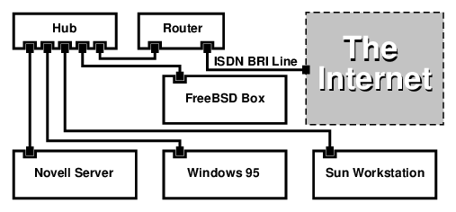

==========
29.8. RDSI
==========

.. raw:: html

   

29.8. RDSI
`Anterior <network-diskless.html>`__?
Cap?tulo 29. Networking avanzado
?\ `Siguiente <network-nis.html>`__

--------------

.. raw:: html

   

.. raw:: html

   

.. raw:: html

   

.. raw:: html

   

.. raw:: html

   

29.8. RDSI
----------

.. raw:: html

   

.. raw:: html

   

.. raw:: html

   

`la p?gina de RDSI de Dan
Kegel <http://www.alumni.caltech.edu/~dank/isdn/>`__ constituye un
recurso de informaci?n bastante bueno sobre la tecnolog?a RDSI (ISDN en
ingl?s) y sobre el hardware relacionado.

A continuaci?n se comenta un esquema r?pido sobre RDSI:

.. raw:: html

   

-  Si usted vive en Europa le puede resultar ?til leer la secci?n sobre
   tarjetas RDSI.

-  Si se prevee utilizar RDSI principalmente para conectarse a Internet
   a trav?s de un Proveedor de Servicios utilizando un mecanismo de
   marcaci?n autom?tica no dedicado (dial-up), se puede echar un vistazo
   a los Adaptadores de Terminal. Dichos adaptadores proporciona la
   mayor flexibilidad y garantiza los m?nimos problemas en caso de
   cambio de cambio de proveedor.

-  Si estamos conectados a dos LAN o conectando a Internet con una
   conexi?n RDSI dedicada puede ser interesante considerar la opci?n de
   usar un “router/bridge” ?nico.

.. raw:: html

   

El coste es un factor importante a la hora de determinar qu? soluci?n se
debe escoger. Las siguientes opciones se encuentran ordenadas desde las
m?s baratas hasta las m?s caras.

.. raw:: html

   

.. raw:: html

   

.. raw:: html

   

.. raw:: html

   

29.8.1. Tarjetas RDSI
~~~~~~~~~~~~~~~~~~~~~

.. raw:: html

   

.. raw:: html

   

Escrito por Hellmuth Michaelis.

.. raw:: html

   

.. raw:: html

   

.. raw:: html

   

La implementaci?n de RDSI que posee FreeBSD soporta s?lamente el
estandar DSS1/Q.931 (tambi?n conocido como Euro-RDSI) utilizando
tarjetas pasivas. A partir de FreeBSD 4.4 se soportan tambi?n algunas
tarjetas activas usando firmware que adem?s soporta otros protocolos de
se?alizaci?n; esto tambi?n sucede con la primera tarjeta RDSI de acceso
primario (PRI) soportada.

El software isdn4bsd permite conectar con otras pasarelas RDSI
utilizando IP sobre HDLC o bien PPP PPP s?ncrono: ambos mediante el uso
del PPP del n?cleo con ``isppp``, una versi?n modificada del controlador
`sppp(4) <http://www.FreeBSD.org/cgi/man.cgi?query=sppp&sektion=4>`__ o
mediante la utilizaci?n del PPP de entorno de usuario,
`ppp(8) <http://www.FreeBSD.org/cgi/man.cgi?query=ppp&sektion=8>`__. Si
se utiliza
`ppp(8) <http://www.FreeBSD.org/cgi/man.cgi?query=ppp&sektion=8>`__ de
entorno de usuario se pueden agrupar dos o mas canales B de RDSI
(channel bonding). Existe tambi?n software que permite a una m?quina
responder a llamadas de tel?fono y algunas cosas m?s como un modem de
300 baudios.

Cada vez se soportan m?s tarjetas RDSI bajo FreeBSD y los informes
existentes muestra que FreeBSD se utiliza con dichas tarjetas de forma
satisfactoria en toda Europa y tambi?n en otras partes del mundo.

Las tarjetas RDSI pasivas soportadas en FreeBSD son principalmente las
que poseen el chip Infineon (antiguamente Siemens) ISAC/HSCX/IPAC.
Tambi?n las tarjetas RDSI con los chips de Cologne (en bus ISA
exclusivamente), tarjetas PCI con el chip Winbond W6692, algunas
tarjetas con combinaciones de los chips Tiger 300/320/ISAC y tambi?n
algunas tarjetas basadas en chips propietarios como las AVM Fritz! PCI
V.1.0 y AVM Fritz! PnP.

Actualmente las tarjetas RDSI activas soportadas son las AVM B1 (ISA y
PCI) BRI, y las AVM T1 PCI PRI.

Se puede consultar ``/usr/share/examples/isdn/`` para obtener
documentaci?n sobre isdn4bsd y tambi?n en `la p?gina principal de
isdn4bsd <http://www.freebsd-support.de/i4b/>`__, donde hay enlaces de
ayuda, erratas y mucha m?s informaci?n ?til, como por ejemplo el `manual
de isdn4bsd <http://people.FreeBSD.org/~hm/>`__.

Si se quiere a?adir soporte para un protoclo RDSI distinto para una
tarjeta RDSI que no se encuentra soportada o para mejorar isdn4bsd en
alg?n aspecto por favor p?ngase en contacto con Hellmuth Michaelis.

Para realizar consultas referentes a la instalaci?n, configuraci?n y
depuraci?n de problemas relacionados con isdn4bsd le recomendamos
recurrir a la lista de correo
`freebsd-isdn <http://lists.FreeBSD.org/mailman/listinfo/freebsd-isdn>`__.

.. raw:: html

   

.. raw:: html

   

.. raw:: html

   

.. raw:: html

   

.. raw:: html

   

29.8.2. Adaptadores de terminal RDSI
~~~~~~~~~~~~~~~~~~~~~~~~~~~~~~~~~~~~

.. raw:: html

   

.. raw:: html

   

.. raw:: html

   

Los Adaptadores de Terminal (TA), son para RDSI lo que los modems son
para las l?neas de tel?fono convencionales.

La mayor parte de los TAs utilizan el conjunto de instrucciones AT de
los modem Hayes y se pueden utilizar en lugar del modem.

Un TA opera b?sicamente de igual forma que un modem, diferenci?ndose en
que las velocidades de conexi?n y “throughput” son mucho m?s grandes. La
configuraci?n de `PPP <ppp.html>`__ se realiza exactamente igual que
para una configuraci?n de modem convencional.

La ventaja principal de utilizar un TA para conectarse a un proveedor de
servicios de internet consiste en que se puede usar PPP din?mico. Ya que
el espacio de direcciones de IP se est? direcciones de IP se est?
convirtiendo cada vez convirtiendo en un recurso cada d? m?s limitado y
escaso los proveedores ya no desean proporcionar direcciones IP
est?ticas a sus clientes. No obstante la mayor?a de los “routers
standalone” no son capaces de adquirir direcciones IP din?micas.

Los TAs conf?an completamente en el d?mon de PPP que se est? ejecutando
para proporcionar fiabilidad y estabilidad en la conexi?n. De esta forma
si se tiene configurado PPP se puede migrar f?cilmente de la utilizaci?n
de modems anal?gicos al uso de RDSI. No obstante si exist?a alg?n
problema con PPP antes de efectuar la migraci?n dichos problemas
persistir?n en RDSI.

Si se desea m?xima estabilidad se puede utilizar la opci?n
`PPP <ppp.html>`__, no el `PPP a nivel de usuario <userppp.html>`__.

Se sabe que los siguientes TAs funcionan con FreeBSD:

.. raw:: html

   

-  Motorola BitSurfer y Bitsurfer Pro

-  Adtran

.. raw:: html

   

La mayor?a de los dem?s TAs probablemente tambi?n funcionen puesto que
los fabricantes siempre tratan de que sus productos puedan aceptar la
mayor?a de las ?rdenes AT.

El problema que existe con los TAs es que, como sucede con los modems,
se necesita tener una buena tarjeta serie instalada en el sistema.

Se recomienda consultar el tutorial `FreeBSD Serial
Hardware <../../articles/serial-uart/index.html>`__ para obtener una
comprensi?n detallada del funcionamiento de los dispositivos serie en
FreeBSD y para comprender las diferencias entre puertos serie s?ncronos
y as?ncronos.

Un TA que se ejecuta a trav?s de un puerto serie (as?ncrono) est?
limitado a 115.2?Kbs, aunque la conexi?n RDSI sea de 128?Kbs. Para
utilizar completamente el ancho de banda que RDSI proporciona, se debe
conectar el TA a una tarjeta serie s?ncrona.

No se enga?e creyendo que comprando un TA interno har? desaparecer los
problemas s?ncronos/as?ncronos. Los TA internos simplemente disponen de
un chip de puerto serie instalado de f?brica. Lo ?nico que se consigue
con estos dispositivos es no tener que enchufarlos a la red el?trica
ahorrando as? un enchufe y no tener que comprar un cable serie, pero los
problemas dichos anteriormente permanecen.

Una tarjeta as?ncrona con un TA resulta ser al menos tan r?pida como un
“router standalone” y si FreeBSD controla dicha tarjeta se puede adaptar
m?s f?cilmente.

La elecci?n de una tarjeta s?ncrona/TA versus un “router standalone” se
trata en la mayor?a de los casos de una cuesti?n cuasi-religiosa. Han
existido diversas discusiones sobre este tema en varias listas de
correo. Nosotros recomendamos que busque informaci?n en los
`hist?ricos <http://www.freebsd.org/search/index.html>`__ para para
poder sopesar los pros y los contras que se han esgrimido en tales
discusiones.

.. raw:: html

   

.. raw:: html

   

.. raw:: html

   

.. raw:: html

   

.. raw:: html

   

29.8.3. “bridges/routers” RDSI “Stand-alone”
~~~~~~~~~~~~~~~~~~~~~~~~~~~~~~~~~~~~~~~~~~~~

.. raw:: html

   

.. raw:: html

   

.. raw:: html

   

Los “bridges” o “routers” RDSI no son espec?ficos de FreeBSD o de
cualquier otro sistema operativo. Para una descripci?n completa de la
tecnolog?a de “bridge” y de pasarela de red por favor consulte cualquier
libro sobre redes.

En el contexto de esta secci?n los t?rminos “router”, pasarela y
“bridge” se utilizar?n indistintamente.

Seg?n va bajando el coste de los “ routers/bridges” RDSI su utilizaci?n
entre el p?blico en general va en aumento. Un “router” RDSI es una
peque?a caja que se conecta directamente a la red Ethernet local y que
gestiona sus propias conexiones con el “bridge/router” remoto. Posee un
software preconfigurado para comunicarse v?a PPP y tamb?en utilizando
otros protocolos de uso com?n.

Un router sopota una mayor tasa de paquetes (throughput) que un
“standalone TA”, ya que utiliza una conexi?n RDSI s?ncrona de forma
completa.

El problema principal que surge con los “routers” y los “bridges” RDSI
es que la interoperatibilidad entre fabricantes muchas veces causa
problemas. Si se est? planificando conectarse a un proveedor de
servicios resulta conveniente discutir previamente con ellos las
necesidades y requisitos.

Si se tiene en mente conectar dos segmentos LAN tales como su LAN de
casa y la LAN de su oficina RDSI proporciona la soluci?n m?s simple y
menos costosa de gestionar. Esto es as? porque al comprar usted mismo el
equipamiento necesario para ambos extremos de la conexi?n tiene usted el
control sobre el enlace y puede asegurar su correcto funcionamiento.

Por ejemplo, si queremos conecar una computadora casera o una sucursal
de la red de oficinas con la oficinal central, se puede utilizar una
configuraci?n como la que se muestra a continuaci?n.

.. raw:: html

   

.. raw:: html

   

Ejemplo 29.2. Sucursal o red dom?stica

.. raw:: html

   

.. raw:: html

   

La red utiliza una topolog?a basada en bus con Ethernet tipo 10 base 2
(“thinnet”). Se conecta, en caso de ser necesario, el “router” a la red
cableada mediante un “transceiver” AUI/10BT.

.. raw:: html

   

|10 Base 2 Ethernet|

.. raw:: html

   

Si nuestra sucursal o red hogar est? compuesta ?nicamente por una
computadora se puede utilizar un cable cruzado de par trenzado para
conectar con el “router standalone” de forma directa.

.. raw:: html

   

.. raw:: html

   

.. raw:: html

   

.. raw:: html

   

Ejemplo 29.3. Oficina central u otra LAN

.. raw:: html

   

.. raw:: html

   

La red utiliza una topolog?a en estrella basada en Ethernet de 10 base T
(“Par Trenzado”).

.. raw:: html

   

|ISDN Network Diagram|

.. raw:: html

   

.. raw:: html

   

.. raw:: html

   

Una gran ventaja que poseen la mayor?a de los “routers/bridges” es que
pueden gestionar al mismo tiempo dos conexiones PPP *independientes*
destinadas a dos organizaciones distintas. Esta funcionalidad no se
proporciona en la mayor?a de los TAs, excepto para determinados modelos
(normalmente m?s caros) que se fabrican con dos puertos serie. No
confunda esto con la agrupaci?n de canales, MPP, etc.

Esta caracter?stica puede resultar muy ?til si, por ejemplo, se dispone
de una conexi?n RDSI dedicada con la oficina y queremos introducirnos en
ella pero no queremos utilizar otra l?nea RDSI en el trabajo. Un
“router” situado en las instalaciones de la oficina puede gestionar una
conexi?n de canal B dedicada (64?Kpbs) hacia internet y utilizar el otro
canal B como una conexi?n de datos independiente. El segundo canal B se
puede utilizar para marcaci?n remota (“dial-in” y “ dial-out”) o para
agrupaci?n din?mica de canales (MPP, etc) en conjunci?n con el primer
canal B con el objetivo de obtener un mayor ancho de banda.

Un “bridge” Ethernet permite transmitir m?s tr?fico aparte del tr?fico
IP. Se puede transmitir IPX/SPX o cualquier otro protocolo que se est?
utilizando.

.. raw:: html

   

.. raw:: html

   

.. raw:: html

   

--------------

+-----------------------------------------+----------------------------------------+---------------------------------------+
| `Anterior <network-diskless.html>`__?   | `Subir <advanced-networking.html>`__   | ?\ `Siguiente <network-nis.html>`__   |
+-----------------------------------------+----------------------------------------+---------------------------------------+
| 29.7. Ejecuci?n sin disco duro?         | `Inicio <index.html>`__                | ?29.9. NIS/YP                         |
+-----------------------------------------+----------------------------------------+---------------------------------------+

.. raw:: html

   

Puede descargar ?ste y muchos otros documentos desde
ftp://ftp.FreeBSD.org/pub/FreeBSD/doc/

| Si tiene dudas sobre FreeBSD consulte la
  `documentaci?n <http://www.FreeBSD.org/docs.html>`__ antes de escribir
  a la lista <questions@FreeBSD.org\ >.
|  Env?e sus preguntas sobre la documentaci?n a <doc@FreeBSD.org\ >.

.. |10 Base 2 Ethernet| image:: advanced-networking/isdn-bus.png

