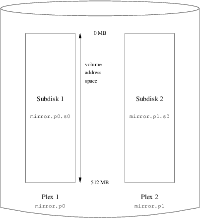
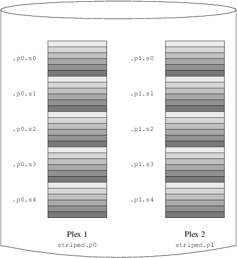

==============
20.6. Ejemplos
==============

.. raw:: html

   

20.6. Ejemplos
`Anterior <vinum-objects.html>`__?
Cap?tulo 20. El Gestor de Vol?menes Vinum
?\ `Siguiente <vinum-object-naming.html>`__

--------------

.. raw:: html

   

.. raw:: html

   

.. raw:: html

   

.. raw:: html

   

.. raw:: html

   

20.6. Ejemplos
--------------

.. raw:: html

   

.. raw:: html

   

.. raw:: html

   

.. raw:: html

   

.. raw:: html

   

.. raw:: html

   

.. raw:: html

   

20.6.1. El Fichero de Configuraci?n
~~~~~~~~~~~~~~~~~~~~~~~~~~~~~~~~~~~

.. raw:: html

   

.. raw:: html

   

.. raw:: html

   

.. raw:: html

   

.. raw:: html

   

Figura 20.4. Un Volumen Vinum Sencillo

.. raw:: html

   

.. raw:: html

   

.. raw:: html

   

|Un Volumen Vinum Sencillo|

.. raw:: html

   

.. raw:: html

   

.. raw:: html

   

| 

.. raw:: html

   

.. raw:: html

   

.. raw:: html

   

.. raw:: html

   

.. raw:: html

   

20.6.2. Increased Resilience: Mirroring
~~~~~~~~~~~~~~~~~~~~~~~~~~~~~~~~~~~~~~~

.. raw:: html

   

.. raw:: html

   

.. raw:: html

   

.. raw:: html

   

.. raw:: html

   

Figura 20.5. Un Volumen Vinum Replicado

.. raw:: html

   

.. raw:: html

   

.. raw:: html

   

|Un Volumen Vinum Replicado|

.. raw:: html

   

.. raw:: html

   

.. raw:: html

   

| 

.. raw:: html

   

.. raw:: html

   

.. raw:: html

   

.. raw:: html

   

.. raw:: html

   

20.6.3. Optimizaci?n del Rendimiento
~~~~~~~~~~~~~~~~~~~~~~~~~~~~~~~~~~~~

.. raw:: html

   

.. raw:: html

   

.. raw:: html

   

.. raw:: html

   

.. raw:: html

   

Figura 20.6. Un Volumen Vinum en “Striping”

.. raw:: html

   

.. raw:: html

   

.. raw:: html

   

|Un Volumen Vinum en “Striping”|

.. raw:: html

   

.. raw:: html

   

.. raw:: html

   

| 

.. raw:: html

   

.. raw:: html

   

.. raw:: html

   

.. raw:: html

   

.. raw:: html

   

20.6.4. Resilience and Performance
~~~~~~~~~~~~~~~~~~~~~~~~~~~~~~~~~~

.. raw:: html

   

.. raw:: html

   

.. raw:: html

   

.. raw:: html

   

.. raw:: html

   

Figura 20.7. Un Volumen Vinum Replicado y en “Striping”

.. raw:: html

   

.. raw:: html

   

.. raw:: html

   

|Un Volumen Vinum Replicado y en “Striping”|

.. raw:: html

   

.. raw:: html

   

.. raw:: html

   

| 

.. raw:: html

   

.. raw:: html

   

.. raw:: html

   

--------------

+--------------------------------------+--------------------------------+-----------------------------------------------+
| `Anterior <vinum-objects.html>`__?   | `Subir <vinum-vinum.html>`__   | ?\ `Siguiente <vinum-object-naming.html>`__   |
+--------------------------------------+--------------------------------+-----------------------------------------------+
| 20.5. Objetos Vinum?                 | `Inicio <index.html>`__        | ?20.7. Esquema de Nombres de los Objetos      |
+--------------------------------------+--------------------------------+-----------------------------------------------+

.. raw:: html

   

Puede descargar ?ste y muchos otros documentos desde
ftp://ftp.FreeBSD.org/pub/FreeBSD/doc/

| Si tiene dudas sobre FreeBSD consulte la
  `documentaci?n <http://www.FreeBSD.org/docs.html>`__ antes de escribir
  a la lista <questions@FreeBSD.org\ >.
|  Env?e sus preguntas sobre la documentaci?n a <doc@FreeBSD.org\ >.

.. |Un Volumen Vinum Sencillo| image:: vinum/vinum-simple-vol.png

.. |Un Volumen Vinum en “Striping”| image:: vinum/vinum-striped-vol.png

