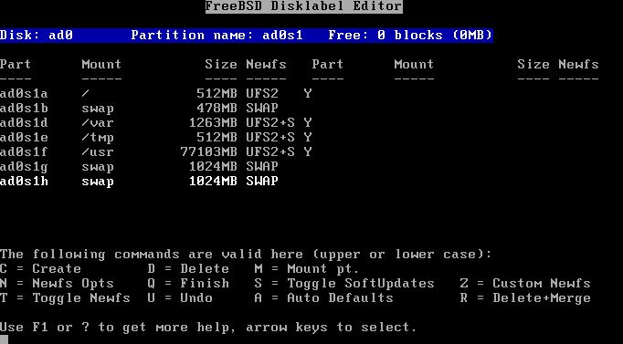

===========================================
3.?Steps During the Installation of FreeBSD
===========================================

.. raw:: html

   

3.?Steps During the Installation of FreeBSD
`Prev <understanding-journaling.html>`__?
?
?\ `Next <configure-journal.html>`__

--------------

.. raw:: html

   

.. raw:: html

   

.. raw:: html

   

.. raw:: html

   

.. raw:: html

   

3.?Steps During the Installation of FreeBSD
-------------------------------------------

.. raw:: html

   

.. raw:: html

   

.. raw:: html

   

.. raw:: html

   

.. raw:: html

   

.. raw:: html

   

.. raw:: html

   

3.1.?Reserving Space for Journaling
~~~~~~~~~~~~~~~~~~~~~~~~~~~~~~~~~~~

.. raw:: html

   

.. raw:: html

   

.. raw:: html

   

A typical desktop machine usually has one hard disk that stores both the
OS and user data. Arguably, the default partitioning scheme selected by
sysinstall is more or less suitable: A desktop machine does not need a
large ``/var`` partition, while ``/usr`` is allocated the bulk of the
disk space, since user data and a lot of packages are installed into its
subdirectories.

The default partitioning (the one obtained by pressing **A** at the
FreeBSD partition editor, called Disklabel) does not leave any
unallocated space. Each partition that will be journaled, requires
another partition for the journal. Since the ``/usr`` partition is the
largest, it makes sense to shrink this partition slightly, to obtain the
space required for journaling.

In our example, an 80?GB disk is used. The following screenshot shows
the default partitions created by Disklabel during installation:

.. raw:: html

   

|image0|

.. raw:: html

   

If this is more or less what you need, it is very easy to adjust for
journaling. Simply use the arrow keys to move the highlight to the
``/usr`` partition and press **D** to delete it.

Now, move the highlight to the disk name at the top of the screen and
press **C** to create a new partition for ``/usr``. This new partition
should be smaller by 1?GB (if you intend to journal ``/usr`` only), or
2?GB (if you intend to journal both ``/usr`` and ``/var``). From the
pop-up that appears, opt to create a file system, and type ``/usr`` as
the mount point.

.. raw:: html

   

Note:
~~~~~

Should you journal the ``/var`` partition? Normally, journaling makes
sense on quite large partitions. You may decide not to journal ``/var``,
although doing so on a typical desktop will cause no harm. If the file
system is lightly used (quite probable for a desktop) you may wish to
allocate less disk space for its journal.

In our example, we journal both ``/usr`` and ``/var``. You may of course
adjust the procedure to your own needs.

.. raw:: html

   

To keep things as easy going as possible, we are going to use sysinstall
to create the partitions required for journaling. However, during
installation, sysinstall insists on asking a mount point for each
partition you create. At this point, you do not have any mount points
for the partitions that will hold the journals, and in reality you *do
not even need them*. These are not partitions that we are ever going to
mount somewhere.

To avoid these problems with sysinstall, we are going to create the
journal partitions as swap space. Swap is never mounted, and sysinstall
has no problem creating as many swap partitions as needed. After the
first reboot, ``/etc/fstab`` will have to be edited, and the extra swap
space entries removed.

To create the swap, again use the arrow keys to move the highlight to
the top of Disklabel screen, so that the disk name itself is
highlighted. Then press **N**, enter the desired size (*``1024M``*), and
select “swap space” from the pop-up menu that appears. Repeat for every
journal you wish to create. In our example, we create two partitions to
provide for the journals of ``/usr`` and ``/var``. The final result is
shown in the following screenshot:

.. raw:: html

   

|image1|

.. raw:: html

   

When you have completed creating the partitions, we suggest you write
down the partition names, and mount points, so you can easily refer to
this information during the configuration phase. This will help
alleviate mistakes that may damage your installation. The following
table shows our notes for the sample configuration:

.. raw:: html

   

.. raw:: html

   

Table?1.?Partitions and Journals

.. raw:: html

   

.. raw:: html

   

+-------------+---------------+-----------+
| Partition   | Mount Point   | Journal   |
+=============+===============+===========+
| ad0s1d      | /var          | ad0s1h    |
+-------------+---------------+-----------+
| ad0s1f      | /usr          | ad0s1g    |
+-------------+---------------+-----------+

.. raw:: html

   

.. raw:: html

   

Continue the installation as you would normally do. We would however
suggest you postpone installation of third party software (packages)
until you have completely setup journaling.

.. raw:: html

   

.. raw:: html

   

.. raw:: html

   

.. raw:: html

   

.. raw:: html

   

3.2.?Booting for the first time
~~~~~~~~~~~~~~~~~~~~~~~~~~~~~~~

.. raw:: html

   

.. raw:: html

   

.. raw:: html

   

Your system will come up normally, but you will need to edit
``/etc/fstab`` and remove the extra swap partitions you created for the
journals. Normally, the swap partition you will actually use is the one
with the “b” suffix (i.e. ad0s1b in our example). Remove all other swap
space entries and reboot so that FreeBSD will stop using them.

When the system comes up again, we will be ready to configure
journaling.

.. raw:: html

   

.. raw:: html

   

.. raw:: html

   

--------------

+---------------------------------------------+-------------------------+----------------------------------------+
| `Prev <understanding-journaling.html>`__?   | ?                       | ?\ `Next <configure-journal.html>`__   |
+---------------------------------------------+-------------------------+----------------------------------------+
| 2.?Understanding Journaling in FreeBSD?     | `Home <index.html>`__   | ?4.?Setting Up Journaling              |
+---------------------------------------------+-------------------------+----------------------------------------+

.. raw:: html

   

All FreeBSD documents are available for download at
http://ftp.FreeBSD.org/pub/FreeBSD/doc/

| Questions that are not answered by the
  `documentation <http://www.FreeBSD.org/docs.html>`__ may be sent to
  <freebsd-questions@FreeBSD.org\ >.
|  Send questions about this document to <freebsd-doc@FreeBSD.org\ >.

.. |image0| image:: disklabel1.png

