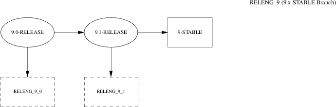

==================
2.?Release Process
==================

.. raw:: html

   

2.?Release Process
`Prev <index.html>`__?
?
?\ `Next <release-build.html>`__

--------------

.. raw:: html

   

.. raw:: html

   

.. raw:: html

   

.. raw:: html

   

.. raw:: html

   

2.?Release Process
------------------

.. raw:: html

   

.. raw:: html

   

.. raw:: html

   

New releases of FreeBSD are released from the -STABLE branch at
approximately four month intervals. The FreeBSD release process begins
to ramp up 70-80 days before the anticipated release date when the
release engineer sends an email to the development mailing lists to
remind developers that they only have 15 days to integrate new changes
before the code freeze. During this time, many developers perform what
have become known as “MFC sweeps”.

MFC stands for “Merge From CURRENT” and it describes the process of
merging a tested change from our -CURRENT development branch to our
-STABLE branch. Project policy requires any change to be first applied
to trunk, and merged to the -STABLE branches after sufficient external
testing was done by -CURRENT users (developers are expected to
extensively test the change before committing to -CURRENT, but it is
impossible for a person to exercise all usages of the general-purpose
operating system). Minimal MFC period is 3 days, which is typically used
only for trivial or critical bugfixes.

.. raw:: html

   

.. raw:: html

   

.. raw:: html

   

.. raw:: html

   

2.1.?Code Review
~~~~~~~~~~~~~~~~

.. raw:: html

   

.. raw:: html

   

.. raw:: html

   

Sixty days before the anticipated release, the source repository enters
a “code freeze”. During this time, all commits to the -STABLE branch
must be approved by Release Engineering Team ``<re@FreeBSD.org>``. The
approval process is technically enforced by a pre-commit hook. The kinds
of changes that are allowed during this period include:

.. raw:: html

   

-  Bug fixes.

-  Documentation updates.

-  Security-related fixes of any kind.

-  Minor changes to device drivers, such as adding new Device IDs.

-  Driver updates from the vendors.

-  Any additional change that the release engineering team feels is
   justified, given the potential risk.

.. raw:: html

   

Shortly after the code freeze is started, a *BETA1* image is built and
released for widespread testing. During the code freeze, at least one
beta image or release candidate is released every two weeks until the
final release is ready. During the days preceeding the final release,
the release engineering team is in constant communication with the
security-officer team, the documentation maintainers, and the port
maintainers to ensure that all of the different components required for
a successful release are available.

After the quality of the BETA images is satisfying enough, and no large
and potentially risky changes are planned, the release branch is created
and *Release Candidate* (RC) images are built from the release branch,
instead of the BETA images from the STABLE branch. Also, the freeze on
the STABLE branch is lifted and release branch enters a “hard code
freeze” where it becomes much harder to justify new changes to the
system unless a serious bug-fix or security issue is involved.

.. raw:: html

   

.. raw:: html

   

.. raw:: html

   

.. raw:: html

   

.. raw:: html

   

2.2.?Final Release Checklist
~~~~~~~~~~~~~~~~~~~~~~~~~~~~

.. raw:: html

   

.. raw:: html

   

.. raw:: html

   

When several BETA images have been made available for widespread testing
and all major issues have been resolved, the final release “polishing”
can begin.

.. raw:: html

   

.. raw:: html

   

.. raw:: html

   

.. raw:: html

   

2.2.1.?Creating the Release Branch
^^^^^^^^^^^^^^^^^^^^^^^^^^^^^^^^^^

.. raw:: html

   

.. raw:: html

   

.. raw:: html

   

.. raw:: html

   

Note:
~~~~~

In all examples below, ``$FSVN`` refers to the location of the FreeBSD
Subversion repository, ``svn+ssh://svn.FreeBSD.org/base/``.

.. raw:: html

   

The layout of FreeBSD branches in Subversion is described in the
`Committer's
Guide <../../../../doc/en_US.ISO8859-1/articles/committers-guide/subversion-primer.html#subversion-primer-base-layout>`__.
The first step in creating a branch is to identify the revision of the
``stable/X`` sources that you want to branch *from*.

.. code:: screen

    # svn log -v $FSVN/stable/9

The next step is to create the *release branch*

.. code:: screen

    # svn cp $FSVN/stable/9@REVISION $FSVN/releng/9.2

This branch can be checked out:

.. code:: screen

    # svn co $FSVN/releng/9.2 src

.. raw:: html

   

Note:
~~~~~

Creating the ``releng`` branch and ``release`` tags is done by the
`Release Engineering Team <../../../../administration.html#t-re>`__.

.. raw:: html

   

.. raw:: html

   

|FreeBSD Development Branch|

.. raw:: html

   

.. raw:: html

   

|FreeBSD?3.x STABLE Branch|

.. raw:: html

   

.. raw:: html

   

|FreeBSD?4.x STABLE Branch|

.. raw:: html

   

.. raw:: html

   

|FreeBSD?5.x STABLE Branch|

.. raw:: html

   

.. raw:: html

   

|FreeBSD?6.x STABLE Branch|

.. raw:: html

   

.. raw:: html

   

|FreeBSD?7.x STABLE Branch|

.. raw:: html

   

.. raw:: html

   

|FreeBSD?8.x STABLE Branch|

.. raw:: html

   

.. raw:: html

   

|FreeBSD?9.x STABLE Branch|

.. raw:: html

   

.. raw:: html

   

.. raw:: html

   

.. raw:: html

   

.. raw:: html

   

.. raw:: html

   

2.2.2.?Bumping up the Version Number
^^^^^^^^^^^^^^^^^^^^^^^^^^^^^^^^^^^^

.. raw:: html

   

.. raw:: html

   

.. raw:: html

   

Before the final release can be tagged, built, and released, the
following files need to be modified to reflect the correct version of
FreeBSD:

.. raw:: html

   

-  ``doc/en_US.ISO8859-1/books/handbook/mirrors/chapter.xml           ``

-  ``doc/en_US.ISO8859-1/books/porters-handbook/book.xml           ``

-  ``doc/en_US.ISO8859-1/htdocs/cgi/ports.cgi``

-  ``ports/Tools/scripts/release/config``

-  ``doc/share/xml/freebsd.ent``

-  ``src/Makefile.inc1``

-  ``src/UPDATING``

-  ``src/gnu/usr.bin/groff/tmac/mdoc.local``

-  ``src/release/Makefile``

-  ``src/release/doc/en_US.ISO8859-1/share/xml/release.dsl``

-  ``src/release/doc/share/examples/Makefile.relnotesng``

-  ``src/release/doc/share/xml/release.ent``

-  ``src/sys/conf/newvers.sh``

-  ``src/sys/sys/param.h``

-  ``src/usr.sbin/pkg_install/add/main.c``

-  ``doc/en_US.ISO8859-1/htdocs/search/opensearch/man.xml``

.. raw:: html

   

The release notes and errata files also need to be adjusted for the new
release (on the release branch) and truncated appropriately (on the
stable/current branch):

.. raw:: html

   

-  ``src/release/doc/en_US.ISO8859-1/relnotes/common/new.xml           ``

-  ``src/release/doc/en_US.ISO8859-1/errata/article.xml           ``

.. raw:: html

   

Sysinstall should be updated to note the number of available ports and
the amount of disk space required for the Ports Collection.
`:sup:`[5]` <#ftn.idp63972176>`__ This information is currently kept in
``src/usr.sbin/sysinstall/dist.c``.

After the release has been built, a number of files should be updated to
announce the release to the world. These files are relative to ``head/``
within the ``doc/`` subversion tree.

.. raw:: html

   

-  ``share/images/articles/releng/branches-relengX``.pic

-  ``head/share/xml/release.ent``

-  ``en_US.ISO8859-1/htdocs/releases/*``

-  ``en_US.ISO8859-1/htdocs/releng/index.xml``

-  ``share/xml/news.xml``

.. raw:: html

   

Additionally, update the “BSD Family Tree” file:

.. raw:: html

   

-  ``src/share/misc/bsd-family-tree``

.. raw:: html

   

.. raw:: html

   

.. raw:: html

   

.. raw:: html

   

.. raw:: html

   

.. raw:: html

   

2.2.3.?Creating the Release Tag
^^^^^^^^^^^^^^^^^^^^^^^^^^^^^^^

.. raw:: html

   

.. raw:: html

   

.. raw:: html

   

When the final release is ready, the following command will create the
``release/9.2.0`` tag.

.. code:: screen

    # svn cp $FSVN/releng/9.2 $FSVN/release/9.2.0

The Documentation and Ports managers are responsible for tagging their
respective trees with the ``tags/RELEASE_9_2_0`` tag.

.. raw:: html

   

.. raw:: html

   

.. raw:: html

   

When the Subversion ``svn cp`` command is used to create a *release
tag*, this identifies the source at a specific point in time. By
creating tags, we ensure that future release builders will always be
able to use the exact same source we used to create the official FreeBSD
Project releases.

.. raw:: html

   

.. raw:: html

   

.. raw:: html

   

.. raw:: html

   

--------------

.. raw:: html

   

`:sup:`[5]` <#idp63972176>`__ FreeBSD Ports Collection
``http://www.FreeBSD.org/ports``

.. raw:: html

   

.. raw:: html

   

.. raw:: html

   

.. raw:: html

   

--------------

+--------------------------------+-------------------------+------------------------------------+
| `Prev <index.html>`__?         | ?                       | ?\ `Next <release-build.html>`__   |
+--------------------------------+-------------------------+------------------------------------+
| FreeBSD Release Engineering?   | `Home <index.html>`__   | ?3.?Release Building               |
+--------------------------------+-------------------------+------------------------------------+

.. raw:: html

   

All FreeBSD documents are available for download at
http://ftp.FreeBSD.org/pub/FreeBSD/doc/

| Questions that are not answered by the
  `documentation <http://www.FreeBSD.org/docs.html>`__ may be sent to
  <freebsd-questions@FreeBSD.org\ >.
|  Send questions about this document to <freebsd-doc@FreeBSD.org\ >.

.. |FreeBSD Development Branch| image:: branches-head.png
.. |FreeBSD?3.x STABLE Branch| image:: branches-releng3.png
.. |FreeBSD?4.x STABLE Branch| image:: branches-releng4.png
.. |FreeBSD?5.x STABLE Branch| image:: branches-releng5.png
.. |FreeBSD?6.x STABLE Branch| image:: branches-releng6.png
.. |FreeBSD?7.x STABLE Branch| image:: branches-releng7.png
.. |FreeBSD?8.x STABLE Branch| image:: branches-releng8.png

