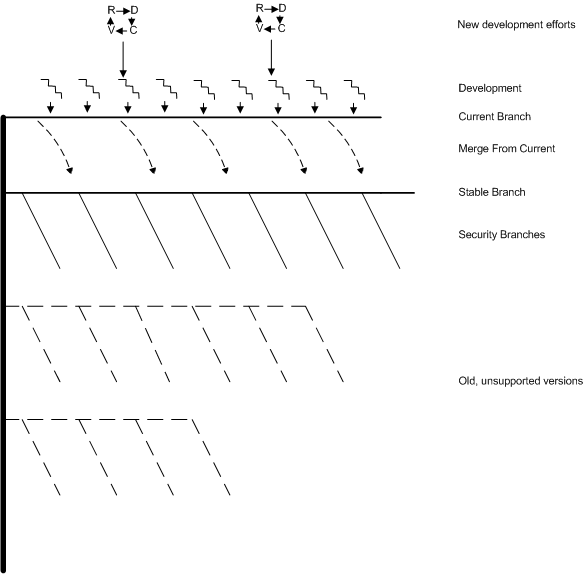
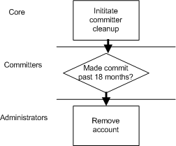
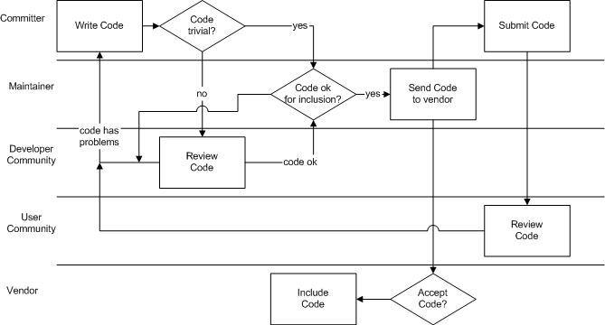
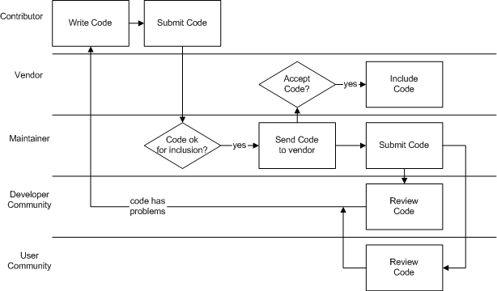
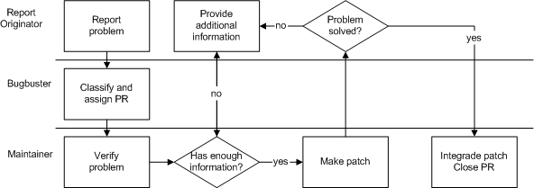
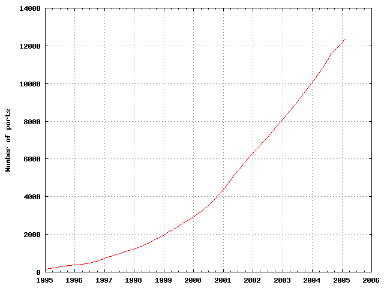

=======================================
A project model for the FreeBSD Project
=======================================

.. raw:: html

   

.. raw:: html

   

.. raw:: html

   

.. raw:: html

   

.. raw:: html

   

.. raw:: html

   

.. raw:: html

   

Niklas Saers
~~~~~~~~~~~~

.. raw:: html

   

.. raw:: html

   

.. raw:: html

   

Revision: ` <https://svnweb.freebsd.org/changeset/doc/>`__

.. raw:: html

   

.. raw:: html

   

Copyright ? 2002-2005 Niklas Saers

.. raw:: html

   

.. raw:: html

   

.. raw:: html

   

**Revision History**
Revision 1.5
October, 2014
Remove mention of GNATS which is no longer used by the project.
Revision 1.4
September, 2013
Remove mention of CVS and CVSup which are no longer used by the project.
Revision 1.3
October, 2012
Remove hats held by specific people, these are documented elsewhere.
Revision 1.2
April, 2005
Update one year of changes, replace statistics with those of 2004
Revision 1.1
July, 2004
First update within the FreeBSD tree
Revision 1.0
December 4th, 2003
Ready for commit to FreeBSD Documentation
Revision 0.7
April 7th, 2003
Release for review by the Documentation team
Revision 0.6
March 1st, 2003
Incorporated corrections noted by interviewees and reviewers
Revision 0.5
February 1st, 2003
Initial review by interviewees

.. raw:: html

   

.. raw:: html

   

.. raw:: html

   

.. raw:: html

   

[ `Split HTML <index.html>`__ / Single HTML ]

.. raw:: html

   

--------------

.. raw:: html

   

.. raw:: html

   

.. raw:: html

   

Table of Contents

.. raw:: html

   

`Foreword <#foreword>`__
`1. Overview <#overview>`__
`2. Definitions <#definitions>`__
`2.1. Activity <#ref-activity>`__
`2.2. Process <#def-process>`__
`2.3. Hat <#ref-hat>`__
`2.4. Outcome <#ref-outcome>`__
`2.5. FreeBSD <#ref-freebsd>`__
`3. Organisational structure <#model-orgstruct>`__
`4. Methodology model <#methodology-model>`__
`4.1. Development model <#development-model>`__
`4.2. Release branches <#release-branches>`__
`4.3. Model summary <#model-summary>`__
`5. Hats <#sect-hats>`__
`5.1. General Hats <#general-hats>`__
`5.2. Official Hats <#official-hats>`__
`5.3. Process dependent hats <#proc-depend-hats>`__
`6. Processes <#model-processes>`__
`6.1. Adding new and removing old committers <#proc-addrem-committer>`__
`6.2. Committing code <#committing>`__
`6.3. Core election <#process-core-election>`__
`6.4. Development of new features <#new-features>`__
`6.5. Maintenance <#model-maintenance>`__
`6.6. Problem reporting <#model-pr>`__
`6.7. Reacting to misbehaviour <#process-reactions>`__
`6.8. Release engineering <#process-release-engineering>`__
`7. Tools <#tools>`__
`7.1. Subversion (SVN) <#tool-svn>`__
`7.2. Bugzilla <#tool-bugzilla>`__
`7.3. Mailman <#model-mailman>`__
`7.4. Perforce <#tool-perforce>`__
`7.5. Pretty Good Privacy <#tool-pgp>`__
`7.6. Secure Shell <#tool-ssh2>`__
`8. Sub-projects <#sub-projects>`__
`8.1. The Ports Subproject <#sub-project-ports>`__
`8.2. The FreeBSD Documentation Project <#sub-project-documentation>`__
`References <#bibliography>`__

.. raw:: html

   

.. raw:: html

   

.. raw:: html

   

List of Figures

.. raw:: html

   

3.1. `The FreeBSD Project's structure <#idp61971152>`__
3.2. `The FreeBSD Project's structure with committers in
categories <#idp61989584>`__
4.1. `J?rgenssen's model for change integration <#idp62014544>`__
4.2. `The FreeBSD release tree <#idp62068304>`__
4.3. `The overall development model <#idp62089424>`__
5.1. `Overview of official hats <#idp62159056>`__
6.1. `Process summary: adding a new committer <#idp62348112>`__
6.2. `Process summary: removing a committer <#idp62364880>`__
6.3. `Process summary: A committer commits code <#idp62417104>`__
6.4. `Process summary: A contributor commits code <#idp62421456>`__
6.5. `Process summary: Core elections <#idp62468688>`__
6.6. `J?rgenssen's model for change integration <#idp62533456>`__
6.7. `Process summary: problem reporting <#idp62556240>`__
6.8. `Process summary: release engineering <#idp62650832>`__
8.1. `Number of ports added between 1996 and 2005 <#fig-ports>`__

.. raw:: html

   

.. raw:: html

   

.. raw:: html

   

.. raw:: html

   

.. raw:: html

   

.. raw:: html

   

.. raw:: html

   

.. raw:: html

   

Up until now, the FreeBSD project has released a number of described
techniques to do different parts of work. However, a project model
summarising how the project is structured is needed because of the
increasing amount of project members. `:sup:`[1]` <#ftn.idp61853136>`__
This paper will provide such a project model and is donated to the
FreeBSD Documentation project where it can evolve together with the
project so that it can at any point in time reflect the way the project
works. It is based on [`Saers, 2003 <#thesis>`__].

I would like to thank the following people for taking the time to
explain things that were unclear to me and for proofreading the
document.

.. raw:: html

   

-  Andrey A. Chernov ``<ache@freebsd.org>``

-  Bruce A. Mah ``<bmah@freebsd.org>``

-  Dag-Erling Sm?rgrav ``<des@freebsd.org>``

-  Giorgos Keramidas\ ``<keramida@freebsd.org>``

-  Ingvil Hovig ``<ingvil.hovig@skatteetaten.no>``

-  Jesper Holck\ ``<jeh.inf@cbs.dk>``

-  John Baldwin ``<jhb@freebsd.org>``

-  John Polstra ``<jdp@freebsd.org>``

-  Kirk McKusick ``<mckusick@freebsd.org>``

-  Mark Linimon ``<linimon@freebsd.org>``

-  Marleen Devos

-  Niels J?rgenssen\ ``<nielsj@ruc.dk>``

-  Nik Clayton ``<nik@freebsd.org>``

-  Poul-Henning Kamp ``<phk@freebsd.org>``

-  Simon L. Nielsen ``<simon@freebsd.org>``

.. raw:: html

   

.. raw:: html

   

--------------

.. raw:: html

   

`:sup:`[1]` <#idp61853136>`__ This goes hand-in-hand with Brooks' law
that “adding another person to a late project will make it later” since
it will increase the communication needs `Brooks, 1995 <#brooks>`__. A
project model is a tool to reduce the communication needs.

.. raw:: html

   

.. raw:: html

   

.. raw:: html

   

.. raw:: html

   

.. raw:: html

   

.. raw:: html

   

.. raw:: html

   

.. raw:: html

   

.. raw:: html

   

.. raw:: html

   

A project model is a means to reduce the communications overhead in a
project. As shown by [`Brooks, 1995 <#brooks>`__], increasing the number
of project participants increases the communication in the project
exponentionally. FreeBSD has during the past few years increased both
its mass of active users and committers, and the communication in the
project has risen accordingly. This project model will serve to reduce
this overhead by providing an up-to-date description of the project.

During the Core elections in 2002, Mark Murray stated “I am opposed to a
long rule-book, as that satisfies lawyer-tendencies, and is counter to
the technocentricity that the project so badly needs.” [`FreeBSD,
2002B <#bsd-election2002>`__]. This project model is not meant to be a
tool to justify creating impositions for developers, but as a tool to
facilitate coordination. It is meant as a description of the project,
with an overview of how the different processes are executed. It is an
introduction to how the FreeBSD project works.

The FreeBSD project model will be described as of July 1st, 2004. It is
based on the Niels J?rgensen's paper [`J?rgensen,
2001 <#jorgensen2001>`__], FreeBSD's official documents, discussions on
FreeBSD mailing lists and interviews with developers.

After providing definitions of terms used, this document will outline
the organisational structure (including role descriptions and
communication lines), discuss the methodology model and after presenting
the tools used for process control, it will present the defined
processes. Finally it will outline major sub-projects of the FreeBSD
project.

[`FreeBSD, 2002A <#freebsd-developer-handbook>`__, Section 1.2 and 1.3]
give the vision and the architectural guidelines for the project. The
vision is “To produce the best UNIX-like operating system package
possible, with due respect to the original software tools ideology as
well as usability, performance and stability.” The architectural
guidelines help determine whether a problem that someone wants to be
solved is within the scope of the project

.. raw:: html

   

.. raw:: html

   

.. raw:: html

   

.. raw:: html

   

.. raw:: html

   

.. raw:: html

   

.. raw:: html

   

.. raw:: html

   

.. raw:: html

   

.. raw:: html

   

Table of Contents

.. raw:: html

   

`2.1. Activity <#ref-activity>`__
`2.2. Process <#def-process>`__
`2.3. Hat <#ref-hat>`__
`2.4. Outcome <#ref-outcome>`__
`2.5. FreeBSD <#ref-freebsd>`__

.. raw:: html

   

.. raw:: html

   

.. raw:: html

   

.. raw:: html

   

.. raw:: html

   

2.1.?Activity
-------------

.. raw:: html

   

.. raw:: html

   

.. raw:: html

   

An “activity” is an element of work performed during the course of a
project [`PMI, 2000 <#ref-pmbok>`__]. It has an output and leads towards
an outcome. Such an output can either be an input to another activity or
a part of the process' delivery.

.. raw:: html

   

.. raw:: html

   

.. raw:: html

   

.. raw:: html

   

.. raw:: html

   

2.2.?Process
------------

.. raw:: html

   

.. raw:: html

   

.. raw:: html

   

A “process” is a series of activities that lead towards a particular
outcome. A process can consist of one or more sub-processes. An example
of a process is software design.

.. raw:: html

   

.. raw:: html

   

.. raw:: html

   

.. raw:: html

   

.. raw:: html

   

2.3.?Hat
--------

.. raw:: html

   

.. raw:: html

   

.. raw:: html

   

A “hat” is synonymous with role. A hat has certain responsibilities in a
process and for the process outcome. The hat executes activities. It is
well defined what issues the hat should be contacted about by the
project members and people outside the project.

.. raw:: html

   

.. raw:: html

   

.. raw:: html

   

.. raw:: html

   

.. raw:: html

   

2.4.?Outcome
------------

.. raw:: html

   

.. raw:: html

   

.. raw:: html

   

An “outcome” is the final output of the process. This is synonymous with
deliverable, that is defined as “any measurable, tangible, verifiable
outcome, result or item that must be produced to complete a project or
part of a project. Often used more narrowly in reference to an external
deliverable, which is a deliverable that is subject to approval by the
project sponsor or customer” by [`PMI, 2000 <#ref-pmbok>`__]. Examples
of outcomes are a piece of software, a decision made or a report
written.

.. raw:: html

   

.. raw:: html

   

.. raw:: html

   

.. raw:: html

   

.. raw:: html

   

2.5.?FreeBSD
------------

.. raw:: html

   

.. raw:: html

   

.. raw:: html

   

When saying “FreeBSD” we will mean the BSD derivative UNIX-like
operating system FreeBSD, whereas when saying “the FreeBSD Project” we
will mean the project organisation.

.. raw:: html

   

.. raw:: html

   

.. raw:: html

   

.. raw:: html

   

.. raw:: html

   

.. raw:: html

   

.. raw:: html

   

.. raw:: html

   

.. raw:: html

   

While no-one takes ownership of FreeBSD, the FreeBSD organisation is
divided into core, committers and contributors and is part of the
FreeBSD community that lives around it.

.. raw:: html

   

.. raw:: html

   

Figure?3.1.?The FreeBSD Project's structure

.. raw:: html

   

.. raw:: html

   

.. raw:: html

   

|The FreeBSD Project's structure|

.. raw:: html

   

.. raw:: html

   

.. raw:: html

   

| 

Number of committers has been determined by going through CVS logs from
January 1st, 2004 to December 31st, 2004 and contributors by going
through the list of contributions and problem reports.

The main resource in the FreeBSD community is its developers: the
committers and contributors. It is with their contributions that the
project can move forward. Regular developers are referred to as
contributors. As by January 1st, 2003, there are an estimated 5500
contributors on the project.

Committers are developers with the privilege of being able to commit
changes. These are usually the most active developers who are willing to
spend their time not only integrating their own code but integrating
code submitted by the developers who do not have this privilege. They
are also the developers who elect the core team, and they have access to
closed discussions.

The project can be grouped into four distinct separate parts, and most
developers will focus their involvement in one part of FreeBSD. The four
parts are kernel development, userland development, ports and
documentation. When referring to the base system, both kernel and
userland is meant.

This split changes our triangle to look like this:

.. raw:: html

   

.. raw:: html

   

Figure?3.2.?The FreeBSD Project's structure with committers in
categories

.. raw:: html

   

.. raw:: html

   

.. raw:: html

   

|The FreeBSD Project's structure with committers in categories|

.. raw:: html

   

.. raw:: html

   

.. raw:: html

   

| 

Number of committers per area has been determined by going through CVS
logs from January 1st, 2004 to December 31st, 2004. Note that many
committers work in multiple areas, making the total number higher than
the real number of committers. The total number of committers at that
time was 269.

Committers fall into three groups: committers who are only concerned
with one area of the project (for instance file systems), committers who
are involved only with one sub-project and committers who commit to
different parts of the code, including sub-projects. Because some
committers work on different parts, the total number in the committers
section of the triangle is higher than in the above triangle.

The kernel is the main building block of FreeBSD. While the userland
applications are protected against faults in other userland
applications, the entire system is vulnerable to errors in the kernel.
This, combined with the vast amount of dependencies in the kernel and
that it is not easy to see all the consequences of a kernel change,
demands developers with a relative full understanding of the kernel.
Multiple development efforts in the kernel also requires a closer
coordination than userland applications do.

The core utilities, known as userland, provide the interface that
identifies FreeBSD, both user interface, shared libraries and external
interfaces to connecting clients. Currently, 162 people are involved in
userland development and maintenance, many being maintainers for their
own part of the code. Maintainership will be discussed in the
`Maintainership <#role-maintainer>`__ section.

Documentation is handled by `The FreeBSD Documentation
Project <#sub-project-documentation>`__ and includes all documents
surrounding the FreeBSD project, including the web pages. There were
during 2004 101 people making commits to the FreeBSD Documentation
Project.

Ports is the collection of meta-data that is needed to make software
packages build correctly on FreeBSD. An example of a port is the port
for the web-browser Mozilla. It contains information about where to
fetch the source, what patches to apply and how, and how the package
should be installed on the system. This allows automated tools to fetch,
build and install the package. As of this writing, there are more than
12600 ports available. `:sup:`[2]` <#ftn.idp62005968>`__ , ranging from
web servers to games, programming languages and most of the application
types that are in use on modern computers. Ports will be discussed
further in the section `The Ports Subproject <#sub-project-ports>`__.

.. raw:: html

   

--------------

.. raw:: html

   

`:sup:`[2]` <#idp62005968>`__ Statistics are generated by counting the
number of entries in the file fetched by portsdb by April 1st, 2005.
portsdb is a part of the port sysutils/portupgrade.

.. raw:: html

   

.. raw:: html

   

.. raw:: html

   

.. raw:: html

   

.. raw:: html

   

.. raw:: html

   

.. raw:: html

   

.. raw:: html

   

.. raw:: html

   

.. raw:: html

   

.. raw:: html

   

.. raw:: html

   

Table of Contents

.. raw:: html

   

`4.1. Development model <#development-model>`__
`4.2. Release branches <#release-branches>`__
`4.3. Model summary <#model-summary>`__

.. raw:: html

   

.. raw:: html

   

.. raw:: html

   

.. raw:: html

   

.. raw:: html

   

4.1.?Development model
----------------------

.. raw:: html

   

.. raw:: html

   

.. raw:: html

   

There is no defined model for how people write code in FreeBSD. However,
Niels J?rgenssen has suggested a model of how written code is integrated
into the project.

.. raw:: html

   

.. raw:: html

   

Figure?4.1.?J?rgenssen's model for change integration

.. raw:: html

   

.. raw:: html

   

.. raw:: html

   

|J?rgenssen's model for change integration|

.. raw:: html

   

.. raw:: html

   

.. raw:: html

   

| 

The “development release” is the FreeBSD-CURRENT ("-CURRENT") branch and
the “production release” is the FreeBSD-STABLE branch ("-STABLE")
[`J?rgensen, 2001 <#jorgensen2001>`__].

This is a model for one change, and shows that after coding, developers
seek community review and try integrating it with their own systems.
After integrating the change into the development release, called
FreeBSD-CURRENT, it is tested by many users and developers in the
FreeBSD community. After it has gone through enough testing, it is
merged into the production release, called FreeBSD-STABLE. Unless each
stage is finished successfully, the developer needs to go back and make
modifications in the code and restart the process. To integrate a change
with either -CURRENT or -STABLE is called making a commit.

J?rgensen found that most FreeBSD developers work individually, meaning
that this model is used in parallel by many developers on the different
ongoing development efforts. A developer can also be working on multiple
changes, so that while he is waiting for review or people to test one or
more of his changes, he may be writing another change.

As each commit represents an increment, this is a massively incremental
model. The commits are in fact so frequent that during one year
`:sup:`[3]` <#ftn.idp62034896>`__ , 85427 commits were made, making a
daily average of 233 commits.

Within the “code” bracket in J?rgensen's figure, each programmer has his
own working style and follows his own development models. The bracket
could very well have been called “development” as it includes
requirements gathering and analysis, system and detailed design,
implementation and verification. However, the only output from these
stages is the source code or system documentation.

From a stepwise model's perspective (such as the waterfall model), the
other brackets can be seen as further verification and system
integration. This system integration is also important to see if a
change is accepted by the community. Up until the code is committed, the
developer is free to choose how much to communicate about it to the rest
of the project. In order for -CURRENT to work as a buffer (so that
bright ideas that had some undiscovered drawbacks can be backed out) the
minimum time a commit should be in -CURRENT before merging it to -STABLE
is 3 days. Such a merge is referred to as an MFC (Merge From Current).

It is important to notice the word “change”. Most commits do not contain
radical new features, but are maintenance updates.

The only exceptions from this model are security fixes and changes to
features that are deprecated in the -CURRENT branch. In these cases,
changes can be committed directly to the -STABLE branch.

In addition to many people working on the project, there are many
related projects to the FreeBSD Project. These are either projects
developing brand new features, sub-projects or projects whose outcome is
incorporated into FreeBSD `:sup:`[4]` <#ftn.idp62049360>`__. These
projects fit into the FreeBSD Project just like regular development
efforts: they produce code that is integrated with the FreeBSD Project.
However, some of them (like Ports and Documentation) have the privilege
of being applicable to both branches or commit directly to both -CURRENT
and -STABLE.

There is no standards to how design should be done, nor is design
collected in a centralised repository. The main design is that of
4.4BSD. `:sup:`[5]` <#ftn.idp62052048>`__ As design is a part of the
“Code” bracket in J?rgenssen's model, it is up to every developer or
sub-project how this should be done. Even if the design should be stored
in a central repository, the output from the design stages would be of
limited use as the differences of methodologies would make them poorly
if at all interoperable. For the overall design of the project, the
project relies on the sub-projects to negotiate fit interfaces between
each other rather than to dictate interfacing.

.. raw:: html

   

.. raw:: html

   

.. raw:: html

   

.. raw:: html

   

.. raw:: html

   

4.2.?Release branches
---------------------

.. raw:: html

   

.. raw:: html

   

.. raw:: html

   

The releases of FreeBSD is best illustrated by a tree with many branches
where each major branch represents a major version. Minor versions are
represented by branches of the major branches.

In the following release tree, arrows that follow one-another in a
particular direction represent a branch. Boxes with full lines and
diamonds represent official releases. Boxes with dotted lines represent
the development branch at that time. Security branches are represented
by ovals. Diamonds differ from boxes in that they represent a fork,
meaning a place where a branch splits into two branches where one of the
branches becomes a sub-branch. For example, at 4.0-RELEASE the
4.0-CURRENT branch split into 4-STABLE and 5.0-CURRENT. At 4.5-RELEASE,
the branch forked off a security branch called RELENG\_4\_5.

.. raw:: html

   

.. raw:: html

   

Figure?4.2.?The FreeBSD release tree

.. raw:: html

   

.. raw:: html

   

.. raw:: html

   

|The FreeBSD release tree|

.. raw:: html

   

.. raw:: html

   

.. raw:: html

   

| 

The latest -CURRENT version is always referred to as -CURRENT, while the
latest -STABLE release is always referred to as -STABLE. In this figure,
-STABLE refers to 4-STABLE while -CURRENT refers to 5.0-CURRENT
following 5.0-RELEASE. [`FreeBSD, 2002E <#freebsd-releng>`__]

A “major release” is always made from the -CURRENT branch. However, the
-CURRENT branch does not need to fork at that point in time, but can
focus on stabilising. An example of this is that following 3.0-RELEASE,
3.1-RELEASE was also a continuation of the -CURRENT-branch, and -CURRENT
did not become a true development branch until this version was released
and the 3-STABLE branch was forked. When -CURRENT returns to becoming a
development branch, it can only be followed by a major release. 5-STABLE
is predicted to be forked off 5.0-CURRENT at around 5.3-RELEASE. It is
not until 5-STABLE is forked that the development branch will be branded
6.0-CURRENT.

A “minor release” is made from the -CURRENT branch following a major
release, or from the -STABLE branch.

Following and including, 4.3-RELEASE`:sup:`[6]` <#ftn.idp62078288>`__,
when a minor release has been made, it becomes a “security branch”. This
is meant for organisations that do not want to follow the -STABLE branch
and the potential new/changed features it offers, but instead require an
absolutely stable environment, only updating to implement security
updates. `:sup:`[7]` <#ftn.idp62081488>`__

Each update to a security branch is called a “patchlevel”. For every
security enhancement that is done, the patchlevel number is increased,
making it easy for people tracking the branch to see what security
enhancements they have implemented. In cases where there have been
especially serious security flaws, an entire new release can be made
from a security branch. An example of this is 4.6.2-RELEASE.

.. raw:: html

   

.. raw:: html

   

.. raw:: html

   

.. raw:: html

   

.. raw:: html

   

4.3.?Model summary
------------------

.. raw:: html

   

.. raw:: html

   

.. raw:: html

   

To summarise, the development model of FreeBSD can be seen as the
following tree:

.. raw:: html

   

.. raw:: html

   

Figure?4.3.?The overall development model

.. raw:: html

   

.. raw:: html

   

.. raw:: html

   

|The overall development model|

.. raw:: html

   

.. raw:: html

   

.. raw:: html

   

| 

The tree of the FreeBSD development with ongoing development efforts and
continuous integration.

The tree symbolises the release versions with major versions spawning
new main branches and minor versions being versions of the main branch.
The top branch is the -CURRENT branch where all new development is
integrated, and the -STABLE branch is the branch directly below it.

Clouds of development efforts hang over the project where developers use
the development models they see fit. The product of their work is then
integrated into -CURRENT where it undergoes parallel debugging and is
finally merged from -CURRENT into -STABLE. Security fixes are merged
from -STABLE to the security branches.

.. raw:: html

   

.. raw:: html

   

--------------

.. raw:: html

   

`:sup:`[3]` <#idp62034896>`__ The period from January 1st, 2004 to
December 31st, 2004 was examined to find this number.

.. raw:: html

   

.. raw:: html

   

`:sup:`[4]` <#idp62049360>`__ For instance, the development of the
Bluetooth stack started as a sub-project until it was deemed stable
enough to be merged into the -CURRENT branch. Now it is a part of the
core FreeBSD system.

.. raw:: html

   

.. raw:: html

   

`:sup:`[5]` <#idp62052048>`__ According to Kirk McKusick, after 20 years
of developing UNIX operating systems, the interfaces are for the most
part figured out. There is therefore no need for much design. However,
new applications of the system and new hardware leads to some
implementations being more beneficial than those that used to be
preferred. One example is the introduction of web browsing that made the
normal TCP/IP connection a short burst of data rather than a steady
stream over a longer period of time.

.. raw:: html

   

.. raw:: html

   

`:sup:`[6]` <#idp62078288>`__ The first release this actually happened
for was 4.5-RELEASE, but security branches were at the same time created
for 4.3-RELEASE and 4.4-RELEASE.

.. raw:: html

   

.. raw:: html

   

`:sup:`[7]` <#idp62081488>`__ There is a terminology overlap with
respect to the word "stable", which leads to some confusion. The -STABLE
branch is still a development branch, whose goal is to be useful for
most people. If it is never acceptable for a system to get changes that
are not announced at the time it is deployed, that system should run a
security branch.

.. raw:: html

   

.. raw:: html

   

.. raw:: html

   

.. raw:: html

   

.. raw:: html

   

.. raw:: html

   

.. raw:: html

   

.. raw:: html

   

.. raw:: html

   

.. raw:: html

   

.. raw:: html

   

.. raw:: html

   

Table of Contents

.. raw:: html

   

`5.1. General Hats <#general-hats>`__
`5.2. Official Hats <#official-hats>`__
`5.3. Process dependent hats <#proc-depend-hats>`__

.. raw:: html

   

Many committers have a special area of responsibility. These roles are
called hats. These hats can be either project roles, such as public
relations officer, or maintainer for a certain area of the code. Because
this is a project where people give voluntarily of their spare time,
people with assigned hats are not always available. They must therefore
appoint a deputy that can perform the hat's role in his or her absence.
The other option is to have the role held by a group.

Many of these hats are not formalised. Formalised hats have a charter
stating the exact purpose of the hat along with its privileges and
responsibilities. The writing of such charters is a new part of the
project, and has thus yet to be completed for all hats. These hat
descriptions are not such a formalisation, rather a summary of the role
with links to the charter where available and contact addresses.

.. raw:: html

   

.. raw:: html

   

.. raw:: html

   

.. raw:: html

   

5.1.?General Hats
-----------------

.. raw:: html

   

.. raw:: html

   

.. raw:: html

   

.. raw:: html

   

.. raw:: html

   

.. raw:: html

   

.. raw:: html

   

5.1.1.?Contributor
~~~~~~~~~~~~~~~~~~

.. raw:: html

   

.. raw:: html

   

.. raw:: html

   

A Contributor contributes to the FreeBSD project either as a developer,
as an author, by sending problem reports, or in other ways contributing
to the progress of the project. A contributor has no special privileges
in the FreeBSD project. [`FreeBSD, 2002F <#freebsd-contributors>`__]

.. raw:: html

   

.. raw:: html

   

.. raw:: html

   

.. raw:: html

   

.. raw:: html

   

5.1.2.?Committer
~~~~~~~~~~~~~~~~

.. raw:: html

   

.. raw:: html

   

.. raw:: html

   

A person who has the required privileges to add his code or
documentation to the repository. A committer has made a commit within
the past 12 months. [`FreeBSD, 2000A <#freebsd-bylaws>`__] An active
committer is a committer who has made an average of one commit per month
during that time.

It is worth noting that there are no technical barriers to prevent
someone, once having gained commit privileges to the main- or a
sub-project, to make commits in parts of that project's source the
committer did not specifically get permission to modify. However, when
wanting to make modifications to parts a committer has not been involved
in before, he/she should read the logs to see what has happened in this
area before, and also read the MAINTAINER file to see if the maintainer
of this part has any special requests on how changes in the code should
be made

.. raw:: html

   

.. raw:: html

   

.. raw:: html

   

.. raw:: html

   

.. raw:: html

   

5.1.3.?Core Team
~~~~~~~~~~~~~~~~

.. raw:: html

   

.. raw:: html

   

.. raw:: html

   

The core team is elected by the committers from the pool of committers
and serves as the board of directors of the FreeBSD project. It promotes
active contributors to committers, assigns people to well-defined hats,
and is the final arbiter of decisions involving which way the project
should be heading. As by July 1st, 2004, core consisted of 9 members.
Elections are held every two years.

.. raw:: html

   

.. raw:: html

   

.. raw:: html

   

.. raw:: html

   

.. raw:: html

   

5.1.4.?Maintainership
~~~~~~~~~~~~~~~~~~~~~

.. raw:: html

   

.. raw:: html

   

.. raw:: html

   

Maintainership means that that person is responsible for what is allowed
to go into that area of the code and has the final say should
disagreements over the code occur. This involves proactive work aimed at
stimulating contributions and reactive work in reviewing commits.

With the FreeBSD source comes the MAINTAINERS file that contains a
one-line summary of how each maintainer would like contributions to be
made. Having this notice and contact information enables developers to
focus on the development effort rather than being stuck in a slow
correspondence should the maintainer be unavailable for some time.

If the maintainer is unavailable for an unreasonably long period of
time, and other people do a significant amount of work, maintainership
may be switched without the maintainer's approval. This is based on the
stance that maintainership should be demonstrated, not declared.

Maintainership of a particular piece of code is a hat that is not held
as a group.

.. raw:: html

   

.. raw:: html

   

.. raw:: html

   

.. raw:: html

   

.. raw:: html

   

.. raw:: html

   

5.2.?Official Hats
------------------

.. raw:: html

   

.. raw:: html

   

.. raw:: html

   

The official hats in the FreeBSD Project are hats that are more or less
formalised and mainly administrative roles. They have the authority and
responsibility for their area. The following illustration shows the
responsibility lines. After this follows a description of each hat,
including who it is held by.

.. raw:: html

   

.. raw:: html

   

Figure?5.1.?Overview of official hats

.. raw:: html

   

.. raw:: html

   

.. raw:: html

   

|Overview of official hats|

.. raw:: html

   

.. raw:: html

   

.. raw:: html

   

| 

All boxes consist of groups of committers, except for the dotted boxes
where the holders are not necessarily committers. The flattened circles
are sub-projects and consist of both committers and non-committers of
the main project.

.. raw:: html

   

.. raw:: html

   

.. raw:: html

   

.. raw:: html

   

5.2.1.?Documentation project manager
~~~~~~~~~~~~~~~~~~~~~~~~~~~~~~~~~~~~

.. raw:: html

   

.. raw:: html

   

.. raw:: html

   

`The FreeBSD Documentation Project <#sub-project-documentation>`__
architect is responsible for defining and following up documentation
goals for the committers in the Documentation project.

Hat held by: The DocEng team ``<doceng@FreeBSD.org>``. The `DocEng
Charter <http://www.freebsd.org/internal/doceng.html>`__.

.. raw:: html

   

.. raw:: html

   

.. raw:: html

   

.. raw:: html

   

.. raw:: html

   

5.2.2.?Postmaster
~~~~~~~~~~~~~~~~~

.. raw:: html

   

.. raw:: html

   

.. raw:: html

   

The Postmaster is responsible for mail being correctly delivered to the
committers' email address. He is also responsible for ensuring that the
mailing lists work and should take measures against possible disruptions
of mail such as having troll-, spam- and virus-filters.

Hat currently held by: the Postmaster Team ``<postmaster@FreeBSD.org>``.

.. raw:: html

   

.. raw:: html

   

.. raw:: html

   

.. raw:: html

   

.. raw:: html

   

5.2.3.?Release Coordination
~~~~~~~~~~~~~~~~~~~~~~~~~~~

.. raw:: html

   

.. raw:: html

   

.. raw:: html

   

The responsibilities of the Release Engineering Team are

.. raw:: html

   

-  Setting, publishing and following a release schedule for official
   releases

-  Documenting and formalising release engineering procedures

-  Creation and maintenance of code branches

-  Coordinating with the Ports and Documentation teams to have an
   updated set of packages and documentation released with the new
   releases

-  Coordinating with the Security team so that pending releases are not
   affected by recently disclosed vulnerabilities.

.. raw:: html

   

Further information about the development process is available in the
`release engineering <#process-release-engineering>`__ section.

 Hat held by: the Release Engineering team ``<re@FreeBSD.org>``. The
`Release Engineering
Charter <http://www.freebsd.org/releng/charter.html>`__.

.. raw:: html

   

.. raw:: html

   

.. raw:: html

   

.. raw:: html

   

.. raw:: html

   

5.2.4.?Public Relations & Corporate Liaison
~~~~~~~~~~~~~~~~~~~~~~~~~~~~~~~~~~~~~~~~~~~

.. raw:: html

   

.. raw:: html

   

.. raw:: html

   

The Public Relations & Corporate Liaison's responsibilities are:

.. raw:: html

   

-  Making press statements when happenings that are important to the
   FreeBSD Project happen.

-  Being the official contact person for corporations that are working
   close with the FreeBSD Project.

-  Take steps to promote FreeBSD within both the Open Source community
   and the corporate world.

-  Handle the “freebsd-advocacy” mailing list.

.. raw:: html

   

This hat is currently not occupied.

.. raw:: html

   

.. raw:: html

   

.. raw:: html

   

.. raw:: html

   

.. raw:: html

   

5.2.5.?Security Officer
~~~~~~~~~~~~~~~~~~~~~~~

.. raw:: html

   

.. raw:: html

   

.. raw:: html

   

The Security Officer's main responsibility is to coordinate information
exchange with others in the security community and in the FreeBSD
project. The Security Officer is also responsible for taking action when
security problems are reported and promoting proactive development
behaviour when it comes to security.

Because of the fear that information about vulnerabilities may leak out
to people with malicious intent before a patch is available, only the
Security Officer, consisting of an officer, a deputy and two `Core
team <#role-core>`__ members, receive sensitive information about
security issues. However, to create or implement a patch, the Security
Officer has the Security Officer Team ``<security-team@FreeBSD.org>`` to
help do the work.

.. raw:: html

   

.. raw:: html

   

.. raw:: html

   

.. raw:: html

   

.. raw:: html

   

5.2.6.?Source Repository Manager
~~~~~~~~~~~~~~~~~~~~~~~~~~~~~~~~

.. raw:: html

   

.. raw:: html

   

.. raw:: html

   

The Source Repository Manager is the only one who is allowed to directly
modify the repository without using the `SVN <#tool-svn>`__ tool. It is
his/her responsibility to ensure that technical problems that arise in
the repository are resolved quickly. The source repository manager has
the authority to back out commits if this is necessary to resolve a SVN
technical problem.

Hat held by: the Source Repository Manager ``<clusteradm@FreeBSD.org>``.

.. raw:: html

   

.. raw:: html

   

.. raw:: html

   

.. raw:: html

   

.. raw:: html

   

5.2.7.?Election Manager
~~~~~~~~~~~~~~~~~~~~~~~

.. raw:: html

   

.. raw:: html

   

.. raw:: html

   

The Election Manager is responsible for the `Core
election <#process-core-election>`__ process. The manager is responsible
for running and maintaining the election system, and is the final
authority should minor unforeseen events happen in the election process.
Major unforeseen events have to be discussed with the `Core
team <#role-core>`__

Hat held only during elections.

.. raw:: html

   

.. raw:: html

   

.. raw:: html

   

.. raw:: html

   

.. raw:: html

   

5.2.8.?Web site Management
~~~~~~~~~~~~~~~~~~~~~~~~~~

.. raw:: html

   

.. raw:: html

   

.. raw:: html

   

The Web site Management hat is responsible for coordinating the rollout
of updated web pages on mirrors around the world, for the overall
structure of the primary web site and the system it is running upon. The
management needs to coordinate the content with `The FreeBSD
Documentation Project <#sub-project-documentation>`__ and acts as
maintainer for the “www” tree.

Hat held by: the FreeBSD Webmasters ``<www@FreeBSD.org>``.

.. raw:: html

   

.. raw:: html

   

.. raw:: html

   

.. raw:: html

   

.. raw:: html

   

5.2.9.?Ports Manager
~~~~~~~~~~~~~~~~~~~~

.. raw:: html

   

.. raw:: html

   

.. raw:: html

   

The Ports Manager acts as a liaison between `The Ports
Subproject <#sub-project-ports>`__ and the core project, and all
requests from the project should go to the ports manager.

Hat held by: the Ports Management Team ``<portmgr@FreeBSD.org>``. The
`Portmgr charter <http://www.freebsd.org/portmgr/charter.html>`__.

.. raw:: html

   

.. raw:: html

   

.. raw:: html

   

.. raw:: html

   

.. raw:: html

   

5.2.10.?Standards
~~~~~~~~~~~~~~~~~

.. raw:: html

   

.. raw:: html

   

.. raw:: html

   

The Standards hat is responsible for ensuring that FreeBSD complies with
the standards it is committed to , keeping up to date on the development
of these standards and notifying FreeBSD developers of important changes
that allows them to take a proactive role and decrease the time between
a standards update and FreeBSD's compliancy.

Hat currently held by: Garrett Wollman ``<wollman@FreeBSD.org>``.

.. raw:: html

   

.. raw:: html

   

.. raw:: html

   

.. raw:: html

   

.. raw:: html

   

5.2.11.?Core Secretary
~~~~~~~~~~~~~~~~~~~~~~

.. raw:: html

   

.. raw:: html

   

.. raw:: html

   

The Core Secretary's main responsibility is to write drafts to and
publish the final Core Reports. The secretary also keeps the core
agenda, thus ensuring that no balls are dropped unresolved.

Hat currently held by: Matthew Seaman ``<matthew@FreeBSD.org>``.

.. raw:: html

   

.. raw:: html

   

.. raw:: html

   

.. raw:: html

   

.. raw:: html

   

5.2.12.?Bugmeister
~~~~~~~~~~~~~~~~~~

.. raw:: html

   

.. raw:: html

   

.. raw:: html

   

The Bugmeister is responsible for ensuring that the maintenance database
is in working order, that the entries are correctly categorised and that
there are no invalid entries.

Hat currently held by: the Bugmeister Team ``<bugmeister@FreeBSD.org>``.

.. raw:: html

   

.. raw:: html

   

.. raw:: html

   

.. raw:: html

   

.. raw:: html

   

5.2.13.?Donations Liaison Officer
~~~~~~~~~~~~~~~~~~~~~~~~~~~~~~~~~

.. raw:: html

   

.. raw:: html

   

.. raw:: html

   

The task of the donations liaison officer is to match the developers
with needs with people or organisations willing to make a donation. The
Donations Liaison Charter is available
`here <http://www.freebsd.org/donations/>`__

Hat held by: the Donations Liaison Office ``<donations@FreeBSD.org>``.

.. raw:: html

   

.. raw:: html

   

.. raw:: html

   

.. raw:: html

   

.. raw:: html

   

5.2.14.?Admin
~~~~~~~~~~~~~

.. raw:: html

   

.. raw:: html

   

.. raw:: html

   

(Also called “FreeBSD Cluster Admin”)

The admin team consists of the people responsible for administrating the
computers that the project relies on for its distributed work and
communication to be synchronised. It consists mainly of those people who
have physical access to the servers.

Hat held by: the Admin team ``<admin@FreeBSD.org>``.

.. raw:: html

   

.. raw:: html

   

.. raw:: html

   

.. raw:: html

   

.. raw:: html

   

.. raw:: html

   

5.3.?Process dependent hats
---------------------------

.. raw:: html

   

.. raw:: html

   

.. raw:: html

   

.. raw:: html

   

.. raw:: html

   

.. raw:: html

   

.. raw:: html

   

5.3.1.?Report originator
~~~~~~~~~~~~~~~~~~~~~~~~

.. raw:: html

   

.. raw:: html

   

.. raw:: html

   

The person originally responsible for filing a Problem Report.

.. raw:: html

   

.. raw:: html

   

.. raw:: html

   

.. raw:: html

   

.. raw:: html

   

5.3.2.?Bugbuster
~~~~~~~~~~~~~~~~

.. raw:: html

   

.. raw:: html

   

.. raw:: html

   

A person who will either find the right person to solve the problem, or
close the PR if it is a duplicate or otherwise not an interesting one.

.. raw:: html

   

.. raw:: html

   

.. raw:: html

   

.. raw:: html

   

.. raw:: html

   

5.3.3.?Mentor
~~~~~~~~~~~~~

.. raw:: html

   

.. raw:: html

   

.. raw:: html

   

A mentor is a committer who takes it upon him/her to introduce a new
committer to the project, both in terms of ensuring the new committers
setup is valid, that the new committer knows the available tools
required in his/her work and that the new committer knows what is
expected of him/her in terms of behaviour.

.. raw:: html

   

.. raw:: html

   

.. raw:: html

   

.. raw:: html

   

.. raw:: html

   

5.3.4.?Vendor
~~~~~~~~~~~~~

.. raw:: html

   

.. raw:: html

   

.. raw:: html

   

The person(s) or organisation whom external code comes from and whom
patches are sent to.

.. raw:: html

   

.. raw:: html

   

.. raw:: html

   

.. raw:: html

   

.. raw:: html

   

5.3.5.?Reviewers
~~~~~~~~~~~~~~~~

.. raw:: html

   

.. raw:: html

   

.. raw:: html

   

People on the mailing list where the request for review is posted.

.. raw:: html

   

.. raw:: html

   

.. raw:: html

   

.. raw:: html

   

.. raw:: html

   

.. raw:: html

   

.. raw:: html

   

.. raw:: html

   

.. raw:: html

   

.. raw:: html

   

.. raw:: html

   

.. raw:: html

   

Table of Contents

.. raw:: html

   

`6.1. Adding new and removing old committers <#proc-addrem-committer>`__
`6.2. Committing code <#committing>`__
`6.3. Core election <#process-core-election>`__
`6.4. Development of new features <#new-features>`__
`6.5. Maintenance <#model-maintenance>`__
`6.6. Problem reporting <#model-pr>`__
`6.7. Reacting to misbehaviour <#process-reactions>`__
`6.8. Release engineering <#process-release-engineering>`__

.. raw:: html

   

The following section will describe the defined project processes.
Issues that are not handled by these processes happen on an ad-hoc basis
based on what has been customary to do in similar cases.

.. raw:: html

   

.. raw:: html

   

.. raw:: html

   

.. raw:: html

   

6.1.?Adding new and removing old committers
-------------------------------------------

.. raw:: html

   

.. raw:: html

   

.. raw:: html

   

The Core team has the responsibility of giving and removing commit
privileges to contributors. This can only be done through a vote on the
core mailing list. The ports and documentation sub-projects can give
commit privileges to people working on these projects, but have to date
not removed such privileges.

Normally a contributor is recommended to core by a committer. For
contributors or outsiders to contact core asking to be a committer is
not well thought of and is usually rejected.

If the area of particular interest for the developer potentially
overlaps with other committers' area of maintainership, the opinion of
those maintainers is sought. However, it is frequently this committer
that recommends the developer.

When a contributor is given committer status, he is assigned a mentor.
The committer who recommended the new committer will, in the general
case, take it upon himself to be the new committers mentor.

When a contributor is given his commit bit, a `PGP <#tool-pgp>`__-signed
email is sent from either `Core Secretary <#role-core-secretary>`__,
`Ports Manager <#role-ports-manager>`__ or nik@freebsd.org to both
admins@freebsd.org, the assigned mentor, the new committer and core
confirming the approval of a new account. The mentor then gathers a
password line, `SSH 2 <#tool-ssh2>`__ public key and PGP key from the
new committer and sends them to `Admin <#role-admin>`__. When the new
account is created, the mentor activates the commit bit and guides the
new committer through the rest of the initial process.

.. raw:: html

   

.. raw:: html

   

Figure?6.1.?Process summary: adding a new committer

.. raw:: html

   

.. raw:: html

   

.. raw:: html

   

|Process summary: adding a new committer|

.. raw:: html

   

.. raw:: html

   

.. raw:: html

   

| 

When a contributor sends a piece of code, the receiving committer may
choose to recommend that the contributor is given commit privileges. If
he recommends this to core, they will vote on this recommendation. If
they vote in favour, a mentor is assigned the new committer and the new
committer has to email his details to the administrators for an account
to be created. After this, the new committer is all set to make his
first commit. By tradition, this is by adding his name to the committers
list.

Recall that a committer is considered to be someone who has committed
code during the past 12 months. However, it is not until after 18 months
of inactivity have passed that commit privileges are eligible to be
revoked. [`FreeBSD, 2002H <#freebsd-expiration-policy>`__] There are,
however, no automatic procedures for doing this. For reactions
concerning commit privileges not triggered by time, see `section
1.5.8 <#process-reactions>`__.

.. raw:: html

   

.. raw:: html

   

Figure?6.2.?Process summary: removing a committer

.. raw:: html

   

.. raw:: html

   

.. raw:: html

   

|Process summary: removing a committer|

.. raw:: html

   

.. raw:: html

   

.. raw:: html

   

| 

When Core decides to clean up the committers list, they check who has
not made a commit for the past 18 months. Committers who have not done
so have their commit bits revoked.

It is also possible for committers to request that their commit bit be
retired if for some reason they are no longer going to be actively
committing to the project. In this case, it can also be restored at a
later time by core, should the committer ask.

Roles in this process:

.. raw:: html

   

#. `Core team <#role-core>`__

#. `Contributor <#role-contributor>`__

#. `Committer <#role-committer>`__

#. `Maintainership <#role-maintainer>`__

#. `Mentor <#role-mentor>`__

.. raw:: html

   

[`FreeBSD, 2000A <#freebsd-bylaws>`__] [`FreeBSD,
2002H <#freebsd-expiration-policy>`__] [`FreeBSD,
2002I <#freebsd-new-account>`__]

.. raw:: html

   

.. raw:: html

   

.. raw:: html

   

.. raw:: html

   

.. raw:: html

   

6.2.?Committing code
--------------------

.. raw:: html

   

.. raw:: html

   

.. raw:: html

   

The committing of new or modified code is one of the most frequent
processes in the FreeBSD project and will usually happen many times a
day. Committing of code can only be done by a “committer”. Committers
commit either code written by themselves, code submitted to them or code
submitted through a `problem report <#model-pr>`__.

When code is written by the developer that is non-trivial, he should
seek a code review from the community. This is done by sending mail to
the relevant list asking for review. Before submitting the code for
review, he should ensure it compiles correctly with the entire tree and
that all relevant tests run. This is called “pre-commit test”. When
contributed code is received, it should be reviewed by the committer and
tested the same way.

When a change is committed to a part of the source that has been
contributed from an outside `Vendor <#role-vendor>`__, the maintainer
should ensure that the patch is contributed back to the vendor. This is
in line with the open source philosophy and makes it easier to stay in
sync with outside projects as the patches do not have to be reapplied
every time a new release is made.

After the code has been available for review and no further changes are
necessary, the code is committed into the development branch, -CURRENT.
If the change applies for the -STABLE branch or the other branches as
well, a “Merge From Current” ("MFC") countdown is set by the committer.
After the number of days the committer chose when setting the MFC have
passed, an email will automatically be sent to the committer reminding
him to commit it to the -STABLE branch (and possibly security branches
as well). Only security critical changes should be merged to security
branches.

Delaying the commit to -STABLE and other branches allows for “parallel
debugging” where the committed code is tested on a wide range of
configurations. This makes changes to -STABLE to contain fewer faults
and thus giving the branch its name.

.. raw:: html

   

.. raw:: html

   

Figure?6.3.?Process summary: A committer commits code

.. raw:: html

   

.. raw:: html

   

.. raw:: html

   

|Process summary: A committer commits code|

.. raw:: html

   

.. raw:: html

   

.. raw:: html

   

| 

When a committer has written a piece of code and wants to commit it, he
first needs to determine if it is trivial enough to go in without prior
review or if it should first be reviewed by the developer community. If
the code is trivial or has been reviewed and the committer is not the
maintainer, he should consult the maintainer before proceeding. If the
code is contributed by an outside vendor, the maintainer should create a
patch that is sent back to the vendor. The code is then committed and
the deployed by the users. Should they find problems with the code, this
will be reported and the committer can go back to writing a patch. If a
vendor is affected, he can choose to implement or ignore the patch.

.. raw:: html

   

.. raw:: html

   

Figure?6.4.?Process summary: A contributor commits code

.. raw:: html

   

.. raw:: html

   

.. raw:: html

   

|Process summary: A contributor commits code|

.. raw:: html

   

.. raw:: html

   

.. raw:: html

   

| 

The difference when a contributor makes a code contribution is that he
submits the code through the Bugzilla interface. This report is picked
up by the maintainer who reviews the code and commits it.

Hats included in this process are:

.. raw:: html

   

#. `Committer <#role-committer>`__

#. `Contributor <#role-contributor>`__

#. `Vendor <#role-vendor>`__

#. `Reviewer <#role-reviewer>`__

.. raw:: html

   

[`FreeBSD, 2001 <#freebsd-committer>`__] [`J?rgensen,
2001 <#jorgensen2001>`__]

.. raw:: html

   

.. raw:: html

   

.. raw:: html

   

.. raw:: html

   

.. raw:: html

   

6.3.?Core election
------------------

.. raw:: html

   

.. raw:: html

   

.. raw:: html

   

Core elections are held at least every two years.
`:sup:`[8]` <#ftn.idp62455760>`__ Nine core members are elected. New
elections are held if the number of core members drops below seven. New
elections can also be held should at least 1/3 of the active committers
demand this.

When an election is to take place, core announces this at least 6 weeks
in advance, and appoints an election manager to run the elections.

Only committers can be elected into core. The candidates need to submit
their candidacy at least one week before the election starts, but can
refine their statements until the voting starts. They are presented in
the `candidates
list <http://election.uk.freebsd.org/candidates.html>`__. When writing
their election statements, the candidates must answer a few standard
questions submitted by the election manager.

During elections, the rule that a committer must have committed during
the 12 past months is followed strictly. Only these committers are
eligible to vote.

When voting, the committer may vote once in support of up to nine
nominees. The voting is done over a period of four weeks with reminders
being posted on “developers” mailing list that is available to all
committers.

The election results are released one week after the election ends, and
the new core team takes office one week after the results have been
posted.

Should there be a voting tie, this will be resolved by the new,
unambiguously elected core members.

Votes and candidate statements are archived, but the archives are not
publicly available.

.. raw:: html

   

.. raw:: html

   

Figure?6.5.?Process summary: Core elections

.. raw:: html

   

.. raw:: html

   

.. raw:: html

   

|Process summary: Core elections|

.. raw:: html

   

.. raw:: html

   

.. raw:: html

   

| 

Core announces the election and selects an election manager. He prepares
the elections, and when ready, candidates can announce their candidacies
through submitting their statements. The committers then vote. After the
vote is over, the election results are announced and the new core team
takes office.

Hats in core elections are:

.. raw:: html

   

-  `Core team <#role-core>`__

-  `Committer <#role-committer>`__

-  `Election Manager <#role-election-manager>`__

.. raw:: html

   

[`FreeBSD, 2000A <#freebsd-bylaws>`__] [`FreeBSD,
2002B <#bsd-election2002>`__] [`FreeBSD, 2002G <#freebsd-election>`__]

.. raw:: html

   

.. raw:: html

   

.. raw:: html

   

.. raw:: html

   

.. raw:: html

   

6.4.?Development of new features
--------------------------------

.. raw:: html

   

.. raw:: html

   

.. raw:: html

   

Within the project there are sub-projects that are working on new
features. These projects are generally done by one person [`J?rgensen,
2001 <#jorgensen2001>`__]. Every project is free to organise development
as it sees fit. However, when the project is merged to the -CURRENT
branch it must follow the project guidelines. When the code has been
well tested in the -CURRENT branch and deemed stable enough and relevant
to the -STABLE branch, it is merged to the -STABLE branch.

The requirements of the project are given by developer wishes, requests
from the community in terms of direct requests by mail, Problem Reports,
commercial funding for the development of features, or contributions by
the scientific community. The wishes that come within the responsibility
of a developer are given to that developer who prioritises his time
between the request and his wishes. A common way to do this is maintain
a TODO-list maintained by the project. Items that do not come within
someone's responsibility are collected on TODO-lists unless someone
volunteers to take the responsibility. All requests, their distribution
and follow-up are handled by the `Bugzilla <#tool-bugzilla>`__ tool.

Requirements analysis happens in two ways. The requests that come in are
discussed on mailing lists, both within the main project and in the
sub-project that the request belongs to or is spawned by the request.
Furthermore, individual developers on the sub-project will evaluate the
feasibility of the requests and determine the prioritisation between
them. Other than archives of the discussions that have taken place, no
outcome is created by this phase that is merged into the main project.

As the requests are prioritised by the individual developers on the
basis of doing what they find interesting, necessary or are funded to
do, there is no overall strategy or prioritisation of what requests to
regard as requirements and following up their correct implementation.
However, most developers have some shared vision of what issues are more
important, and they can ask for guidelines from the release engineering
team.

The verification phase of the project is two-fold. Before committing
code to the current-branch, developers request their code to be reviewed
by their peers. This review is for the most part done by functional
testing, but also code review is important. When the code is committed
to the branch, a broader functional testing will happen, that may
trigger further code review and debugging should the code not behave as
expected. This second verification form may be regarded as structural
verification. Although the sub-projects themselves may write formal
tests such as unit tests, these are usually not collected by the main
project and are usually removed before the code is committed to the
current branch. `:sup:`[9]` <#ftn.idp62512848>`__

.. raw:: html

   

.. raw:: html

   

.. raw:: html

   

.. raw:: html

   

.. raw:: html

   

6.5.?Maintenance
----------------

.. raw:: html

   

.. raw:: html

   

.. raw:: html

   

It is an advantage to the project to for each area of the source have at
least one person that knows this area well. Some parts of the code have
designated maintainers. Others have de-facto maintainers, and some parts
of the system do not have maintainers. The maintainer is usually a
person from the sub-project that wrote and integrated the code, or
someone who has ported it from the platform it was written for.
`:sup:`[10]` <#ftn.idp62527952>`__ The maintainer's job is to make sure
the code is in sync with the project the code comes from if it is
contributed code, and apply patches submitted by the community or write
fixes to issues that are discovered.

The main bulk of work that is put into the FreeBSD project is
maintenance. [`J?rgensen, 2001 <#jorgensen2001>`__] has made a figure
showing the life cycle of changes.

.. raw:: html

   

.. raw:: html

   

Figure?6.6.?J?rgenssen's model for change integration

.. raw:: html

   

.. raw:: html

   

.. raw:: html

   

|J?rgenssen's model for change integration|

.. raw:: html

   

.. raw:: html

   

.. raw:: html

   

| 

Here “development release” refers to the -CURRENT branch while
“production release” refers to the -STABLE branch. The “pre-commit test”
is the functional testing by peer developers when asked to do so or
trying out the code to determine the status of the sub-project.
“Parallel debugging” is the functional testing that can trigger more
review, and debugging when the code is included in the -CURRENT branch.

As of this writing, there were 269 committers in the project. When they
commit a change to a branch, that constitutes a new release. It is very
common for users in the community to track a particular branch. The
immediate existence of a new release makes the changes widely available
right away and allows for rapid feedback from the community. This also
gives the community the response time they expect on issues that are of
importance to them. This makes the community more engaged, and thus
allows for more and better feedback that again spurs more maintenance
and ultimately should create a better product.

Before making changes to code in parts of the tree that has a history
unknown to the committer, the committer is required to read the commit
logs to see why certain features are implemented the way they are in
order not to make mistakes that have previously either been thought
through or resolved.

.. raw:: html

   

.. raw:: html

   

.. raw:: html

   

.. raw:: html

   

.. raw:: html

   

6.6.?Problem reporting
----------------------

.. raw:: html

   

.. raw:: html

   

.. raw:: html

   

Before FreeBSD?10, FreeBSD included a problem reporting tool called
``send-pr``. Problems include bug reports, feature requests, feature
enhancements and notices of new versions of external software that are
included in the project. Although ``send-pr`` is available, users and
developers are encouraged to submit issues using our `problem report
form <https://bugs.freebsd.org/submit/>`__.

Problem reports are sent to an email address where it is inserted into
the Problem Reports maintenance database. A
`Bugbuster <#role-bugbuster>`__ classifies the problem and sends it to
the correct group or maintainer within the project. After someone has
taken responsibility for the report, the report is being analysed. This
analysis includes verifying the problem and thinking out a solution for
the problem. Often feedback is required from the report originator or
even from the FreeBSD community. Once a patch for the problem is made,
the originator may be asked to try it out. Finally, the working patch is
integrated into the project, and documented if applicable. It there goes
through the regular maintenance cycle as described in section
`maintenance <#model-maintenance>`__. These are the states a problem
report can be in: open, analyzed, feedback, patched, suspended and
closed. The suspended state is for when further progress is not possible
due to the lack of information or for when the task would require so
much work that nobody is working on it at the moment.

.. raw:: html

   

.. raw:: html

   

Figure?6.7.?Process summary: problem reporting

.. raw:: html

   

.. raw:: html

   

.. raw:: html

   

|Process summary: problem reporting|

.. raw:: html

   

.. raw:: html

   

.. raw:: html

   

| 

A problem is reported by the report originator. It is then classified by
a bugbuster and handed to the correct maintainer. He verifies the
problem and discusses the problem with the originator until he has
enough information to create a working patch. This patch is then
committed and the problem report is closed.

The roles included in this process are:

.. raw:: html

   

#. `Report originator <#role-problem-originator>`__

#. `Maintainership <#role-maintainer>`__

#. `Bugbuster <#role-bugbuster>`__

.. raw:: html

   

[`FreeBSD, 2002C <#freebsd-handle-pr>`__]. [`FreeBSD,
2002D <#freebsd-send-pr>`__]

.. raw:: html

   

.. raw:: html

   

.. raw:: html

   

.. raw:: html

   

.. raw:: html

   

6.7.?Reacting to misbehaviour
-----------------------------

.. raw:: html

   

.. raw:: html

   

.. raw:: html

   

[`FreeBSD, 2001 <#freebsd-committer>`__] has a number of rules that
committers should follow. However, it happens that these rules are
broken. The following rules exist in order to be able to react to
misbehaviour. They specify what actions will result in how long a
suspension the committer's commit privileges.

.. raw:: html

   

-  Committing during code freezes without the approval of the Release
   Engineering team - 2 days

-  Committing to a security branch without approval - 2 days

-  Commit wars - 5 days to all participating parties

-  Impolite or inappropriate behaviour - 5 days

.. raw:: html

   

[`Lehey, 2002 <#ref-freebsd-trenches>`__]

For the suspensions to be efficient, any single core member can
implement a suspension before discussing it on the “core” mailing list.
Repeat offenders can, with a 2/3 vote by core, receive harsher
penalties, including permanent removal of commit privileges. (However,
the latter is always viewed as a last resort, due to its inherent
tendency to create controversy). All suspensions are posted to the
“developers” mailing list, a list available to committers only.

It is important that you cannot be suspended for making technical
errors. All penalties come from breaking social etiquette.

Hats involved in this process:

.. raw:: html

   

-  `Core team <#role-core>`__

-  `Committer <#role-committer>`__

.. raw:: html

   

.. raw:: html

   

.. raw:: html

   

.. raw:: html

   

.. raw:: html

   

.. raw:: html

   

6.8.?Release engineering
------------------------

.. raw:: html

   

.. raw:: html

   

.. raw:: html

   

The FreeBSD project has a Release Engineering team with a principal
release engineer that is responsible for creating releases of FreeBSD
that can be brought out to the user community via the net or sold in
retail outlets. Since FreeBSD is available on multiple platforms and
releases for the different architectures are made available at the same
time, the team has one person in charge of each architecture. Also,
there are roles in the team responsible for coordinating quality
assurance efforts, building a package set and for having an updated set
of documents. When referring to the release engineer, a representative
for the release engineering team is meant.

When a release is coming, the FreeBSD project changes shape somewhat. A
release schedule is made containing feature- and code-freezes, release
of interim releases and the final release. A feature-freeze means no new
features are allowed to be committed to the branch without the release
engineers' explicit consent. Code-freeze means no changes to the code
(like bugs-fixes) are allowed to be committed without the release
engineers explicit consent. This feature- and code-freeze is known as
stabilising. During the release process, the release engineer has the
full authority to revert to older versions of code and thus "back out"
changes should he find that the changes are not suitable to be included
in the release.

There are three different kinds of releases:

.. raw:: html

   

#. .0 releases are the first release of a major version. These are
   branched of the -CURRENT branch and have a significantly longer
   release engineering cycle due to the unstable nature of the -CURRENT
   branch

#. .X releases are releases of the -STABLE branch. They are scheduled to
   come out every 4 months.

#. .X.Y releases are security releases that follow the .X branch. These
   come out only when sufficient security fixes have been merged since
   the last release on that branch. New features are rarely included,
   and the security team is far more involved in these than in regular
   releases.

.. raw:: html

   

For releases of the -STABLE-branch, the release process starts 45 days
before the anticipated release date. During the first phase, the first
15 days, the developers merge what changes they have had in -CURRENT
that they want to have in the release to the release branch. When this
period is over, the code enters a 15 day code freeze in which only bug
fixes, documentation updates, security-related fixes and minor device
driver changes are allowed. These changes must be approved by the
release engineer in advance. At the beginning of the last 15 day period
a release candidate is created for widespread testing. Updates are less
likely to be allowed during this period, except for important bug fixes
and security updates. In this final period, all releases are considered
release candidates. At the end of the release process, a release is
created with the new version number, including binary distributions on
web sites and the creation of a CD-ROM images. However, the release is
not considered "really released" until a `PGP <#tool-pgp>`__-signed
message stating exactly that, is sent to the mailing list
freebsd-announce; anything labelled as a "release" before that may well
be in-process and subject to change before the PGP-signed message is
sent. `:sup:`[11]` <#ftn.idp62630736>`__.

The releases of the -CURRENT-branch (that is, all releases that end with
“.0”) are very similar, but with twice as long timeframe. It starts 8
weeks prior to the release with announcement of the release time line.
Two weeks into the release process, the feature freeze is initiated and
performance tweaks should be kept to a minimum. Four weeks prior to the
release, an official beta version is made available. Two weeks prior to
release, the code is officially branched into a new version. This
version is given release candidate status, and as with the release
engineering of -STABLE, the code freeze of the release candidate is
hardened. However, development on the main development branch can
continue. Other than these differences, the release engineering
processes are alike.

.0 releases go into their own branch and are aimed mainly at early
adopters. The branch then goes through a period of stabilisation, and it
is not until the `Release Engineering Team <#role-releng>`__ decides the
demands to stability have been satisfied that the branch becomes -STABLE
and -CURRENT targets the next major version. While this for the majority
has been with .1 versions, this is not a demand.

Most releases are made when a given date that has been deemed a long
enough time since the previous release comes. A target is set for having
major releases every 18 months and minor releases every 4 months. The
user community has made it very clear that security and stability cannot
be sacrificed by self-imposed deadlines and target release dates. For
slips of time not to become too long with regards to security and
stability issues, extra discipline is required when committing changes
to -STABLE.

.. raw:: html

   

.. raw:: html

   

Figure?6.8.?Process summary: release engineering

.. raw:: html

   

.. raw:: html

   

.. raw:: html

   

|Process summary: release engineering|

.. raw:: html

   

.. raw:: html

   

.. raw:: html

   

| 

These are the stages in the release engineering process. Multiple
release candidates may be created until the release is deemed stable
enough to be released.

[`FreeBSD, 2002E <#freebsd-releng>`__]

.. raw:: html

   

.. raw:: html

   

--------------

.. raw:: html

   

`:sup:`[8]` <#idp62455760>`__\ The first Core election was held
September 2000

.. raw:: html

   

.. raw:: html

   

`:sup:`[9]` <#idp62512848>`__ More and more tests are however performed
when building the system (“make world”). These tests are however a very
new addition and no systematic framework for these tests have yet been
created.

.. raw:: html

   

.. raw:: html

   

`:sup:`[10]` <#idp62527952>`__ sendmail and named are examples of code
that has been merged from other platforms.

.. raw:: html

   

.. raw:: html

   

`:sup:`[11]` <#idp62630736>`__ Many commercial vendors use these images
to create CD-ROMs that are sold in retail outlets.

.. raw:: html

   

.. raw:: html

   

.. raw:: html

   

.. raw:: html

   

.. raw:: html

   

.. raw:: html

   

.. raw:: html

   

.. raw:: html

   

.. raw:: html

   

.. raw:: html

   

.. raw:: html

   

.. raw:: html

   

Table of Contents

.. raw:: html

   

`7.1. Subversion (SVN) <#tool-svn>`__
`7.2. Bugzilla <#tool-bugzilla>`__
`7.3. Mailman <#model-mailman>`__
`7.4. Perforce <#tool-perforce>`__
`7.5. Pretty Good Privacy <#tool-pgp>`__
`7.6. Secure Shell <#tool-ssh2>`__

.. raw:: html

   

The major support tools for supporting the development process are
Perforce, Bugzilla, Mailman, and OpenSSH. These are externally developed
tools and are commonly used in the open source world.

.. raw:: html

   

.. raw:: html

   

.. raw:: html

   

.. raw:: html

   

7.1.?Subversion (SVN)
---------------------

.. raw:: html

   

.. raw:: html

   

.. raw:: html

   

Subversion (“SVN”) is a system to handle multiple versions of text files
and tracking who committed what changes and why. A project lives within
a “repository” and different versions are considered different
“branches”.

.. raw:: html

   

.. raw:: html

   

.. raw:: html

   

.. raw:: html

   

.. raw:: html

   

7.2.?Bugzilla
-------------

.. raw:: html

   

.. raw:: html

   

.. raw:: html

   

Bugzilla is a maintenance database consisting of a set of tools to track
bugs at a central site. It supports the bug tracking process for sending
and handling bugs as well as querying and updating the database and
editing bug reports. The project uses its web interface to send “Problem
Reports” to the projects central Bugzilla server. The committers also
have web and command-line clients.

.. raw:: html

   

.. raw:: html

   

.. raw:: html

   

.. raw:: html

   

.. raw:: html

   

7.3.?Mailman
------------

.. raw:: html

   

.. raw:: html

   

.. raw:: html

   

Mailman is a program that automates the management of mailing lists. The
FreeBSD Project uses it to run 16 general lists, 60 technical lists, 4
limited lists and 5 lists with CVS commit logs. It is also used for many
mailing lists set up and used by other people and projects in the
FreeBSD community. General lists are lists for the general public,
technical lists are mainly for the development of specific areas of
interest, and closed lists are for internal communication not intended
for the general public. The majority of all the communication in the
project goes through these 85 lists [`FreeBSD,
2003A <#ref-bsd-handbook>`__, Appendix C].

.. raw:: html

   

.. raw:: html

   

.. raw:: html

   

.. raw:: html

   

.. raw:: html

   

7.4.?Perforce
-------------

.. raw:: html

   

.. raw:: html

   

.. raw:: html

   

Perforce is a commercial software configuration management system
developed by Perforce Systems that is available on over 50 operating
systems. It is a collection of clients built around the Perforce server
that contains the central file repository and tracks the operations done
upon it. The clients are both clients for accessing the repository and
administration of its configuration.

.. raw:: html

   

.. raw:: html

   

.. raw:: html

   

.. raw:: html

   

.. raw:: html

   

7.5.?Pretty Good Privacy
------------------------

.. raw:: html

   

.. raw:: html

   

.. raw:: html

   

Pretty Good Privacy, better known as PGP, is a cryptosystem using a
public key architecture to allow people to digitally sign and/or encrypt
information in order to ensure secure communication between two parties.
A signature is used when sending information out many recipients,
enabling them to verify that the information has not been tampered with
before they received it. In the FreeBSD Project this is the primary
means of ensuring that information has been written by the person who
claims to have written it, and not altered in transit.

.. raw:: html

   

.. raw:: html

   

.. raw:: html

   

.. raw:: html

   

.. raw:: html

   

7.6.?Secure Shell
-----------------

.. raw:: html

   

.. raw:: html

   

.. raw:: html

   

Secure Shell is a standard for securely logging into a remote system and
for executing commands on the remote system. It allows other
connections, called tunnels, to be established and protected between the
two involved systems. This standard exists in two primary versions, and
only version two is used for the FreeBSD Project. The most common
implementation of the standard is OpenSSH that is a part of the
project's main distribution. Since its source is updated more often than
FreeBSD releases, the latest version is also available in the ports
tree.

.. raw:: html

   

.. raw:: html

   

.. raw:: html

   

.. raw:: html

   

.. raw:: html

   

.. raw:: html

   

.. raw:: html

   

.. raw:: html

   

.. raw:: html

   

.. raw:: html

   

.. raw:: html

   

Table of Contents

.. raw:: html

   

`8.1. The Ports Subproject <#sub-project-ports>`__
`8.2. The FreeBSD Documentation Project <#sub-project-documentation>`__

.. raw:: html

   

Sub-projects are formed to reduce the amount of communication needed to
coordinate the group of developers. When a problem area is sufficiently
isolated, most communication would be within the group focusing on the
problem, requiring less communication with the groups they communicate
with than were the group not isolated.

.. raw:: html

   

.. raw:: html

   

.. raw:: html

   

.. raw:: html

   

8.1.?The Ports Subproject
-------------------------

.. raw:: html

   

.. raw:: html

   

.. raw:: html

   

A “port” is a set of meta-data and patches that are needed to fetch,
compile and install correctly an external piece of software on a FreeBSD
system. The amount of ports have grown at a tremendous rate, as shown by
the following figure.

.. raw:: html

   

.. raw:: html

   

Figure?8.1.?Number of ports added between 1996 and 2005

.. raw:: html

   

.. raw:: html

   

.. raw:: html

   

|Number of ports added between 1996 and 2005|

.. raw:: html

   

.. raw:: html

   

.. raw:: html

   

| 

`Figure?8.1, “Number of ports added between 1996 and
2005” <#fig-ports>`__ is taken from `the FreeBSD web
site <http://www.freebsd.org/ports/growth/status.png>`__. It shows the
number of ports available to FreeBSD in the period 1995 to 2005. It
looks like the curve has first grown exponentionally, and then since the
middle of 2001 grown linearly.

As the external software described by the port often is under continued
development, the amount of work required to maintain the ports is
already large, and increasing. This has led to the ports part of the
FreeBSD project gaining a more empowered structure, and is more and more
becoming a sub-project of the FreeBSD project.

Ports has its own core team with the `Ports
Manager <#role-ports-manager>`__ as its leader, and this team can
appoint committers without FreeBSD Core's approval. Unlike in the
FreeBSD Project, where a lot of maintenance frequently is rewarded with
a commit bit, the ports sub-project contains many active maintainers
that are not committers.

Unlike the main project, the ports tree is not branched. Every release
of FreeBSD follows the current ports collection and has thus available
updated information on where to find programs and how to build them.
This, however, means that a port that makes dependencies on the system
may need to have variations depending on what version of FreeBSD it runs
on.

With an unbranched ports repository it is not possible to guarantee that
any port will run on anything other than -CURRENT and -STABLE, in
particular older, minor releases. There is neither the infrastructure
nor volunteer time needed to guarantee this.

For efficiency of communication, teams depending on Ports, such as the
release engineering team, have their own ports liaisons.

.. raw:: html

   

.. raw:: html

   

.. raw:: html

   

.. raw:: html

   

.. raw:: html

   

8.2.?The FreeBSD Documentation Project
--------------------------------------

.. raw:: html

   

.. raw:: html

   

.. raw:: html

   

The FreeBSD Documentation project was started January 1995. From the
initial group of a project leader, four team leaders and 16 members,
they are now a total of 44 committers. The documentation mailing list
has just under 300 members, indicating that there is quite a large
community around it.

The goal of the Documentation project is to provide good and useful
documentation of the FreeBSD project, thus making it easier for new
users to get familiar with the system and detailing advanced features
for the users.

The main tasks in the Documentation project are to work on current
projects in the “FreeBSD Documentation Set”, and translate the
documentation to other languages.

Like the FreeBSD Project, documentation is split in the same branches.
This is done so that there is always an updated version of the
documentation for each version. Only documentation errors are corrected
in the security branches.

Like the ports sub-project, the Documentation project can appoint
documentation committers without FreeBSD Core's approval. [`FreeBSD,
2003B <#freebsd-doceng-charter>`__].

The Documentation project has a primer. This is used both to introduce
new project members to the standard tools and syntaxes and acts as a
reference when working on the project.

.. raw:: html

   

.. raw:: html

   

.. raw:: html

   

.. raw:: html

   

.. raw:: html

   

.. raw:: html

   

.. raw:: html

   

.. raw:: html

   

.. raw:: html

   

.. raw:: html

   

[Brooks, 1995] Frederick P. Brooks. Copyright ? 1975, 1995 Pearson
Education Limited. 0201835959. Addison-Wesley Pub Co. *The Mythical
Man-Month*. Essays on Software Engineering, Anniversary Edition (2nd
Edition).

.. raw:: html

   

.. raw:: html

   

[Saers, 2003] Niklas Saers. Copyright ? 2003. *A project model for the
FreeBSD Project*. Candidatus Scientiarum thesis.
http://niklas.saers.com/thesis.

.. raw:: html

   

.. raw:: html

   

[J?rgensen, 2001] Niels J?rgensen. Copyright ? 2001. *Putting it All in
the Trunk*. Incremental Software Development in the FreeBSD Open Source
Project. http://www.dat.ruc.dk/~nielsj/research/papers/freebsd.pdf.

.. raw:: html

   

.. raw:: html

   

[PMI, 2000] Project Management Institute. Copyright ? 1996, 2000 Project
Management Institute. 1-880410-23-0. Project Management Institute.
Newtown Square Pennsylvania USA . *PMBOK Guide*. A Guide to the Project
Management Body of Knowledge, 2000 Edition.

.. raw:: html

   

.. raw:: html

   

[FreeBSD, 2000A] Copyright ? 2002 The FreeBSD Project. *Core Bylaws*.
http://www.freebsd.org/internal/bylaws.html.

.. raw:: html

   

.. raw:: html

   

[FreeBSD, 2002A] Copyright ? 2002 The FreeBSD Documentation Project.
*FreeBSD Developer's Handbook*.
http://www.freebsd.org/doc/en\_US.ISO8859-1/books/developers-handbook/.

.. raw:: html

   

.. raw:: html

   

[FreeBSD, 2002B] Copyright ? 2002 The FreeBSD Project. *Core team
election 2002*. http://election.uk.freebsd.org/candidates.html.

.. raw:: html

   

.. raw:: html

   

[FreeBSD, 2002C] Dag-Erling Sm?rgrav and Hiten Pandya. Copyright ? 2002
The FreeBSD Documentation Project. The FreeBSD Documentation Project.
*Problem Report Handling Guidelines*.
http://www.freebsd.org/doc/en/articles/pr-guidelines/article.html.

.. raw:: html

   

.. raw:: html

   

[FreeBSD, 2002D] Dag-Erling Sm?rgrav. Copyright ? 2002 The FreeBSD
Documentation Project. The FreeBSD Documentation Project. *Writing
FreeBSD Problem Reports*.
http://www.freebsd.org/doc/en/articles/problem-reports/article.html.

.. raw:: html

   

.. raw:: html

   

[FreeBSD, 2001] Copyright ? 2001 The FreeBSD Documentation Project. The
FreeBSD Documentation Project. *Committers Guide*.
http://www.freebsd.org/doc/en/articles/committers-guide/article.html.

.. raw:: html

   

.. raw:: html

   

[FreeBSD, 2002E] Murray Stokely. Copyright ? 2002 The FreeBSD
Documentation Project. The FreeBSD Documentation Project. *FreeBSD
Release Engineering*.
http://www.freebsd.org/doc/en\_US.ISO8859-1/articles/releng/article.html.

.. raw:: html

   

.. raw:: html

   

[FreeBSD, 2003A] The FreeBSD Documentation Project. *FreeBSD Handbook*.
http://www.freebsd.org/doc/en\_US.ISO8859-1/books/handbook.

.. raw:: html

   

.. raw:: html

   

[FreeBSD, 2002F] Copyright ? 2002 The FreeBSD Documentation Project. The
FreeBSD Documentation Project. *Contributors to FreeBSD*.
http://www.freebsd.org/doc/en\_US.ISO8859-1/articles/contributors/article.html.

.. raw:: html

   

.. raw:: html

   

[FreeBSD, 2002G] Copyright ? 2002 The FreeBSD Project. The FreeBSD
Project. *Core team elections 2002*. http://election.uk.freebsd.org.

.. raw:: html

   

.. raw:: html

   

[FreeBSD, 2002H] Copyright ? 2002 The FreeBSD Project. The FreeBSD
Project. *Commit Bit Expiration Policy*. 2002/04/06 15:35:30.
http://www.freebsd.org/internal/expire-bits.html.

.. raw:: html

   

.. raw:: html

   

[FreeBSD, 2002I] Copyright ? 2002 The FreeBSD Project. The FreeBSD
Project. *New Account Creation Procedure*. 2002/08/19 17:11:27.
http://www.freebsd.org/internal/new-account.html.

.. raw:: html

   

.. raw:: html

   

[FreeBSD, 2003B] Copyright ? 2002 The FreeBSD Documentation Project. The
FreeBSD Documentation Project. *FreeBSD DocEng Team Charter*. 2003/03/16
12:17. http://www.freebsd.org/internal/doceng.html.

.. raw:: html

   

.. raw:: html

   

[Lehey, 2002] Greg Lehey. Copyright ? 2002 Greg Lehey. Greg Lehey. *Two
years in the trenches*. The evolution of a software project.
http://www.lemis.com/grog/In-the-trenches.pdf.

.. raw:: html

   

.. raw:: html

   

.. raw:: html

   

.. |The FreeBSD Project's structure| image:: orghierarchy.png

