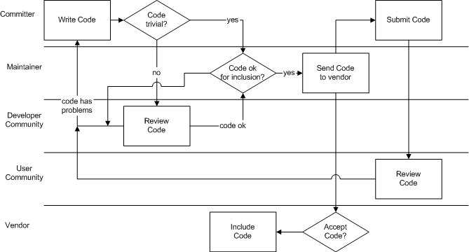

====================
6.2.?Committing code
====================

.. raw:: html

   

6.2.?Committing code
`Prev <model-processes.html>`__?
Chapter?6.?Processes
?\ `Next <process-core-election.html>`__

--------------

.. raw:: html

   

.. raw:: html

   

.. raw:: html

   

.. raw:: html

   

.. raw:: html

   

6.2.?Committing code
--------------------

.. raw:: html

   

.. raw:: html

   

.. raw:: html

   

The committing of new or modified code is one of the most frequent
processes in the FreeBSD project and will usually happen many times a
day. Committing of code can only be done by a “committer”. Committers
commit either code written by themselves, code submitted to them or code
submitted through a `problem report <model-pr.html>`__.

When code is written by the developer that is non-trivial, he should
seek a code review from the community. This is done by sending mail to
the relevant list asking for review. Before submitting the code for
review, he should ensure it compiles correctly with the entire tree and
that all relevant tests run. This is called “pre-commit test”. When
contributed code is received, it should be reviewed by the committer and
tested the same way.

When a change is committed to a part of the source that has been
contributed from an outside
`Vendor <proc-depend-hats.html#role-vendor>`__, the maintainer should
ensure that the patch is contributed back to the vendor. This is in line
with the open source philosophy and makes it easier to stay in sync with
outside projects as the patches do not have to be reapplied every time a
new release is made.

After the code has been available for review and no further changes are
necessary, the code is committed into the development branch, -CURRENT.
If the change applies for the -STABLE branch or the other branches as
well, a “Merge From Current” ("MFC") countdown is set by the committer.
After the number of days the committer chose when setting the MFC have
passed, an email will automatically be sent to the committer reminding
him to commit it to the -STABLE branch (and possibly security branches
as well). Only security critical changes should be merged to security
branches.

Delaying the commit to -STABLE and other branches allows for “parallel
debugging” where the committed code is tested on a wide range of
configurations. This makes changes to -STABLE to contain fewer faults
and thus giving the branch its name.

.. raw:: html

   

.. raw:: html

   

Figure?6.3.?Process summary: A committer commits code

.. raw:: html

   

.. raw:: html

   

.. raw:: html

   

|Process summary: A committer commits code|

.. raw:: html

   

.. raw:: html

   

.. raw:: html

   

| 

When a committer has written a piece of code and wants to commit it, he
first needs to determine if it is trivial enough to go in without prior
review or if it should first be reviewed by the developer community. If
the code is trivial or has been reviewed and the committer is not the
maintainer, he should consult the maintainer before proceeding. If the
code is contributed by an outside vendor, the maintainer should create a
patch that is sent back to the vendor. The code is then committed and
the deployed by the users. Should they find problems with the code, this
will be reported and the committer can go back to writing a patch. If a
vendor is affected, he can choose to implement or ignore the patch.

.. raw:: html

   

.. raw:: html

   

Figure?6.4.?Process summary: A contributor commits code

.. raw:: html

   

.. raw:: html

   

.. raw:: html

   

|Process summary: A contributor commits code|

.. raw:: html

   

.. raw:: html

   

.. raw:: html

   

| 

The difference when a contributor makes a code contribution is that he
submits the code through the Bugzilla interface. This report is picked
up by the maintainer who reviews the code and commits it.

Hats included in this process are:

.. raw:: html

   

#. `Committer <sect-hats.html#role-committer>`__

#. `Contributor <sect-hats.html#role-contributor>`__

#. `Vendor <proc-depend-hats.html#role-vendor>`__

#. `Reviewer <proc-depend-hats.html#role-reviewer>`__

.. raw:: html

   

[`FreeBSD, 2001 <bibliography.html#freebsd-committer>`__] [`J?rgensen,
2001 <bibliography.html#jorgensen2001>`__]

.. raw:: html

   

.. raw:: html

   

--------------

+------------------------------------+---------------------------------+--------------------------------------------+
| `Prev <model-processes.html>`__?   | `Up <model-processes.html>`__   | ?\ `Next <process-core-election.html>`__   |
+------------------------------------+---------------------------------+--------------------------------------------+
| Chapter?6.?Processes?              | `Home <index.html>`__           | ?6.3.?Core election                        |
+------------------------------------+---------------------------------+--------------------------------------------+

.. raw:: html

   

All FreeBSD documents are available for download at
http://ftp.FreeBSD.org/pub/FreeBSD/doc/

| Questions that are not answered by the
  `documentation <http://www.FreeBSD.org/docs.html>`__ may be sent to
  <freebsd-questions@FreeBSD.org\ >.
|  Send questions about this document to <freebsd-doc@FreeBSD.org\ >.

.. |Process summary: A contributor commits code| image:: proc-contrib.png
