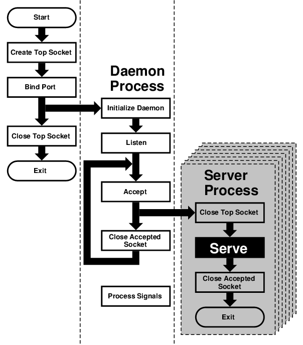

=======================
7.7.?Concurrent Servers
=======================

.. raw:: html

   

7.7.?Concurrent Servers
`Prev <sockets-helper-functions.html>`__?
Chapter?7.?Sockets
?\ `Next <ipv6.html>`__

--------------

.. raw:: html

   

.. raw:: html

   

.. raw:: html

   

.. raw:: html

   

.. raw:: html

   

7.7.?Concurrent Servers
-----------------------

.. raw:: html

   

.. raw:: html

   

.. raw:: html

   

Unlike a sequential server, a *concurrent server* has to be able to
serve more than one client at a time. For example, a *chat server* may
be serving a specific client for hours—it cannot wait till it stops
serving a client before it serves the next one.

This requires a significant change in our flowchart:

.. raw:: html

   

|Concurrent Server|

.. raw:: html

   

We moved the *serve* from the *daemon process* to its own *server
process*. However, because each child process inherits all open files
(and a socket is treated just like a file), the new process inherits not
only the *“accepted handle,”* i.e., the socket returned by the
``accept`` call, but also the *top socket*, i.e., the one opened by the
top process right at the beginning.

However, the *server process* does not need this socket and should
``close`` it immediately. Similarly, the *daemon process* no longer
needs the *accepted socket*, and not only should, but *must* ``close``
it—otherwise, it will run out of available *file descriptors* sooner or
later.

After the *server process* is done serving, it should close the
*accepted socket*. Instead of returning to ``accept``, it now exits.

Under UNIX?, a process does not really *exit*. Instead, it *returns* to
its parent. Typically, a parent process ``wait``\ s for its child
process, and obtains a return value. However, our *daemon process*
cannot simply stop and wait. That would defeat the whole purpose of
creating additional processes. But if it never does ``wait``, its
children will become *zombies*—no longer functional but still roaming
around.

For that reason, the *daemon process* needs to set *signal handlers* in
its *initialize daemon* phase. At least a SIGCHLD signal has to be
processed, so the daemon can remove the zombie return values from the
system and release the system resources they are taking up.

That is why our flowchart now contains a *process signals* box, which is
not connected to any other box. By the way, many servers also process
SIGHUP, and typically interpret as the signal from the superuser that
they should reread their configuration files. This allows us to change
settings without having to kill and restart these servers.

.. raw:: html

   

.. raw:: html

   

--------------

+---------------------------------------------+-------------------------+------------------------------+
| `Prev <sockets-helper-functions.html>`__?   | `Up <sockets.html>`__   | ?\ `Next <ipv6.html>`__      |
+---------------------------------------------+-------------------------+------------------------------+
| 7.6.?Helper Functions?                      | `Home <index.html>`__   | ?Chapter?8.?IPv6 Internals   |
+---------------------------------------------+-------------------------+------------------------------+

.. raw:: html

   

All FreeBSD documents are available for download at
http://ftp.FreeBSD.org/pub/FreeBSD/doc/

| Questions that are not answered by the
  `documentation <http://www.FreeBSD.org/docs.html>`__ may be sent to
  <freebsd-questions@FreeBSD.org\ >.
|  Send questions about this document to <freebsd-doc@FreeBSD.org\ >.

