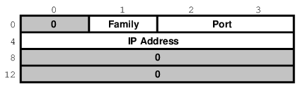
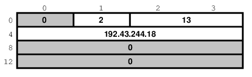
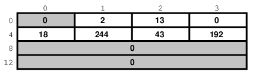
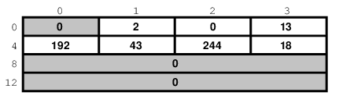
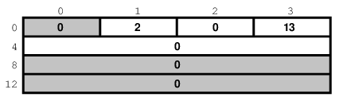
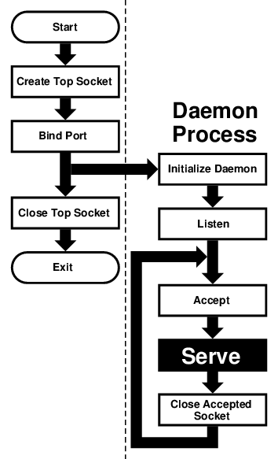

===============================
7.5.?Essential Socket Functions
===============================

.. raw:: html

   

7.5.?Essential Socket Functions
`Prev <sockets-model.html>`__?
Chapter?7.?Sockets
?\ `Next <sockets-helper-functions.html>`__

--------------

.. raw:: html

   

.. raw:: html

   

.. raw:: html

   

.. raw:: html

   

.. raw:: html

   

7.5.?Essential Socket Functions
-------------------------------

.. raw:: html

   

.. raw:: html

   

.. raw:: html

   

While FreeBSD offers different functions to work with sockets, we only
*need* four to “open” a socket. And in some cases we only need two.

.. raw:: html

   

.. raw:: html

   

.. raw:: html

   

.. raw:: html

   

7.5.1.?The Client-Server Difference
~~~~~~~~~~~~~~~~~~~~~~~~~~~~~~~~~~~

.. raw:: html

   

.. raw:: html

   

.. raw:: html

   

Typically, one of the ends of a socket-based data communication is a
*server*, the other is a *client*.

.. raw:: html

   

.. raw:: html

   

.. raw:: html

   

.. raw:: html

   

7.5.1.1.?The Common Elements
^^^^^^^^^^^^^^^^^^^^^^^^^^^^

.. raw:: html

   

.. raw:: html

   

.. raw:: html

   

.. raw:: html

   

.. raw:: html

   

.. raw:: html

   

.. raw:: html

   

7.5.1.1.1.?\ ``socket``
'''''''''''''''''''''''

.. raw:: html

   

.. raw:: html

   

.. raw:: html

   

The one function used by both, clients and servers, is
`socket(2) <http://www.FreeBSD.org/cgi/man.cgi?query=socket&sektion=2>`__.
It is declared this way:

.. code:: programlisting

    int socket(int domain, int type, int protocol);

The return value is of the same type as that of ``open``, an integer.
FreeBSD allocates its value from the same pool as that of file handles.
That is what allows sockets to be treated the same way as files.

The ``domain`` argument tells the system what *protocol family* you want
it to use. Many of them exist, some are vendor specific, others are very
common. They are declared in ``sys/socket.h``.

Use ``PF_INET`` for UDP, TCP and other Internet protocols (IPv4).

Five values are defined for the ``type`` argument, again, in
``sys/socket.h``. All of them start with “``SOCK_``”. The most common
one is ``SOCK_STREAM``, which tells the system you are asking for a
*reliable stream delivery service* (which is TCP when used with
``PF_INET``).

If you asked for ``SOCK_DGRAM``, you would be requesting a
*connectionless datagram delivery service* (in our case, UDP).

If you wanted to be in charge of the low-level protocols (such as IP),
or even network interfaces (e.g., the Ethernet), you would need to
specify ``SOCK_RAW``.

Finally, the ``protocol`` argument depends on the previous two
arguments, and is not always meaningful. In that case, use ``0`` for its
value.

.. raw:: html

   

The Unconnected Socket:
~~~~~~~~~~~~~~~~~~~~~~~

Nowhere, in the ``socket`` function have we specified to what other
system we should be connected. Our newly created socket remains
*unconnected*.

This is on purpose: To use a telephone analogy, we have just attached a
modem to the phone line. We have neither told the modem to make a call,
nor to answer if the phone rings.

.. raw:: html

   

.. raw:: html

   

.. raw:: html

   

.. raw:: html

   

.. raw:: html

   

.. raw:: html

   

7.5.1.1.2.?\ ``sockaddr``
'''''''''''''''''''''''''

.. raw:: html

   

.. raw:: html

   

.. raw:: html

   

Various functions of the sockets family expect the address of (or
pointer to, to use C terminology) a small area of the memory. The
various C declarations in the ``sys/socket.h`` refer to it as
``struct sockaddr``. This structure is declared in the same file:

.. code:: programlisting

    /*
     * Structure used by kernel to store most
     * addresses.
     */
    struct sockaddr {
        unsigned char   sa_len;     /* total length */
        sa_family_t sa_family;  /* address family */
        char        sa_data[14];    /* actually longer; address value */
    };
    #define SOCK_MAXADDRLEN 255     /* longest possible addresses */

Please note the *vagueness* with which the ``sa_data`` field is
declared, just as an array of ``14`` bytes, with the comment hinting
there can be more than ``14`` of them.

This vagueness is quite deliberate. Sockets is a very powerful
interface. While most people perhaps think of it as nothing more than
the Internet interface—and most applications probably use it for that
nowadays—sockets can be used for just about *any* kind of interprocess
communications, of which the Internet (or, more precisely, IP) is only
one.

The ``sys/socket.h`` refers to the various types of protocols sockets
will handle as *address families*, and lists them right before the
definition of ``sockaddr``:

.. code:: programlisting

    /*
     * Address families.
     */
    #define AF_UNSPEC   0       /* unspecified */
    #define AF_LOCAL    1       /* local to host (pipes, portals) */
    #define AF_UNIX     AF_LOCAL    /* backward compatibility */
    #define AF_INET     2       /* internetwork: UDP, TCP, etc. */
    #define AF_IMPLINK  3       /* arpanet imp addresses */
    #define AF_PUP      4       /* pup protocols: e.g. BSP */
    #define AF_CHAOS    5       /* mit CHAOS protocols */
    #define AF_NS       6       /* XEROX NS protocols */
    #define AF_ISO      7       /* ISO protocols */
    #define AF_OSI      AF_ISO
    #define AF_ECMA     8       /* European computer manufacturers */
    #define AF_DATAKIT  9       /* datakit protocols */
    #define AF_CCITT    10      /* CCITT protocols, X.25 etc */
    #define AF_SNA      11      /* IBM SNA */
    #define AF_DECnet   12      /* DECnet */
    #define AF_DLI      13      /* DEC Direct data link interface */
    #define AF_LAT      14      /* LAT */
    #define AF_HYLINK   15      /* NSC Hyperchannel */
    #define AF_APPLETALK    16      /* Apple Talk */
    #define AF_ROUTE    17      /* Internal Routing Protocol */
    #define AF_LINK     18      /* Link layer interface */
    #define pseudo_AF_XTP   19      /* eXpress Transfer Protocol (no AF) */
    #define AF_COIP     20      /* connection-oriented IP, aka ST II */
    #define AF_CNT      21      /* Computer Network Technology */
    #define pseudo_AF_RTIP  22      /* Help Identify RTIP packets */
    #define AF_IPX      23      /* Novell Internet Protocol */
    #define AF_SIP      24      /* Simple Internet Protocol */
    #define pseudo_AF_PIP   25      /* Help Identify PIP packets */
    #define AF_ISDN     26      /* Integrated Services Digital Network*/
    #define AF_E164     AF_ISDN     /* CCITT E.164 recommendation */
    #define pseudo_AF_KEY   27      /* Internal key-management function */
    #define AF_INET6    28      /* IPv6 */
    #define AF_NATM     29      /* native ATM access */
    #define AF_ATM      30      /* ATM */
    #define pseudo_AF_HDRCMPLT 31       /* Used by BPF to not rewrite headers
                         * in interface output routine
                         */
    #define AF_NETGRAPH 32      /* Netgraph sockets */
    #define AF_SLOW     33      /* 802.3ad slow protocol */
    #define AF_SCLUSTER 34      /* Sitara cluster protocol */
    #define AF_ARP      35
    #define AF_BLUETOOTH    36      /* Bluetooth sockets */
    #define AF_MAX      37

The one used for IP is AF\_INET. It is a symbol for the constant ``2``.

It is the *address family* listed in the ``sa_family`` field of
``sockaddr`` that decides how exactly the vaguely named bytes of
``sa_data`` will be used.

Specifically, whenever the *address family* is AF\_INET, we can use
``struct sockaddr_in`` found in ``netinet/in.h``, wherever ``sockaddr``
is expected:

.. code:: programlisting

    /*
     * Socket address, internet style.
     */
    struct sockaddr_in {
        uint8_t     sin_len;
        sa_family_t sin_family;
        in_port_t   sin_port;
        struct  in_addr sin_addr;
        char    sin_zero[8];
    };

We can visualize its organization this way:

.. raw:: html

   

|sockaddr\_in|

.. raw:: html

   

The three important fields are ``sin_family``, which is byte 1 of the
structure, ``sin_port``, a 16-bit value found in bytes 2 and 3, and
``sin_addr``, a 32-bit integer representation of the IP address, stored
in bytes 4-7.

Now, let us try to fill it out. Let us assume we are trying to write a
client for the *daytime* protocol, which simply states that its server
will write a text string representing the current date and time to port
13. We want to use TCP/IP, so we need to specify ``AF_INET`` in the
address family field. ``AF_INET`` is defined as ``2``. Let us use the IP
address of ``192.43.244.18``, which is the time server of US federal
government (``time.nist.gov``).

.. raw:: html

   

|Specific example of sockaddr\_in|

.. raw:: html

   

By the way the ``sin_addr`` field is declared as being of the
``struct in_addr`` type, which is defined in ``netinet/in.h``:

.. code:: programlisting

    /*
     * Internet address (a structure for historical reasons)
     */
    struct in_addr {
        in_addr_t s_addr;
    };

In addition, ``in_addr_t`` is a 32-bit integer.

The ``192.43.244.18`` is just a convenient notation of expressing a
32-bit integer by listing all of its 8-bit bytes, starting with the
*most significant* one.

So far, we have viewed ``sockaddr`` as an abstraction. Our computer does
not store ``short`` integers as a single 16-bit entity, but as a
sequence of 2 bytes. Similarly, it stores 32-bit integers as a sequence
of 4 bytes.

Suppose we coded something like this:

.. code:: programlisting

    sa.sin_family      = AF_INET;
    sa.sin_port        = 13;
    sa.sin_addr.s_addr = (((((192 << 8) | 43) << 8) | 244) << 8) | 18;

What would the result look like?

Well, that depends, of course. On a Pentium?, or other x86, based
computer, it would look like this:

.. raw:: html

   

|sockaddr\_in on an Intel system|

.. raw:: html

   

On a different system, it might look like this:

.. raw:: html

   

|sockaddr\_in on an MSB system|

.. raw:: html

   

And on a PDP it might look different yet. But the above two are the most
common ways in use today.

Ordinarily, wanting to write portable code, programmers pretend that
these differences do not exist. And they get away with it (except when
they code in assembly language). Alas, you cannot get away with it that
easily when coding for sockets.

Why?

Because when communicating with another computer, you usually do not
know whether it stores data *most significant byte* (MSB) or *least
significant byte* (LSB) first.

You might be wondering, *“So, will sockets not handle it for me?”*

It will not.

While that answer may surprise you at first, remember that the general
sockets interface only understands the ``sa_len`` and ``sa_family``
fields of the ``sockaddr`` structure. You do not have to worry about the
byte order there (of course, on FreeBSD ``sa_family`` is only 1 byte
anyway, but many other UNIX? systems do not have ``sa_len`` and use 2
bytes for ``sa_family``, and expect the data in whatever order is native
to the computer).

But the rest of the data is just ``sa_data[14]`` as far as sockets goes.
Depending on the *address family*, sockets just forwards that data to
its destination.

Indeed, when we enter a port number, it is because we want the other
computer to know what service we are asking for. And, when we are the
server, we read the port number so we know what service the other
computer is expecting from us. Either way, sockets only has to forward
the port number as data. It does not interpret it in any way.

Similarly, we enter the IP address to tell everyone on the way where to
send our data to. Sockets, again, only forwards it as data.

That is why, we (the *programmers*, not the *sockets*) have to
distinguish between the byte order used by our computer and a
conventional byte order to send the data in to the other computer.

We will call the byte order our computer uses the *host byte order*, or
just the *host order*.

There is a convention of sending the multi-byte data over IP *MSB
first*. This, we will refer to as the *network byte order*, or simply
the *network order*.

Now, if we compiled the above code for an Intel based computer, our
*host byte order* would produce:

.. raw:: html

   

|Host byte order on an Intel system|

.. raw:: html

   

But the *network byte order* requires that we store the data MSB first:

.. raw:: html

   

|Network byte order|

.. raw:: html

   

Unfortunately, our *host order* is the exact opposite of the *network
order*.

We have several ways of dealing with it. One would be to *reverse* the
values in our code:

.. code:: programlisting

    sa.sin_family      = AF_INET;
    sa.sin_port        = 13 << 8;
    sa.sin_addr.s_addr = (((((18 << 8) | 244) << 8) | 43) << 8) | 192;

This will *trick* our compiler into storing the data in the *network
byte order*. In some cases, this is exactly the way to do it (e.g., when
programming in assembly language). In most cases, however, it can cause
a problem.

Suppose, you wrote a sockets-based program in C. You know it is going to
run on a Pentium?, so you enter all your constants in reverse and force
them to the *network byte order*. It works well.

Then, some day, your trusted old Pentium? becomes a rusty old Pentium?.
You replace it with a system whose *host order* is the same as the
*network order*. You need to recompile all your software. All of your
software continues to perform well, except the one program you wrote.

You have since forgotten that you had forced all of your constants to
the opposite of the *host order*. You spend some quality time tearing
out your hair, calling the names of all gods you ever heard of (and some
you made up), hitting your monitor with a nerf bat, and performing all
the other traditional ceremonies of trying to figure out why something
that has worked so well is suddenly not working at all.

Eventually, you figure it out, say a couple of swear words, and start
rewriting your code.

Luckily, you are not the first one to face the problem. Someone else has
created the
`htons(3) <http://www.FreeBSD.org/cgi/man.cgi?query=htons&sektion=3>`__
and
`htonl(3) <http://www.FreeBSD.org/cgi/man.cgi?query=htonl&sektion=3>`__
C functions to convert a ``short`` and ``long`` respectively from the
*host byte order* to the *network byte order*, and the
`ntohs(3) <http://www.FreeBSD.org/cgi/man.cgi?query=ntohs&sektion=3>`__
and
`ntohl(3) <http://www.FreeBSD.org/cgi/man.cgi?query=ntohl&sektion=3>`__
C functions to go the other way.

On *MSB-first* systems these functions do nothing. On *LSB-first*
systems they convert values to the proper order.

So, regardless of what system your software is compiled on, your data
will end up in the correct order if you use these functions.

.. raw:: html

   

.. raw:: html

   

.. raw:: html

   

.. raw:: html

   

.. raw:: html

   

.. raw:: html

   

7.5.1.2.?Client Functions
^^^^^^^^^^^^^^^^^^^^^^^^^

.. raw:: html

   

.. raw:: html

   

.. raw:: html

   

Typically, the client initiates the connection to the server. The client
knows which server it is about to call: It knows its IP address, and it
knows the *port* the server resides at. It is akin to you picking up the
phone and dialing the number (the *address*), then, after someone
answers, asking for the person in charge of wingdings (the *port*).

.. raw:: html

   

.. raw:: html

   

.. raw:: html

   

.. raw:: html

   

7.5.1.2.1.?\ ``connect``
''''''''''''''''''''''''

.. raw:: html

   

.. raw:: html

   

.. raw:: html

   

Once a client has created a socket, it needs to connect it to a specific
port on a remote system. It uses
`connect(2) <http://www.FreeBSD.org/cgi/man.cgi?query=connect&sektion=2>`__:

.. code:: programlisting

    int connect(int s, const struct sockaddr *name, socklen_t namelen);

The ``s`` argument is the socket, i.e., the value returned by the
``socket`` function. The ``name`` is a pointer to ``sockaddr``, the
structure we have talked about extensively. Finally, ``namelen`` informs
the system how many bytes are in our ``sockaddr`` structure.

If ``connect`` is successful, it returns ``0``. Otherwise it returns
``-1`` and stores the error code in ``errno``.

There are many reasons why ``connect`` may fail. For example, with an
attempt to an Internet connection, the IP address may not exist, or it
may be down, or just too busy, or it may not have a server listening at
the specified port. Or it may outright *refuse* any request for specific
code.

.. raw:: html

   

.. raw:: html

   

.. raw:: html

   

.. raw:: html

   

.. raw:: html

   

7.5.1.2.2.?Our First Client
'''''''''''''''''''''''''''

.. raw:: html

   

.. raw:: html

   

.. raw:: html

   

We now know enough to write a very simple client, one that will get
current time from ``192.43.244.18`` and print it to ``stdout``.

.. code:: programlisting

    /*
     * daytime.c
     *
     * Programmed by G. Adam Stanislav
     */
    #include <stdio.h>
    #include <string.h>
    #include <sys/types.h>
    #include <sys/socket.h>
    #include <netinet/in.h>

    int main() {
      register int s;
      register int bytes;
      struct sockaddr_in sa;
      char buffer[BUFSIZ+1];

      if ((s = socket(PF_INET, SOCK_STREAM, 0)) < 0) {
        perror("socket");
        return 1;
      }

      bzero(&sa, sizeof sa);

      sa.sin_family = AF_INET;
      sa.sin_port = htons(13);
      sa.sin_addr.s_addr = htonl((((((192 << 8) | 43) << 8) | 244) << 8) | 18);
      if (connect(s, (struct sockaddr *)&sa, sizeof sa) < 0) {
        perror("connect");
        close(s);
        return 2;
      }

      while ((bytes = read(s, buffer, BUFSIZ)) > 0)
        write(1, buffer, bytes);

      close(s);
      return 0;
    }

Go ahead, enter it in your editor, save it as ``daytime.c``, then
compile and run it:

.. code:: screen

    % cc -O3 -o daytime daytime.c
    % ./daytime

    52079 01-06-19 02:29:25 50 0 1 543.9 UTC(NIST) *
    %

In this case, the date was June 19, 2001, the time was 02:29:25 UTC.
Naturally, your results will vary.

.. raw:: html

   

.. raw:: html

   

.. raw:: html

   

.. raw:: html

   

.. raw:: html

   

.. raw:: html

   

7.5.1.3.?Server Functions
^^^^^^^^^^^^^^^^^^^^^^^^^

.. raw:: html

   

.. raw:: html

   

.. raw:: html

   

The typical server does not initiate the connection. Instead, it waits
for a client to call it and request services. It does not know when the
client will call, nor how many clients will call. It may be just sitting
there, waiting patiently, one moment, The next moment, it can find
itself swamped with requests from a number of clients, all calling in at
the same time.

The sockets interface offers three basic functions to handle this.

.. raw:: html

   

.. raw:: html

   

.. raw:: html

   

.. raw:: html

   

7.5.1.3.1.?\ ``bind``
'''''''''''''''''''''

.. raw:: html

   

.. raw:: html

   

.. raw:: html

   

Ports are like extensions to a phone line: After you dial a number, you
dial the extension to get to a specific person or department.

There are 65535 IP ports, but a server usually processes requests that
come in on only one of them. It is like telling the phone room operator
that we are now at work and available to answer the phone at a specific
extension. We use
`bind(2) <http://www.FreeBSD.org/cgi/man.cgi?query=bind&sektion=2>`__ to
tell sockets which port we want to serve.

.. code:: programlisting

    int bind(int s, const struct sockaddr *addr, socklen_t addrlen);

Beside specifying the port in ``addr``, the server may include its IP
address. However, it can just use the symbolic constant INADDR\_ANY to
indicate it will serve all requests to the specified port regardless of
what its IP address is. This symbol, along with several similar ones, is
declared in ``netinet/in.h``

.. code:: programlisting

    #define INADDR_ANY      (u_int32_t)0x00000000

Suppose we were writing a server for the *daytime* protocol over TCP/IP.
Recall that it uses port 13. Our ``sockaddr_in`` structure would look
like this:

.. raw:: html

   

|Example Server sockaddr\_in|

.. raw:: html

   

.. raw:: html

   

.. raw:: html

   

.. raw:: html

   

.. raw:: html

   

.. raw:: html

   

7.5.1.3.2.?\ ``listen``
'''''''''''''''''''''''

.. raw:: html

   

.. raw:: html

   

.. raw:: html

   

To continue our office phone analogy, after you have told the phone
central operator what extension you will be at, you now walk into your
office, and make sure your own phone is plugged in and the ringer is
turned on. Plus, you make sure your call waiting is activated, so you
can hear the phone ring even while you are talking to someone.

The server ensures all of that with the
`listen(2) <http://www.FreeBSD.org/cgi/man.cgi?query=listen&sektion=2>`__
function.

.. code:: programlisting

    int listen(int s, int backlog);

In here, the ``backlog`` variable tells sockets how many incoming
requests to accept while you are busy processing the last request. In
other words, it determines the maximum size of the queue of pending
connections.

.. raw:: html

   

.. raw:: html

   

.. raw:: html

   

.. raw:: html

   

.. raw:: html

   

7.5.1.3.3.?\ ``accept``
'''''''''''''''''''''''

.. raw:: html

   

.. raw:: html

   

.. raw:: html

   

After you hear the phone ringing, you accept the call by answering the
call. You have now established a connection with your client. This
connection remains active until either you or your client hang up.

The server accepts the connection by using the
`accept(2) <http://www.FreeBSD.org/cgi/man.cgi?query=accept&sektion=2>`__
function.

.. code:: programlisting

    int accept(int s, struct sockaddr *addr, socklen_t *addrlen);

Note that this time ``addrlen`` is a pointer. This is necessary because
in this case it is the socket that fills out ``addr``, the
``sockaddr_in`` structure.

The return value is an integer. Indeed, the ``accept`` returns a *new
socket*. You will use this new socket to communicate with the client.

What happens to the old socket? It continues to listen for more requests
(remember the ``backlog`` variable we passed to ``listen``?) until we
``close`` it.

Now, the new socket is meant only for communications. It is fully
connected. We cannot pass it to ``listen`` again, trying to accept
additional connections.

.. raw:: html

   

.. raw:: html

   

.. raw:: html

   

.. raw:: html

   

.. raw:: html

   

7.5.1.3.4.?Our First Server
'''''''''''''''''''''''''''

.. raw:: html

   

.. raw:: html

   

.. raw:: html

   

Our first server will be somewhat more complex than our first client
was: Not only do we have more sockets functions to use, but we need to
write it as a daemon.

This is best achieved by creating a *child process* after binding the
port. The main process then exits and returns control to the shell (or
whatever program invoked it).

The child calls ``listen``, then starts an endless loop, which accepts a
connection, serves it, and eventually closes its socket.

.. code:: programlisting

    /*
     * daytimed - a port 13 server
     *
     * Programmed by G. Adam Stanislav
     * June 19, 2001
     */
    #include <stdio.h>
    #include <string.h>
    #include <time.h>
    #include <unistd.h>
    #include <sys/types.h>
    #include <sys/socket.h>
    #include <netinet/in.h>

    #define BACKLOG 4

    int main() {
        register int s, c;
        int b;
        struct sockaddr_in sa;
        time_t t;
        struct tm *tm;
        FILE *client;

        if ((s = socket(PF_INET, SOCK_STREAM, 0)) < 0) {
            perror("socket");
            return 1;
        }

        bzero(&sa, sizeof sa);

        sa.sin_family = AF_INET;
        sa.sin_port   = htons(13);

        if (INADDR_ANY)
            sa.sin_addr.s_addr = htonl(INADDR_ANY);

        if (bind(s, (struct sockaddr *)&sa, sizeof sa) < 0) {
            perror("bind");
            return 2;
        }

        switch (fork()) {
            case -1:
                perror("fork");
                return 3;
                break;
            default:
                close(s);
                return 0;
                break;
            case 0:
                break;
        }

        listen(s, BACKLOG);

        for (;;) {
            b = sizeof sa;

            if ((c = accept(s, (struct sockaddr *)&sa, &b)) < 0) {
                perror("daytimed accept");
                return 4;
            }

            if ((client = fdopen(c, "w")) == NULL) {
                perror("daytimed fdopen");
                return 5;
            }

            if ((t = time(NULL)) < 0) {
                perror("daytimed time");

                return 6;
            }

            tm = gmtime(&t);
            fprintf(client, "%.4i-%.2i-%.2iT%.2i:%.2i:%.2iZ\n",
                tm->tm_year + 1900,
                tm->tm_mon + 1,
                tm->tm_mday,
                tm->tm_hour,
                tm->tm_min,
                tm->tm_sec);

            fclose(client);
        }
    }

We start by creating a socket. Then we fill out the ``sockaddr_in``
structure in ``sa``. Note the conditional use of INADDR\_ANY:

.. code:: programlisting

        if (INADDR_ANY)
            sa.sin_addr.s_addr = htonl(INADDR_ANY);

Its value is ``0``. Since we have just used ``bzero`` on the entire
structure, it would be redundant to set it to ``0`` again. But if we
port our code to some other system where INADDR\_ANY is perhaps not a
zero, we need to assign it to ``sa.sin_addr.s_addr``. Most modern C
compilers are clever enough to notice that INADDR\_ANY is a constant. As
long as it is a zero, they will optimize the entire conditional
statement out of the code.

After we have called ``bind`` successfully, we are ready to become a
*daemon*: We use ``fork`` to create a child process. In both, the parent
and the child, the ``s`` variable is our socket. The parent process will
not need it, so it calls ``close``, then it returns ``0`` to inform its
own parent it had terminated successfully.

Meanwhile, the child process continues working in the background. It
calls ``listen`` and sets its backlog to ``4``. It does not need a large
value here because *daytime* is not a protocol many clients request all
the time, and because it can process each request instantly anyway.

Finally, the daemon starts an endless loop, which performs the following
steps:

.. raw:: html

   

#. Call ``accept``. It waits here until a client contacts it. At that
   point, it receives a new socket, ``c``, which it can use to
   communicate with this particular client.

#. It uses the C function ``fdopen`` to turn the socket from a low-level
   *file descriptor* to a C-style ``FILE`` pointer. This will allow the
   use of ``fprintf`` later on.

#. It checks the time, and prints it in the *ISO 8601* format to the
   ``client`` “file”. It then uses ``fclose`` to close the file. That
   will automatically close the socket as well.

.. raw:: html

   

We can *generalize* this, and use it as a model for many other servers:

.. raw:: html

   

|Sequential Server|

.. raw:: html

   

This flowchart is good for *sequential servers*, i.e., servers that can
serve one client at a time, just as we were able to with our *daytime*
server. This is only possible whenever there is no real “conversation”
going on between the client and the server: As soon as the server
detects a connection to the client, it sends out some data and closes
the connection. The entire operation may take nanoseconds, and it is
finished.

The advantage of this flowchart is that, except for the brief moment
after the parent ``fork``\ s and before it exits, there is always only
one *process* active: Our server does not take up much memory and other
system resources.

Note that we have added *initialize daemon* in our flowchart. We did not
need to initialize our own daemon, but this is a good place in the flow
of the program to set up any ``signal`` handlers, open any files we may
need, etc.

Just about everything in the flow chart can be used literally on many
different servers. The *serve* entry is the exception. We think of it as
a *“black box”*, i.e., something you design specifically for your own
server, and just “plug it into the rest.”

Not all protocols are that simple. Many receive a request from the
client, reply to it, then receive another request from the same client.
Because of that, they do not know in advance how long they will be
serving the client. Such servers usually start a new process for each
client. While the new process is serving its client, the daemon can
continue listening for more connections.

Now, go ahead, save the above source code as ``daytimed.c`` (it is
customary to end the names of daemons with the letter ``d``). After you
have compiled it, try running it:

.. code:: screen

    % ./daytimed
    bind: Permission denied
    %

What happened here? As you will recall, the *daytime* protocol uses port
13. But all ports below 1024 are reserved to the superuser (otherwise,
anyone could start a daemon pretending to serve a commonly used port,
while causing a security breach).

Try again, this time as the superuser:

.. code:: screen

    # ./daytimed
    #

What... Nothing? Let us try again:

.. code:: screen

    # ./daytimed

    bind: Address already in use
    #

Every port can only be bound by one program at a time. Our first attempt
was indeed successful: It started the child daemon and returned quietly.
It is still running and will continue to run until you either kill it,
or any of its system calls fail, or you reboot the system.

Fine, we know it is running in the background. But is it working? How do
we know it is a proper *daytime* server? Simple:

.. code:: screen

    % telnet localhost 13

    Trying ::1...
    telnet: connect to address ::1: Connection refused
    Trying 127.0.0.1...
    Connected to localhost.
    Escape character is '^]'.
    2001-06-19T21:04:42Z
    Connection closed by foreign host.
    %

telnet tried the new IPv6, and failed. It retried with IPv4 and
succeeded. The daemon works.

If you have access to another UNIX? system via telnet, you can use it to
test accessing the server remotely. My computer does not have a static
IP address, so this is what I did:

.. code:: screen

    % who

    whizkid          ttyp0   Jun 19 16:59   (216.127.220.143)
    xxx              ttyp1   Jun 19 16:06   (xx.xx.xx.xx)
    % telnet 216.127.220.143 13

    Trying 216.127.220.143...
    Connected to r47.bfm.org.
    Escape character is '^]'.
    2001-06-19T21:31:11Z
    Connection closed by foreign host.
    %

Again, it worked. Will it work using the domain name?

.. code:: screen

    % telnet r47.bfm.org 13

    Trying 216.127.220.143...
    Connected to r47.bfm.org.
    Escape character is '^]'.
    2001-06-19T21:31:40Z
    Connection closed by foreign host.
    %

By the way, telnet prints the *Connection closed by foreign host*
message after our daemon has closed the socket. This shows us that,
indeed, using ``fclose(client);`` in our code works as advertised.

.. raw:: html

   

.. raw:: html

   

.. raw:: html

   

.. raw:: html

   

.. raw:: html

   

--------------

+----------------------------------+-------------------------+-----------------------------------------------+
| `Prev <sockets-model.html>`__?   | `Up <sockets.html>`__   | ?\ `Next <sockets-helper-functions.html>`__   |
+----------------------------------+-------------------------+-----------------------------------------------+
| 7.4.?The Sockets Model?          | `Home <index.html>`__   | ?7.6.?Helper Functions                        |
+----------------------------------+-------------------------+-----------------------------------------------+

.. raw:: html

   

All FreeBSD documents are available for download at
http://ftp.FreeBSD.org/pub/FreeBSD/doc/

| Questions that are not answered by the
  `documentation <http://www.FreeBSD.org/docs.html>`__ may be sent to
  <freebsd-questions@FreeBSD.org\ >.
|  Send questions about this document to <freebsd-doc@FreeBSD.org\ >.

