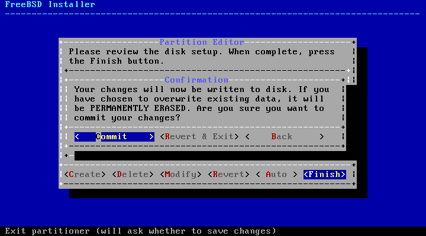
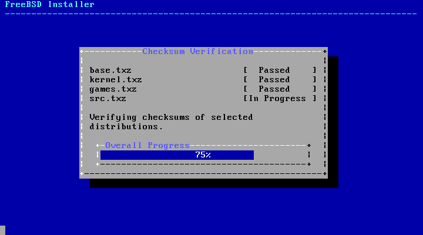

===================================
2.7.?Committing to the Installation
===================================

.. raw:: html

   

2.7.?Committing to the Installation
`Prev <bsdinstall-partitioning.html>`__?
Chapter?2.?Installing FreeBSD?9.\ *``X``* and Later
?\ `Next <bsdinstall-post.html>`__

--------------

.. raw:: html

   

.. raw:: html

   

.. raw:: html

   

.. raw:: html

   

.. raw:: html

   

2.7.?Committing to the Installation
-----------------------------------

.. raw:: html

   

.. raw:: html

   

.. raw:: html

   

Once the disks are configured, the next menu provides the last chance to
make changes before the selected hard drive(s) are formatted. If changes
need to be made, select [?Back?] to return to the main partitioning
menu. [?Revert?&?Exit?] will exit the installer without making any
changes to the hard drive.

.. raw:: html

   

.. raw:: html

   

Figure?2.26.?Final Confirmation

.. raw:: html

   

.. raw:: html

   

.. raw:: html

   

|Final Confirmation|

.. raw:: html

   

.. raw:: html

   

.. raw:: html

   

To instead start the actual installation, select [?Commit?] and press
**Enter**.

Installation time will vary depending on the distributions chosen,
installation media, and speed of the computer. A series of messages will
indicate the progress.

First, the installer formats the selected disk(s) and initializes the
partitions. Next, in the case of a bootonly media, it downloads the
selected components:

.. raw:: html

   

.. raw:: html

   

Figure?2.27.?Fetching Distribution Files

.. raw:: html

   

.. raw:: html

   

.. raw:: html

   

|Fetching Distribution Files|

.. raw:: html

   

.. raw:: html

   

.. raw:: html

   

Next, the integrity of the distribution files is verified to ensure they
have not been corrupted during download or misread from the installation
media:

.. raw:: html

   

.. raw:: html

   

Figure?2.28.?Verifying Distribution Files

.. raw:: html

   

.. raw:: html

   

.. raw:: html

   

|Verifying Distribution Files|

.. raw:: html

   

.. raw:: html

   

.. raw:: html

   

Finally, the verified distribution files are extracted to the disk:

.. raw:: html

   

.. raw:: html

   

Figure?2.29.?Extracting Distribution Files

.. raw:: html

   

.. raw:: html

   

.. raw:: html

   

|Extracting Distribution Files|

.. raw:: html

   

.. raw:: html

   

.. raw:: html

   

Once all requested distribution files have been extracted, bsdinstall
displays the first post-installation configuration screen. The available
post-configuration options are described in the next section.

.. raw:: html

   

.. raw:: html

   

--------------

+--------------------------------------------+----------------------------+--------------------------------------+
| `Prev <bsdinstall-partitioning.html>`__?   | `Up <bsdinstall.html>`__   | ?\ `Next <bsdinstall-post.html>`__   |
+--------------------------------------------+----------------------------+--------------------------------------+
| 2.6.?Allocating Disk Space?                | `Home <index.html>`__      | ?2.8.?Post-Installation              |
+--------------------------------------------+----------------------------+--------------------------------------+

.. raw:: html

   

All FreeBSD documents are available for download at
http://ftp.FreeBSD.org/pub/FreeBSD/doc/

| Questions that are not answered by the
  `documentation <http://www.FreeBSD.org/docs.html>`__ may be sent to
  <freebsd-questions@FreeBSD.org\ >.
|  Send questions about this document to <freebsd-doc@FreeBSD.org\ >.

.. |Fetching Distribution Files| image:: bsdinstall/bsdinstall-distfile-fetching.png

