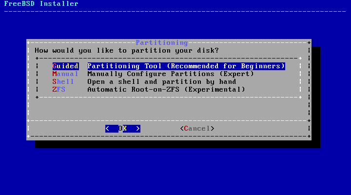
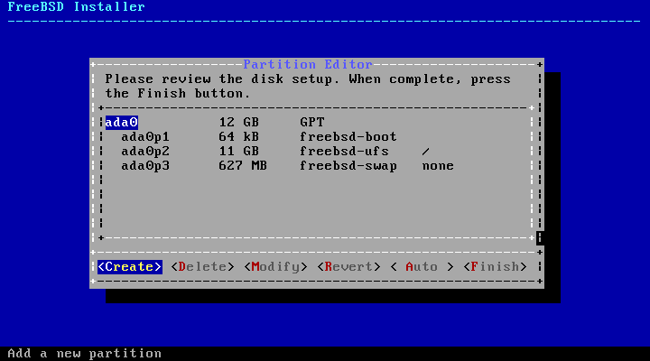
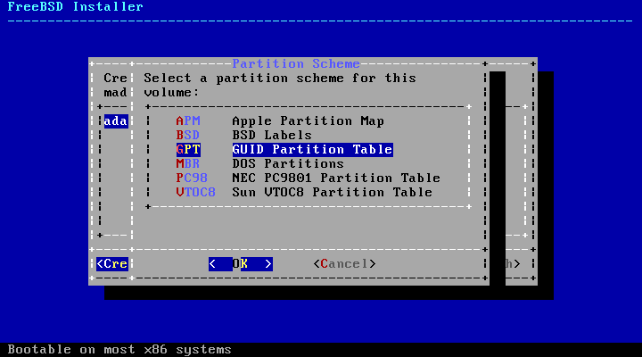
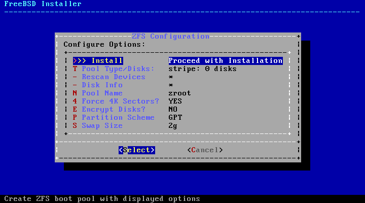
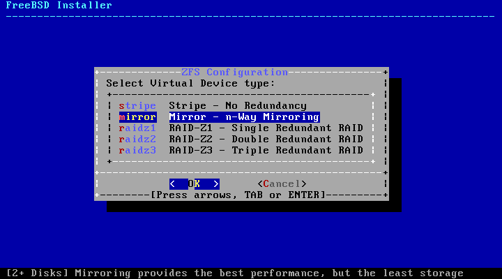
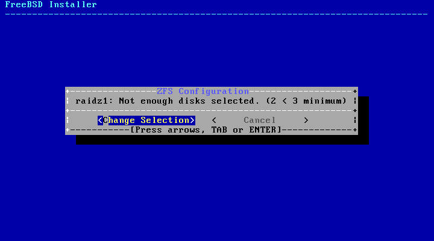
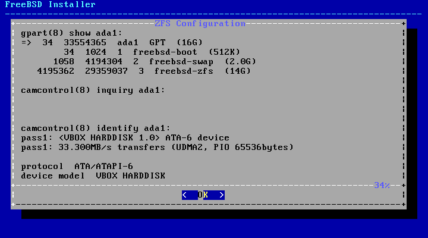

==========================
2.6.?Allocating Disk Space
==========================

.. raw:: html

   

2.6.?Allocating Disk Space
`Prev <using-bsdinstall.html>`__?
Chapter?2.?Installing FreeBSD?9.\ *``X``* and Later
?\ `Next <bsdinstall-final-warning.html>`__

--------------

.. raw:: html

   

.. raw:: html

   

.. raw:: html

   

.. raw:: html

   

.. raw:: html

   

2.6.?Allocating Disk Space
--------------------------

.. raw:: html

   

.. raw:: html

   

.. raw:: html

   

The next menu is used to determine the method for allocating disk space.
The options available in the menu depend upon the version of FreeBSD
being installed.

.. raw:: html

   

.. raw:: html

   

Figure?2.11.?Partitioning Choices on FreeBSD 9.x

.. raw:: html

   

.. raw:: html

   

.. raw:: html

   

|Partitioning Choices on FreeBSD 9.x|

.. raw:: html

   

.. raw:: html

   

.. raw:: html

   

.. raw:: html

   

.. raw:: html

   

Figure?2.12.?Partitioning Choices on FreeBSD 10.x and Higher

.. raw:: html

   

.. raw:: html

   

.. raw:: html

   

|Partitioning Choices on FreeBSD 10.x and Higher|

.. raw:: html

   

.. raw:: html

   

.. raw:: html

   

``Guided`` partitioning automatically sets up the disk partitions,
``Manual`` partitioning allows advanced users to create customized
partitions from menu options, and ``Shell`` opens a shell prompt where
advanced users can create customized partitions using command-line
utilities like
`gpart(8) <http://www.FreeBSD.org/cgi/man.cgi?query=gpart&sektion=8>`__,
`fdisk(8) <http://www.FreeBSD.org/cgi/man.cgi?query=fdisk&sektion=8>`__,
and
`bsdlabel(8) <http://www.FreeBSD.org/cgi/man.cgi?query=bsdlabel&sektion=8>`__.
``ZFS`` partitioning, only available in FreeBSD 10 and later, creates an
optionally encrypted root-on-ZFS system with support for *boot
environments*.

This section describes what to consider when laying out the disk
partitions. It then demonstrates how to use the different partitioning
methods.

.. raw:: html

   

.. raw:: html

   

.. raw:: html

   

.. raw:: html

   

2.6.1.?Designing the Partition Layout
~~~~~~~~~~~~~~~~~~~~~~~~~~~~~~~~~~~~~

.. raw:: html

   

.. raw:: html

   

.. raw:: html

   

When laying out file systems, remember that hard drives transfer data
faster from the outer tracks to the inner. Thus, smaller and
heavier-accessed file systems should be closer to the outside of the
drive, while larger partitions like ``/usr`` should be placed toward the
inner parts of the disk. It is a good idea to create partitions in an
order similar to: ``/``, swap, ``/var``, and ``/usr``.

The size of the ``/var`` partition reflects the intended machine's
usage. This partition is used to hold mailboxes, log files, and printer
spools. Mailboxes and log files can grow to unexpected sizes depending
on the number of users and how long log files are kept. On average, most
users rarely need more than about a gigabyte of free disk space in
``/var``.

.. raw:: html

   

Note:
~~~~~

Sometimes, a lot of disk space is required in ``/var/tmp``. When new
software is installed, the packaging tools extract a temporary copy of
the packages under ``/var/tmp``. Large software packages, like Firefox,
OpenOffice or LibreOffice may be tricky to install if there is not
enough disk space under ``/var/tmp``.

.. raw:: html

   

The ``/usr`` partition holds many of the files which support the system,
including the FreeBSD Ports Collection and system source code. At least
2 gigabytes is recommended for this partition.

When selecting partition sizes, keep the space requirements in mind.
Running out of space in one partition while barely using another can be
a hassle.

As a rule of thumb, the swap partition should be about double the size
of physical memory (RAM). Systems with minimal RAM may perform better
with more swap. Configuring too little swap can lead to inefficiencies
in the VM page scanning code and might create issues later if more
memory is added.

On larger systems with multiple SCSI disks or multiple IDE disks
operating on different controllers, it is recommended that swap be
configured on each drive, up to four drives. The swap partitions should
be approximately the same size. The kernel can handle arbitrary sizes
but internal data structures scale to 4 times the largest swap
partition. Keeping the swap partitions near the same size will allow the
kernel to optimally stripe swap space across disks. Large swap sizes are
fine, even if swap is not used much. It might be easier to recover from
a runaway program before being forced to reboot.

By properly partitioning a system, fragmentation introduced in the
smaller write heavy partitions will not bleed over into the mostly read
partitions. Keeping the write loaded partitions closer to the disk's
edge will increase I/O performance in the partitions where it occurs the
most. While I/O performance in the larger partitions may be needed,
shifting them more toward the edge of the disk will not lead to a
significant performance improvement over moving ``/var`` to the edge.

.. raw:: html

   

.. raw:: html

   

.. raw:: html

   

.. raw:: html

   

.. raw:: html

   

2.6.2.?Guided Partitioning
~~~~~~~~~~~~~~~~~~~~~~~~~~

.. raw:: html

   

.. raw:: html

   

.. raw:: html

   

When this method is selected, a menu will display the available disk(s).
If multiple disks are connected, choose the one where FreeBSD is to be
installed.

.. raw:: html

   

.. raw:: html

   

Figure?2.13.?Selecting from Multiple Disks

.. raw:: html

   

.. raw:: html

   

.. raw:: html

   

|Selecting from Multiple Disks|

.. raw:: html

   

.. raw:: html

   

.. raw:: html

   

Once the disk is selected, the next menu prompts to install to either
the entire disk or to create a partition using free space. If
[?Entire?Disk?] is chosen, a general partition layout filling the whole
disk is automatically created. Selecting [?Partition?] creates a
partition layout from the unused space on the disk.

.. raw:: html

   

.. raw:: html

   

Figure?2.14.?Selecting Entire Disk or Partition

.. raw:: html

   

.. raw:: html

   

.. raw:: html

   

|Selecting Entire Disk or Partition|

.. raw:: html

   

.. raw:: html

   

.. raw:: html

   

After the partition layout has been created, review it to ensure it
meets the needs of the installation. Selecting [?Revert?] will reset the
partitions to their original values and pressing [?Auto?] will recreate
the automatic FreeBSD partitions. Partitions can also be manually
created, modified, or deleted. When the partitioning is correct, select
[?Finish?] to continue with the installation.

.. raw:: html

   

.. raw:: html

   

Figure?2.15.?Review Created Partitions

.. raw:: html

   

.. raw:: html

   

.. raw:: html

   

|Review Created Partitions|

.. raw:: html

   

.. raw:: html

   

.. raw:: html

   

.. raw:: html

   

.. raw:: html

   

.. raw:: html

   

.. raw:: html

   

.. raw:: html

   

2.6.3.?Manual Partitioning
~~~~~~~~~~~~~~~~~~~~~~~~~~

.. raw:: html

   

.. raw:: html

   

.. raw:: html

   

Selecting this method opens the partition editor:

.. raw:: html

   

.. raw:: html

   

Figure?2.16.?Manually Create Partitions

.. raw:: html

   

.. raw:: html

   

.. raw:: html

   

|Manually Create Partitions|

.. raw:: html

   

.. raw:: html

   

.. raw:: html

   

Highlight the installation drive (``ada0`` in this example) and select
[?Create?] to display a menu of available partition schemes:

.. raw:: html

   

.. raw:: html

   

Figure?2.17.?Manually Create Partitions

.. raw:: html

   

.. raw:: html

   

.. raw:: html

   

|Manually Create Partitions|

.. raw:: html

   

.. raw:: html

   

.. raw:: html

   

GPT is usually the most appropriate choice for amd64 computers. Older
computers that are not compatible with GPT should use MBR. The other
partition schemes are generally used for uncommon or older computers.

.. raw:: html

   

.. raw:: html

   

Table?2.1.?Partitioning Schemes

.. raw:: html

   

.. raw:: html

   

+----------------+---------------------------------------------------------------------------------------------------------------------------+
| Abbreviation   | Description                                                                                                               |
+================+===========================================================================================================================+
| APM            | Apple Partition Map, used by PowerPC?.                                                                                    |
+----------------+---------------------------------------------------------------------------------------------------------------------------+
| BSD            | BSD label without an MBR, sometimes called *dangerously dedicated mode* as non-BSD disk utilities may not recognize it.   |
+----------------+---------------------------------------------------------------------------------------------------------------------------+
| GPT            | GUID Partition Table (http://en.wikipedia.org/wiki/GUID_Partition_Table).                                                 |
+----------------+---------------------------------------------------------------------------------------------------------------------------+
| MBR            | Master Boot Record (http://en.wikipedia.org/wiki/Master_boot_record).                                                     |
+----------------+---------------------------------------------------------------------------------------------------------------------------+
| PC98           | MBR variant used by NEC PC-98 computers (http://en.wikipedia.org/wiki/Pc9801).                                            |
+----------------+---------------------------------------------------------------------------------------------------------------------------+
| VTOC8          | Volume Table Of Contents used by Sun SPARC64 and UltraSPARC computers.                                                    |
+----------------+---------------------------------------------------------------------------------------------------------------------------+

.. raw:: html

   

.. raw:: html

   

After the partitioning scheme has been selected and created, select
[?Create?] again to create the partitions.

.. raw:: html

   

.. raw:: html

   

Figure?2.18.?Manually Create Partitions

.. raw:: html

   

.. raw:: html

   

.. raw:: html

   

|Manually Create Partitions|

.. raw:: html

   

.. raw:: html

   

.. raw:: html

   

A standard FreeBSD GPT installation uses at least three partitions:

.. raw:: html

   

-  ``freebsd-boot`` - Holds the FreeBSD boot code.

-  ``freebsd-ufs`` - A FreeBSD UFS file system.

-  ``freebsd-swap`` - FreeBSD swap space.

.. raw:: html

   

Another partition type worth noting is ``freebsd-zfs``, used for
partitions that will contain a FreeBSD ZFS file system (`Chapter?20,
*The Z File System (ZFS)* <zfs.html>`__). Refer to
`gpart(8) <http://www.FreeBSD.org/cgi/man.cgi?query=gpart&sektion=8>`__
for descriptions of the available GPT partition types.

Multiple file system partitions can be created and some people prefer a
traditional layout with separate partitions for ``/``, ``/var``,
``/tmp``, and ``/usr``. See `Example?2.1, “Creating Traditional Split
File System
Partitions” <bsdinstall-partitioning.html#bsdinstall-part-manual-splitfs>`__
for an example.

The ``Size`` may be entered with common abbreviations: *K* for
kilobytes, *M* for megabytes, or *G* for gigabytes.

.. raw:: html

   

Tip:
~~~~

Proper sector alignment provides the best performance, and making
partition sizes even multiples of 4K bytes helps to ensure alignment on
drives with either 512-byte or 4K-byte sectors. Generally, using
partition sizes that are even multiples of 1M or 1G is the easiest way
to make sure every partition starts at an even multiple of 4K. There is
one exception: the *freebsd-boot* partition should be no larger than
512K due to current boot code limitations.

.. raw:: html

   

A ``Mountpoint`` is needed if the partition will contain a file system.
If only a single UFS partition will be created, the mountpoint should be
``/``.

The ``Label`` is a name by which the partition will be known. Drive
names or numbers can change if the drive is connected to a different
controller or port, but the partition label does not change. Referring
to labels instead of drive names and partition numbers in files like
``/etc/fstab`` makes the system more tolerant to hardware changes. GPT
labels appear in ``/dev/gpt/`` when a disk is attached. Other
partitioning schemes have different label capabilities and their labels
appear in different directories in ``/dev/``.

.. raw:: html

   

Tip:
~~~~

Use a unique label on every partition to avoid conflicts from identical
labels. A few letters from the computer's name, use, or location can be
added to the label. For instance, use ``labroot`` or ``rootfslab`` for
the UFS root partition on the computer named ``lab``.

.. raw:: html

   

.. raw:: html

   

.. raw:: html

   

Example?2.1.?Creating Traditional Split File System Partitions

.. raw:: html

   

.. raw:: html

   

For a traditional partition layout where the ``/``, ``/var``, ``/tmp``,
and ``/usr`` directories are separate file systems on their own
partitions, create a GPT partitioning scheme, then create the partitions
as shown. Partition sizes shown are typical for a 20G target disk. If
more space is available on the target disk, larger swap or ``/var``
partitions may be useful. Labels shown here are prefixed with ``ex`` for
“example”, but readers should use other unique label values as described
above.

By default, FreeBSD's ``gptboot`` expects the first UFS partition to be
the ``/`` partition.

.. raw:: html

   

+--------------------+----------------------------------------------+--------------+----------------+
| Partition Type     | Size                                         | Mountpoint   | Label          |
+====================+==============================================+==============+================+
| ``freebsd-boot``   | ``512K``                                     | ?            | ?              |
+--------------------+----------------------------------------------+--------------+----------------+
| ``freebsd-ufs``    | ``2G``                                       | ``/``        | ``exrootfs``   |
+--------------------+----------------------------------------------+--------------+----------------+
| ``freebsd-swap``   | ``4G``                                       | ?            | ``exswap``     |
+--------------------+----------------------------------------------+--------------+----------------+
| ``freebsd-ufs``    | ``2G``                                       | ``/var``     | ``exvarfs``    |
+--------------------+----------------------------------------------+--------------+----------------+
| ``freebsd-ufs``    | ``1G``                                       | ``/tmp``     | ``extmpfs``    |
+--------------------+----------------------------------------------+--------------+----------------+
| ``freebsd-ufs``    | accept the default (remainder of the disk)   | ``/usr``     | ``exusrfs``    |
+--------------------+----------------------------------------------+--------------+----------------+

.. raw:: html

   

.. raw:: html

   

.. raw:: html

   

After the custom partitions have been created, select [?Finish?] to
continue with the installation.

.. raw:: html

   

.. raw:: html

   

.. raw:: html

   

.. raw:: html

   

.. raw:: html

   

2.6.4.?Root-on-ZFS Automatic Partitioning
~~~~~~~~~~~~~~~~~~~~~~~~~~~~~~~~~~~~~~~~~

.. raw:: html

   

.. raw:: html

   

.. raw:: html

   

Support for automatic creation of root-on-ZFS installations was added in
FreeBSD 10.0-RELEASE. This partitioning mode only works with whole disks
and will erase the contents of the entire disk. The installer will
automatically create partitions aligned to 4k boundaries and force ZFS
to use 4k sectors. This is safe even with 512 byte sector disks, and has
the added benefit of ensuring that pools created on 512 byte disks will
be able to have 4k sector disks added in the future, either as
additional storage space or as replacements for failed disks. The
installer can also optionally employ GELI disk encryption as described
in `Section?18.12.2, “Disk Encryption with
``geli``\ ” <disks-encrypting.html#disks-encrypting-geli>`__. If
encryption is enabled, a 2?GB unencrypted boot pool containing the
``/boot`` directory is created. It holds the kernel and other files
necessary to boot the system. A swap partition of a user selectable size
is also created, and all remaining space is used for the ZFS pool.

The main ZFS configuration menu offers a number of options to control
the creation of the pool.

.. raw:: html

   

.. raw:: html

   

Figure?2.19.?ZFS Partitioning Menu

.. raw:: html

   

.. raw:: html

   

.. raw:: html

   

|ZFS Partitioning Menu|

.. raw:: html

   

.. raw:: html

   

.. raw:: html

   

Select **T** to configure the ``Pool       Type`` and the disk(s) that
will constitute the pool. The automatic ZFS installer currently only
supports the creation of a single top level vdev, except in stripe mode.
To create more complex pools, use the instructions in `Section?2.6.5,
“Shell Mode
Partitioning” <bsdinstall-partitioning.html#bsdinstall-part-shell>`__ to
create the pool. The installer supports the creation of various pool
types, including stripe (not recommended, no redundancy), mirror (best
performance, least usable space), and RAID-Z 1, 2, and 3 (with the
capability to withstand the concurrent failure of 1, 2, and 3 disks,
respectively). while selecting the pool type, a tooltip is displayed
across the bottom of the screen with advice about the number of required
disks, and in the case of RAID-Z, the optimal number of disks for each
configuration.

.. raw:: html

   

.. raw:: html

   

Figure?2.20.?ZFS Pool Type

.. raw:: html

   

.. raw:: html

   

.. raw:: html

   

|ZFS Pool Type|

.. raw:: html

   

.. raw:: html

   

.. raw:: html

   

Once a ``Pool Type`` has been selected, a list of available disks is
displayed, and the user is prompted to select one or more disks to make
up the pool. The configuration is then validated, to ensure enough disks
are selected. If not, select <Change Selection> to return to the list of
disks, or <Cancel> to change the pool type.

.. raw:: html

   

.. raw:: html

   

Figure?2.21.?Disk Selection

.. raw:: html

   

.. raw:: html

   

.. raw:: html

   

|Disk Selection|

.. raw:: html

   

.. raw:: html

   

.. raw:: html

   

.. raw:: html

   

.. raw:: html

   

Figure?2.22.?Invalid Selection

.. raw:: html

   

.. raw:: html

   

.. raw:: html

   

|Invalid Selection|

.. raw:: html

   

.. raw:: html

   

.. raw:: html

   

If one or more disks are missing from the list, or if disks were
attached after the installer was started, select - Rescan Devices to
repopulate the list of available disks. To ensure that the correct disks
are selected, so as not to accidently destroy the wrong disks, the -
Disk Info menu can be used to inspect each disk, including its partition
table and various other information such as the device model number and
serial number, if available.

.. raw:: html

   

.. raw:: html

   

Figure?2.23.?Analysing a Disk

.. raw:: html

   

.. raw:: html

   

.. raw:: html

   

|Analysing a Disk|

.. raw:: html

   

.. raw:: html

   

.. raw:: html

   

The main ZFS configuration menu also allows the user to enter a pool
name, disable forcing 4k sectors, enable or disable encryption, switch
between GPT (recommended) and MBR partition table types, and select the
amount of swap space. Once all options have been set to the desired
values, select the >>>?Install option at the top of the menu.

If GELI disk encryption was enabled, the installer will prompt twice for
the passphrase to be used to encrypt the disks.

.. raw:: html

   

.. raw:: html

   

Figure?2.24.?Disk Encryption Password

.. raw:: html

   

.. raw:: html

   

.. raw:: html

   

|Disk Encryption Password|

.. raw:: html

   

.. raw:: html

   

.. raw:: html

   

The installer then offers a last chance to cancel before the contents of
the selected drives are destroyed to create the ZFS pool.

.. raw:: html

   

.. raw:: html

   

Figure?2.25.?Last Chance

.. raw:: html

   

.. raw:: html

   

.. raw:: html

   

|Last Chance|

.. raw:: html

   

.. raw:: html

   

.. raw:: html

   

The installation then proceeds normally.

.. raw:: html

   

.. raw:: html

   

.. raw:: html

   

.. raw:: html

   

.. raw:: html

   

2.6.5.?Shell Mode Partitioning
~~~~~~~~~~~~~~~~~~~~~~~~~~~~~~

.. raw:: html

   

.. raw:: html

   

.. raw:: html

   

When creating advanced installations, the bsdinstall paritioning menus
may not provide the level of flexibility required. Advanced users can
select the Shell option from the partitioning menu in order to manually
partition the drives, create the file system(s), populate
``/tmp/bsdinstall_etc/fstab``, and mount the file systems under
``/mnt``. Once this is done, type ``exit`` to return to bsdinstall and
continue the installation.

.. raw:: html

   

.. raw:: html

   

.. raw:: html

   

--------------

+-------------------------------------+----------------------------+-----------------------------------------------+
| `Prev <using-bsdinstall.html>`__?   | `Up <bsdinstall.html>`__   | ?\ `Next <bsdinstall-final-warning.html>`__   |
+-------------------------------------+----------------------------+-----------------------------------------------+
| 2.5.?Using bsdinstall?              | `Home <index.html>`__      | ?2.7.?Committing to the Installation          |
+-------------------------------------+----------------------------+-----------------------------------------------+

.. raw:: html

   

All FreeBSD documents are available for download at
http://ftp.FreeBSD.org/pub/FreeBSD/doc/

| Questions that are not answered by the
  `documentation <http://www.FreeBSD.org/docs.html>`__ may be sent to
  <freebsd-questions@FreeBSD.org\ >.
|  Send questions about this document to <freebsd-doc@FreeBSD.org\ >.

.. |Partitioning Choices on FreeBSD 9.x| image:: bsdinstall/bsdinstall-part-guided-manual.png

.. |Selecting from Multiple Disks| image:: bsdinstall/bsdinstall-part-guided-disk.png
.. |Selecting Entire Disk or Partition| image:: bsdinstall/bsdinstall-part-entire-part.png

.. |Manually Create Partitions| image:: bsdinstall/bsdinstall-part-manual-create.png

.. |Manually Create Partitions| image:: bsdinstall/bsdinstall-part-manual-addpart.png

.. |Disk Selection| image:: bsdinstall/bsdinstall-zfs-disk_select.png

.. |Disk Encryption Password| image:: bsdinstall/bsdinstall-zfs-geli_password.png
.. |Last Chance| image:: bsdinstall/bsdinstall-zfs-warning.png
