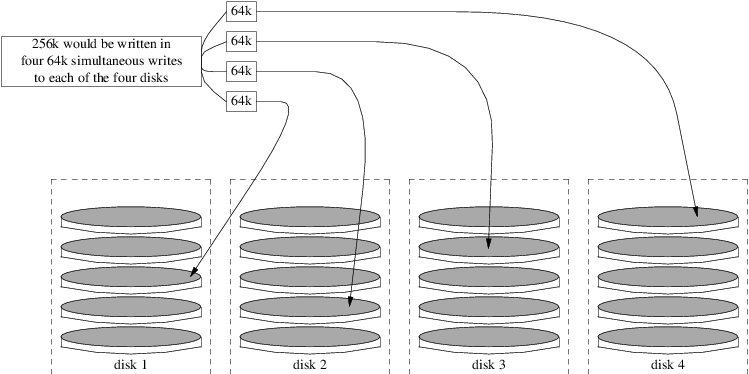

======================
19.2.?RAID0 - Striping
======================

.. raw:: html

   

19.2.?RAID0 - Striping
`Prev <geom.html>`__?
Chapter?19.?GEOM: Modular Disk Transformation Framework
?\ `Next <geom-mirror.html>`__

--------------

.. raw:: html

   

.. raw:: html

   

.. raw:: html

   

.. raw:: html

   

.. raw:: html

   

19.2.?RAID0 - Striping
----------------------

.. raw:: html

   

.. raw:: html

   

Written by Tom Rhodes and Murray Stokely.

.. raw:: html

   

.. raw:: html

   

.. raw:: html

   

Striping combines several disk drives into a single volume. Striping can
be performed through the use of hardware RAID controllers. The GEOM disk
subsystem provides software support for disk striping, also known as
RAID0, without the need for a RAID disk controller.

In RAID0, data is split into blocks that are written across all the
drives in the array. As seen in the following illustration, instead of
having to wait on the system to write 256k to one disk, RAID0 can
simultaneously write 64k to each of the four disks in the array,
offering superior I/O performance. This performance can be enhanced
further by using multiple disk controllers.

.. raw:: html

   

|Disk Striping Illustration|

.. raw:: html

   

Each disk in a RAID0 stripe must be of the same size, since I/O requests
are interleaved to read or write to multiple disks in parallel.

.. raw:: html

   

Note:
~~~~~

RAID0 does *not* provide any redundancy. This means that if one disk in
the array fails, all of the data on the disks is lost. If the data is
important, implement a backup strategy that regularly saves backups to a
remote system or device.

.. raw:: html

   

The process for creating a software, GEOM-based RAID0 on a FreeBSD
system using commodity disks is as follows. Once the stripe is created,
refer to
`gstripe(8) <http://www.FreeBSD.org/cgi/man.cgi?query=gstripe&sektion=8>`__
for more information on how to control an existing stripe.

.. raw:: html

   

.. raw:: html

   

Procedure?19.1.?Creating a Stripe of Unformatted ATA Disks

.. raw:: html

   

#. Load the ``geom_stripe.ko`` module:

   .. code:: screen

       # kldload geom_stripe

#. Ensure that a suitable mount point exists. If this volume will become
   a root partition, then temporarily use another mount point such as
   ``/mnt``.

#. Determine the device names for the disks which will be striped, and
   create the new stripe device. For example, to stripe two unused and
   unpartitioned ATA disks with device names of ``/dev/ad2`` and
   ``/dev/ad3``:

   .. code:: screen

       # gstripe label -v st0 /dev/ad2 /dev/ad3
       Metadata value stored on /dev/ad2.
       Metadata value stored on /dev/ad3.
       Done.

#. Write a standard label, also known as a partition table, on the new
   volume and install the default bootstrap code:

   .. code:: screen

       # bsdlabel -wB /dev/stripe/st0

#. This process should create two other devices in ``/dev/stripe`` in
   addition to ``st0``. Those include ``st0a`` and ``st0c``. At this
   point, a UFS file system can be created on ``st0a`` using ``newfs``:

   .. code:: screen

       # newfs -U /dev/stripe/st0a

   Many numbers will glide across the screen, and after a few seconds,
   the process will be complete. The volume has been created and is
   ready to be mounted.

#. To manually mount the created disk stripe:

   .. code:: screen

       # mount /dev/stripe/st0a /mnt

#. To mount this striped file system automatically during the boot
   process, place the volume information in ``/etc/fstab``. In this
   example, a permanent mount point, named ``stripe``, is created:

   .. code:: screen

       # mkdir /stripe
       # echo "/dev/stripe/st0a /stripe ufs rw 2 2" \
       >> /etc/fstab

#. The ``geom_stripe.ko`` module must also be automatically loaded
   during system initialization, by adding a line to
   ``/boot/loader.conf``:

   .. code:: screen

       # echo 'geom_stripe_load="YES"' >> /boot/loader.conf

.. raw:: html

   

.. raw:: html

   

.. raw:: html

   

--------------

+------------------------------------------------------------+-------------------------+----------------------------------+
| `Prev <geom.html>`__?                                      | `Up <geom.html>`__      | ?\ `Next <geom-mirror.html>`__   |
+------------------------------------------------------------+-------------------------+----------------------------------+
| Chapter?19.?GEOM: Modular Disk Transformation Framework?   | `Home <index.html>`__   | ?19.3.?RAID1 - Mirroring         |
+------------------------------------------------------------+-------------------------+----------------------------------+

.. raw:: html

   

All FreeBSD documents are available for download at
http://ftp.FreeBSD.org/pub/FreeBSD/doc/

| Questions that are not answered by the
  `documentation <http://www.FreeBSD.org/docs.html>`__ may be sent to
  <freebsd-questions@FreeBSD.org\ >.
|  Send questions about this document to <freebsd-doc@FreeBSD.org\ >.

