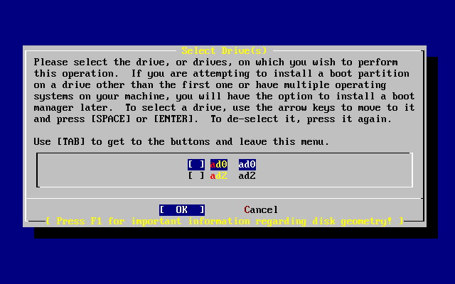
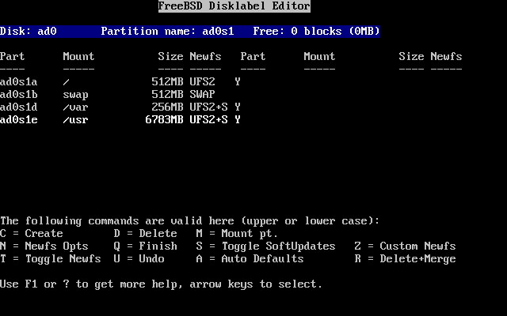

==========================
3.6.?Allocating Disk Space
==========================

.. raw:: html

   

3.6.?Allocating Disk Space
`Prev <using-sysinstall.html>`__?
Chapter?3.?Installing FreeBSD?8.\ *``X``*
?\ `Next <install-choosing.html>`__

--------------

.. raw:: html

   

.. raw:: html

   

.. raw:: html

   

.. raw:: html

   

.. raw:: html

   

3.6.?Allocating Disk Space
--------------------------

.. raw:: html

   

.. raw:: html

   

.. raw:: html

   

The first task is to allocate disk space for FreeBSD, and label that
space so that
`sysinstall(8) <http://www.FreeBSD.org/cgi/man.cgi?query=sysinstall&sektion=8>`__
can prepare it. In order to do this you need to know how FreeBSD expects
to find information on the disk.

.. raw:: html

   

.. raw:: html

   

.. raw:: html

   

.. raw:: html

   

3.6.1.?BIOS Drive Numbering
~~~~~~~~~~~~~~~~~~~~~~~~~~~

.. raw:: html

   

.. raw:: html

   

.. raw:: html

   

Before installing and configuring FreeBSD it is important to be aware
how FreeBSD deals with BIOS drive mappings.

In a PC running a BIOS-dependent operating system such as
Microsoft??Windows?, the BIOS is able to abstract the normal disk drive
order and the operating system goes along with the change. This allows
the user to boot from a disk drive other than the "primary master". This
is especially convenient for users buy an identical second hard drive,
and perform routine copies of the first drive to the second drive. If
the first drive fails, is attacked by a virus, or is scribbled upon by
an operating system defect, they can easily recover by instructing the
BIOS to logically swap the drives. It is like switching the cables on
the drives, without having to open the case.

Systems with SCSI controllers often include BIOS extensions which allow
the SCSI drives to be re-ordered in a similar fashion for up to seven
drives.

A user who is accustomed to taking advantage of these features may
become surprised when the results with FreeBSD are not as expected.
FreeBSD does not use the BIOS, and does not know the “logical BIOS drive
mapping”. This can lead to perplexing situations, especially when drives
are physically identical in geometry and have been made as data clones
of one another.

When using FreeBSD, always restore the BIOS to natural drive numbering
before installing FreeBSD, and then leave it that way. If drives need to
be switched around, take the time to open the case and move the jumpers
and cables.

.. raw:: html

   

.. raw:: html

   

.. raw:: html

   

.. raw:: html

   

.. raw:: html

   

.. raw:: html

   

.. raw:: html

   

.. raw:: html

   

.. raw:: html

   

Bill breaks-down an older Wintel box to make another FreeBSD box for
Fred. Bill installs a single SCSI drive as SCSI unit zero and installs
FreeBSD on it.

Fred begins using the system, but after several days notices that the
older SCSI drive is reporting numerous errors.

To address the situation, Bill grabs an identical SCSI drive and
installs this drive as SCSI unit four and makes an image copy from drive
zero to drive four. Now that the new drive is installed and functioning,
Bill decides to start using it, so he uses features in the SCSI BIOS to
re-order the disk drives so that the system boots from SCSI unit four.
FreeBSD boots and runs just fine.

Fred continues his work and soon decides that it is time to upgrade to a
newer version of FreeBSD. Bill removes SCSI unit zero because it was a
bit flaky and replaces it with another identical disk drive. Bill then
installs the new version of FreeBSD onto the new SCSI unit zero and the
installation goes well.

Fred uses the new version of FreeBSD for a few days, and certifies that
it is good enough for use in the engineering department. It is time to
copy all of his work from the old version, so Fred mounts SCSI unit four
which should contain the latest copy of the older FreeBSD version. Fred
is dismayed to find that none of his work is present on SCSI unit four.

It turns out that when Bill made an image copy of the original SCSI unit
zero onto SCSI unit four, unit four became the “new clone”. When Bill
re-ordered the SCSI BIOS so that he could boot from SCSI unit four,
FreeBSD was still running on SCSI unit zero. Making this kind of BIOS
change causes some or all of the boot and loader code to be fetched from
the selected BIOS drive. But when the FreeBSD kernel drivers take over,
the BIOS drive numbering is ignored, and FreeBSD transitions back to
normal drive numbering. In this example, the system continued to operate
on the original SCSI unit zero, and all of Fred's data was there, not on
SCSI unit four. The fact that the system appeared to be running on SCSI
unit four was simply an artifact of human expectations.

Fortunately, the older SCSI unit zero was retrieved and all of Fred's
work was restored.

Although SCSI drives were used in this illustration, the concepts apply
equally to IDE drives.

.. raw:: html

   

.. raw:: html

   

.. raw:: html

   

.. raw:: html

   

.. raw:: html

   

.. raw:: html

   

3.6.2.?Creating Slices Using FDisk
~~~~~~~~~~~~~~~~~~~~~~~~~~~~~~~~~~

.. raw:: html

   

.. raw:: html

   

.. raw:: html

   

After choosing to begin a standard installation in
`sysinstall(8) <http://www.FreeBSD.org/cgi/man.cgi?query=sysinstall&sektion=8>`__,
this message will appear:

.. code:: screen

                                     Message
     In the next menu, you will need to set up a DOS-style ("fdisk")
     partitioning scheme for your hard disk. If you simply wish to devote
     all disk space to FreeBSD (overwriting anything else that might be on
     the disk(s) selected) then use the (A)ll command to select the default
     partitioning scheme followed by a (Q)uit. If you wish to allocate only
     free space to FreeBSD, move to a partition marked "unused" and use the
     (C)reate command.
                                    [  OK  ]

                          [ Press enter or space ]

Press **Enter** and a list of all the hard drives that the kernel found
when it carried out the device probes will be displayed. `Figure?3.13,
“Select Drive for FDisk” <install-steps.html#sysinstall-fdisk-drive1>`__
shows an example from a system with two IDE disks called ``ad0`` and
``ad2``.

.. raw:: html

   

.. raw:: html

   

Figure?3.13.?Select Drive for FDisk

.. raw:: html

   

.. raw:: html

   

.. raw:: html

   

|Select Drive for FDisk|

.. raw:: html

   

.. raw:: html

   

.. raw:: html

   

Note that ``ad1`` is not listed here.

Consider two IDE hard disks where one is the master on the first IDE
controller and one is the master on the second IDE controller. If
FreeBSD numbered these as ``ad0`` and ``ad1``, everything would work.

But if a third disk is later added as the slave device on the first IDE
controller, it would now be ``ad1``, and the previous ``ad1`` would
become ``ad2``. Because device names are used to find filesystems, some
filesystems may no longer appear correctly, requiring a change to the
FreeBSD configuration.

To work around this, the kernel can be configured to name IDE disks
based on where they are and not the order in which they were found. With
this scheme, the master disk on the second IDE controller will *always*
be ``ad2``, even if there are no ``ad0`` or ``ad1`` devices.

This configuration is the default for the FreeBSD kernel, which is why
the display in this example shows ``ad0`` and ``ad2``. The machine on
which this screenshot was taken had IDE disks on both master channels of
the IDE controllers and no disks on the slave channels.

Select the disk on which to install FreeBSD, and then press [?OK?].
FDisk will start, with a display similar to that shown in `Figure?3.14,
“Typical Default FDisk
Partitions” <install-steps.html#sysinstall-fdisk1>`__.

The FDisk display is broken into three sections.

The first section, covering the first two lines of the display, shows
details about the currently selected disk, including its FreeBSD name,
the disk geometry, and the total size of the disk.

The second section shows the slices that are currently on the disk,
where they start and end, how large they are, the name FreeBSD gives
them, and their description and sub-type. This example shows two small
unused slices which are artifacts of disk layout schemes on the PC. It
also shows one large FAT slice, which appears as ``C:`` in Windows?, and
an extended slice, which may contain other drive letters in Windows?.

The third section shows the commands that are available in FDisk.

.. raw:: html

   

.. raw:: html

   

Figure?3.14.?Typical Default FDisk Partitions

.. raw:: html

   

.. raw:: html

   

.. raw:: html

   

|Typical Default FDisk Partitions|

.. raw:: html

   

.. raw:: html

   

.. raw:: html

   

This step varies, depending on how the disk is to be sliced.

To install FreeBSD to the entire disk, which will delete all the other
data on this disk, press **A**, which corresponds to the Use Entire Disk
option. The existing slices will be removed and replaced with a small
area flagged as ``unused`` and one large slice for FreeBSD. Then, select
the newly created FreeBSD slice using the arrow keys and press **S** to
mark the slice as being bootable. The screen will then look similar to
`Figure?3.15, “Fdisk Partition Using Entire
Disk” <install-steps.html#sysinstall-fdisk2>`__. Note the ``A`` in the
``Flags`` column, which indicates that this slice is *active*, and will
be booted from.

If an existing slice needs to be deleted to make space for FreeBSD,
select the slice using the arrow keys and press **D**. Then, press **C**
to be prompted for the size of the slice to create. Enter the
appropriate value and press **Enter**. The default value in this box
represents the largest possible slice to make, which could be the
largest contiguous block of unallocated space or the size of the entire
hard disk.

If you have already made space for FreeBSD then you can press **C** to
create a new slice. Again, you will be prompted for the size of slice
you would like to create.

.. raw:: html

   

.. raw:: html

   

Figure?3.15.?Fdisk Partition Using Entire Disk

.. raw:: html

   

.. raw:: html

   

.. raw:: html

   

|Fdisk Partition Using Entire Disk|

.. raw:: html

   

.. raw:: html

   

.. raw:: html

   

When finished, press **Q**. Any changes will be saved in
`sysinstall(8) <http://www.FreeBSD.org/cgi/man.cgi?query=sysinstall&sektion=8>`__,
but will not yet be written to disk.

.. raw:: html

   

.. raw:: html

   

.. raw:: html

   

.. raw:: html

   

.. raw:: html

   

3.6.3.?Install a Boot Manager
~~~~~~~~~~~~~~~~~~~~~~~~~~~~~

.. raw:: html

   

.. raw:: html

   

.. raw:: html

   

The next menu provides the option to install a boot manager. In general,
install the FreeBSD boot manager if:

.. raw:: html

   

-  There is more than one drive and FreeBSD will be installed onto a
   drive other than the first one.

-  FreeBSD will be installed alongside another operating system on the
   same disk, and you want to choose whether to start FreeBSD or the
   other operating system when the computer starts.

.. raw:: html

   

If FreeBSD is going to be the only operating system on this machine,
installed on the first hard disk, then the Standard boot manager will
suffice. Choose None if using a third-party boot manager capable of
booting FreeBSD.

Make a selection and press **Enter**.

.. raw:: html

   

.. raw:: html

   

Figure?3.16.?Sysinstall Boot Manager Menu

.. raw:: html

   

.. raw:: html

   

.. raw:: html

   

|Sysinstall Boot Manager Menu|

.. raw:: html

   

.. raw:: html

   

.. raw:: html

   

The help screen, reached by pressing **F1**, discusses the problems that
can be encountered when trying to share the hard disk between operating
systems.

.. raw:: html

   

.. raw:: html

   

.. raw:: html

   

.. raw:: html

   

.. raw:: html

   

3.6.4.?Creating Slices on Another Drive
~~~~~~~~~~~~~~~~~~~~~~~~~~~~~~~~~~~~~~~

.. raw:: html

   

.. raw:: html

   

.. raw:: html

   

If there is more than one drive, it will return to the Select Drives
screen after the boot manager selection. To install FreeBSD on to more
than one disk, select another disk and repeat the slice process using
FDisk.

.. raw:: html

   

Important:
~~~~~~~~~~

If installing FreeBSD on a drive other than the first drive, the FreeBSD
boot manager needs to be installed on both drives.

.. raw:: html

   

.. raw:: html

   

.. raw:: html

   

Figure?3.17.?Exit Select Drive

.. raw:: html

   

.. raw:: html

   

.. raw:: html

   

|Exit Select Drive|

.. raw:: html

   

.. raw:: html

   

.. raw:: html

   

Use **Tab** to toggle between the last drive selected, [?OK?], and
[?Cancel?].

Press **Tab** once to toggle to [?OK?], then press **Enter** to continue
with the installation.

.. raw:: html

   

.. raw:: html

   

.. raw:: html

   

.. raw:: html

   

.. raw:: html

   

3.6.5.?Creating Partitions Using Disklabel
~~~~~~~~~~~~~~~~~~~~~~~~~~~~~~~~~~~~~~~~~~

.. raw:: html

   

.. raw:: html

   

.. raw:: html

   

Next, create some partitions inside each slice. Remember that each
partition is lettered, from ``a`` through to ``h``, and that partitions
``b``, ``c``, and ``d`` have conventional meanings that should be
adhered to.

Certain applications can benefit from particular partition schemes,
especially when laying out partitions across more than one disk.
However, for a first FreeBSD installation, do not give too much thought
to how to partition the disk. It is more important to install FreeBSD
and start learning how to use it. You can always re-install FreeBSD to
change the partition scheme after becoming more familiar with the
operating system.

The following scheme features four partitions: one for swap space and
three for filesystems.

.. raw:: html

   

.. raw:: html

   

Table?3.2.?Partition Layout for First Disk

.. raw:: html

   

.. raw:: html

   

+-------------+--------------+--------------------------------+-------------------------------------------------------------------------------------------------------------------------------------------------------------------------------------------------------------------------------------------------------------------------------------------------------------------------------------------------------------------------------------------------------------------------------------------------------------------------------------------------------------------------------------------------------------------------------------------------------------------------------------------------------------------------------------------+
| Partition   | Filesystem   | Size                           | Description                                                                                                                                                                                                                                                                                                                                                                                                                                                                                                                                                                                                                                                                               |
+=============+==============+================================+===========================================================================================================================================================================================================================================================================================================================================================================================================================================================================================================================================================================================================================================================================================+
| ``a``       | ``/``        | 1?GB                           | This is the root filesystem. Every other filesystem will be mounted somewhere under this one. 1?GB is a reasonable size for this filesystem as user files should not be stored here and a regular FreeBSD install will put about 128?MB of data here.                                                                                                                                                                                                                                                                                                                                                                                                                                     |
+-------------+--------------+--------------------------------+-------------------------------------------------------------------------------------------------------------------------------------------------------------------------------------------------------------------------------------------------------------------------------------------------------------------------------------------------------------------------------------------------------------------------------------------------------------------------------------------------------------------------------------------------------------------------------------------------------------------------------------------------------------------------------------------+
| ``b``       | N/A          | 2-3 x RAM                      | The system's swap space is kept on the ``b`` partition. Choosing the right amount of swap space can be a bit of an art. A good rule of thumb is that swap space should be two or three times as much as the available physical memory (RAM). There should be at least 64?MB of swap, so if there is less than 32?MB of RAM in the computer, set the swap amount to 64?MB. If there is more than one disk, swap space can be put on each disk. FreeBSD will then use each disk for swap, which effectively speeds up the act of swapping. In this case, calculate the total amount of swap needed and divide this by the number of disks to give the amount of swap to put on each disk.   |
+-------------+--------------+--------------------------------+-------------------------------------------------------------------------------------------------------------------------------------------------------------------------------------------------------------------------------------------------------------------------------------------------------------------------------------------------------------------------------------------------------------------------------------------------------------------------------------------------------------------------------------------------------------------------------------------------------------------------------------------------------------------------------------------+
| ``e``       | ``/var``     | 512?MB to 4096?MB              | ``/var`` contains files that are constantly varying, such as log files and other administrative files. Many of these files are read from or written to extensively during FreeBSD's day-to-day running. Putting these files on another filesystem allows FreeBSD to optimize the access of these files without affecting other files in other directories that do not have the same access pattern.                                                                                                                                                                                                                                                                                       |
+-------------+--------------+--------------------------------+-------------------------------------------------------------------------------------------------------------------------------------------------------------------------------------------------------------------------------------------------------------------------------------------------------------------------------------------------------------------------------------------------------------------------------------------------------------------------------------------------------------------------------------------------------------------------------------------------------------------------------------------------------------------------------------------+
| ``f``       | ``/usr``     | Rest of disk (at least 8?GB)   | All other files will typically be stored in ``/usr`` and its subdirectories.                                                                                                                                                                                                                                                                                                                                                                                                                                                                                                                                                                                                              |
+-------------+--------------+--------------------------------+-------------------------------------------------------------------------------------------------------------------------------------------------------------------------------------------------------------------------------------------------------------------------------------------------------------------------------------------------------------------------------------------------------------------------------------------------------------------------------------------------------------------------------------------------------------------------------------------------------------------------------------------------------------------------------------------+

.. raw:: html

   

.. raw:: html

   

.. raw:: html

   

Warning:
~~~~~~~~

The values above are given as example and should be used by experienced
users only. Users are encouraged to use the automatic partition layout
called ``Auto         Defaults`` by the FreeBSD partition editor.

.. raw:: html

   

If installing FreeBSD on to more than one disk, create partitions in the
other configured slices. The easiest way to do this is to create two
partitions on each disk, one for the swap space, and one for a
filesystem.

.. raw:: html

   

.. raw:: html

   

Table?3.3.?Partition Layout for Subsequent Disks

.. raw:: html

   

.. raw:: html

   

+-------------+----------------+-------------------+----------------------------------------------------------------------------------------------------------------------------------------------------------------------------------------------------------------------------------------------------------------------------------------------------------------------------------------------------------------------------------------------------------------------------------------------------------------------------------------------------------------------------------------------------------------------------------------------------------------------------+
| Partition   | Filesystem     | Size              | Description                                                                                                                                                                                                                                                                                                                                                                                                                                                                                                                                                                                                                |
+=============+================+===================+============================================================================================================================================================================================================================================================================================================================================================================================================================================================================================================================================================================================================================+
| ``b``       | N/A            | See description   | Swap space can be split across each disk. Even though the ``a`` partition is free, convention dictates that swap space stays on the ``b`` partition.                                                                                                                                                                                                                                                                                                                                                                                                                                                                       |
+-------------+----------------+-------------------+----------------------------------------------------------------------------------------------------------------------------------------------------------------------------------------------------------------------------------------------------------------------------------------------------------------------------------------------------------------------------------------------------------------------------------------------------------------------------------------------------------------------------------------------------------------------------------------------------------------------------+
| ``e``       | /disk*``n``*   | Rest of disk      | The rest of the disk is taken up with one big partition. This could easily be put on the ``a`` partition, instead of the ``e`` partition. However, convention says that the ``a`` partition on a slice is reserved for the filesystem that will be the root (``/``) filesystem. Following this convention is not necessary, but `sysinstall(8) <http://www.FreeBSD.org/cgi/man.cgi?query=sysinstall&sektion=8>`__ uses it, so following it makes the installation slightly cleaner. This filesystem can be mounted anywhere; this example mounts it as ``/diskn``, where *``n``* is a number that changes for each disk.   |
+-------------+----------------+-------------------+----------------------------------------------------------------------------------------------------------------------------------------------------------------------------------------------------------------------------------------------------------------------------------------------------------------------------------------------------------------------------------------------------------------------------------------------------------------------------------------------------------------------------------------------------------------------------------------------------------------------------+

.. raw:: html

   

.. raw:: html

   

Having chosen the partition layout, create it using
`sysinstall(8) <http://www.FreeBSD.org/cgi/man.cgi?query=sysinstall&sektion=8>`__.

.. code:: screen

                                     Message
     Now, you need to create BSD partitions inside of the fdisk
     partition(s) just created. If you have a reasonable amount of disk
     space (1GB or more) and don't have any special requirements, simply
     use the (A)uto command to allocate space automatically. If you have
     more specific needs or just don't care for the layout chosen by
     (A)uto, press F1 for more information on manual layout.

                                    [  OK  ]
                              [ Press enter or space ]

Press **Enter** to start the FreeBSD partition editor, called Disklabel.

`Figure?3.18, “Sysinstall Disklabel
Editor” <install-steps.html#sysinstall-label>`__ shows the display when
Disklabel starts. The display is divided into three sections.

The first few lines show the name of the disk being worked on and the
slice that contains the partitions to create. At this point, Disklabel
calls this the ``Partition name`` rather than slice name. This display
also shows the amount of free space within the slice; that is, space
that was set aside in the slice, but that has not yet been assigned to a
partition.

The middle of the display shows the partitions that have been created,
the name of the filesystem that each partition contains, their size, and
some options pertaining to the creation of the filesystem.

The bottom third of the screen shows the keystrokes that are valid in
Disklabel.

.. raw:: html

   

.. raw:: html

   

Figure?3.18.?Sysinstall Disklabel Editor

.. raw:: html

   

.. raw:: html

   

.. raw:: html

   

|Sysinstall Disklabel Editor|

.. raw:: html

   

.. raw:: html

   

.. raw:: html

   

Disklabel can automatically create partitions and assign them default
sizes. The default sizes are calculated with the help of an internal
partition sizing algorithm based on the disk size. Press **A** to see a
display similar to that shown in `Figure?3.19, “Sysinstall Disklabel
Editor with Auto Defaults” <install-steps.html#sysinstall-label2>`__.
Depending on the size of the disk, the defaults may or may not be
appropriate.

.. raw:: html

   

Note:
~~~~~

The default partitioning assigns ``/tmp`` its own partition instead of
being part of the ``/`` partition. This helps avoid filling the ``/``
partition with temporary files.

.. raw:: html

   

.. raw:: html

   

.. raw:: html

   

Figure?3.19.?Sysinstall Disklabel Editor with Auto Defaults

.. raw:: html

   

.. raw:: html

   

.. raw:: html

   

|Sysinstall Disklabel Editor with Auto Defaults|

.. raw:: html

   

.. raw:: html

   

.. raw:: html

   

To replace the default partitions, use the arrow keys to select the
first partition and press **D** to delete it. Repeat this to delete all
the suggested partitions.

To create the first partition, ``a``, mounted as ``/``, make sure the
proper disk slice at the top of the screen is selected and press **C**.
A dialog box will appear, prompting for the size of the new partition,
as shown in `Figure?3.20, “Free Space for Root
Partition” <install-steps.html#sysinstall-label-add>`__. The size can be
entered as the number of disk blocks to use or as a number followed by
either ``M`` for megabytes, ``G`` for gigabytes, or ``C`` for cylinders.

.. raw:: html

   

.. raw:: html

   

Figure?3.20.?Free Space for Root Partition

.. raw:: html

   

.. raw:: html

   

.. raw:: html

   

|Free Space for Root Partition|

.. raw:: html

   

.. raw:: html

   

.. raw:: html

   

The default size shown will create a partition that takes up the rest of
the slice. If using the partition sizes described in the earlier
example, delete the existing figure using **Backspace**, and then type
in **``512M``**, as shown in `Figure?3.21, “Edit Root Partition
Size” <install-steps.html#sysinstall-label-add2>`__. Then press [?OK?].

.. raw:: html

   

.. raw:: html

   

Figure?3.21.?Edit Root Partition Size

.. raw:: html

   

.. raw:: html

   

.. raw:: html

   

|Edit Root Partition Size|

.. raw:: html

   

.. raw:: html

   

.. raw:: html

   

After choosing the partition's size, the installer will ask whether this
partition will contain a filesystem or swap space. The dialog box is
shown in `Figure?3.22, “Choose the Root Partition
Type” <install-steps.html#sysinstall-label-type>`__. This first
partition will contain a filesystem, so check that FS is selected and
press **Enter**.

.. raw:: html

   

.. raw:: html

   

Figure?3.22.?Choose the Root Partition Type

.. raw:: html

   

.. raw:: html

   

.. raw:: html

   

|Choose the Root Partition Type|

.. raw:: html

   

.. raw:: html

   

.. raw:: html

   

Finally, tell Disklabel where the filesystem will be mounted. The dialog
box is shown in `Figure?3.23, “Choose the Root Mount
Point” <install-steps.html#sysinstall-label-mount>`__. Type **``/``**,
and then press **Enter**.

.. raw:: html

   

.. raw:: html

   

Figure?3.23.?Choose the Root Mount Point

.. raw:: html

   

.. raw:: html

   

.. raw:: html

   

|Choose the Root Mount Point|

.. raw:: html

   

.. raw:: html

   

.. raw:: html

   

The display will then update to show the newly created partition. Repeat
this procedure for the other partitions. When creating the swap
partition, it will not prompt for the filesystem mount point. When
creating the final partition, ``/usr``, leave the suggested size as is
to use the rest of the slice.

The final FreeBSD DiskLabel Editor screen will appear similar to
`Figure?3.24, “Sysinstall Disklabel
Editor” <install-steps.html#sysinstall-label4>`__, although the values
chosen may be different. Press **Q** to finish.

.. raw:: html

   

.. raw:: html

   

Figure?3.24.?Sysinstall Disklabel Editor

.. raw:: html

   

.. raw:: html

   

.. raw:: html

   

|Sysinstall Disklabel Editor|

.. raw:: html

   

.. raw:: html

   

.. raw:: html

   

.. raw:: html

   

.. raw:: html

   

.. raw:: html

   

--------------

+-------------------------------------+-------------------------+---------------------------------------+
| `Prev <using-sysinstall.html>`__?   | `Up <install.html>`__   | ?\ `Next <install-choosing.html>`__   |
+-------------------------------------+-------------------------+---------------------------------------+
| 3.5.?Introducing sysinstall(8)?     | `Home <index.html>`__   | ?3.7.?Choosing What to Install        |
+-------------------------------------+-------------------------+---------------------------------------+

.. raw:: html

   

All FreeBSD documents are available for download at
http://ftp.FreeBSD.org/pub/FreeBSD/doc/

| Questions that are not answered by the
  `documentation <http://www.FreeBSD.org/docs.html>`__ may be sent to
  <freebsd-questions@FreeBSD.org\ >.
|  Send questions about this document to <freebsd-doc@FreeBSD.org\ >.

.. |Typical Default FDisk Partitions| image:: install/fdisk-edit1.png
.. |Fdisk Partition Using Entire Disk| image:: install/fdisk-edit2.png
.. |Sysinstall Boot Manager Menu| image:: install/boot-mgr.png
.. |Exit Select Drive| image:: install/fdisk-drive2.png
.. |Sysinstall Disklabel Editor| image:: install/disklabel-ed1.png
.. |Sysinstall Disklabel Editor with Auto Defaults| image:: install/disklabel-auto.png
.. |Free Space for Root Partition| image:: install/disklabel-root1.png
.. |Edit Root Partition Size| image:: install/disklabel-root2.png
.. |Choose the Root Partition Type| image:: install/disklabel-fs.png
.. |Choose the Root Mount Point| image:: install/disklabel-root3.png

