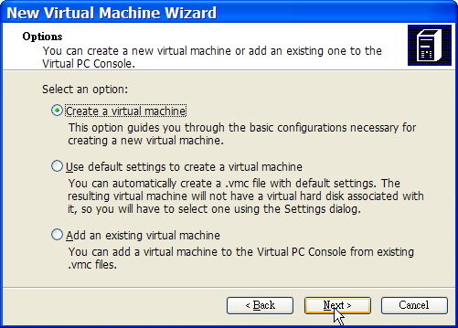
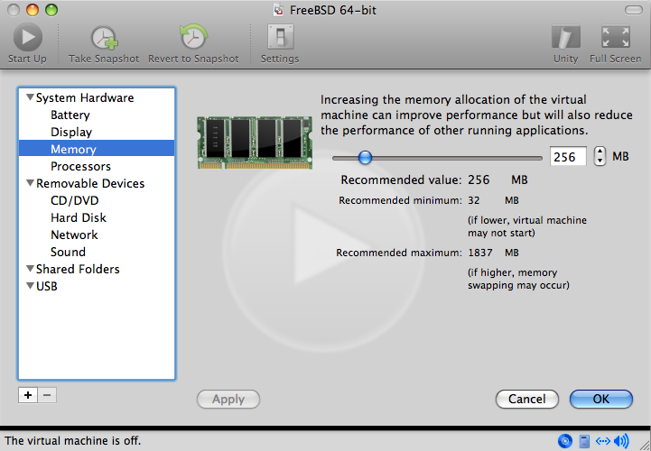

===========================
22.2.?FreeBSD as a Guest OS
===========================

.. raw:: html

   

22.2.?FreeBSD as a Guest OS
`Prev <virtualization.html>`__?
Chapter?22.?Virtualization
?\ `Next <virtualization-host-virtualbox.html>`__

--------------

.. raw:: html

   

.. raw:: html

   

.. raw:: html

   

.. raw:: html

   

.. raw:: html

   

22.2.?FreeBSD as a Guest OS
---------------------------

.. raw:: html

   

.. raw:: html

   

.. raw:: html

   

.. raw:: html

   

.. raw:: html

   

.. raw:: html

   

.. raw:: html

   

22.2.1.?Parallels on Mac?OS? X
~~~~~~~~~~~~~~~~~~~~~~~~~~~~~~

.. raw:: html

   

.. raw:: html

   

.. raw:: html

   

Parallels Desktop for Mac? is a commercial software product available
for Intel? based Apple? Mac? computers running Mac?OS? 10.4.6 or higher.
FreeBSD is a fully supported guest operating system. Once Parallels has
been installed on Mac?OS? X, the user must configure a virtual machine
and then install the desired guest operating system.

.. raw:: html

   

.. raw:: html

   

.. raw:: html

   

.. raw:: html

   

22.2.1.1.?Installing FreeBSD on Parallels/Mac?OS? X
^^^^^^^^^^^^^^^^^^^^^^^^^^^^^^^^^^^^^^^^^^^^^^^^^^^

.. raw:: html

   

.. raw:: html

   

.. raw:: html

   

The first step in installing FreeBSD on Parallels is to create a new
virtual machine for installing FreeBSD. Select FreeBSD as the Guest OS
Type when prompted:

.. raw:: html

   

|image0|

.. raw:: html

   

Choose a reasonable amount of disk and memory depending on the plans for
this virtual FreeBSD instance. 4GB of disk space and 512MB of RAM work
well for most uses of FreeBSD under Parallels:

.. raw:: html

   

|image1|

.. raw:: html

   

.. raw:: html

   

|image2|

.. raw:: html

   

.. raw:: html

   

|image3|

.. raw:: html

   

.. raw:: html

   

|image4|

.. raw:: html

   

Select the type of networking and a network interface:

.. raw:: html

   

|image5|

.. raw:: html

   

.. raw:: html

   

|image6|

.. raw:: html

   

Save and finish the configuration:

.. raw:: html

   

|image7|

.. raw:: html

   

.. raw:: html

   

|image8|

.. raw:: html

   

After the FreeBSD virtual machine has been created, FreeBSD can be
installed on it. This is best done with an official FreeBSD CD/DVD or
with an ISO image downloaded from an official FTP site. Copy the
appropriate ISO image to the local Mac? filesystem or insert a CD/DVD in
the Mac?'s CD drive. Click on the disc icon in the bottom right corner
of the FreeBSD Parallels window. This will bring up a window that can be
used to associate the CDROM drive in the virtual machine with the ISO
file on disk or with the real CDROM drive.

.. raw:: html

   

|image9|

.. raw:: html

   

Once this association with the CDROM source has been made, reboot the
FreeBSD virtual machine by clicking the reboot icon. Parallels will
reboot with a special BIOS that first checks if there is a CDROM.

.. raw:: html

   

|image10|

.. raw:: html

   

In this case it will find the FreeBSD installation media and begin a
normal FreeBSD installation. Perform the installation, but do not
attempt to configure Xorg at this time.

.. raw:: html

   

|image11|

.. raw:: html

   

When the installation is finished, reboot into the newly installed
FreeBSD virtual machine.

.. raw:: html

   

|image12|

.. raw:: html

   

.. raw:: html

   

.. raw:: html

   

.. raw:: html

   

.. raw:: html

   

.. raw:: html

   

22.2.1.2.?Configuring FreeBSD on Parallels
^^^^^^^^^^^^^^^^^^^^^^^^^^^^^^^^^^^^^^^^^^

.. raw:: html

   

.. raw:: html

   

.. raw:: html

   

After FreeBSD has been successfully installed on Mac?OS? X with
Parallels, there are a number of configuration steps that can be taken
to optimize the system for virtualized operation.

.. raw:: html

   

#. **Set Boot Loader Variables**

   The most important step is to reduce the ``kern.hz`` tunable to
   reduce the CPU utilization of FreeBSD under the Parallels
   environment. This is accomplished by adding the following line to
   ``           /boot/loader.conf``:

   .. code:: programlisting

       kern.hz=100

   Without this setting, an idle FreeBSD Parallels guest will use
   roughly 15% of the CPU of a single processor iMac?. After this change
   the usage will be closer to 5%.

#. **Create a New Kernel Configuration File**

   All of the SCSI, FireWire, and USB device drivers can be removed from
   a custom kernel configuration file. Parallels provides a virtual
   network adapter used by the
   `ed(4) <http://www.FreeBSD.org/cgi/man.cgi?query=ed&sektion=4>`__
   driver, so all network devices except for
   `ed(4) <http://www.FreeBSD.org/cgi/man.cgi?query=ed&sektion=4>`__ and
   `miibus(4) <http://www.FreeBSD.org/cgi/man.cgi?query=miibus&sektion=4>`__
   can be removed from the kernel.

#. **Configure Networking**

   The most basic networking setup uses DHCP to connect the virtual
   machine to the same local area network as the host Mac?. This can be
   accomplished by adding ``ifconfig_ed0="DHCP"`` to ``/etc/rc.conf``.
   More advanced networking setups are described in `Chapter?31,
   *Advanced Networking* <advanced-networking.html>`__.

.. raw:: html

   

.. raw:: html

   

.. raw:: html

   

.. raw:: html

   

.. raw:: html

   

.. raw:: html

   

.. raw:: html

   

22.2.2.?Virtual PC on Windows?
~~~~~~~~~~~~~~~~~~~~~~~~~~~~~~

.. raw:: html

   

.. raw:: html

   

.. raw:: html

   

Virtual PC for Windows? is a Microsoft? software product available for
free download. See this website for the `system
requirements <http://www.microsoft.com/windows/downloads/virtualpc/sysreq.mspx>`__.
Once Virtual PC has been installed on Microsoft??Windows?, the user can
configure a virtual machine and then install the desired guest operating
system.

.. raw:: html

   

.. raw:: html

   

.. raw:: html

   

.. raw:: html

   

22.2.2.1.?Installing FreeBSD on Virtual PC
^^^^^^^^^^^^^^^^^^^^^^^^^^^^^^^^^^^^^^^^^^

.. raw:: html

   

.. raw:: html

   

.. raw:: html

   

The first step in installing FreeBSD on Virtual PC is to create a new
virtual machine for installing FreeBSD. Select Create a virtual machine
when prompted:

.. raw:: html

   

|image13|

.. raw:: html

   

.. raw:: html

   

|image14|

.. raw:: html

   

Select Other as the Operating system when prompted:

.. raw:: html

   

|image15|

.. raw:: html

   

Then, choose a reasonable amount of disk and memory depending on the
plans for this virtual FreeBSD instance. 4GB of disk space and 512MB of
RAM work well for most uses of FreeBSD under Virtual PC:

.. raw:: html

   

|image16|

.. raw:: html

   

.. raw:: html

   

|image17|

.. raw:: html

   

Save and finish the configuration:

.. raw:: html

   

|image18|

.. raw:: html

   

Select the FreeBSD virtual machine and click Settings, then set the type
of networking and a network interface:

.. raw:: html

   

|image19|

.. raw:: html

   

.. raw:: html

   

|image20|

.. raw:: html

   

After the FreeBSD virtual machine has been created, FreeBSD can be
installed on it. This is best done with an official FreeBSD CD/DVD or
with an ISO image downloaded from an official FTP site. Copy the
appropriate ISO image to the local Windows? filesystem or insert a
CD/DVD in the CD drive, then double click on the FreeBSD virtual machine
to boot. Then, click CD and choose Capture ISO Image... on the Virtual
PC window. This will bring up a window where the CDROM drive in the
virtual machine can be associated with an ISO file on disk or with the
real CDROM drive.

.. raw:: html

   

|image21|

.. raw:: html

   

.. raw:: html

   

|image22|

.. raw:: html

   

Once this association with the CDROM source has been made, reboot the
FreeBSD virtual machine by clicking Action and Reset. Virtual PC will
reboot with a special BIOS that first checks for a CDROM.

.. raw:: html

   

|image23|

.. raw:: html

   

In this case it will find the FreeBSD installation media and begin a
normal FreeBSD installation. Continue with the installation, but do not
attempt to configure Xorg at this time.

.. raw:: html

   

|image24|

.. raw:: html

   

When the installation is finished, remember to eject the CD/DVD or
release the ISO image. Finally, reboot into the newly installed FreeBSD
virtual machine.

.. raw:: html

   

|image25|

.. raw:: html

   

.. raw:: html

   

.. raw:: html

   

.. raw:: html

   

.. raw:: html

   

.. raw:: html

   

22.2.2.2.?Configuring FreeBSD on Virtual PC
^^^^^^^^^^^^^^^^^^^^^^^^^^^^^^^^^^^^^^^^^^^

.. raw:: html

   

.. raw:: html

   

.. raw:: html

   

After FreeBSD has been successfully installed on Microsoft??Windows?
with Virtual PC , there are a number of configuration steps that can be
taken to optimize the system for virtualized operation.

.. raw:: html

   

#. **Set Boot Loader Variables**

   The most important step is to reduce the ``kern.hz`` tunable to
   reduce the CPU utilization of FreeBSD under the Virtual PC
   environment. This is accomplished by adding the following line to
   `` /boot/loader.conf``:

   .. code:: programlisting

       kern.hz=100

   Without this setting, an idle FreeBSD Virtual PC guest OS will use
   roughly 40% of the CPU of a single processor computer. After this
   change, the usage will be closer to 3%.

#. **Create a New Kernel Configuration File**

   All of the SCSI, FireWire, and USB device drivers can be removed from
   a custom kernel configuration file. Virtual PC provides a virtual
   network adapter used by the
   `de(4) <http://www.FreeBSD.org/cgi/man.cgi?query=de&sektion=4>`__
   driver, so all network devices except for
   `de(4) <http://www.FreeBSD.org/cgi/man.cgi?query=de&sektion=4>`__ and
   `miibus(4) <http://www.FreeBSD.org/cgi/man.cgi?query=miibus&sektion=4>`__
   can be removed from the kernel.

#. **Configure Networking**

   The most basic networking setup uses DHCP to connect the virtual
   machine to the same local area network as the Microsoft??Windows?
   host. This can be accomplished by adding ``ifconfig_de0="DHCP"`` to
   ``/etc/rc.conf``. More advanced networking setups are described in
   `Chapter?31, *Advanced Networking* <advanced-networking.html>`__.

.. raw:: html

   

.. raw:: html

   

.. raw:: html

   

.. raw:: html

   

.. raw:: html

   

.. raw:: html

   

.. raw:: html

   

22.2.3.?VMware Fusion on Mac?OS?
~~~~~~~~~~~~~~~~~~~~~~~~~~~~~~~~

.. raw:: html

   

.. raw:: html

   

.. raw:: html

   

VMware Fusion for Mac? is a commercial software product available for
Intel? based Apple? Mac? computers running Mac?OS? 10.4.9 or higher.
FreeBSD is a fully supported guest operating system. Once VMware Fusion
has been installed on Mac?OS? X, the user can configure a virtual
machine and then install the desired guest operating system.

.. raw:: html

   

.. raw:: html

   

.. raw:: html

   

.. raw:: html

   

22.2.3.1.?Installing FreeBSD on VMware Fusion
^^^^^^^^^^^^^^^^^^^^^^^^^^^^^^^^^^^^^^^^^^^^^

.. raw:: html

   

.. raw:: html

   

.. raw:: html

   

The first step is to start VMware Fusion which will load the Virtual
Machine Library. Click New to create the virtual machine:

.. raw:: html

   

|image26|

.. raw:: html

   

This will load the New Virtual Machine Assistant. Click Continue to
proceed:

.. raw:: html

   

|image27|

.. raw:: html

   

Select Other as the Operating System and either FreeBSD or FreeBSD
64-bit, as the Version when prompted:

.. raw:: html

   

|image28|

.. raw:: html

   

Choose the name of the virtual machine and the directory where it should
be saved:

.. raw:: html

   

|image29|

.. raw:: html

   

Choose the size of the Virtual Hard Disk for the virtual machine:

.. raw:: html

   

|image30|

.. raw:: html

   

Choose the method to install the virtual machine, either from an ISO
image or from a CD/DVD:

.. raw:: html

   

|image31|

.. raw:: html

   

Click Finish and the virtual machine will boot:

.. raw:: html

   

|image32|

.. raw:: html

   

Install FreeBSD as usual:

.. raw:: html

   

|image33|

.. raw:: html

   

Once the install is complete, the settings of the virtual machine can be
modified, such as memory usage:

.. raw:: html

   

Note:
~~~~~

The System Hardware settings of the virtual machine cannot be modified
while the virtual machine is running.

.. raw:: html

   

.. raw:: html

   

|image34|

.. raw:: html

   

The number of CPUs the virtual machine will have access to:

.. raw:: html

   

|image35|

.. raw:: html

   

The status of the CDROM device. Normally the CD/DVD/ISO is disconnected
from the virtual machine when it is no longer needed.

.. raw:: html

   

|image36|

.. raw:: html

   

The last thing to change is how the virtual machine will connect to the
network. To allow connections to the virtual machine from other machines
besides the host, choose Connect directly to the physical network
(Bridged). Otherwise, Share the host's internet connection (NAT) is
preferred so that the virtual machine can have access to the Internet,
but the network cannot access the virtual machine.

.. raw:: html

   

|image37|

.. raw:: html

   

After modifying the settings, boot the newly installed FreeBSD virtual
machine.

.. raw:: html

   

.. raw:: html

   

.. raw:: html

   

.. raw:: html

   

.. raw:: html

   

22.2.3.2.?Configuring FreeBSD on VMware Fusion
^^^^^^^^^^^^^^^^^^^^^^^^^^^^^^^^^^^^^^^^^^^^^^

.. raw:: html

   

.. raw:: html

   

.. raw:: html

   

After FreeBSD has been successfully installed on Mac?OS? X with VMware
Fusion, there are a number of configuration steps that can be taken to
optimize the system for virtualized operation.

.. raw:: html

   

#. **Set Boot Loader Variables**

   The most important step is to reduce the ``kern.hz`` tunable to
   reduce the CPU utilization of FreeBSD under the VMware Fusion
   environment. This is accomplished by adding the following line to
   ``/boot/loader.conf``:

   .. code:: programlisting

       kern.hz=100

   Without this setting, an idle FreeBSD VMware Fusion guest will use
   roughly 15% of the CPU of a single processor iMac?. After this
   change, the usage will be closer to 5%.

#. **Create a New Kernel Configuration File**

   All of the FireWire, and USB device drivers can be removed from a
   custom kernel configuration file. VMware Fusion provides a virtual
   network adapter used by the
   `em(4) <http://www.FreeBSD.org/cgi/man.cgi?query=em&sektion=4>`__
   driver, so all network devices except for
   `em(4) <http://www.FreeBSD.org/cgi/man.cgi?query=em&sektion=4>`__ can
   be removed from the kernel.

#. **Configure Networking**

   The most basic networking setup uses DHCP to connect the virtual
   machine to the same local area network as the host Mac?. This can be
   accomplished by adding ``ifconfig_em0="DHCP"`` to ``/etc/rc.conf``.
   More advanced networking setups are described in `Chapter?31,
   *Advanced Networking* <advanced-networking.html>`__.

.. raw:: html

   

.. raw:: html

   

.. raw:: html

   

.. raw:: html

   

.. raw:: html

   

.. raw:: html

   

.. raw:: html

   

22.2.4.?VirtualBox™ Guest Additions on a FreeBSD Guest
~~~~~~~~~~~~~~~~~~~~~~~~~~~~~~~~~~~~~~~~~~~~~~~~~~~~~~

.. raw:: html

   

.. raw:: html

   

.. raw:: html

   

The VirtualBox™ guest additions provide support for:

.. raw:: html

   

-  Clipboard sharing.

-  Mouse pointer integration.

-  Host time synchronization.

-  Window scaling.

-  Seamless mode.

.. raw:: html

   

.. raw:: html

   

Note:
~~~~~

The following commands are run in the FreeBSD guest.

.. raw:: html

   

First, install the
`emulators/virtualbox-ose-additions <http://www.freebsd.org/cgi/url.cgi?ports/emulators/virtualbox-ose-additions/pkg-descr>`__
package or port in the FreeBSD guest. This will install the port:

.. code:: screen

    # cd /usr/ports/emulators/virtualbox-ose-additions && make install clean

Add these lines to ``/etc/rc.conf``:

.. code:: programlisting

    vboxguest_enable="YES"
    vboxservice_enable="YES"

When Xorg will be used in the guest, any required supporting services
must also be enabled just as if the guest was a physical machine.
Typically, these lines would also be added to ``/etc/rc.conf``:

.. code:: programlisting

    hald_enable="YES"
    dbus_enable="YES"

See `Section?6.5, “Xorg Configuration” <x-config.html>`__ for details.

If `ntpd(8) <http://www.FreeBSD.org/cgi/man.cgi?query=ntpd&sektion=8>`__
or
`ntpdate(8) <http://www.FreeBSD.org/cgi/man.cgi?query=ntpdate&sektion=8>`__
is used, disable host time synchronization:

.. code:: programlisting

    vboxservice_flags="--disable-timesync"

Xorg will automatically recognize the ``vboxvideo`` driver. It can also
be manually entered in ``/etc/X11/xorg.conf``:

.. code:: programlisting

    Section "Device"
        ### Available Driver options are:-
        ### Values: <i>: integer, <f>: float, <bool>: "True"/"False",
        ### <string>: "String", <freq>: "<f> Hz/kHz/MHz"
        ### [arg]: arg optional
        Identifier "Card0"
        Driver "vboxvideo"
        VendorName "InnoTek Systemberatung GmbH"
        BoardName "VirtualBox Graphics Adapter"
        BusID "PCI:0:2:0"
    EndSection

To use the ``vboxmouse`` driver, adjust the mouse section in
``/etc/X11/xorg.conf``:

.. code:: programlisting

    Section "InputDevice"
        Identifier "Mouse0"
        Driver "vboxmouse"
    EndSection

HAL users should create the following
``/usr/local/etc/hal/fdi/policy/90-vboxguest.fdi`` or copy it from
``/usr/local/share/hal/fdi/policy/10osvendor/90-vboxguest.fdi``:

.. code:: programlisting

    <?xml version="1.0" encoding="utf-8"?>
    <!--
    # Sun VirtualBox
    # Hal driver description for the vboxmouse driver
    # $Id: chapter.xml,v 1.33 2012-03-17 04:53:52 eadler Exp $

        Copyright (C) 2008-2009 Sun Microsystems, Inc.

        This file is part of VirtualBox Open Source Edition (OSE, as
        available from http://www.virtualbox.org. This file is free software;
        you can redistribute it and/or modify it under the terms of the GNU
        General Public License (GPL) as published by the Free Software
        Foundation, in version 2 as it comes in the "COPYING" file of the
        VirtualBox OSE distribution. VirtualBox OSE is distributed in the
        hope that it will be useful, but WITHOUT ANY WARRANTY of any kind.

        Please contact Sun Microsystems, Inc., 4150 Network Circle, Santa
        Clara, CA 95054 USA or visit http://www.sun.com if you need
        additional information or have any questions.
    -->
    <deviceinfo version="0.2">
      <device>
        <match key="info.subsystem" string="pci">
          <match key="info.product" string="VirtualBox guest Service">
            <append key="info.capabilities" type="strlist">input</append>
        <append key="info.capabilities" type="strlist">input.mouse</append>
            <merge key="input.x11_driver" type="string">vboxmouse</merge>
        <merge key="input.device" type="string">/dev/vboxguest</merge>
          </match>
        </match>
      </device>
    </deviceinfo>

.. raw:: html

   

.. raw:: html

   

.. raw:: html

   

--------------

+-----------------------------------+--------------------------------+-----------------------------------------------------+
| `Prev <virtualization.html>`__?   | `Up <virtualization.html>`__   | ?\ `Next <virtualization-host-virtualbox.html>`__   |
+-----------------------------------+--------------------------------+-----------------------------------------------------+
| Chapter?22.?Virtualization?       | `Home <index.html>`__          | ?22.3.?FreeBSD as a Host with VirtualBox            |
+-----------------------------------+--------------------------------+-----------------------------------------------------+

.. raw:: html

   

All FreeBSD documents are available for download at
http://ftp.FreeBSD.org/pub/FreeBSD/doc/

| Questions that are not answered by the
  `documentation <http://www.FreeBSD.org/docs.html>`__ may be sent to
  <freebsd-questions@FreeBSD.org\ >.
|  Send questions about this document to <freebsd-doc@FreeBSD.org\ >.

.. |image0| image:: virtualization/parallels-freebsd1.png
.. |image1| image:: virtualization/parallels-freebsd2.png
.. |image2| image:: virtualization/parallels-freebsd3.png
.. |image3| image:: virtualization/parallels-freebsd4.png
.. |image4| image:: virtualization/parallels-freebsd5.png
.. |image5| image:: virtualization/parallels-freebsd6.png
.. |image6| image:: virtualization/parallels-freebsd7.png
.. |image7| image:: virtualization/parallels-freebsd8.png
.. |image8| image:: virtualization/parallels-freebsd9.png
.. |image9| image:: virtualization/parallels-freebsd11.png
.. |image10| image:: virtualization/parallels-freebsd10.png
.. |image11| image:: virtualization/parallels-freebsd12.png
.. |image12| image:: virtualization/parallels-freebsd13.png

.. |image14| image:: virtualization/virtualpc-freebsd2.png
.. |image15| image:: virtualization/virtualpc-freebsd3.png
.. |image16| image:: virtualization/virtualpc-freebsd4.png
.. |image17| image:: virtualization/virtualpc-freebsd5.png
.. |image18| image:: virtualization/virtualpc-freebsd6.png
.. |image19| image:: virtualization/virtualpc-freebsd7.png
.. |image20| image:: virtualization/virtualpc-freebsd8.png
.. |image21| image:: virtualization/virtualpc-freebsd9.png
.. |image22| image:: virtualization/virtualpc-freebsd10.png
.. |image23| image:: virtualization/virtualpc-freebsd11.png
.. |image24| image:: virtualization/virtualpc-freebsd12.png
.. |image25| image:: virtualization/virtualpc-freebsd13.png
.. |image26| image:: virtualization/vmware-freebsd01.png
.. |image27| image:: virtualization/vmware-freebsd02.png
.. |image28| image:: virtualization/vmware-freebsd03.png
.. |image29| image:: virtualization/vmware-freebsd04.png
.. |image30| image:: virtualization/vmware-freebsd05.png
.. |image31| image:: virtualization/vmware-freebsd06.png
.. |image32| image:: virtualization/vmware-freebsd07.png
.. |image33| image:: virtualization/vmware-freebsd08.png

.. |image35| image:: virtualization/vmware-freebsd10.png
.. |image36| image:: virtualization/vmware-freebsd11.png
.. |image37| image:: virtualization/vmware-freebsd12.png
