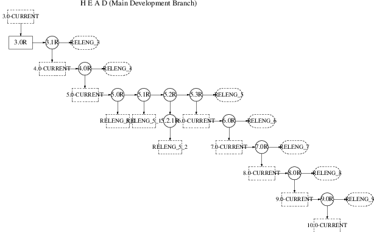

====================================
2. Proceso de ingenier?a de releases
====================================

.. raw:: html

   

2. Proceso de ingenier?a de releases
`Anterior <index.html>`__?
?
?\ `Siguiente <release-build.html>`__

--------------

.. raw:: html

   

.. raw:: html

   

.. raw:: html

   

.. raw:: html

   

.. raw:: html

   

2. Proceso de ingenier?a de releases
------------------------------------

.. raw:: html

   

.. raw:: html

   

.. raw:: html

   

Las nuevas release de FreeBSD se generan a partir de la rama -STABLE en
intervalos de aproximadamente cuatro meses. El proceso comienza a
ejecutarse 45 d?as antes de la fecha de salida, cuando el ingeniero de
releases env?a un correo eletr?nico a las listas de desarrollo de
FreeBSD para recordar a los desarrolladores que disponen de tan solo 15
d?as para integrar nuevos cambios antes de la fase de congelaci?n de
c?digo fuente. Durante este periodo de tiempo, muchos desarrolladores
realizan lo que se ha dado en llamar “barrido MFC”. MFC significa en
ingl?s “Merge From CURRENT” (Integraci?n desde CURRENT) y describe el
proceso de unificaci?n de los cambios aplicados en la rama de desarrollo
-CURRENT a nuestra rama -STABLE.

.. raw:: html

   

.. raw:: html

   

.. raw:: html

   

.. raw:: html

   

2.1. Revisi?n de C?digo
~~~~~~~~~~~~~~~~~~~~~~~

.. raw:: html

   

.. raw:: html

   

.. raw:: html

   

Treinta d?as antes del lanzamiento de una release dada el repositorio de
c?digo fuente entra en una fase de “code slush” (“c?digo aguanieve”, en
el sentido de no estar a?n congelado y ser por tanto ligeramente
moldeable). Durante este per?odo todos los commits de la rama -STABLE
deben ser aprobados por el Grupo de ingenier?a de releases
``<re@FreeBSD.org>``. Los cambios permitidos en esta fase de 15 d?as de
duraci?n son los siguientes:

.. raw:: html

   

-  Arreglo de bugs o errores.

-  Actualizaciones de la documentaci?n.

-  Parches relacionados con cualquier tipo de fallo en la seguridad.

-  Cambios peque?os en controladores de dispositivos, tales como la
   adici?n de identificadores de dispositivo.

-  Cualquier cambio adicional que el equipo de ingenier?a de releases
   considere justificado, teniendo siempre en cuenta el riesgo potencial
   que puede conllevar.

.. raw:: html

   

Despu?s de los primeros 15 d?as de c?digo “slush”, se genera una
*release candidate* (candidata a release) o “RC” para su testeo
exhaustivo por parte de la comunidad de usuarios y el c?digo fuente
entra en la fase de “code freeze” o congelamiento. En este punto resulta
mucho m?s dif?cil aceptar cambios a menos que se descubran serios fallos
de seguridad o bugs importantes. Durante esta fase, se genera al menos
una RC cada semana, hasta que la release final ve la luz. Durante el
periodo de tiempo comprendido desde el congelamiento del c?digo hasta la
generaci?n de la release final, el equipo de ingenier?a de releases se
comunica constantemente con el equipo del “security officer”, los
equipos encargados de mantener la documentaci?n y los mantenedores de
ports, para asegurarse de que los distintos componentes necesarios para
obtener una release existosa se encuentran disponibles y listos para ser
construidos.

.. raw:: html

   

.. raw:: html

   

.. raw:: html

   

.. raw:: html

   

.. raw:: html

   

2.2. Lista de tareas para la release final.
~~~~~~~~~~~~~~~~~~~~~~~~~~~~~~~~~~~~~~~~~~~

.. raw:: html

   

.. raw:: html

   

.. raw:: html

   

Cuando todos los problemas encontrados en las releases candidatas se han
corregido, se puede comenzar con el procedimiento de “pulimiento o
enbellecimiento” de la release final.

.. raw:: html

   

.. raw:: html

   

.. raw:: html

   

.. raw:: html

   

2.2.1. Creaci?n de una Rama Release
^^^^^^^^^^^^^^^^^^^^^^^^^^^^^^^^^^^

.. raw:: html

   

.. raw:: html

   

.. raw:: html

   

Como se describe en la introducci?n, la rama ``RELENG_X_Y`` es una
caracter?stica relativamente nueva de nuestra metodolog?a de generaci?n
de releases. El primer paso para crear esta rama consiste en asegurar
que el c?digo fuente utilizado “proviene” de la versi?n m?s reciente de
``RELENG_X``.

.. code:: screen

    /usr/src# cvs update -rRELENG_4 -P -d

El siguiente paso consiste en crear una etiqueta de rama, (*tag*), de
esta forma se pueden generar diferencias entre el c?digo actual y la
rama de inicio f?cilmente, utilizando CVS:

.. code:: screen

    /usr/src# cvs rtag -rRELENG_4 RELENG_4_8_BP src

Y a continuaci?n se crea la etiqueta de la rama:

.. code:: screen

    /usr/src# cvs rtag -b -rRELENG_4_8_BP RELENG_4_8 src

.. raw:: html

   

Nota:
~~~~~

*Las etiquetas ``RELENG_*`` s?lo pueden ser utilizadas por los
CVS-meisters y los ingenieros de releases.*

.. raw:: html

   

.. raw:: html

   

.. raw:: html

   

.. raw:: html

   

Una “*etiqueta o tag*” es una caracter?stica de CVS que sirve para
identificar el c?digo fuente en un determinado instante del tiempo.
Mediante el etiquetado del ?rbol, nos aseguramos de que las futuras
releases puedan generar diferencias con respecto al mismo c?digo fuente
que se utiliz? para generar las releases oficiales anteriores.

.. raw:: html

   

.. raw:: html

   

|Rama FreeBSD Development (Rama de Desarrollo)|

.. raw:: html

   

.. raw:: html

   

|Rama FreeBSD 3.x STABLE|

.. raw:: html

   

.. raw:: html

   

|Rama FreeBSD 4.x STABLE|

.. raw:: html

   

.. raw:: html

   

.. raw:: html

   

.. raw:: html

   

.. raw:: html

   

.. raw:: html

   

2.2.2. Elevaci?n del n?mero de versi?n
^^^^^^^^^^^^^^^^^^^^^^^^^^^^^^^^^^^^^^

.. raw:: html

   

.. raw:: html

   

.. raw:: html

   

Antes de que la release final se puede etiquetar, construir y antes de
que vea la luz, se deben modificar los siguientes ficheros de tal forma
que reflejen el n?mero de versi?n correcto:

.. raw:: html

   

-  ``doc/en_US.ISO8859-1/books/handbook/mirrors/chapter.xml           ``

-  ``doc/en_US.ISO8859-1/books/porters-handbook/book.xml           ``

-  ``doc/share/xml/freebsd.ent``

-  ``src/Makefile.inc1``

-  ``src/UPDATING``

-  ``src/gnu/usr.bin/groff/tmac/mdoc.local``

-  ``src/release/Makefile``

-  ``src/release/doc/en_US.ISO8859-1/share/xml/release.dsl``

-  ``src/release/doc/share/examples/Makefile.relnotesng``

-  ``src/release/doc/share/xml/release.ent``

-  ``src/share/examples/cvsup/standard-supfile``

-  ``src/sys/conf/newvers.sh``

-  ``src/sys/sys/param.h``

-  ``src/usr.sbin/pkg_install/add/main.c``

-  ``www/en/docs.xml``

-  ``www/en/cgi/ports.cgi``

-  ``ports/Tools/scripts/release/config``

.. raw:: html

   

El fichero “release notes” y el fichero “errata” tambi?n deben ajustarse
de acuerdo con la nueva release (en la rama de la release) y deben
cortarse adecuadamente en las ramas stable/currrent):

.. raw:: html

   

-  ``src/release/doc/en_US.ISO8859-1/relnotes/common/new.xml           ``

-  ``src/release/doc/en_US.ISO8859-1/errata/article.xml           ``

.. raw:: html

   

Sysinstall debe actualizarse para que proporcione el n?mero actual de
ports disponibles y la cantidad de espacio de disco requerida para
instalar dicha colecci?n de ports. Esta informaci?n se encuentra
almacenada actualmente en el fichero ``src/release/sysinstall/dist.c``.

Despu?s de construir la release se debe actualizar el n?mero almacenado
en los siguientes ficheros para anunciar la release al resto del mundo:

.. raw:: html

   

-  ``www/share/xml/includes.release.xml``

-  ``www/share/xml/includes.release.xsl``

-  ``www/en/releases/*``

-  ``www/en/releng/index.xml``

-  ``www/en/news/news.xml``

-  ``www/en/search/web.atoz``

-  ``src/share/misc/bsd-family-tree``

.. raw:: html

   

.. raw:: html

   

.. raw:: html

   

.. raw:: html

   

.. raw:: html

   

.. raw:: html

   

2.2.3. Creaci?n de las etiquetas de release
^^^^^^^^^^^^^^^^^^^^^^^^^^^^^^^^^^^^^^^^^^^

.. raw:: html

   

.. raw:: html

   

.. raw:: html

   

Cuando la release final se encuentra preparada se utiliza el siguiente
comando para crear la etiqueta (a modo de ejemplo)
``RELENG_4_8_0_RELEASE``.

.. code:: screen

    /usr/src# cvs rtag -rRELENG_4_8 RELENG_4_8_0_RELEASE src

Los gestores de los proyectos de Documentaci?n y de los Ports se
responsabilizan del correcto etiquetado de sus respectivos ?rboles
utilizando ``RELEASE_4_8_0``.

Ocasionalmente se puede presentar un apa?o o arreglo de ?ltima hora
justo *despu?s* de la creaci?n de las etiquetas finales. En la pr?ctica
esto no constituye un problema ya que CVS permite cierta manipulaci?n de
etiquetados mediante
``cvs tag -d     nombredeetiqueta nombredefichero ``. Es muy importante
que dichos cambios de ?ltima hora se etiqueten adecuadamente para que
pasen a formar parte de la nueva release. Las releases de FreeBSD deben
ser siempre “reproducibles”. Los “hacks” locales dentro del entorno de
ingenier?a de releases no est?n permitidos salvo que se efect?en
mediante una correcta manipulaci?n y notificaci?n.

.. raw:: html

   

.. raw:: html

   

.. raw:: html

   

.. raw:: html

   

--------------

+-------------------------------------------------+---------------------------+-----------------------------------------+
| `Anterior <index.html>`__?                      | ?                         | ?\ `Siguiente <release-build.html>`__   |
+-------------------------------------------------+---------------------------+-----------------------------------------+
| Proceso de generaci?n de releases en FreeBSD?   | `Inicio <index.html>`__   | ?3. Construcci?n de la Release          |
+-------------------------------------------------+---------------------------+-----------------------------------------+

.. raw:: html

   

Puede descargar ?ste y muchos otros documentos desde
ftp://ftp.FreeBSD.org/pub/FreeBSD/doc/

| Si tiene dudas sobre FreeBSD consulte la
  `documentaci?n <http://www.FreeBSD.org/docs.html>`__ antes de escribir
  a la lista <questions@FreeBSD.org\ >.
|  Env?e sus preguntas sobre la documentaci?n a <doc@FreeBSD.org\ >.

.. |Rama FreeBSD 3.x STABLE| image:: branches-releng3.png
.. |Rama FreeBSD 4.x STABLE| image:: branches-releng4.png
