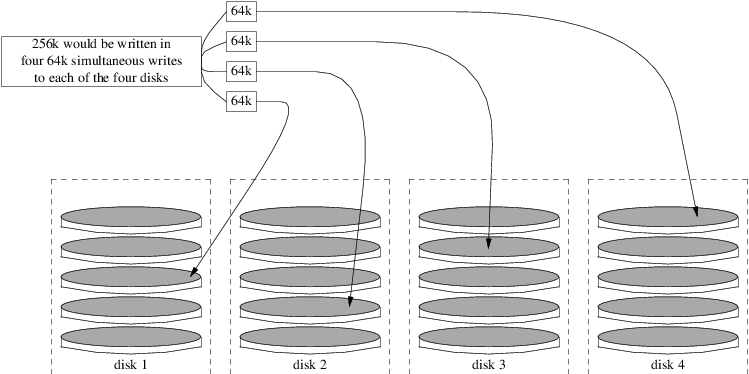

=====================================
19.3. RAID0 - Distribuci?n por bandas
=====================================

.. raw:: html

   

19.3. RAID0 - Distribuci?n por bandas
`Anterior <GEOM-intro.html>`__?
Cap?tulo 19. GEOM: Marco de trabajo modular de transformaci?n de discos
?\ `Siguiente <GEOM-mirror.html>`__

--------------

.. raw:: html

   

.. raw:: html

   

.. raw:: html

   

.. raw:: html

   

.. raw:: html

   

19.3. RAID0 - Distribuci?n por bandas
-------------------------------------

.. raw:: html

   

.. raw:: html

   

Escrito por Tom Rhodes y Murray Stokely.

.. raw:: html

   

.. raw:: html

   

.. raw:: html

   

La distribuci?n por bandas (striping) es un m?todo que se usa para
combinar varias unidades de disco en un ?nico volumen. En muchos casos,
esto se hace usando controladoras por hardware. El subsistema de discos
GEOM proporciona soporte por software para RAID0, tambi?n conocido como
discos configurados en bandas.

En un sistema RAID0, los datos se dividen en bloques que son escritos
por todas las unidades de la agrupaci?n. En lugar de tener que esperar a
que el sistema escriba 256 kB en un disco, un sistema RAID0 puede
escribir simult?neamente 64 kB en cada uno de los cuatro discos,
ofreciendo un superior rendimiento de E/S. Este rendimiento se puede
mejorar a?n m?s usando varias controladoras de disco.

Cada uno de los discos de una banda RAID0 debe ser del mismo tama?o,
pues las peticiones de E/S est?n intercaladas para leer o escribir en
varios discos en paralelo.

.. raw:: html

   

|Ilustraci? de la distribuci?n por bandas de los discos|

.. raw:: html

   

.. raw:: html

   

.. raw:: html

   

Procedimiento 19.1. Creaci?n de una banda de discos ATA sin formatear

.. raw:: html

   

#. Cargue el m?dulo ``geom_stripe``:

   .. code:: screen

       # kldload geom_stripe.ko

#. Aseg?rese de que existe un punto de montaje adecuado. Si este volumen
   se convertir? en una partici?n ra?z, utilice temporalmente otro punto
   de montaje, como ``/mnt``.

   .. code:: screen

       # mkdir /mnt

#. Determine los nombres de dispositivo de los discos que ser?n
   configurados en bandas, y cree el nuevo dispositivo de banda. Por
   ejemplo, podr?a utilizar la siguiente orden para configurar en bandas
   dos discos ATA sin usar ni particionar: ``/dev/ad2`` y ``/dev/ad3``.

   .. code:: screen

       # gstripe label -v st0 /dev/ad2 /dev/ad3

#. Si se va a usar este volumen como dispositivo ra?z para arrancar el
   sistema, debe ejecutar la siguiente orden antes de crear el sistema
   de ficheros:

   .. code:: screen

       # fdisk -vBI /dev/stripe/st0

#. Se debe crear una tabla de particiones en el nuevo volumen con la
   siguiente orden:

   .. code:: screen

       # bsdlabel -wB /dev/stripe/st0

#. Aadem?s del dispositivo ``st0``, este proceso deber?a haber creado
   otros dos dispositivos en el directorio ``/dev/stripe``, incluyendo
   ``st0a`` y ``st0c``. Ahora se debe crear un sistema de ficheros en el
   dispositivo ``st0a`` usando la siguiente orden ``newfs``:

   .. code:: screen

       # newfs -U /dev/stripe/st0a

   Por la pantalla se deslizar?n muchos n?meros, y al cabo de unos pocos
   segundos, el proceso habr? finalizado. El volumen ha sido creado y
   est? preparado para ser montado:

.. raw:: html

   

Se puede usar la siguiente orden para montar manualmente una banda de
discos reci?n creada:

.. code:: screen

    # mount /dev/stripe/st0a /mnt

Para montar autom?ticamente este sistema de ficheros distribuido por
bandas durante el proceso de arranque, ponga la informaci?n del volumen
en el fichero ``/etc/fstab``:

.. code:: screen

    # echo "/dev/stripe/st0a /mnt ufs rw 2 2" \
        >> /etc/fstab

Tambi?n se debe cargar autom?ticamente durante la inicializaci?n del
sistema el m?dulo geom, a?adiendo una l?nea a ``/boot/loader.conf``:

.. code:: screen

    # echo 'geom_stripe_load="YES"' >> /boot/loader.conf

.. raw:: html

   

.. raw:: html

   

--------------

+-----------------------------------+---------------------------+---------------------------------------+
| `Anterior <GEOM-intro.html>`__?   | `Subir <GEOM.html>`__     | ?\ `Siguiente <GEOM-mirror.html>`__   |
+-----------------------------------+---------------------------+---------------------------------------+
| 19.2. Introducci?n a GEOM?        | `Inicio <index.html>`__   | ?19.4. RAID1 - Replicaci?n            |
+-----------------------------------+---------------------------+---------------------------------------+

.. raw:: html

   

Puede descargar ?ste y muchos otros documentos desde
ftp://ftp.FreeBSD.org/pub/FreeBSD/doc/

| Si tiene dudas sobre FreeBSD consulte la
  `documentaci?n <http://www.FreeBSD.org/docs.html>`__ antes de escribir
  a la lista <questions@FreeBSD.org\ >.
|  Env?e sus preguntas sobre la documentaci?n a <doc@FreeBSD.org\ >.

