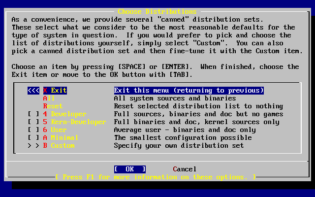

=============================
2.7. Elecci?n de qu? instalar
=============================

.. raw:: html

   

2.7. Elecci?n de qu? instalar
`Anterior <install-steps.html>`__?
Cap?tulo 2. Instalaci?n de FreeBSD
?\ `Siguiente <install-media.html>`__

--------------

.. raw:: html

   

.. raw:: html

   

.. raw:: html

   

.. raw:: html

   

.. raw:: html

   

2.7. Elecci?n de qu? instalar
-----------------------------

.. raw:: html

   

.. raw:: html

   

.. raw:: html

   

.. raw:: html

   

.. raw:: html

   

.. raw:: html

   

.. raw:: html

   

2.7.1. Elecci?n del tipo de instalaci?n
~~~~~~~~~~~~~~~~~~~~~~~~~~~~~~~~~~~~~~~

.. raw:: html

   

.. raw:: html

   

.. raw:: html

   

La elecci?n de qu? tipo de instalaci?n debe hacer depende enormemente
del uso que se va a dar al sistema y del espacio de disco disponible. El
rango de opciones predefinidas est? entre hacer la instalaci?n m?s
peque?a posible o instalarlo todo. Las personas con poco o ninguna
experiencia en UNIX? o FreeBSD deber?n elegir alguna de las opciones
predefinidas que se les ofrecen, a las que llamaremos distribuciones (de
?distribution set?) tal y como aparecen en el men? de sysinstall. Una
instalaci?n ?a medida es algo m?s adecuado para para usuarios con m?s
experiencia.

Si pulsa **F1** podr? acceder a m?s informaci?n sobre las opciones de
tipo de instalaci?n y qu? contiene cada distribuci?n. Cuando acabe de
consultar la ayuda pulse **Intro** y volver? al al men? de selecci?n de
instalaci?n de distribuciones.

Si tiene intenci?n de instalar un interfaz gr?fico de usuario tendr? que
instalar una de las distribuciones cuyo nombre comienza por ``X``. La
configuraci?n del servidor X y la selecci?n de un entorno de escritorio
son algunas de las tareas que tendr? una vez instalado FreeBSD. Tiene
m?s informaci?n sobre la configuraci?n de un servidor X en `Cap?tulo?5,
*El sistema X Window* <x11.html>`__.

La versi?n de X11 por omisi?n en FreeBSD es Xorg.

Si preve compilar un kernel a medida selecciones la opci?n que incluye
el c?digo fuente. Para m?s informaci?n sobre las razones por las que
debe compilarse un kernel a medida y sobre c?mo compilarlo consulte el
`Cap?tulo?8, *Configuraci?n del kernel de
FreeBSD* <kernelconfig.html>`__.

Evidentemente el sistema m?s vers?til es aqu?l que lo tiene todo. Si
dispone de espacio de disco suficiente seleccione All, como se muestra
en la `Figura?2.24, “Elecci?n de
distribuciones” <install-choosing.html#distribution-set1>`__, usando las
flechas y pulsando **Intro**. Si el espacio en disco es limitado piense
en usar alguna de las otras opciones. No pierda con ello demasiado
tiempo puesto que el resto de distribuciones pueden a?adirse en
cualquier momento tras la intalaci?n.

.. raw:: html

   

.. raw:: html

   

Figura 2.24. Elecci?n de distribuciones

.. raw:: html

   

.. raw:: html

   

.. raw:: html

   

|Elecci?n de distribuciones|

.. raw:: html

   

.. raw:: html

   

.. raw:: html

   

.. raw:: html

   

.. raw:: html

   

.. raw:: html

   

.. raw:: html

   

.. raw:: html

   

2.7.2. Instalaci?n de la colecci?n de ports
~~~~~~~~~~~~~~~~~~~~~~~~~~~~~~~~~~~~~~~~~~~

.. raw:: html

   

.. raw:: html

   

.. raw:: html

   

Tras seleccionar la distribuci?n elegida se le presentar? la opci?n de
instalar el ?rbol de ports, o Colecci?n de Ports, de FreeBSD. Los ports
son una forma f?cil y c?moda de instalar software. El ?rbol de ports no
contiene el c?digo fuente necesario para compilar software; es una gran
colecci?n de ficheros que automatiza la descarga, la compilaci?n y la
instalaci?n de paquetes de software de todo tipo. El `Cap?tulo?4,
*Instalaci?n de aplicaciones: ?packages? y ports* <ports.html>`__
explica con detalle c?mo utilizar los ports.

El programa de instalaci?n no comprueba si tiene espacio suficiente.
Seleccione esta opci?n si dispone de sitio en el disco. En FreeBSD 10.1
los ports ocupan cerca de 500?MB en disco. Puede asumir tranquilamente
que en las nuevas versiones del sistema ir?n ocupando m?s y m?s.

.. code:: screen

                             User Confirmation Requested
     Would you like to install the FreeBSD ports collection?

     This will give you ready access to over 24,000 ported software packages,
     at a cost of around 500?MB of disk space when "clean" and possibly much
     more than that if a lot of the distribution tarballs are loaded
     (unless you have the extra CDs from a FreeBSD CD/DVD distribution
     available and can mount it on /cdrom, in which case this is far less
     of a problem).

     The Ports Collection is a very valuable resource and well worth having
     on your /usr partition, so it is advisable to say Yes to this option.

     For more information on the Ports Collection & the latest ports,
     visit:
         http://www.FreeBSD.org/ports

                                  [ Yes ]     No

Es decir:

.. code:: screen

     Petici?n de confirmaci?n del usuario
     ?Quiere instalar la colecci?n de ports de FreeBSD?

     Tendr? acceso inmediato a m?s de 24,000 paquetes de software listos
     para usarse en FreeBSD, aunque necesitar? cerca de 500?MB de
     espacio en disco como m?nimo y posiblemente mucho m?s
     si descarga los 'tarballs' de c?digo fuente (aunque si tiene los CD
     extra de una versi?n de FreeBSD en CD/DVD puede montarlos en /cdrom, de forma
     que esto dejar?a de ser un problema).

     La colecci?n de ports es un recurso extremadamente valioso y es muy
     recomendable que la instale en su partici?n /usr, as? que deber?a
     responder S? a la siguiente pregunta.

     Si quiere estar al tanto de las ?ltimas novedades y las ?ltimas
     entradas en la colecci?n de ports visite:
         http://www.FreeBSD.org/ports

                                  [ Yes ]     No

Seleccione [?Yes?] con las flechas e instale los ports o [?No?] para
obviar la pregunta. Pulse **Intro** para seguir con la instalaci?n.
Volvemos al men? de elecci?n de distribuciones.

.. raw:: html

   

.. raw:: html

   

Figura 2.25. Confirmar la elecci?n de distribuciones

.. raw:: html

   

.. raw:: html

   

.. raw:: html

   

|Confirmar la elecci?n de distribuciones|

.. raw:: html

   

.. raw:: html

   

.. raw:: html

   

Si ya ha elegido todo lo que necesita seleccione Exit con las flechas,
aseg?rese de que [?OK?] est? seleccionado tambi?n y pulse **Intro**.

.. raw:: html

   

.. raw:: html

   

.. raw:: html

   

--------------

+----------------------------------------+----------------------------+-------------------------------------------+
| `Anterior <install-steps.html>`__?     | `Subir <install.html>`__   | ?\ `Siguiente <install-media.html>`__     |
+----------------------------------------+----------------------------+-------------------------------------------+
| 2.6. Asignaci?n de espacio en disco?   | `Inicio <index.html>`__    | ?2.8. Elecci?n del medio de instalaci?n   |
+----------------------------------------+----------------------------+-------------------------------------------+

.. raw:: html

   

Puede descargar ?ste y muchos otros documentos desde
ftp://ftp.FreeBSD.org/pub/FreeBSD/doc/

| Si tiene dudas sobre FreeBSD consulte la
  `documentaci?n <http://www.FreeBSD.org/docs.html>`__ antes de escribir
  a la lista <questions@FreeBSD.org\ >.
|  Env?e sus preguntas sobre la documentaci?n a <doc@FreeBSD.org\ >.

.. |Confirmar la elecci?n de distribuciones| image:: install/dist-set2.png
