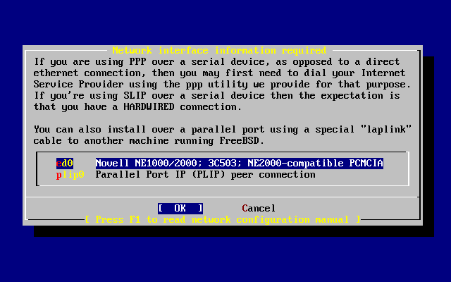
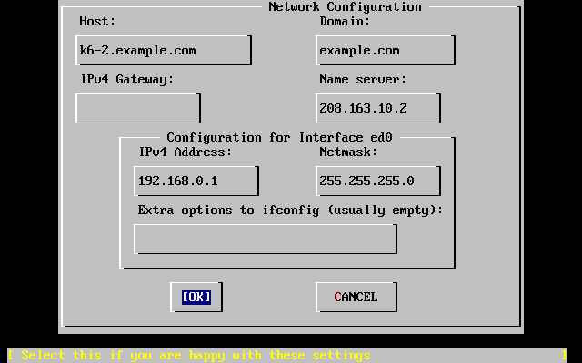
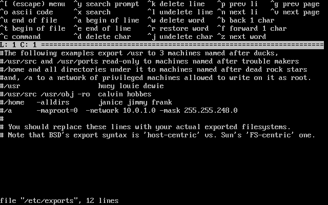
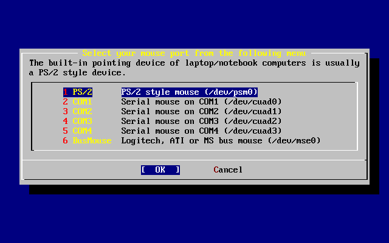
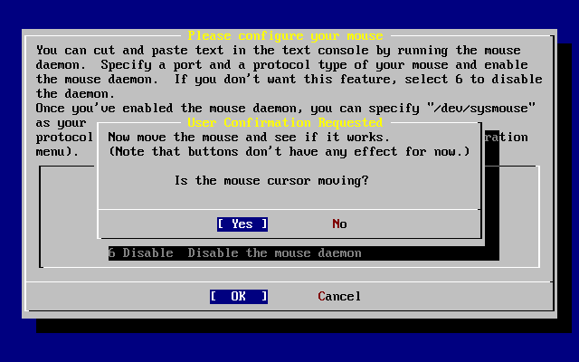
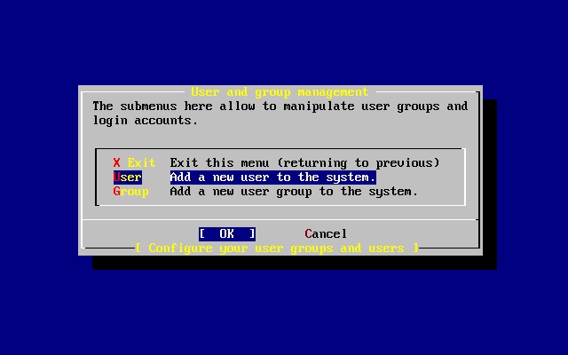
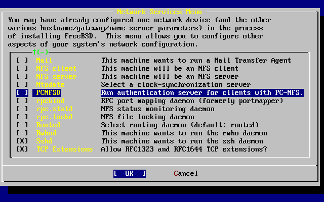

===============================
2.10. Despu?s de la instalaci?n
===============================

.. raw:: html

   

2.10. Despu?s de la instalaci?n
`Anterior <install-final-warning.html>`__?
Cap?tulo 2. Instalaci?n de FreeBSD
?\ `Siguiente <install-trouble.html>`__

--------------

.. raw:: html

   

.. raw:: html

   

.. raw:: html

   

.. raw:: html

   

.. raw:: html

   

2.10. Despu?s de la instalaci?n
-------------------------------

.. raw:: html

   

.. raw:: html

   

.. raw:: html

   

Para poder terminar una instalaci?n de FreeBSD que merezca tal nombre
debemos responder todav?a a unas cuantas preguntas. Para ello debemos
entrar en la configuraci?n antes de entrar en el nuevo sistema FreeBSD o
una vez en dentro del sistema desde ``sysinstall``, seleccionando
Configure.

.. raw:: html

   

.. raw:: html

   

.. raw:: html

   

.. raw:: html

   

2.10.1. Network Device Configuration
~~~~~~~~~~~~~~~~~~~~~~~~~~~~~~~~~~~~

.. raw:: html

   

.. raw:: html

   

.. raw:: html

   

Si ha tenido que configurar PPP para poder instalar desde FTP esta
pantalla no aparecer?. Puede modificar la configuraci?n tal y como se ha
explicado m?s arriba.

Si necesita informaci?n sobre redes de ?rea local y la configuraci?n de
FreeBSD necesaria para que haga de ?gateway/router? consulte el
`Advanced Networking <advanced-networking.html>`__ chapter.

.. code:: screen

                          User Confirmation Requested
       Would you like to configure any Ethernet or SLIP/PPP network devices?

                                 [ Yes ]   No

Si quiere configurar dispositivos de red seleccione [?Yes?] y pulse
**Intro**. Si no quiere seleccione [?No?].

.. raw:: html

   

.. raw:: html

   

Figura 2.27. Selecci?n de un dispositivo Ethernet

.. raw:: html

   

.. raw:: html

   

.. raw:: html

   

|Selecci?n de un dispositivo Ethernet|

.. raw:: html

   

.. raw:: html

   

.. raw:: html

   

Seleccione con las flechas el interfaz de red que desea configurar y
pulse **Enter**.

.. code:: screen

                          User Confirmation Requested
           Do you want to try IPv6 configuration of the interface?

                                  Yes   [ No ]

En la red local del ejemplo el tipo de protocolo de Internet que hab?a
(IPv4) parec?a m?s que suficiente, as? que se eligi? [?No?].

Si puede conectar con alguna red IPv6 mediante un servidor RA elija
[?Yes?] y pulse **Intro**. La b?squeda de servidores RA se har? en unos
instantes.

.. code:: screen

                                 User Confirmation Requested
            Do you want to try DHCP configuration of the interface?

                                  Yes   [ No ]

Si no necesita DHCP seleccione [?No?] con las flechas y pulse **Intro**.

Si selecciona [?Yes?] ejecutar? dhclient y, si ha funcionado, completar?
los datos de configuraci?n autom?ticamente. Para m?s informaci?n
consulte la `Secci?n?29.10, “DHCP” <network-dhcp.html>`__.

La siguiente ilustraci?n muestra la configuraci?n de un dispositivo
Ethernet en un sistema que cumplir? las funciones de ?gateway? en una
red local.

.. raw:: html

   

.. raw:: html

   

Figura 2.28. Configuraci?n de ed0

.. raw:: html

   

.. raw:: html

   

.. raw:: html

   

|Configuraci?n de ed0|

.. raw:: html

   

.. raw:: html

   

.. raw:: html

   

Use el **tabulador** para ir pasando de un campo al siguiente una vez
que los vaya rellenando:

.. raw:: html

   

Host
    El nombre de la m?quina; por ejemplo, ``k6-2.ejemplo.com``.

Dominio
    El nombre del dominio al que pertenece la m?quina, en este caso
    ``ejemplo.com``.

?Gateway?IPv4
    La direcci?n IP del sistema que reenvia paquetes a destinos fuera de
    la red local. Debe rellenar este campo si esta funci?n la realiza
    una m?quina que forme parte de la red. *D?jelo en blanco* si el
    sistema es el enlace de su red con Internet. El ?gateway? recibe
    tambi?n los nombres de puerta de enlace o ruta por omisi?n.

Servidor de nombres
    Direcci?n IP de su servidor local de DNS. En la red del ejemplo no
    hay servidor DNS local as? que se ha introducido la direcci?n IP del
    servidor DNS del proveedor de Internet: ``208.163.10.2``.

Direcci?n IPv4
    En este interfaz se usar? la direcci?n IP ``192.168.0.1``

M?scara de red
    En esta red local se usa un bloque de redes de Clase C
    ``192.168.0.0`` - ``192.168.0.255``. La m?scara de red es, por
    tanto, ``255.255.255.0``.

Opciones adicionales de ifconfig
    Cualquiera de las opciones que quiera agregar a su interfaz mediante
    ``ifconfig``. En nuestro caso no hab?a ninguna.

.. raw:: html

   

Utilice el **tabulador** para seleccionar [?OK?] cuando haya acabado y
pulse**Intro**.

.. code:: screen

                          User Confirmation Requested
            Would you like to Bring Up the ed0 interface right now?

                                 [ Yes ]   No

Seleccione [?Yes?] y pulse **Enter** si quiere conectar inmediatamente
su sistema a la red mediante el o los interfaces que acaba de
configurar, pero recuerde que a?n tendr? que reiniciar la m?quina.

.. raw:: html

   

.. raw:: html

   

.. raw:: html

   

.. raw:: html

   

.. raw:: html

   

2.10.2. Configuraci?n del ?gateway?
~~~~~~~~~~~~~~~~~~~~~~~~~~~~~~~~~~~

.. raw:: html

   

.. raw:: html

   

.. raw:: html

   

.. code:: screen

                           User Confirmation Requested
           Do you want this machine to function as a network gateway?

                                  [ Yes ]    No

Si el sistema har? de enlace de la red local y reenviar? paquetes entre
otras m?quinas elija [?Yes?] y pulse **Intro**. Si la m?quina es un nodo
de una red elija [?No?] y pulse **Intro**.

.. raw:: html

   

.. raw:: html

   

.. raw:: html

   

.. raw:: html

   

.. raw:: html

   

2.10.3. Configuraci?n de servicios de internet
~~~~~~~~~~~~~~~~~~~~~~~~~~~~~~~~~~~~~~~~~~~~~~

.. raw:: html

   

.. raw:: html

   

.. raw:: html

   

.. code:: screen

                          User Confirmation Requested
    Do you want to configure inetd and the network services that it provides?

                                   Yes   [ No ]

Si selecciona [?No?] varios servicios de la m?quina, como telnetd y
otros, no se activar?n. Eso significa que los usuarios remotos no podr?n
acceder al sistema mediante telnet. Los usuarios locales, en cambio,
podr?n acceder a sistemas remotos mediante telnet.

Dichos servicios pueden activarse en cualquier momento editando
``/etc/inetd.conf`` con el editor de texto que prefiera. Para m?s
informaci?n consulte la `Secci?n?29.14.1,
“Resumen” <network-inetd.html#network-inetd-overview>`__.

Seleccione [?Yes?] si desea configurar estos servicios durante la
instalaci?n. Se le mostrar? el siguiente mensaje:

.. code:: screen

                          User Confirmation Requested
    The Internet Super Server (inetd) allows a number of simple Internet
    services to be enabled, including finger, ftp and telnetd.  Enabling
    these services may increase risk of security problems by increasing
    the exposure of your system.

    With this in mind, do you wish to enable inetd?

                                 [ Yes ]   No

Select [?Yes?] to continue.

.. code:: screen

                          User Confirmation Requested
    inetd(8) relies on its configuration file, /etc/inetd.conf, to determine
    which of its Internet services will be available.  The default FreeBSD
    inetd.conf(5) leaves all services disabled by default, so they must be
    specifically enabled in the configuration file before they will
    function, even once inetd(8) is enabled.  Note that services for
    IPv6 must be separately enabled from IPv4 services.

    Select [Yes] now to invoke an editor on /etc/inetd.conf, or [No] to
    use the current settings.

                                 [ Yes ]   No

Es decir:

.. code:: screen

          Petici?n de confirmaci?n del usuario
    El Super Servidor de Internet (inetd) le permite activar diversos
    servicios sencillos de Internet, como finger, ftp y telnetd.  Si
    activa tales servicios puede sobreexponer su sistema al exterior, lo
    que puede incrementar el riesgo de tener problemas de seguridad.

    Dicho esto ?desea activar inetd?

                                 [ Yes ]   No

Si selecciona [?Yes?] podr? a?adir servicios borrando caracteres ``#``
al comienzo de las l?neas correspondientes.

.. raw:: html

   

.. raw:: html

   

Figura 2.29. Edici?n de ``inetd.conf``

.. raw:: html

   

.. raw:: html

   

.. raw:: html

   

|Edici?n de inetd.conf|

.. raw:: html

   

.. raw:: html

   

.. raw:: html

   

Una vez que haya a?adido los servicios que quiera en el sistema pulse
**Esc** y ver? un men? en el que se le preguntar? si quiere guardar los
cambios.

.. raw:: html

   

.. raw:: html

   

.. raw:: html

   

.. raw:: html

   

.. raw:: html

   

2.10.4. Activar el acceso al sistema mediante SSH
~~~~~~~~~~~~~~~~~~~~~~~~~~~~~~~~~~~~~~~~~~~~~~~~~

.. raw:: html

   

.. raw:: html

   

.. raw:: html

   

.. code:: screen

                          User Confirmation Requested
                      Would you like to enable SSH login?
                               Yes        [  No  ]

Si selecciona [?Yes?] activar?
`sshd(8) <http://www.FreeBSD.org/cgi/man.cgi?query=sshd&sektion=8>`__,
el d?mon de OpenSSH. De este modo ser? posible el acceso remoto y seguro
al sistema. Para m?s informaci?n sobre OpenSSH visite `Secci?n?14.11,
“OpenSSH” <openssh.html>`__.

.. raw:: html

   

.. raw:: html

   

.. raw:: html

   

.. raw:: html

   

.. raw:: html

   

2.10.5. FTP an?nimo
~~~~~~~~~~~~~~~~~~~

.. raw:: html

   

.. raw:: html

   

.. raw:: html

   

.. code:: screen

                          User Confirmation Requested
     Do you want to have anonymous FTP access to this machine?

                                  Yes    [ No ]

.. raw:: html

   

.. raw:: html

   

.. raw:: html

   

.. raw:: html

   

2.10.5.1. Rechazar el acceso al sistema mediante FTP an?nimo
^^^^^^^^^^^^^^^^^^^^^^^^^^^^^^^^^^^^^^^^^^^^^^^^^^^^^^^^^^^^

.. raw:: html

   

.. raw:: html

   

.. raw:: html

   

si acepta la respuesta por omisi?n ([?No?]) y pulsa **Intro** tenga en
cuenta que los usuarios que tengan cuenta en la m?quina podr?n seguir
accediendo al sistema.

.. raw:: html

   

.. raw:: html

   

.. raw:: html

   

.. raw:: html

   

.. raw:: html

   

2.10.5.2. Aceptar el acceso al sistema mediante FTP an?nimo
^^^^^^^^^^^^^^^^^^^^^^^^^^^^^^^^^^^^^^^^^^^^^^^^^^^^^^^^^^^

.. raw:: html

   

.. raw:: html

   

.. raw:: html

   

Si decide aceptar conexiones FTP an?nimas cualquiera podr? conectarse al
sistema. Antes de activar esta opci?n deber?a meditar sobre las
implicaciones de seguridad de esa decisi?n. Para m?s informaci?n sobre
la seguridad y FreeBSD consulte el `Cap?tulo?14,
*Seguridad* <security.html>`__.

Si ha decidido activar el FTP an?nimo seleccione con las flechas [?Yes?]
y pulse **Intro**. Ver? la siguiente pantalla (o una muy similar):

.. code:: screen

    This screen allows you to configure the anonymous FTP user.

    The following configuration values are editable:

    UID:     The user ID you wish to assign to the anonymous FTP user.
             All files uploaded will be owned by this ID.

    Group:   Which group you wish the anonymous FTP user to be in.

    Comment: String describing this user in /etc/passwd

    FTP Root Directory:

            Where files available for anonymous FTP will be kept.

    Upload subdirectory:

            Where files uploaded by anonymous FTP users will go.

Es decir:

.. code:: screen

    En esta pantalla puede configurar el usuario de FTP
            an?nimo.

    Puede editar los siguientes valores de la configuraci?n:

    UID:     El ID del usuario que quiere asignar al usuario an?nimo de
             de FTP.  Todos los ficheros que se suban le  pertenecer?n.

    Group:   El grupo al que pertenecer? el usuario FTP an?nimo.

    Comment: La descripci?n del usuario en /etc/passwd

    FTP Root Directory:

            D?nde se guardar?n contenidos para los usuarios an?nimos.

    Upload subdirectory:

            D?nde se guardar?n los ficheros que suban los usuarios
        de FTP an?nimo.

Por omisi?n el directorio ra?z del ftp ser? ``/var``. Si no hay sitio
suficiente para lo que prevea que va a necesitar puede usar ``/usr``;
puede poner el Directorio Ra?z de FTP en ``/usr/ftp``.

Cuando haya terminado con la configuraci?n pulse **Intro**.

.. code:: screen

                              User Confirmation Requested
             Create a welcome message file for anonymous FTP users?

                                  [ Yes ]    No

Si selecciona [?Yes?] y pulsa **Intro** arrancar? autom?ticamente un
editor y podr? crear un mensaje que ver? los usuarios de FTP an?nimo al
conectarse a la m?quina.

.. raw:: html

   

.. raw:: html

   

Figura 2.30. Edici?n del mensaje de bienvenida de FTP

.. raw:: html

   

.. raw:: html

   

.. raw:: html

   

|Edici?n del mensaje de bienvenida de FTP|

.. raw:: html

   

.. raw:: html

   

.. raw:: html

   

Vemos en acci?n un editor de texto llamado ``ee``. Puede modificar el
mensaje ahora mismo o hacerlo en cualquier otro momento con el editor de
texto que prefiera. Observe el fichero y su ubicaci?n en la parte baja
de la pantalla.

Pulse **Esc**, aparecer? una ventana flotante con la opci?n por omisi?n
de to a) leave editor (salir del editor). Pulse **Intro** si quiere
salir y seguir con lo que estaba haciendo. Pulse **Intro** de nuevo para
guardar los cambios que hubiera hecho.

.. raw:: html

   

.. raw:: html

   

.. raw:: html

   

.. raw:: html

   

.. raw:: html

   

.. raw:: html

   

2.10.6. Configuraci?n de NFS
~~~~~~~~~~~~~~~~~~~~~~~~~~~~

.. raw:: html

   

.. raw:: html

   

.. raw:: html

   

NFS (?Network File System? (de Network File System, o Sistema de
Ficheros en Red) le permitir? compartir ficheros a trav?s de una red.
Una m?quina puede configurarse como servidor, como cliente o ambos. Para
m? informaci?n consulte la `Secci?n?29.6, “NFS” <network-nfs.html>`__.

.. raw:: html

   

.. raw:: html

   

.. raw:: html

   

.. raw:: html

   

2.10.6.1. Servidor NFS
^^^^^^^^^^^^^^^^^^^^^^

.. raw:: html

   

.. raw:: html

   

.. raw:: html

   

.. code:: screen

                           User Confirmation Requested
     Do you want to configure this machine as an NFS server?

                                  Yes    [ No ]

Si no tiene necesidad de usar un servidor NFS seleccione [?No?] y pulse
**Intro**.

Si ha elegido [?Yes?] ver? un mensaje emergente indicando que hay que
crear el fichero ``exports``.

.. code:: screen

                                   Message
    Operating as an NFS server means that you must first configure an
    /etc/exports file to indicate which hosts are allowed certain kinds of
    access to your local filesystems.
    Press [Enter] now to invoke an editor on /etc/exports
                                   [ OK ]

Es decir:

.. code:: screen

                                   Mensaje
    Hacer funcionar un servidor NFS implica que tendr? que configurar
    un fichero /etc/exports para indicar qu? hosts estar?n autorizados a
    acceder de qu? manera a sus sistemas de ficheros locales.
    Pulse [Intro] para abrir /etc/exports en un editor
                                   [ OK ]

Pulse **Intro** para seguir adelante. Se abrir? un editor de texto
gracias al cual se podr? editar y crear el fichero ``exports``.

.. raw:: html

   

.. raw:: html

   

Figura 2.31. Edici?n de ``exports``

.. raw:: html

   

.. raw:: html

   

.. raw:: html

   

|Edici?n de exports|

.. raw:: html

   

.. raw:: html

   

.. raw:: html

   

Puede editar el fichero ahora mismo o m?s tarde con el editor de texto
que prefiera. Observe que el nombre del fichero y su ubicaci?n aparecen
en la parte de abajo de de la pantalla.

Pulse **Escape**; aparecer? un mensaje emergente que por omisi?n le
ofrecer? a) leave editor (es decir, salir del editor). Pulse **Intro**
para salir del editor y seguir adelante.

.. raw:: html

   

.. raw:: html

   

.. raw:: html

   

.. raw:: html

   

.. raw:: html

   

2.10.6.2. Cliente NFS
^^^^^^^^^^^^^^^^^^^^^

.. raw:: html

   

.. raw:: html

   

.. raw:: html

   

El cliente NFS permite que su m?quina pueda acceder a servidores NFS.

.. code:: screen

                           User Confirmation Requested
     Do you want to configure this machine as an NFS client?

                                  Yes   [ No ]

Utilice las flechas para elegir si quiere o no disponer de cliente NFS
(respectivamente con [?Yes?] y [?No?] y pulse **Intro**.

.. raw:: html

   

.. raw:: html

   

.. raw:: html

   

.. raw:: html

   

.. raw:: html

   

.. raw:: html

   

2.10.7. Configuraci?n de la consola del sistema
~~~~~~~~~~~~~~~~~~~~~~~~~~~~~~~~~~~~~~~~~~~~~~~

.. raw:: html

   

.. raw:: html

   

.. raw:: html

   

La consola del sistema tiene diversas opciones que puede usted adaptar a
sus gustos o necesidades.

.. code:: screen

                          User Confirmation Requested
           Would you like to customize your system console settings?

                                  [ Yes ]  No

Si quiere ver y modificar las opciones seleccione [?Yes?] y pulse
**Intro**.

.. raw:: html

   

.. raw:: html

   

Figura 2.32. Opciones de configuraci?n de la consola del sistema

.. raw:: html

   

.. raw:: html

   

.. raw:: html

   

|Opciones de configuraci?n de la consola del sistema|

.. raw:: html

   

.. raw:: html

   

.. raw:: html

   

Una opci?n que suele elegirse es el uso del salvapantallas. Elija Saver
y luego pulse **Intro**.

.. raw:: html

   

.. raw:: html

   

Figura 2.33. Opciones del salvapantallas

.. raw:: html

   

.. raw:: html

   

.. raw:: html

   

|Opciones del salvapantallas|

.. raw:: html

   

.. raw:: html

   

.. raw:: html

   

Despl?cese arriba y abajo con las flechas por la lista de salvapantallas
y elija el que prefiera pulsando **Intro** sobre ?l. Se le mostrar? de
nuevo el men? de configuraci?n de la consola.

El intervalo por defecto es de 300 segundos. Si quiere cambiarlo
seleccione Saver otra vez. Busque Timeout en el men? de opciones del
salvapantallas y pulse **Intro**. Aparecer? un mensaje en pantalla:

.. raw:: html

   

.. raw:: html

   

Figura 2.34. Retardo del salvapantallas

.. raw:: html

   

.. raw:: html

   

.. raw:: html

   

|Retardo del salvapantallas|

.. raw:: html

   

.. raw:: html

   

.. raw:: html

   

Asigne el retardo del salvapantallas a su gusto, seleccione [?OK?] y
pulse **Intro** para volver al men? de configuraci?n de la consola del
sistema.

.. raw:: html

   

.. raw:: html

   

Figura 2.35. Salida del men? de configuraci?n de la consola del sistema

.. raw:: html

   

.. raw:: html

   

.. raw:: html

   

|Salida del men? de configuraci?n de la consola del sistema|

.. raw:: html

   

.. raw:: html

   

.. raw:: html

   

Seleccione Exit y pulse **Intro** para seguir adelante con la
configuraci?n necesaria tras la instalaci?n.

.. raw:: html

   

.. raw:: html

   

.. raw:: html

   

.. raw:: html

   

.. raw:: html

   

2.10.8. Configuraci?n de la zona horaria
~~~~~~~~~~~~~~~~~~~~~~~~~~~~~~~~~~~~~~~~

.. raw:: html

   

.. raw:: html

   

.. raw:: html

   

Si su sistema tiene correctamente configurada la zona horaria podr?
corregir cualquier autom?ticamente cualquier cambio horario regional,
as? como cumplir adecuadamente con otras funciones relacionadas con
zonas horarias.

El ejemplo que se muestra en las capturas de pantalla es de una m?quina
ubicada en la zona horaria del Este de los EEUU.

.. code:: screen

                          User Confirmation Requested
              Would you like to set this machine's time zone now?

                                [ Yes ]   No

Seleccione [?Yes?] y pulse **Intro**. Vamos a configurar la zona horaria
del sistema.

Seleccione [?Yes?] y pulse **Intro**.

.. code:: screen

                           User Confirmation Requested
     Is this machine's CMOS clock set to UTC? If it is set to local time
     or you don't know, please choose NO here!

                                  Yes   [ No ]

Seleccione [?Yes?] o [?No?] seg?n est? configurado el reloj del sistema
y pulse **Intro**.

.. raw:: html

   

.. raw:: html

   

Figura 2.36. Elecci?n de regi?n

.. raw:: html

   

.. raw:: html

   

.. raw:: html

   

|Elecci?n de regi?n|

.. raw:: html

   

.. raw:: html

   

.. raw:: html

   

Elija la zona adecuada mediante las flechas y pulse **Intro**.

.. raw:: html

   

.. raw:: html

   

Figura 2.37. Elecci?n de pa?s

.. raw:: html

   

.. raw:: html

   

.. raw:: html

   

|Elecci?n de pa?s|

.. raw:: html

   

.. raw:: html

   

.. raw:: html

   

Elija el pa?s adecuado con las flechas y pulse **Intro**.

.. raw:: html

   

.. raw:: html

   

Figura 2.38. Elecci?n de zona horaria

.. raw:: html

   

.. raw:: html

   

.. raw:: html

   

|Elecci?n de zona horaria|

.. raw:: html

   

.. raw:: html

   

.. raw:: html

   

Elija la zona horaria adecuada con las flechas y pulse **Intro**.

.. code:: screen

                                Confirmation
                Does the abbreviation 'EDT' look reasonable?

                                [ Yes ]   No

Confirme si la abreviatura de la zona horaria es la correcta. Cuando
todo est? correcto pulse **Intro** y siga adelante.

.. raw:: html

   

.. raw:: html

   

.. raw:: html

   

.. raw:: html

   

.. raw:: html

   

2.10.9. Compatibilidad con Linux?
~~~~~~~~~~~~~~~~~~~~~~~~~~~~~~~~~

.. raw:: html

   

.. raw:: html

   

.. raw:: html

   

.. code:: screen

                          User Confirmation Requested
              Would you like to enable Linux binary compatibility?

                                [ Yes ]   No

Si selecciona [?Yes?] y pulsa **Intro** podr? ejecutar software Linux?
en FreeBSD. La instalaci?n a?adir? los paquetes necesarios para poder
tener compatibilidad binaria con Linux?.

Si realiza la instalaci?n por FTP la m?quina necesitar? conectarse a
Internet. A veces los servidores ftp no tienen todas las distribuciones,
de forma que si no puede instalar la distribuci?n de compatibilidad con
Linux? no se preocupe, puede probar con otro servidor o instalarla m?s
tarde.

.. raw:: html

   

.. raw:: html

   

.. raw:: html

   

.. raw:: html

   

.. raw:: html

   

2.10.10. Configuraci?n del rat?n
~~~~~~~~~~~~~~~~~~~~~~~~~~~~~~~~

.. raw:: html

   

.. raw:: html

   

.. raw:: html

   

Esta opci?n le permitir? cortar y pegar texto en consola y en otros
programas mediante un rat?n de tres botones. Consulte
`moused(8) <http://www.FreeBSD.org/cgi/man.cgi?query=moused&sektion=8>`__
si usa uno de 2 botones, es posible emular ese tercer bot?n. En el
siguiente ejemplo veremos la configuraci?n de un rat?n ?no USB? (es
decir, PS/2 o de puerto COM):

.. code:: screen

                          User Confirmation Requested
             Does this system have a PS/2, serial, or bus mouse?

                                [ Yes ]    No 

Seleccione [?Yes?] si tiene un rat?n que no sea USB o por el contrario
seleccione [?No?] si tiene un rat?n USB. Despu?s pulse **Intro**.

.. raw:: html

   

.. raw:: html

   

Figura 2.39. Elija el protocolo que usa el rat?n

.. raw:: html

   

.. raw:: html

   

.. raw:: html

   

|Elija el protocolo que usa el rat?n|

.. raw:: html

   

.. raw:: html

   

.. raw:: html

   

Seleccione Type usando las flechas y pulse **Intro**.

.. raw:: html

   

.. raw:: html

   

Figura 2.40. Ajuste del protocolo del rat?n

.. raw:: html

   

.. raw:: html

   

.. raw:: html

   

|Ajuste del protocolo del rat?n|

.. raw:: html

   

.. raw:: html

   

.. raw:: html

   

En el ejemplo se ha usado un rat?n PS/2, as? que Auto era correcto. Para
cambiar el protocolo use las flechas para moverse por el men? y elegir
otra opci?n. Para salir seleccione [?OK?] y pulse **Intro**.

.. raw:: html

   

.. raw:: html

   

Figura 2.41. Configuraci?n del puerto del rat?n

.. raw:: html

   

.. raw:: html

   

.. raw:: html

   

|Configuraci?n del puerto del rat?n|

.. raw:: html

   

.. raw:: html

   

.. raw:: html

   

Seleccione Port y pulse **Intro**.

.. raw:: html

   

.. raw:: html

   

Figura 2.42. Configuraci?n del puerto del rat?n

.. raw:: html

   

.. raw:: html

   

.. raw:: html

   

|Configuraci?n del puerto del rat?n|

.. raw:: html

   

.. raw:: html

   

.. raw:: html

   

El sistema de ejemplo tiene un rat?na PS/2, de forma que la
configuraci?n por omisi?n basta. Si quiere modificarla utilice las
flechas y despu?s pulse**Intro**.

.. raw:: html

   

.. raw:: html

   

Figura 2.43. Arranque del d?mon del rat?n

.. raw:: html

   

.. raw:: html

   

.. raw:: html

   

|Arranque del d?mon del rat?n|

.. raw:: html

   

.. raw:: html

   

.. raw:: html

   

Por ?ltimo, utilice las flechas para elegir Enabley pulse **Intro**; as?
se activa y prueba el d?mon del rat?n.

.. raw:: html

   

.. raw:: html

   

Figura 2.44. Prueba del d?mon del rat?n

.. raw:: html

   

.. raw:: html

   

.. raw:: html

   

|Prueba del d?mon del rat?n|

.. raw:: html

   

.. raw:: html

   

.. raw:: html

   

Mueva el rat?n un poco por la pantalla hasta asegurarse de que el cursor
responde adecuadamente. Si todo es correcto seleccione [?Yes?] y pulse
**Intro**. Si hay algo que no funcione correctamente seleccione [?No?] e
int?ntelo con otras opciones de configuraci?n.

Seleccione Exit y pulse **Intro** para volver a la configuraci?n del
sistema.

.. raw:: html

   

.. raw:: html

   

.. raw:: html

   

.. raw:: html

   

.. raw:: html

   

2.10.11. Instalaci?n de ?packages?
~~~~~~~~~~~~~~~~~~~~~~~~~~~~~~~~~~

.. raw:: html

   

.. raw:: html

   

.. raw:: html

   

Los ?packages? son binarios precompilados; son una forma muy c?moda de
instalar software.

Veamos la instalaci?n de un ?package? Este es un buen momento para
instalar ?packages? si as? lo desea. De todos modos una vez concluida la
instalaci?n puede entrar cuando quiera a ``sysinstall`` e instalar lo
que necesite.

.. code:: screen

                         User Confirmation Requested
     The FreeBSD package collection is a collection of hundreds of
     ready-to-run applications, from text editors to games to WEB servers
     and more. Would you like to browse the collection now?

                                [ Yes ]   No

Elija [?Yes?] y pulse **Intro**: ver? la pantalla de selecci?n de
paquetes:

.. raw:: html

   

.. raw:: html

   

Figura 2.45. Categor?as de ?packages?

.. raw:: html

   

.. raw:: html

   

.. raw:: html

   

|Categor?as de ?packages?|

.. raw:: html

   

.. raw:: html

   

.. raw:: html

   

Los ?packages? presentes en el medio de instalaci?n que est? accesible
en cada momento son los ?nicos que se pueden instalar.

Todos los ?packages? disponibles en el medio se mostrar?n al seleccionar
la categor?a All. Elija una categor?a y pulse **Intro**.

Al seleccionar una categor?a aparecer? un men? con los paquetes
disponibles existentes en la misma:

.. raw:: html

   

.. raw:: html

   

Figura 2.46. Selecci?n de ?packages?

.. raw:: html

   

.. raw:: html

   

.. raw:: html

   

|Selecci?n de ?packages?|

.. raw:: html

   

.. raw:: html

   

.. raw:: html

   

Hemos elegido la shell bash. Seleccione tantos ?packages? como quiera
instalar y pulse **Espacio**. Se mostrar? una breve descripci?n de cada
?package? en la esquina inferior izquierda de la pantalla.

Pulsando el **Tabulador** desplazar? el cursor entre el ?ltimo ?package?
que haya seleccionado, [?OK?] y [?Cancel?].

Cuando haya seleccionado todos los ?packages? que quiera instalar pulse
**Tabulador** una sola vez para que el cursor pase a [?OK?] y pulse
**Intro**, lo que le llevar? al men? de selecci?n de ?packages?.

Las flechas ?izquierda? y ?derecha? pueden usarse para mover el cursor
entre [?OK?] y [?Cancel?]. Use esto para seleccionar [?OK?] y pulsar
**Intro** para volver al men? de selecci?n de ?packages?.

.. raw:: html

   

.. raw:: html

   

Figura 2.47. Instalaci?n de ?packages?

.. raw:: html

   

.. raw:: html

   

.. raw:: html

   

|Instalaci?n de ?packages?|

.. raw:: html

   

.. raw:: html

   

.. raw:: html

   

Utilice el **tabulador** y las flechas para seleccionar [?Install?] y
pulse **Intro**. Se le pedir? que confirme que quiere instalar
?packages?:

.. raw:: html

   

.. raw:: html

   

Figura 2.48. Confirmaci?n previa a la instalaci?n de ?packages?

.. raw:: html

   

.. raw:: html

   

.. raw:: html

   

|Confirmaci?n previa a la instalaci?n de ?packages?|

.. raw:: html

   

.. raw:: html

   

.. raw:: html

   

Si selecciona [?OK?] y pulsa **Intro** comenzar? la instalaci?n de
?packages?. Ir?n apareciendo mensajes relacionados con los diversos
procesos de instalaci?n hasta que se cumplan todos. Est? atento por si
aparecieran mensajes de error.

Tras la instalaci?n de ?packages? nos quedan unos toques finales a la
configuraci?n. Si no ha elegido ning?n ?package? y quiere regresar al
men? de configuraci?n seleccione Install de todos modos.

.. raw:: html

   

.. raw:: html

   

.. raw:: html

   

.. raw:: html

   

.. raw:: html

   

2.10.12. A?adir usuarios y grupos
~~~~~~~~~~~~~~~~~~~~~~~~~~~~~~~~~

.. raw:: html

   

.. raw:: html

   

.. raw:: html

   

Deber? al menos a?adir un usuario al sistema para poder usarlo para
acceder al sistema una vez reiniciado sin tener que recurrir a ``root``.
La partici?n ra?z suele ser peque?a y ejecutar aplicaciones como
``root`` tiene a llenarla r?pidamente. Pero hay un peligro mucho mayor:

.. code:: screen

                         User Confirmation Requested
     Would you like to add any initial user accounts to the system? Adding
     at least one account for yourself at this stage is suggested since
     working as the "root" user is dangerous (it is easy to do things which
     adversely affect the entire system).

                                [ Yes ]   No

Es decir:

.. code:: screen

         Petici?n de confirmaci?n del usuario
     ?Quiere a?adir alg?n usuario al sistema? Le sugerimos que a?ada al menos
     uno para usted puesto que trabajar como "root" es peligroso (es f?cil
     hacer algo con consecuencias en todo el sistema).

                                [ Yes ]   No

Seleccione [?Yes?] y pulse **Intro** para a?adir un usuario.

.. raw:: html

   

.. raw:: html

   

Figura 2.49. Selecci?n de ?A?adir un usuario?

.. raw:: html

   

.. raw:: html

   

.. raw:: html

   

|Selecci?n de ?A?adir un usuario?|

.. raw:: html

   

.. raw:: html

   

.. raw:: html

   

Seleccione User con las flechas y y pulse**Intro**.

.. raw:: html

   

.. raw:: html

   

Figura 2.50. A?adir la informaci?n del usuario

.. raw:: html

   

.. raw:: html

   

.. raw:: html

   

|A?adir la informaci?n del usuario|

.. raw:: html

   

.. raw:: html

   

.. raw:: html

   

A medida que vaya seleccionando los campos ayud?ndose del **Tabulador**
se le ir?n mostrando las siguientes descripciones en la parte baja de la
pantalla:

.. raw:: html

   

Login ID
    El nombre del usuario (obligatorio).

UID
    El ID num?rico del usuario D?jelo en blanco si quiere el que sistema
    lo asigne autom?ticamente.

Group
    El grupo al que pertenecer? el usuario. D?jelo en blanco si quiere
    que el sistema lo asigne autom?ticamente.

Password
    La contrase?a del usuario. *Rellene este campo con mucho cuidado*.

Full name
    El nombre completo del usuario (o un comentario descriptivo.

Member groups
    Los grupos a los que este usuario pertenece, es decir, de los que
    hereda sus derechos de acceso.

Home directory
    El directorio ?home? del usuario; d?jelo en blanco si quiere que el
    sistema lo asigne autom?ticamente.

Login shell
    La shell con la que el usuario acceder? al sistema. D?jela en blanco
    si le sirve ``/bin/sh``, la shell por omisi?n.

.. raw:: html

   

En nuestro ejemplo no se eligi? ``/bin/sh`` sino
``/usr/local/bin/bash``, para lo cual hubo que instalar previamente la
shell bash como ?package?. No intente usar una shell que no existe o no
podr? acceder al sistema con ese usuario. La shell m?s habitual en el
mundo BSD es ``/bin/tcsh``, la ?C shell?.

El usuario se a?adi? tambi?n al grupo ``wheel`` para que pueda
convertirse en superusuario con privilegios de ``root``.

Cuando haya terminado pulse [?OK?] y volver? al men? de gesti?n de
grupos y usuarios.

.. raw:: html

   

.. raw:: html

   

Figura 2.51. Salir de la gesti?n de usuarios y grupos

.. raw:: html

   

.. raw:: html

   

.. raw:: html

   

|Salir de la gesti?n de usuarios y grupos|

.. raw:: html

   

.. raw:: html

   

.. raw:: html

   

Los grupos tambi?n pueden a?adirse en este momento si fuera necesario.
Tambi?n puede hacerse desde ``sysinstall`` una vez culminada la
instalaci?n.

Cuando haya acabado de a?adir usuarios seleccione Exit con las flechas y
pulse **Intro** y siga con la instalaci?n.

.. raw:: html

   

.. raw:: html

   

.. raw:: html

   

.. raw:: html

   

.. raw:: html

   

2.10.13. Asignar contrase?a a\ ``root`` Password
~~~~~~~~~~~~~~~~~~~~~~~~~~~~~~~~~~~~~~~~~~~~~~~~

.. raw:: html

   

.. raw:: html

   

.. raw:: html

   

.. code:: screen

                            Message
     Now you must set the system manager's password.
     This is the password you'll use to log in as "root".

                             [ OK ]

                   [ Press enter or space ]

Es decir:

.. code:: screen

                            Mensaje
     Debe asignar la contrase?a del administrador del sistema.
     Esta es la contrase?a que usar? cuando acceda al sistema como
     "root".

                             [ OK ]

                        [ Pulse Intro ]

Pulse **Intro** y as?gnele una contrase?a a ``root``.

Tendr? que escribir la contrase?a correctamente dos veces. No hay
necesidad de decirle que es importante que recuerde esa contrase?a.

.. code:: screen

    New password:
    Retype new password :

La instalaci?n proseguir? una vez que introduzca la contrase?a
correctamente dos veces.

.. raw:: html

   

.. raw:: html

   

.. raw:: html

   

.. raw:: html

   

.. raw:: html

   

2.10.14. Salir de la instalaci?n
~~~~~~~~~~~~~~~~~~~~~~~~~~~~~~~~

.. raw:: html

   

.. raw:: html

   

.. raw:: html

   

Si tiene que configurar `servicios de
red <install-post.html#network-services>`__ o cualquier otra cosa, puede
hacerlo ahora mismo o tras terminar la instalaci?n ejecutando
``sysinstall``.

.. code:: screen

                         User Confirmation Requested
     Visit the general configuration menu for a chance to set any last
     options?

                                  Yes   [ No ]

Seleccione [?No?] con las flechas y pulse **Intro** para volver al men?
principal de la instalaci?n.

.. raw:: html

   

.. raw:: html

   

Figura 2.52. Salir de la instalaci?n

.. raw:: html

   

.. raw:: html

   

.. raw:: html

   

|Salir de la instalaci?n|

.. raw:: html

   

.. raw:: html

   

.. raw:: html

   

Seleccione [X Exit Install] con las flechas y pulse **Intro**. Se le
pedir? que confirme que quiere salir de la instalaci?n:

.. code:: screen

                         User Confirmation Requested
     Are you sure you wish to exit? The system will reboot (be sure to
     remove any floppies/CDs/DVDs from the drives).

                                [ Yes ]   No

Es decir:

.. code:: screen

                Petici?n del Confirmaci?n al usuario
     ?Seguro que quiere salir?  El sistema reiniciar? (compruebe que
     ha retirado los disquetes de la unidad).

                                [ Yes ]   No

Seleccione [?Yes?] y extraiga el disquete si ha arrancado desde floppy.
La unidad CDROM est? bloqueada hasta que la m?quina comience a
reiniciarse. La unidad CDROM se desbloquea y (actuando con agilidad
felina) puede extraerse el CDROM.

El sistema reiniciar?. Est? atento por si aparece alg?n mensaje de
error.

Seleccione [?Yes?] y extraiga el disquete si ha arrancado desde floppy.
La unidad lectora de CDROM est? bloqueada hasta que la m?quina comience
a reiniciarse. La unidad CDROM se desbloquea y (actuando con agilidad
felina) puede extraerse el CDROM.

Si apareciera alg?n error durante el arranque consulte la
`Secci?n?2.10.16, “El arranque de
FreeBSD” <install-post.html#freebsdboot>`__.

.. raw:: html

   

.. raw:: html

   

.. raw:: html

   

.. raw:: html

   

.. raw:: html

   

2.10.15. Configuraci?n de servicios de red
~~~~~~~~~~~~~~~~~~~~~~~~~~~~~~~~~~~~~~~~~~

.. raw:: html

   

.. raw:: html

   

Escrito por Tom Rhodes.

.. raw:: html

   

.. raw:: html

   

.. raw:: html

   

La configuraci?n de servicios de red puede ser una tarea peliaguda para
usuarios inexpertos si no tienen demasiados conocimientos en la materia.
Todo lo relacionado con las redes (y ah? entra Internet) tiene una
importancia cr?tica en cualquier sistema operativo moderno y FreeBSD no
es una excepci?n. Es por esta raz?n que le ser? muy ?til saber un poco
sobre la conectividad en general de FreeBSD desde el momento mismo de la
instalaci?n y los servicios de que puede disponer.

Los servicios de red son programas que aceptan entradas de datos desde
cualquier punto de la red. Se pone mucho empe?o en evitar que estos
programas puedan ser ?da?inos? pero por desgracia los programadores no
son perfectos y de tanto en cuanto aparecen errores en los servicios de
red que algunos logran aprovechar para hacer maldades. Es crucial que
solamente active los servicios que sabe que va a necesitar. Si tiene
dudas con alguno lo mejor es que no lo active hasta que no sea evidente
que lo necesita. Puede activarlo cuando sea necesario ejecutando later
by re-running sysinstall o utilizando el fichero ``/etc/rc.conf`` file.

Si selecciona la opci?n Networking ver? un men? muy parecido a este:

.. raw:: html

   

.. raw:: html

   

Figura 2.53. Primer nivel de servicios de red

.. raw:: html

   

.. raw:: html

   

.. raw:: html

   

|Primer nivel de servicios de red|

.. raw:: html

   

.. raw:: html

   

.. raw:: html

   

La primera opci?n, Interfaces, la hemos visto en la `Secci?n?2.10.1,
“Network Device Configuration” <install-post.html#inst-network-dev>`__,
as? que podemos ignorarla.

Si selecciona la opci?n AMD a?adir? al sistema la aplicaci?n montaje
autom?tico de dispositivos de BSD. Suele usarse junto con el protocolo
NFS protocol (ver m?s adelante) para automatizar el montaje de sistemas
de ficheros remotos. No es necesario que configure nada.

La siguiente opci?n es AMD Flags. Si la selecciona ver? un men?
emergente que le requerir? par?metros espec?ficos de AMD. El men?
dispone ya de un conjunto de opciones por omisi?n:

.. code:: screen

    -a /.amd_mnt -l syslog /host /etc/amd.map /net /etc/amd.map

La opci?n ``-a`` fija el punto de montaje por omisi?n, en este caso
``/.amd_mnt``. La opci?n ``-l`` indica el ``log`` por omisi?, aunque si
usa ``syslogd`` todos los datos de log se enviar?n al d?mon de logs del
sistema. El directorio ``/host`` se usa para montar sistemas de ficheros
exportados desde una m?quina remota, mientras que el directorio ``/net``
se usa para montar sistemas de ficheros exportados desde una direcci?n
IP. El fichero ``/etc/amd.map`` define las opciones de exportaci?n que
AMD exporta por omisi?n.

La opci?n Anon FTP permite conexiones FTP an?nimas. Seleccione esta
opci?n si quiere utilizar la m?quina como servidor servidor FTP an?nimo.
Tenga muy en cuenta los riesgos de seguridad que conlleva esta opci?n.
Se le ofrecer? otro men? en el que se explican en profundidad los
riesgos de seguridad y la configuraci?n.

El men? de configuraci?n Gateway preparar? la m?quina para que cumpla
las funciones de pasarela, tal y como se ha explicado previamente. Puede
utilizarlo tambi?n para desactivar la opci?n Gateway si la seleccion?n
sin querer durante la instalaci?n.

La opci?n Inetd permite desactivar el d?mon
`inetd(8) <http://www.FreeBSD.org/cgi/man.cgi?query=inetd&sektion=8>`__.

La opci?n Mail se usa para configurar el MTA (de Mail Transfer Agent,
agente de transferencia de correo) del sistema. Si selecciona esta
opci?n llegar? al siguiente men?:

.. raw:: html

   

.. raw:: html

   

Figura 2.54. Elegir el MTA del sistema

.. raw:: html

   

.. raw:: html

   

.. raw:: html

   

|Elegir el MTA del sistema|

.. raw:: html

   

.. raw:: html

   

.. raw:: html

   

Aqu? se le pide que elija qu? MTA quiere instalar en su sistema. Un MTA
no es otra cosa que un servidor de correo que entrega correo electr?nico
a los usuarios del sistema o los que acceden a trav?s de Internet.

Si selecciona Sendmail instalar? el c?lebre sendmail, el MTA de FreeBSD
por omisi?n. La opci?n Sendmail local har? que sendmail sea el MTA del
sistema pero desactivar? la capacidad de recibir correo entrante desde
Internet. Las dem?s opciones, Postfix y Exim son en el fonodo similares
a Sendmail. Ambas aplicaciones gestionan correo aunque hay usuarios que
los elegir?an como su MTA antes que sendmail.

Tras elegir un MTA (o si ha elegido no usar ninguno) el men? de
configuraci?n de red nos muestra la siguiente opci?n:NFS client.

La opci?n NFS client configura el sistema para comunicarse con
servidores NFS. Un servidor NFS permite que, mediante el uso del
protocolo NFS, otras m?quinas de la red puedan acceder a sus sistemas de
ficheros. Si no hay m?s m?quinas en su red puede dejar la opci?n sin
seleccionar. El sistema puede necesitar m?s configuraci?n; consulte la
`Secci?n?29.6, “NFS” <network-nfs.html>`__ para m?s informaci?n sobre
c?mo configurar el cliente y el servidor.

La siguiente opci?n es NFS server, que le permitir? configurar su
sistema como servidor NFS. Con esta opci?n a?adir? la informaci?n
necesaria para el arranque de RPC, los servicios de llamada de
procedimientos remotos. RPC se usa para coordinar conexiones entre
sistemas y programas.

La siguiente opci?n es Ntpdate, la sincronizaci?n de la hora. Al
seleccionarla ver? un men? como este:

.. raw:: html

   

.. raw:: html

   

Figura 2.55. Configuraci?n de Ntpdate

.. raw:: html

   

.. raw:: html

   

.. raw:: html

   

|Configuraci?n de Ntpdate|

.. raw:: html

   

.. raw:: html

   

.. raw:: html

   

Elija en el men? el servidor m?s cercano al lugar donde est? la m?quina.
De este modo la sincronozaci?n ser? m?s precisa, puesto que un servidor
m?s lejano puede padecer de conexiones con m?s latencia.

La siguiente opci?n es PCNFSD. Esta opci?n instalar? el ?package?
`net/pcnfsd <http://www.freebsd.org/cgi/url.cgi?ports/net/pcnfsd/pkg-descr>`__
desde la colecci?n de Ports. Es una aplicaci?n muy ?til que da servicios
de autentificaci?n NFS a sistemas que son incapaces de tenerlos por s?
mismos, como por ejemplo el sistema operativo MS-DOS? de Microsoft.

Si usa las flechas podr? ver m?s opciones:

.. raw:: html

   

.. raw:: html

   

Figura 2.56. Segundo nivel de configuraci?n de red

.. raw:: html

   

.. raw:: html

   

.. raw:: html

   

|Segundo nivel de configuraci?n de red|

.. raw:: html

   

.. raw:: html

   

.. raw:: html

   

Las aplicaciones
`rpcbind(8) <http://www.FreeBSD.org/cgi/man.cgi?query=rpcbind&sektion=8>`__,
`rpc.statd(8) <http://www.FreeBSD.org/cgi/man.cgi?query=rpc.statd&sektion=8>`__
y
`rpc.lockd(8) <http://www.FreeBSD.org/cgi/man.cgi?query=rpc.lockd&sektion=8>`__
utilities se utilizan en las llamadas de procesos remotos (RPC).
``rpcbind`` gestiona la comunicaci?n entre servidores y clientes NFS;
los servidores NFS lo necesitan para poder funcionar correctamente. El
d?mon rpc.statd se comunica con el d?mon rpc.statd de otras m?quinas
para facilitar seguimiento de estado. La informaci?n de estado se
deposita por omisi?n en ``/var/db/statd.status``. La siguiente opci?n
que vemos es rpc.lockd; si se selecciona facilita servicios de bloqueo
de ficheros. Se suele usar conjuntamente con rpc.statd para monitorizar
qu? m?quina pide bloqueos y con qu? frecuencia. Si bien es cierto que
estas dos ?timas opciones son fant?sticas para depuraci?n, tambi?n lo es
que no son necesarias para que clientes y servidores NFS funcionen
correctamente.

El siguiente elemento de la lista es Routed, un d?mon de encaminamiento.
`routed(8) <http://www.FreeBSD.org/cgi/man.cgi?query=routed&sektion=8>`__
gestiona tablas de rutas, encuentra ?routers? multicast y, bajo
petici?n, facilita una copia de la tabla de rutas a cualquier m?quina
conectada f?sicamente a la red. Suele usarse principalmente en m?quinas
que hacen funciones de pasarela de una red local. Si la selecciona ver?
un men? en el que se le requerir? que indique la ubicaci?n de la
aplicaci?n. Por omisi?n ya est? configurada, as? que basta que la
confirme pulsando **Intro** key. Se le presentar? un men? m?s,
pidiendole esta vez par?metros que quiera proporcionarle a routed. Por
omisi?n ``-q`` estar? ya dispuesto y deber?a aparecer as? en pantalla.

La siguiente opci?n que aparece es Rwhod; si la selecciona arrancar? el
d?mon
`rwhod(8) <http://www.FreeBSD.org/cgi/man.cgi?query=rwhod&sektion=8>`__
durante el arranque del sistema. La aplicaci?n ``rwhod`` env?a mensajes
del sistema (en broadcast) peri?dicamente a trav?s de la red, o si est?
en modo ?consumer? los va recogiendo. Tiene m?s informaci?n en las
p?ginas de manual de
`ruptime(1) <http://www.FreeBSD.org/cgi/man.cgi?query=ruptime&sektion=1>`__
y `rwho(1) <http://www.FreeBSD.org/cgi/man.cgi?query=rwho&sektion=1>`__.

La siguiente opci?n del men? est? relacionada con el d?mon
`sshd(8) <http://www.FreeBSD.org/cgi/man.cgi?query=sshd&sektion=8>`__.
Se trata del servidor de shell segura de OpenSSH y le recomendamos
encarecidamente su uso en lugar de los servidores telnet y FTP. El
servidor sshd se usa para crear una conexi?n segura de una m?quina a
otra mediante conexiones cifradas.

La ?ltima opci?n es TCP Extensions, que activa las extensiones TCP
definidas en las RFC?1323 y RFC?1644. En algunas m?quinas puede acelerar
conexiones, pero tambi?n puede haber conexiones que se pierdan. No se
recomienda su uso en servidores, pero puede ser de utilidad en m?quinas
aisladas.

Una vez configurados los servicios de red, vaya al principio del men? (
X Exit)a o vuelva a sysinstall seleccionando dos veces X Exit y despu?s
[X Exit Install].

.. raw:: html

   

.. raw:: html

   

.. raw:: html

   

.. raw:: html

   

.. raw:: html

   

2.10.16. El arranque de FreeBSD
~~~~~~~~~~~~~~~~~~~~~~~~~~~~~~~

.. raw:: html

   

.. raw:: html

   

.. raw:: html

   

.. raw:: html

   

.. raw:: html

   

.. raw:: html

   

.. raw:: html

   

2.10.16.1. El arranque de FreeBSD/i386
^^^^^^^^^^^^^^^^^^^^^^^^^^^^^^^^^^^^^^

.. raw:: html

   

.. raw:: html

   

.. raw:: html

   

Si todo ha ido bien deber?a ver una pantalla de mensajes pasando frente
a usted hasta que llegue a lo que llamamos un ?login prompt?. Puede
volver a ver los mensajes del arranque pulsando **Bloq Deslp** y usando
**ReP?g** y **AvP?g**. Pulsando **Bloq Despl** otra vez volver? al
prompt.

El mensaje del arranque no puede mostrarse completo debido a las
limitaciones del b?fer, pero puede consultarse desde la shell mediante
``dmesg``.

Entre al sistema utilizando un nombre de usuario y contrase?a que haya
creado durante la instalaci?n (en nuestro ejemplo ``rpratt``). Evite
entrar al sistema como ``root`` salvo en los casos en los que sea
estrictamente necesario.

Este es un t?pico mensaje de arranque (se ha eliminado la informaci?n de
la versi?n):

.. code:: screen

    Copyright (c) 1992-2002 The FreeBSD Project.
    Copyright (c) 1979, 1980, 1983, 1986, 1988, 1989, 1991, 1992, 1993, 1994
            The Regents of the University of California. All rights reserved.

    Timecounter "i8254"  frequency 1193182 Hz
    CPU: AMD-K6(tm) 3D processor (300.68-MHz 586-class CPU)
      Origin = "AuthenticAMD"  Id = 0x580  Stepping = 0
      Features=0x8001bf<FPU,VME,DE,PSE,TSC,MSR,MCE,CX8,MMX>
      AMD Features=0x80000800<SYSCALL,3DNow!>
    real memory  = 268435456 (262144K bytes)
    config> di sn0
    config> di lnc0
    config> di le0
    config> di ie0
    config> di fe0
    config> di cs0
    config> di bt0
    config> di aic0
    config> di aha0
    config> di adv0
    config> q
    avail memory = 256311296 (250304K bytes)
    Preloaded elf kernel "kernel" at 0xc0491000.
    Preloaded userconfig_script "/boot/kernel.conf" at 0xc049109c.
    md0: Malloc disk
    Using $PIR table, 4 entries at 0xc00fde60
    npx0: <math processor> on motherboard
    npx0: INT 16 interface
    pcib0: <Host to PCI bridge> on motherboard
    pci0: <PCI bus> on pcib0
    pcib1: <VIA 82C598MVP (Apollo MVP3) PCI-PCI (AGP) bridge> at device 1.0 on pci0
    pci1: <PCI bus> on pcib1
    pci1: <Matrox MGA G200 AGP graphics accelerator> at 0.0 irq 11
    isab0: <VIA 82C586 PCI-ISA bridge> at device 7.0 on pci0
    isa0: <ISA bus> on isab0
    atapci0: <VIA 82C586 ATA33 controller> port 0xe000-0xe00f at device 7.1 on pci0
    ata0: at 0x1f0 irq 14 on atapci0
    ata1: at 0x170 irq 15 on atapci0
    uhci0: <VIA 83C572 USB controller> port 0xe400-0xe41f irq 10 at device 7.2 on pci0
    usb0: <VIA 83C572 USB controller> on uhci0
    usb0: USB revision 1.0
    uhub0: VIA UHCI root hub, class 9/0, rev 1.00/1.00, addr 1
    uhub0: 2 ports with 2 removable, self powered
    chip1: <VIA 82C586B ACPI interface> at device 7.3 on pci0
    ed0: <NE2000 PCI Ethernet (RealTek 8029)> port 0xe800-0xe81f irq 9 at
    device 10.0 on pci0
    ed0: address 52:54:05:de:73:1b, type NE2000 (16 bit)
    isa0: too many dependant configs (8)
    isa0: unexpected small tag 14
    fdc0: <NEC 72065B or clone> at port 0x3f0-0x3f5,0x3f7 irq 6 drq 2 on isa0
    fdc0: FIFO enabled, 8 bytes threshold
    fd0: <1440-KB 3.5" drive> on fdc0 drive 0
    atkbdc0: <keyboard controller (i8042)> at port 0x60-0x64 on isa0
    atkbd0: <AT Keyboard> flags 0x1 irq 1 on atkbdc0
    kbd0 at atkbd0
    psm0: <PS/2 Mouse> irq 12 on atkbdc0
    psm0: model Generic PS/2 mouse, device ID 0
    vga0: <Generic ISA VGA> at port 0x3c0-0x3df iomem 0xa0000-0xbffff on isa0
    sc0: <System console> at flags 0x1 on isa0
    sc0: VGA <16 virtual consoles, flags=0x300>
    sio0 at port 0x3f8-0x3ff irq 4 flags 0x10 on isa0
    sio0: type 16550A
    sio1 at port 0x2f8-0x2ff irq 3 on isa0
    sio1: type 16550A
    ppc0: <Parallel port> at port 0x378-0x37f irq 7 on isa0
    ppc0: SMC-like chipset (ECP/EPP/PS2/NIBBLE) in COMPATIBLE mode
    ppc0: FIFO with 16/16/15 bytes threshold
    ppbus0: IEEE1284 device found /NIBBLE
    Probing for PnP devices on ppbus0:
    plip0: <PLIP network interface> on ppbus0
    lpt0: <Printer> on ppbus0
    lpt0: Interrupt-driven port
    ppi0: <Parallel I/O> on ppbus0
    ad0: 8063MB <IBM-DHEA-38451> [16383/16/63] at ata0-master using UDMA33
    ad2: 8063MB <IBM-DHEA-38451> [16383/16/63] at ata1-master using UDMA33
    acd0: CDROM <DELTA OTC-H101/ST3 F/W by OIPD> at ata0-slave using PIO4
    Mounting root from ufs:/dev/ad0s1a
    swapon: adding /dev/ad0s1b as swap device
    Automatic boot in progress...
    /dev/ad0s1a: FILESYSTEM CLEAN; SKIPPING CHECKS
    /dev/ad0s1a: clean, 48752 free (552 frags, 6025 blocks, 0.9% fragmentation)
    /dev/ad0s1f: FILESYSTEM CLEAN; SKIPPING CHECKS
    /dev/ad0s1f: clean, 128997 free (21 frags, 16122 blocks, 0.0% fragmentation)
    /dev/ad0s1g: FILESYSTEM CLEAN; SKIPPING CHECKS
    /dev/ad0s1g: clean, 3036299 free (43175 frags, 374073 blocks, 1.3% fragmentation)
    /dev/ad0s1e: filesystem CLEAN; SKIPPING CHECKS
    /dev/ad0s1e: clean, 128193 free (17 frags, 16022 blocks, 0.0% fragmentation)
    Doing initial network setup: hostname.
    ed0: flags=8843<UP,BROADCAST,RUNNING,SIMPLEX,MULTICAST> mtu 1500
            inet 192.168.0.1 netmask 0xffffff00 broadcast 192.168.0.255
            inet6 fe80::5054::5ff::fede:731b%ed0 prefixlen 64 tentative scopeid 0x1
            ether 52:54:05:de:73:1b
    lo0: flags=8049<UP,LOOPBACK,RUNNING,MULTICAST> mtu 16384
            inet6 fe80::1%lo0 prefixlen 64 scopeid 0x8
            inet6 ::1 prefixlen 128
            inet 127.0.0.1 netmask 0xff000000
    Additional routing options: IP gateway=YES TCP keepalive=YES
    routing daemons:.
    additional daemons: syslogd.
    Doing additional network setup:.
    Starting final network daemons: creating ssh RSA host key
    Generating public/private rsa1 key pair.
    Your identification has been saved in /etc/ssh/ssh_host_key.
    Your public key has been saved in /etc/ssh/ssh_host_key.pub.
    The key fingerprint is:
    cd:76:89:16:69:0e:d0:6e:f8:66:d0:07:26:3c:7e:2d root@k6-2.example.com
     creating ssh DSA host key
    Generating public/private dsa key pair.
    Your identification has been saved in /etc/ssh/ssh_host_dsa_key.
    Your public key has been saved in /etc/ssh/ssh_host_dsa_key.pub.
    The key fingerprint is:
    f9:a1:a9:47:c4:ad:f9:8d:52:b8:b8:ff:8c:ad:2d:e6 root@k6-2.example.com.
    setting ELF ldconfig path: /usr/lib /usr/lib/compat /usr/X11R6/lib
    /usr/local/lib
    a.out ldconfig path: /usr/lib/aout /usr/lib/compat/aout /usr/X11R6/lib/aout
    starting standard daemons: inetd cron sshd usbd sendmail.
    Initial rc.i386 initialization:.
    rc.i386 configuring syscons: blank_time screensaver moused.
    Additional ABI support: linux.
    Local package initialization:.
    Additional TCP options:.

    FreeBSD/i386 (k6-2.example.com) (ttyv0)

    login: rpratt
    Password:

La generaci?n de claves RSA y DSA puede llevar su tiempo en m?quinas
lentas. Esto solamente sucede en el primer arranque despu?s de la
instalaci?n. Los dem?s arranques ser?n m?s r?pidos.

Si ya hay un servidor X configurado y ha elegido un escritorio por
omisi?n puede arrancarlo tecleando ``startx`` en la shell.

.. raw:: html

   

.. raw:: html

   

.. raw:: html

   

.. raw:: html

   

.. raw:: html

   

2.10.16.2. El arranque de FreeBSD/alpha
^^^^^^^^^^^^^^^^^^^^^^^^^^^^^^^^^^^^^^^

.. raw:: html

   

.. raw:: html

   

.. raw:: html

   

Una vez acabado el proceso de instalaci?n podr? arrancar FreeBSD
tecleando algo muy parecido a esto en el prompt de SRM:

Once the install procedure has finished, you will be able to start
FreeBSD by typing something like this to the SRM prompt:

.. code:: screen

    >>>BOOT DKC0

Esto hace que el firmware arranque desde el disco especificado. Para que
FreeBSD arranque autom?ticamente de ah? en adelante utilice lo
siguiente:

.. code:: screen

    >>> SET BOOT_OSFLAGS A
    >>> SET BOOT_FILE ''
    >>> SET BOOTDEF_DEV DKC0
    >>> SET AUTO_ACTION BOOT

Los mensajes de arranque ser?n muy similares (aunque no iguales) a los
que aparecen durante el arranque de FreeBSD en i386™.

.. raw:: html

   

.. raw:: html

   

.. raw:: html

   

.. raw:: html

   

.. raw:: html

   

.. raw:: html

   

2.10.17. El apagado de FreeBSD
~~~~~~~~~~~~~~~~~~~~~~~~~~~~~~

.. raw:: html

   

.. raw:: html

   

.. raw:: html

   

Es importante apagar correctamente el sistema operativo. No basta con
darle al interruptor. Lo primero que debe hacer es convertirse en
superusuario tecleando en la shell ``su`` e introduciendo la contrase?a
de ``root``. Tenga en cuenta que esto funcionar? solamente si el usuario
es miembro del grupo ``wheel``. Si no lo es siempre puede acceder al
sistema como ``root`` y utilizar ``shutdown -h now``.

.. code:: screen

    The operating system has halted.
    Please press any key to reboot.

Una vez que vea el mensaje de ?*Please press any key to reboot* ? puede
apagar la m?quina. Si pulsa cualquier tecla en lugar de apagar la
m?quina el sistema reiniciar?.

Tambi?n puede usar la combinaci?n de teclas **Ctrl**+**Alt**+**Supr**
para reiniciar el sistema, aunque no le recomendamos que lo haga durante
el funcionamiento normal del sistema.

.. raw:: html

   

.. raw:: html

   

.. raw:: html

   

--------------

+----------------------------------------------+----------------------------+-------------------------------------------+
| `Anterior <install-final-warning.html>`__?   | `Subir <install.html>`__   | ?\ `Siguiente <install-trouble.html>`__   |
+----------------------------------------------+----------------------------+-------------------------------------------+
| 2.9. El punto sin retorno?                   | `Inicio <index.html>`__    | ?2.11. Soluci?n de problemas              |
+----------------------------------------------+----------------------------+-------------------------------------------+

.. raw:: html

   

Puede descargar ?ste y muchos otros documentos desde
ftp://ftp.FreeBSD.org/pub/FreeBSD/doc/

| Si tiene dudas sobre FreeBSD consulte la
  `documentaci?n <http://www.FreeBSD.org/docs.html>`__ antes de escribir
  a la lista <questions@FreeBSD.org\ >.
|  Env?e sus preguntas sobre la documentaci?n a <doc@FreeBSD.org\ >.

.. |Edici?n de inetd.conf| image:: install/edit-inetd-conf.png

.. |Opciones de configuraci?n de la consola del sistema| image:: install/console-saver1.png
.. |Opciones del salvapantallas| image:: install/console-saver2.png
.. |Retardo del salvapantallas| image:: install/console-saver3.png
.. |Salida del men? de configuraci?n de la consola del sistema| image:: install/console-saver4.png
.. |Elecci?n de regi?n| image:: install/timezone1.png
.. |Elecci?n de pa?s| image:: install/timezone2.png
.. |Elecci?n de zona horaria| image:: install/timezone3.png

.. |Configuraci?n del puerto del rat?n| image:: install/mouse3.png

.. |Instalaci?n de ?packages?| image:: install/pkg-install.png
.. |Confirmaci?n previa a la instalaci?n de ?packages?| image:: install/pkg-confirm.png

.. |A?adir la informaci?n del usuario| image:: install/adduser2.png
.. |Salir de la gesti?n de usuarios y grupos| image:: install/adduser3.png

.. |Primer nivel de servicios de red| image:: install/net-config-menu1.png
.. |Elegir el MTA del sistema| image:: install/mta-main.png
.. |Configuraci?n de Ntpdate| image:: install/ntp-config.png

