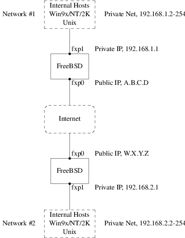
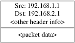
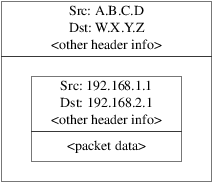
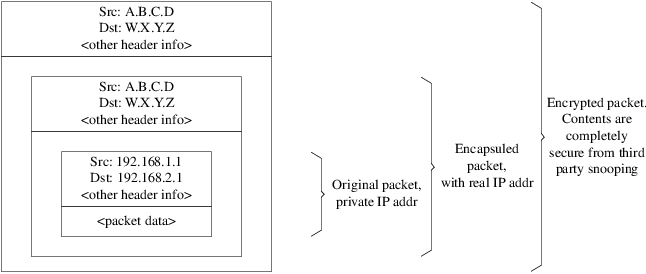

======================
14.10. VPN sobre IPsec
======================

.. raw:: html

   

14.10. VPN sobre IPsec
`Anterior <openssl.html>`__?
Cap?tulo 14. Seguridad
?\ `Siguiente <openssh.html>`__

--------------

.. raw:: html

   

.. raw:: html

   

.. raw:: html

   

.. raw:: html

   

.. raw:: html

   

14.10. VPN sobre IPsec
----------------------

.. raw:: html

   

.. raw:: html

   

Escrito por Nik Clayton.

.. raw:: html

   

.. raw:: html

   

.. raw:: html

   

Creaci?n de una VPN entre dos redes, a trav?s de Internet, mediante
puertas de enlace (“gateways”) FreeBSD.

.. raw:: html

   

.. raw:: html

   

.. raw:: html

   

.. raw:: html

   

14.10.1. Qu? es IPsec
~~~~~~~~~~~~~~~~~~~~~

.. raw:: html

   

.. raw:: html

   

Escrito por Hiten M. Pandya.

.. raw:: html

   

.. raw:: html

   

.. raw:: html

   

Esta secci?n le guiar? a trav?s del proceso de configuraci?n de IPsec, y
de su uso en un entorno consistente en m?quinas FreeBSD y
Microsoft??Windows? 2000/XP, para hacer que se comuniquen de manera
segura. Para configurar IPsec es necesario que est? familiarizado con
los conceptos de construcci?n de un kernel personalizado (consulte el
`Cap?tulo?8, *Configuraci?n del kernel de
FreeBSD* <kernelconfig.html>`__).

*IPsec* es un protocolo que est? sobre la capa del protocolo de Internet
(IP). Le permite a dos o m?s equipos comunicarse de forma segura (de ah?
el nombre). La “pila de red” IPsec de FreeBSD se basa en la
implementaci?n `KAME <http://www.kame.net/>`__, que incluye soporte para
las dos familias de protocolos, IPv4 e IPv6.

.. raw:: html

   

Nota:
~~~~~

FreeBSD 5.X contiene una pila IPsec “acelerada por hardware”, conocida
como “Fast IPsec”, que fu? obtenida de OpenBSD. Emplea hardware
criptogr?fico (cuando es posible) a trav?s del subsistema
`crypto(4) <http://www.FreeBSD.org/cgi/man.cgi?query=crypto&sektion=4>`__
para optimizar el rendimiento de IPsec. Este subsistema es nuevo, y no
soporta todas las opciones disponibles en la versi?n KAME de IPsec. Para
poder habilitar IPsec acelerado por hardware debe a?adir las siguientes
opciones al fichero de configuraci?n de su kernel:

.. code:: screen

    options   FAST_IPSEC  # new IPsec (cannot define w/ IPSEC)
            

Tenga en cuenta que no es posible utilizar el subsistema “Fast IPsec” y
la implementaci?n KAME de IPsec en la misma computadora. Consulte la
p?gina de manual
`fast\_ipsec(4) <http://www.FreeBSD.org/cgi/man.cgi?query=fast_ipsec&sektion=4>`__
para m?s informaci?n.

.. raw:: html

   

IPsec consta de dos sub-protocolos:

.. raw:: html

   

-  *Encapsulated Security Payload (ESP)*, que protege los datos del
   paquete IP de interferencias de terceros, cifrando el contenido
   utilizando algoritmos de criptograf?a sim?trica (como Blowfish,
   3DES).

-  *Authentication Header (AH)*, que protege la cabecera del paquete IP
   de interferencias de terceros as? como contra la falsificaci?n
   (“spoofing”), calculando una suma de comprobaci?n criptogr?fica y
   aplicando a los campos de cabecera IP una funci?n hash segura. Detr?s
   de todo esto va una cabecera adicional que contiene el hash para
   permitir la validaci?n de la informaci?n que contiene el paquete.

.. raw:: html

   

ESP y AH pueden utilizarse conjunta o separadamente, dependiendo del
entorno.

IPsec puede utilizarse para cifrar directamente el tr?fico entre dos
equipos (conocido como *modo de transporte*) o para construir “t?neles
virtuales” entre dos subredes, que pueden usarse para comunicaci?n
segura entre dos redes corporativas (conocido como *modo de t?nel*).
Este ?ltimo es muy conocido como una *red privada virtual (Virtual
Private Network, o VPN)*.
`ipsec(4) <http://www.FreeBSD.org/cgi/man.cgi?query=ipsec&sektion=4>`__
contiene informaci?n detallada sobre el subsistema IPsec de FreeBSD.

Si quiere a?dir soporte IPsec a su kernel debe incluir las siguientes
opciones al fichero de configuraci?n de su kernel:

.. code:: screen

    options   IPSEC        #IP security
    options   IPSEC_ESP    #IP security (crypto; define w/ IPSEC)
          

Si quiere soporte para la depuraci?n de errores no olvide la siguiente
opci?n:

.. code:: screen

    options   IPSEC_DEBUG  #debug for IP security
          

.. raw:: html

   

.. raw:: html

   

.. raw:: html

   

.. raw:: html

   

.. raw:: html

   

14.10.2. El Problema
~~~~~~~~~~~~~~~~~~~~

.. raw:: html

   

.. raw:: html

   

.. raw:: html

   

No existe un est?ndar para lo que constituye una VPN. Las VPN pueden
implementarse utilizando numerosas tecnolog?as diferentes, cada una de
las cuales tiene sus pros y sus contras. Esta secci?n presenta un
escenario, y las estrategias usadas para implementar una VPN para este
escenario.

.. raw:: html

   

.. raw:: html

   

.. raw:: html

   

.. raw:: html

   

.. raw:: html

   

14.10.3. El escenario: dos redes, conectadas por Internet, que queremos que se comporten como una sola
~~~~~~~~~~~~~~~~~~~~~~~~~~~~~~~~~~~~~~~~~~~~~~~~~~~~~~~~~~~~~~~~~~~~~~~~~~~~~~~~~~~~~~~~~~~~~~~~~~~~~~

.. raw:: html

   

.. raw:: html

   

.. raw:: html

   

Este es el punto de partida:

.. raw:: html

   

-  Usted tiene al menos dos sitios

-  Ambos sitios utilizan IP internamente

-  Ambos sitios est?n conectados a Internet, a trav?s de una puerta de
   enlace FreeBSD.

-  La puerta de enlace de cada red tiene al menos una direcci?n IP
   p?blica.

-  Las direcciones internas de las dos redes pueden ser direcciones IP
   p?blicas o privadas, no importa. Puede ejecutar NAT en la m?quina que
   hace de puerta de enlace si es necesario.

-  Las direcciones IP internas de las dos redes *no colisionan*. Aunque
   espero que sea te?ricamente posible utilizar una combinaci?n de
   tecnolog?a VPN y NAT para hacer funcionar todo esto sospecho que
   configurarlo ser?a una pesadilla.

.. raw:: html

   

Si lo que intenta es conectar dos redes y ambas usan el mismo rango de
direcciones IP privadas (por ejemplo las dos usan
``192.168.1.x``)deber?a renumerar una de las dos redes.

La topolog?a de red se parecer?a a esto:

.. raw:: html

   

|image0|

.. raw:: html

   

Observe las dos direcciones IP p?blicas. Usar? letras para referirme a
ellas en el resto de este art?culo. El cualquier lugar que vea esas
letras en este art?culo reempl?celas con su propia direcci?n IP p?blica.
Observe tambi?n que internamente las dos m?quinas que hacen de puerta de
enlace tienen la direcci?n IP .1, y que las dos redes tienen direcciones
IP privadas diferentes (``192.168.1.x`` y ``192.168.2.x``
respectivamente). Todas las m?quinas de las redes privadas est?n
configuradas para utilizar la m?quina ``.1`` como su puerta de enlace
por defecto.

La intenci?n es que, desde el punto de vista de la red, cada red debe
ver las m?quinas en la otra red como si estuvieran directamente
conectadas al mismo router (aunque aunque sea un router ligeramente
lento con una tendencia ocasional a tirar paquetes).

Esto significa que (por ejemplo), la m?quina ``192.168.1.20`` debe ser
capaz de ejecutar

.. code:: programlisting

    ping 192.168.2.34

y recibir de forma transparente una respuesta. Las m?quinas Windows?
deben ser capaces de ver las m?quinas de la otra red, acceder a sus
ficheros compartidos, etc, exactamente igual que cuando acceden a las
m?quinas de la red local.

Y todo debe hacerse de forma segura. Esto significa que el tr?fico entre
las dos redes tiene que ser cifrado.

La creaci?n de una VPN entre estas dos redes es un proceso que requiere
varios pasos. Las etapas son estas:

.. raw:: html

   

#. Crear un enlace de red “virtual” entre las dos redes, a trav?s de
   Internet. Probarlo usando herramientas como
   `ping(8) <http://www.FreeBSD.org/cgi/man.cgi?query=ping&sektion=8>`__
   para asegurarse de que funcione.

#. Aplicar pol?ticas de seguridad para asegurarse de que el tr?fico
   entre las dos redes sea cifrado y descifrado de forma transparente.
   Comprobarlo mediante herramientas como
   `tcpdump(1) <http://www.FreeBSD.org/cgi/man.cgi?query=tcpdump&sektion=1>`__
   para asegurarse de que el tr?fico est? siendo efectivamente cifrado.

#. Configurar software adicional en las puertas de enlace FreeBSD para
   permitir a las m?quinas Windows? verse entre ellas a trav?s de la
   VPN.

.. raw:: html

   

.. raw:: html

   

.. raw:: html

   

.. raw:: html

   

.. raw:: html

   

14.10.3.1. Paso 1: Creaci?n y prueba de un enlace de red “virtual”
^^^^^^^^^^^^^^^^^^^^^^^^^^^^^^^^^^^^^^^^^^^^^^^^^^^^^^^^^^^^^^^^^^

.. raw:: html

   

.. raw:: html

   

.. raw:: html

   

Suponga que est? en la puerta de enlace de la red red #1 (con direcci?n
IP p?blica ``A.B.C.D``, direcci?n IP privada ``192.168.1.1``), y ejecuta
``ping 192.168.2.1``, que es la direcci?n privada de la m?quina con
direcci?n IP ``W.X.Y.Z``. ?Qu? hace falta para esto?

.. raw:: html

   

#. La puerta de enlace necesita saber c?mo alcanzar a ``192.168.2.1``.
   En otras palabras, necesita tener una ruta hasta ``192.168.2.1``.

#. Las direcciones IP privadas, como las que est?n en el rango
   ``192.168.x`` no deber?an aparecer en Internet. Por eso, cada paquete
   que mande a ``192.168.2.1`` necesitar? encerrarse dentro de otro
   paquete. Este paquete debe tener todas las caracter?sticas de haber
   sido enviado desde ``A.B.C.D``, y tendr? que ser enviado a
   ``W.X.Y.Z``. Este proceso recibe el nombre de *encapsulado*.

#. Una vez que este paquete llega a ``W.X.Y.Z`` necesitar? ser
   “desencapsulado”, y entregado a ``192.168.2.1``.

.. raw:: html

   

Puede verlo como si necesitara un “t?nel” entre las dos redes. Las dos
“bocas del t?nel” son las direcciones IP ``A.B.C.D`` y ``W.X.Y.Z``, y
debe hacer que el t?nel sepa cu?les ser?n las direcciones IP privadas
que tendr?n permitido el paso a trav?s de ?l. El t?nel se usa para
transferir tr?fico con direcciones IP privadas a trav?s de la Internet
p?blica.

Este t?nel se crea mediante la interfaz gen?rica, o dispositivo ``gif``
en FreeBSD. Como puede imaginarse la interfaz ``gif`` de cada puerta de
enlace debe configurarse con cuatro direcciones IP: dos para las
direcciones IP p?blicas, y dos para las direcciones IP privadas.

El soporte para el dispositivo gif debe compilarse en el kernel de
FreeBSD en ambas m?quinas a?adiendo la l?nea

.. code:: programlisting

    device gif

a los ficheros de configuraci?n del kernel de ambas m?quinas,
compilarlo, instalarlo y reiniciar.

La configuraci?n del t?nel es un proceso que consta de dos partes.
Primero se le debe decir al t?nel cu?les son las direcciones IP
exteriores (o p?blicas) mediante
`gifconfig(8) <http://www.FreeBSD.org/cgi/man.cgi?query=gifconfig&sektion=8>`__.
Despu?s configure las direcciones IP con
`ifconfig(8) <http://www.FreeBSD.org/cgi/man.cgi?query=ifconfig&sektion=8>`__.

.. raw:: html

   

Nota:
~~~~~

En FreeBSD?5.X las funciones de
`gifconfig(8) <http://www.FreeBSD.org/cgi/man.cgi?query=gifconfig&sektion=8>`__
se han incluido en
`ifconfig(8) <http://www.FreeBSD.org/cgi/man.cgi?query=ifconfig&sektion=8>`__.

.. raw:: html

   

En la puerta de enlace de la red #1 debe ejecutar las siguientes dos
?rdenes para configurar el t?nel.

.. code:: programlisting

    gifconfig gif0 A.B.C.D W.X.Y.Z
    ifconfig gif0 inet 192.168.1.1 192.168.2.1 netmask 0xffffffff
          

En la otra puerta de enlace ejecute las mismas ?rdenes, pero con el
orden las direcciones IP invertido.

.. code:: programlisting

    gifconfig gif0 W.X.Y.Z A.B.C.D
    ifconfig gif0 inet 192.168.2.1 192.168.1.1 netmask 0xffffffff
          

Ahora ejecute:

.. code:: programlisting

    gifconfig gif0

y podr? ver la configuraci?n. Por ejemplo, en la puerta de enlace de la
red #1 ver?a algo parecido a esto:

.. code:: screen

    # gifconfig gif0
    gif0: flags=8011<UP,POINTTOPOINT,MULTICAST> mtu 1280
    inet 192.168.1.1 --> 192.168.2.1 netmask 0xffffffff
    physical address inet A.B.C.D --> W.X.Y.Z
          

Como puede ver se ha creado un t?nel entre las direcciones f?sicas
``A.B.C.D`` y ``W.X.Y.Z``, y el tr?fico que puede pasar a trav?s del
t?nel es entre ``192.168.1.1`` y ``192.168.2.1``.

Esto tambi?n habr? agregado una entrada en la tabla de rutas de ambas
m?quinas, que puede examinar con ``netstat -rn``. Esta salida es de la
puerta de enlace de la red #1.

.. code:: screen

    # netstat -rn
    Routing tables

    Internet:
    Destination      Gateway       Flags    Refs    Use    Netif  Expire
    ...
    192.168.2.1      192.168.1.1   UH        0        0    gif0
    ...
          

Como el valor de “Flags” lo indica, esta es una ruta de equipo, lo que
significa que cada puerta de enlace sabe como alcanzar la otra puerta de
enlace, pero no saben c?mo llegar al resto de sus respectivas redes. Ese
problema se solucionar? en breve.

Es posible que disponga de un cortafuegos en ambas m?quinas, por lo que
tendr? que buscar la forma de que el tr?fico de la VPN pueda entrar y
salir limpiamente. Puede permitir todo el tr?fico de ambas redes, o
puede que quiera incluir reglas en el cortafuegos para que protejan
ambos extremos de la VPN uno del otro.

Las pruebas se simplifican enormemente si configura el cortafuegos para
permitir todo el tr?fico a trav?s de la VPN. Siempre puede ajustar las
cosas despu?s. Si utiliza
`ipfw(8) <http://www.FreeBSD.org/cgi/man.cgi?query=ipfw&sektion=8>`__ en
las puertas de enlace una orden similar a

.. code:: programlisting

    ipfw add 1 allow ip from any to any via gif0

permitir? todo el tr?fico entre los dos extremos de la VPN, sin afectar
al resto de reglas del cortafuegos. Obviamente tendr? que ejecutar esta
orden en ambas puertas de enlace.

Esto es suficiente para permitir a cada puerta de enlace hacer un ping
entre ellas. En ``192.168.1.1`` deber? poder ejecutar

.. code:: programlisting

    ping 192.168.2.1

y obtener una respuesta; es obvio que deber?a poder hacer los mismo en
la otra puerte de enlace.

A?n no podr? acceder a las m?quinas internas de las redes. El problema
est? en el encaminamiento: aunque las puertas de enlace saben c?mo
alcanzarse m?tuamente no saben c?mo llegar a la red que hay detr?s de la
otra.

Para resolver este problema debe a?adir una ruta est?tica en cada puerta
de enlace. La orden en la primera puerta de enlace podr?a ser:

.. code:: programlisting

    route add 192.168.2.0 192.168.2.1 netmask 0xffffff00
          

Esto significa “Para alcanzar los equipos en la red ``192.168.2.0``,
env?a los paquetes al equipo ``192.168.2.1``”. Necesitar? ejecutar una
orden similar en la otra puerta de enlace, pero obviamente con las
direcciones ``192.168.1.x``.

El tr?fico IP de equipos en una red no ser? capaz de alcanzar equipos en
la otra red.

Ya tiene dos tercios de una VPN, puesto que ya es “virtual” y es una
“red”. Todav?a no es privada. Puede comprobarlo con
`ping(8) <http://www.FreeBSD.org/cgi/man.cgi?query=ping&sektion=8>`__ y
`tcpdump(1) <http://www.FreeBSD.org/cgi/man.cgi?query=tcpdump&sektion=1>`__.
Abra una sesi?n en la puerta de enlace y ejecute

.. code:: programlisting

    tcpdump dst host 192.168.2.1

En otra sesi?n en el mismo equipo ejecute

.. code:: programlisting

    ping 192.168.2.1

Ver? algo muy parecido a esto:

.. code:: programlisting

    16:10:24.018080 192.168.1.1 > 192.168.2.1: icmp: echo request
    16:10:24.018109 192.168.1.1 > 192.168.2.1: icmp: echo reply
    16:10:25.018814 192.168.1.1 > 192.168.2.1: icmp: echo request
    16:10:25.018847 192.168.1.1 > 192.168.2.1: icmp: echo reply
    16:10:26.028896 192.168.1.1 > 192.168.2.1: icmp: echo request
    16:10:26.029112 192.168.1.1 > 192.168.2.1: icmp: echo reply
          

Como puede ver los mensajes ICMP van y vienen sin cifrar. Si usa el
par?metro ``-s`` en
`tcpdump(1) <http://www.FreeBSD.org/cgi/man.cgi?query=tcpdump&sektion=1>`__
para tomar m?s bytes de datos de estos paquetes ver? m?s informaci?n.

Obviamente esto es inaceptable. La siguiente secci?n explicar? c?mo
asegurar el enlace entre las dos redes para que todo el tr?fico se cifre
autom?ticamente.

.. raw:: html

   

.. raw:: html

   

Sumario:

.. raw:: html

   

-  Configure ambos kernel con “pseudo-device gif”.

-  Edite ``/etc/rc.conf`` en la puerta de enlace #1 y a?ada las
   siguientes l?neas (reemplazando las direcciones IP seg?n sea
   necesario).

   .. code:: programlisting

       gifconfig_gif0="A.B.C.D W.X.Y.Z"
       ifconfig_gif0="inet 192.168.1.1 192.168.2.1 netmask 0xffffffff"
       static_routes="vpn"
       route_vpn="192.168.2.0 192.168.2.1 netmask 0xffffff00"
                 

-  Edite la configuraci?n de su cortafuegos (``/etc/rc.firewall``, o lo
   que corresponda) en ambos equipos y a?ada

   .. code:: programlisting

       ipfw add 1 allow ip from any to any via gif0

-  Haga los cambios oportunos en el ``/etc/rc.conf`` de la puerta de
   enlace #2, invirtiendo el orden de las direcciones IP.

.. raw:: html

   

.. raw:: html

   

.. raw:: html

   

.. raw:: html

   

.. raw:: html

   

.. raw:: html

   

14.10.3.2. Paso 2: Asegurar el enlace
^^^^^^^^^^^^^^^^^^^^^^^^^^^^^^^^^^^^^

.. raw:: html

   

.. raw:: html

   

.. raw:: html

   

Para asegurar el enlace usaremos IPsec. IPsec ofrece un mecanismo para
que dos equipos coincidan en una llave de cifrado, y usar esta llave
para cifrar los datos entre los dos equipos.

Existen dos ?reas de configuraci?n a tener en cuenta:

.. raw:: html

   

#. Debe existir un mecanismo para que los dos equipos se pongan de
   acuerdo en el mecanismo de cifrado que van a utilizar. Una vez que
   los dos equipos se han puesto de acuerdo dice que existe una
   “asociaci?n de seguridad” entre ellos.

#. Debe existir un mecanismo para especificar que tr?fico debe ser
   cifrado. Obviamente, usted no querr? cifrar todo su tr?fico saliente:
   solo querr? cifrar el tr?fico que es parte de la VPN. Las reglas con
   las que determinar? qu? tr?fico ser? cifrado se llaman “pol?ticas de
   seguridad”.

.. raw:: html

   

Tanto las asociaciones de seguridad como las pol?ticas de seguridad son
responsabilidad del kernel, pero pueden ser modificadas desde el espacio
de usuario. Antes de poder hacerlo, tendr? que configurar el kernel para
que incluya IPsec y el protocolo ESP (Encapsulated Security Payload).
Incluya en el fichero de configuraci?n de su kernel lo siguiente:

.. code:: programlisting

    options IPSEC
    options IPSEC_ESP
           

Recompile y resintale su kernel y reinicie. Como se dijo anteriormente,
tendr? que hacer lo mismo en el kernel de las dos puertas de enlace.

Tiene dos opciones cuando se trata de configurar asociaciones de
seguridad. Puede configurarlas a mano en los dos equipos, lo que
significa elegir el algoritmo de cifrado, las llaves de cifrado, etc, o
puede utilizar alguno de los d?mons que implementan el protocolo de
intercambio de llaves de Internet (IKE, Internet Key Exchange).

Le recomiendo la segunda opci?n. Aparte de otras consideraciones es m?s
f?cil de configurar.

La edici?n y despliegue se efect?a con
`setkey(8) <http://www.FreeBSD.org/cgi/man.cgi?query=setkey&sektion=8>`__.
Todo esto se entiende mejor con una analog?a. ``setkey`` es a las tablas
de pol?ticas de seguridad del kernel lo que
`route(8) <http://www.FreeBSD.org/cgi/man.cgi?query=route&sektion=8>`__
es a las tablas de rutas del kernel. Tambi?n puede usar ``setkey`` ver
las asociaciones de seguridad en vigor, siguiendo con la analog?a, igual
que puede usar ``netstat -r``.

Existen numerosos d?mons que pueden encargarse de la gesti?n de
asociaciones de seguridad en FreeBSD. En este texto se muestra c?mo usar
uno de ellos, racoon (que puede instalar desde
`security/racoon <http://www.freebsd.org/cgi/url.cgi?ports/security/racoon/pkg-descr>`__
en la colecci?n de ports de FreeBSD.

El software
`security/racoon <http://www.freebsd.org/cgi/url.cgi?ports/security/racoon/pkg-descr>`__
debe ejecutarse en las dos puertas de enlace. En cada equipo debe
configurar la direcci?n IP del otro extremo de la VPN y una llave
secreta (que usted puede y debe elegir, y debe ser la misma en ambas
puertas de enlace).

Los dos d?mons entran en contacto uno con otro, y confirman que son
quienes dicen ser (utilizando la llave secreta que usted configur?). Los
d?mons generan una nueva llave secreta, y la utilizan para cifrar el
tr?fico que discurre a trav?s de la VPN. Peri?dicamente cambian esta
llave, para que incluso si un atacante comprometiera una de las llaves
(lo cual es te?ricamente cercano a imposible) no le serviri?a de mucho:
para cuando el atacante haya “crackeado” la llave los d?mons ya habr?n
escogido una nueva.

El fichero de configuraci?n de racoon est? en ``${PREFIX}/etc/racoon``.
No deber?a tener que hacer demasiados cambios a ese fichero. El otro
componente de la configuraci?n de racoon (que *s?* tendr? que modificar)
es la “llave pre-compartida”.

La configuraci?n por defecto de racoon espera encontrarla en
``${PREFIX}/etc/racoon/psk.txt``. Es importante saber que la llave
precompartida *no* es la llave que se utilizar? para cifrar el tr?fico a
trav?s del enlace VPN; solamente es una muestra que permite a los d?mons
que administran las llaves confiar el uno en el otro.

``psk.txt`` contiene una l?nea por cada sitio remoto con el que est?
tratando. En nuestro ejemplo, donde existen dos sitios, cada fichero
``psk.txt`` contendr? una l?nea (porque cada extremo de la VPN solo est?
tratando con un sitio en el otro extremo).

En la puerta de enlace #1 esta l?nea deber?a parecerse a esta:

.. code:: programlisting

    W.X.Y.Z            secreto

Esto es, la direcci?n IP *p?blica* del extremo remoto, un espacio en
blanco, y una cadena de texto que es el secreto en s?. en el extremo
remoto, espacio en blanco, y un texto de cadena que proporcina el
secreto. Obviamente, no debe utilizar “secret” como su llave; aplique
aqu? las reglas y recomendaciones habituales para la elecci?n de
contrase?as.

En la puerta de enlace #2 la l?nea se parecer?a a esta

.. code:: programlisting

    A.B.C.D            secreto

Esto es, la direcci?n IP p?blica del extremo remoto, y la misma llave
secreta. ``psk.txt`` debe tener modo ``0600`` (es decir, modo de solo
lectura/escritura para ``root``) antes de que ejecute racoon.

Debe ejecutar racoon en ambas puertas de enlace. Tambi?n tendr? que
a?adir algunas reglas a su cortafuegos para permitir el tr?fico IKE, que
se transporta sobre UDP al puerto ISAKMP (Internet Security Association
Key Management Protocol). Esto debe estar al principio de las reglas de
su cortafuegos.

.. code:: programlisting

    ipfw add 1 allow udp from A.B.C.D to W.X.Y.Z isakmp
    ipfw add 1 allow udp from W.X.Y.Z to A.B.C.D isakmp
           

Una vez que ejecute racoon puede tratar de hacer un ping a una puerta de
enlace desde la otra. La conexi?n todav?a no est? cifrada porque a?n no
se han creado las asociaciones de seguridad entre los dos equipos: esto
puede llevar un poco de tiempo; es posible que advierta un peque?o
retraso antes de los ping empiecen responder.

Una vez creadas las asociaciones de seguridad puede verlas utilizando
`setkey(8) <http://www.FreeBSD.org/cgi/man.cgi?query=setkey&sektion=8>`__.
Ejecute

.. code:: programlisting

    setkey -D

en cualquiera de los equipos para comprobar la informaci?n de la
asociaci?n de seguridad.

Ya est? resuelta la mitad del problema. La otra mitad es configurar sus
pol?ticas de seguridad.

Queremos crear una pol?tica de seguridad sensata, as? que vamos a
revisar lo que tenemos configurado hasta el momento. Esta revisi?n
abarca ambos extremos del enlace.

Cada paquete IP que usted manda tiene una cabecera que contiene datos
acerca del paquete. La cabecera incluye la direcci?n IP de destino y del
origen. Como ya sabemos, las direcciones IP privadas como el rango
``192.168.x.y`` no deber?an aparezcan en Internet. Dado que es a trav?s
de Internet por donde los queremos transmitir los debemos encapsular
dentro de otro paquete. Este paquete debe contener tanto la direcci?n IP
de destino y origen p?blicas sustituidas por las direcciones privadas.

As? que si su paquete saliente empez? pareciendose a este:

.. raw:: html

   

|image1|

.. raw:: html

   

tras el encapsulado se parecer? bastante a este:

.. raw:: html

   

|image2|

.. raw:: html

   

El dispositivo ``gif`` se encarga del encapsulado. Como puede ver el
paquete tiene una direcci?n IP real en el exterior, y nuestro paquete
original ha sido envuelto como dato dentro del paquete que enviaremos a
trav?s de Internet.

Obviamente, queremos que todo el tr?fico entre las VPN vaya cifrado.
Pongamos esto ?ltimo en palabras para comprenderlo mejor:

“Si un paquete sale desde ``A.B.C.D``, y tiene como destino ``W.X.Y.Z``,
c?fralo utilizando las asociaciones de seguridad necesarias.”

“Si un paquete llega desde ``W.X.Y.Z``, y tiene como destino
``A.B.C.D``, desc?fralo utilizando las asociaciones de seguridad
necesarias.”

Este planteamiento se aproxima bastante, pero no es exactamente lo que
queremos hacer. Si lo hiciera as? todo el tr?fico desde y hacia
``W.X.Y.Z``, incluso el tr?fico que no forma parte de la VPN, ser?
cifrado; esto no es lo que queremos. La pol?tica correcta es la
siguiente:

“Si un paquete sale desde ``A.B.C.D``, y est? encapsulando a otro
paquete, y tiene como destino ``W.X.Y.Z``, c?fralo utilizando las
asociaciones de seguridad necesarias.”

“Si un paquete llega desde ``W.X.Y.Z``, y est? encapsulando a otro
paquete, y tiene como destino ``A.B.C.D``, desc?fralo utilizando las
asociaciones de seguridad necesarias.”

Un cambio sutil, pero necesario.

Las pol?ticas de seguridad tambi?n se imponen utilizando
`setkey(8) <http://www.FreeBSD.org/cgi/man.cgi?query=setkey&sektion=8>`__.
`setkey(8) <http://www.FreeBSD.org/cgi/man.cgi?query=setkey&sektion=8>`__
proporciona un lenguaje de configuraci?n para definir la pol?tica. Puede
introducir las instrucciones de configuraci?n a trav?s de la entrada
est?ndar (stdin), o puede usar la opci?n ``-f`` para especificar un
fichero que contenga las instrucciones de configuraci?n.

La configuraci?n en la puerta de enlace #1 (que tiene la direcci?n IP
p?blica ``A.B.C.D``) para forzar que todo el tr?fico saliente hacia
``W.X.Y.Z`` vaya cifrado es:

.. code:: programlisting

    spdadd A.B.C.D/32 W.X.Y.Z/32 ipencap -P out ipsec esp/tunnel/A.B.C.D-W.X.Y.Z/require;
           

Ponga estas ?rdenes en un fichero (por ejemplo ``/etc/ipsec.conf``) y
ejecute

.. code:: screen

    # setkey -f /etc/ipsec.conf

``spdadd`` le dice a
`setkey(8) <http://www.FreeBSD.org/cgi/man.cgi?query=setkey&sektion=8>`__
que queremos a?adir una regla a la base de datos de pol?ticas de
seguridad. El resto de la l?nea especifica qu? paquetes se ajustar?n a
esta pol?tica. ``A.B.C.D/32`` y ``W.X.Y.Z/32`` son las direcciones IP y
m?scaras de red que identifican la red o equipos a los que se aplicar?
esta pol?tica. En nuestro caso queremos aplicarla al tr?fico entre estos
dos equipos. ``-P out`` dice que esta pol?tica se aplica a paquetes
salientes, e ``ipsec`` hace que el paquete sea asegurado.

La segunda l?nea especifica c?mo ser? cifrado este paquete. ``esp`` es
el protocolo que se utilizar?, mientras que ``tunnel`` indica que el
paquete ser? despu?s encapsulado en un paquete IPsec. El uso repetido de
``A.B.C.D`` y ``W.X.Y.Z`` se utiliza para seleccionar la asociaci?n de
seguridad a usar, y por ?ltimo ``require`` exige que los paquetes deben
cifrarse si concuerdan con esta regla.

Esta regla solo concuerda con paquetes salientes. Necesitar? una regla
similar para los paquetes entrantes.

.. code:: programlisting

    spdadd W.X.Y.Z/32 A.B.C.D/32 ipencap -P in ipsec esp/tunnel/W.X.Y.Z-A.B.C.D/require;

Observe el ``in`` en lugar del ``out`` en este caso, y la inversi?n
necesaria de las direcciones IP.

La otra puerta de enlace (que tiene la direcci?n IP p?blica ``W.X.Y.Z``)
necesitar? reglas similares.

.. code:: programlisting

    spdadd W.X.Y.Z/32 A.B.C.D/32 ipencap -P out ipsec esp/tunnel/W.X.Y.Z-A.B.C.D/require;
    spdadd A.B.C.D/32 W.X.Y.Z/32 ipencap -P in ipsec esp/tunnel/A.B.C.D-W.X.Y.Z/require;

Finalmente, necesita a?adir reglas a su cortafuegos para permitir la
circulaci?n de paquetes ESP e IPENCAP de ida y vuelta. Tendr? que a?adir
reglas como estas a ambos equipos.

.. code:: programlisting

    ipfw add 1 allow esp from A.B.C.D to W.X.Y.Z
    ipfw add 1 allow esp from W.X.Y.Z to A.B.C.D
    ipfw add 1 allow ipencap from A.B.C.D to W.X.Y.Z
    ipfw add 1 allow ipencap from W.X.Y.Z to A.B.C.D
           

Debido a que las reglas son sim?tricas puede utilizar las mismas reglas
en ambas puertas de enlace.

Los paquetes salientes tendr?n ahora este aspecto:

.. raw:: html

   

|image3|

.. raw:: html

   

Cuando los paquetes llegan al otro extremo de la VPN ser?n descifrados
(utilizando las asociaciones de seguridad que han sido negociadas por
racoon). Despu?s entrar?n al interfaz ``gif``, que desenvuelve la
segunda capa, hasta que nos quedamos con paquete m? interno, que puede
entonces viajar a la red interna.

Puede revisar la seguridad utilizando la misma prueba de
`ping(8) <http://www.FreeBSD.org/cgi/man.cgi?query=ping&sektion=8>`__
anterior. Primero, inicie una sesi?n en la puerta de enlace ``A.B.C.D``,
y ejecute:

.. code:: programlisting

    tcpdump dst host 192.168.2.1

En otra sesi?n en la misma m?quina ejecute

.. code:: programlisting

    ping 192.168.2.1

Deber?a ver algo similar a lo siguiente:

.. code:: programlisting

    XXX tcpdump output

ahora, como puede ver,
`tcpdump(1) <http://www.FreeBSD.org/cgi/man.cgi?query=tcpdump&sektion=1>`__
muestra los paquetes ESP. Si trata de examinarlos con la opci?n ``-s``
ver? basura (aparentemente), debido al cifrado.

Felicidades. Acaba de configurar una VPN entre dos sitios remotos.

.. raw:: html

   

.. raw:: html

   

Sumario

.. raw:: html

   

-  Configure ambos kernel con:

   .. code:: programlisting

       options IPSEC
       options IPSEC_ESP
                 

-  Instale
   `security/racoon <http://www.freebsd.org/cgi/url.cgi?ports/security/racoon/pkg-descr>`__.
   Edite ``${PREFIX}/etc/racoon/psk.txt`` en ambas puertas de enlace
   a?adiendo una entrada para la direcci?n IP del equipo remoto y una
   llave secreta que ambos conozcan. Aseg?rese de que este fichero est?
   en modo 0600.

-  A?ada las siguientes l?neas a ``/etc/rc.conf`` en ambos equipos:

   .. code:: programlisting

       ipsec_enable="YES"
       ipsec_file="/etc/ipsec.conf"
                 

-  Cr?e en ambos equipos un ``/etc/ipsec.conf`` que contenga las l?neas
   spdadd necesarias. En la puerta de enlace #1 ser?a:

   .. code:: programlisting

       spdadd A.B.C.D/32 W.X.Y.Z/32 ipencap -P out ipsec
         esp/tunnel/A.B.C.D-W.X.Y.Z/require;
       spdadd W.X.Y.Z/32 A.B.C.D/32 ipencap -P in ipsec
         esp/tunnel/W.X.Y.Z-A.B.C.D/require;

   En la puerta de enlace #2 ser?a:

   .. code:: programlisting

       spdadd W.X.Y.Z/32 A.B.C.D/32 ipencap -P out ipsec
         esp/tunnel/W.X.Y.Z-A.B.C.D/require;
       spdadd A.B.C.D/32 W.X.Y.Z/32 ipencap -P in ipsec
         esp/tunnel/A.B.C.D-W.X.Y.Z/require;

-  A?ada a su(s) cortafuegos las reglas necesarias para que permita(n)
   el paso de tr?fico IKE, ESP e IPENCAP en ambos equipos:

   .. code:: programlisting

       ipfw add 1 allow udp from A.B.C.D to W.X.Y.Z isakmp
       ipfw add 1 allow udp from W.X.Y.Z to A.B.C.D isakmp
       ipfw add 1 allow esp from A.B.C.D to W.X.Y.Z
       ipfw add 1 allow esp from W.X.Y.Z to A.B.C.D
       ipfw add 1 allow ipencap from A.B.C.D to W.X.Y.Z
       ipfw add 1 allow ipencap from W.X.Y.Z to A.B.C.D
                 

.. raw:: html

   

Los dos pasos previos deben bastar para levantar la VPN. Las m?quinas en
cada red se?n capaces de dirigirse una a otra utilizando direcciones IP,
y todo el tr?fico a trav?s del enlace ser? cifrado de forma autom?tica y
segura.

.. raw:: html

   

.. raw:: html

   

.. raw:: html

   

.. raw:: html

   

--------------

+--------------------------------+-----------------------------+-----------------------------------+
| `Anterior <openssl.html>`__?   | `Subir <security.html>`__   | ?\ `Siguiente <openssh.html>`__   |
+--------------------------------+-----------------------------+-----------------------------------+
| 14.9. OpenSSL?                 | `Inicio <index.html>`__     | ?14.11. OpenSSH                   |
+--------------------------------+-----------------------------+-----------------------------------+

.. raw:: html

   

Puede descargar ?ste y muchos otros documentos desde
ftp://ftp.FreeBSD.org/pub/FreeBSD/doc/

| Si tiene dudas sobre FreeBSD consulte la
  `documentaci?n <http://www.FreeBSD.org/docs.html>`__ antes de escribir
  a la lista <questions@FreeBSD.org\ >.
|  Env?e sus preguntas sobre la documentaci?n a <doc@FreeBSD.org\ >.

